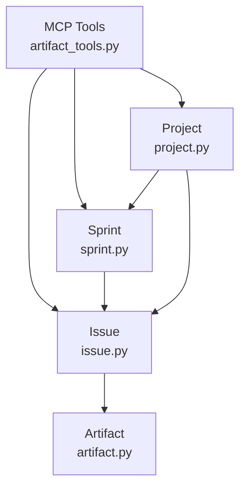
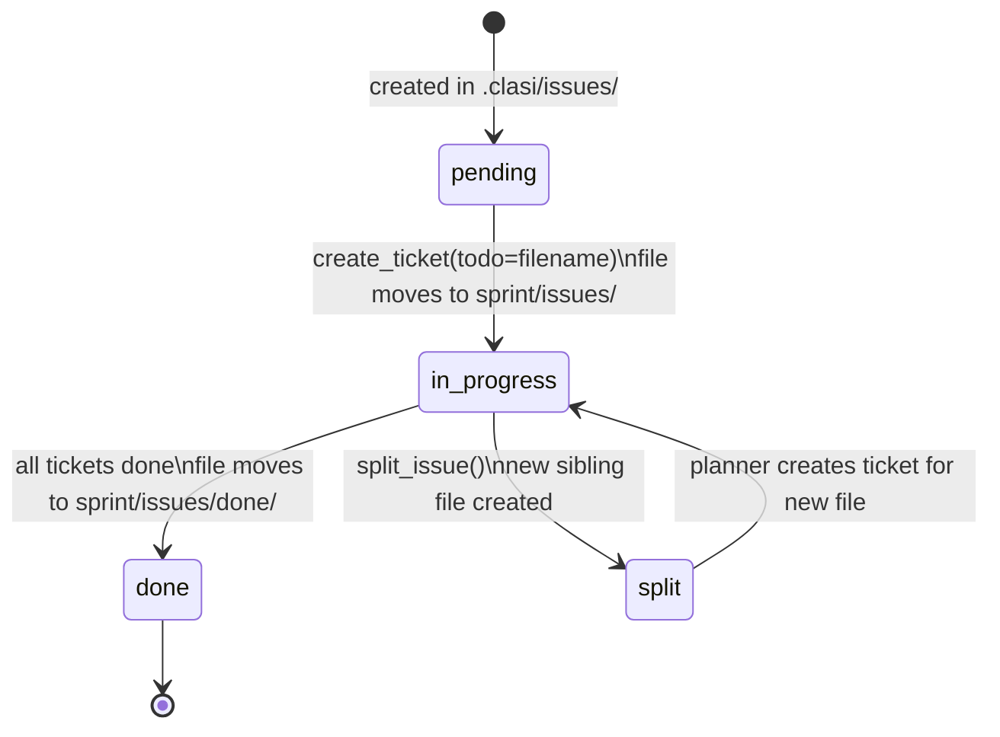
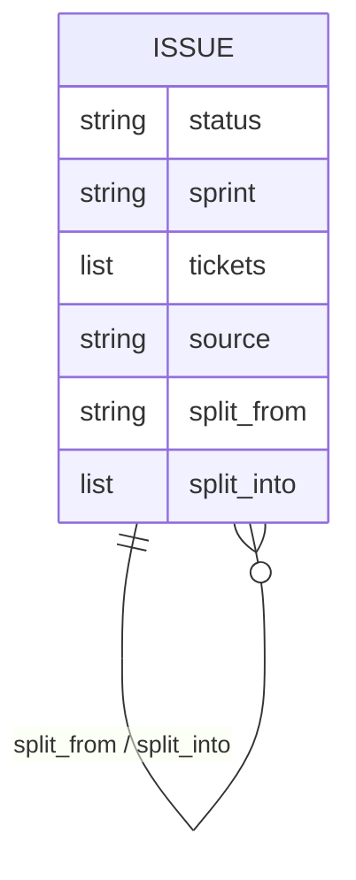

<!-- CLASI: Before changing code or making plans, review the SE process in CLAUDE.md -->

# Architecture Update -- Sprint 001: Sprint-Scoped Issue Lifecycle

## What Changed

### 1. `Issue.move_to_done` — physical file relocation (clasi/issue.py)

**Before:** `move_to_done` only updated frontmatter. The file stayed at its current path.

**After:** Modeled on `Ticket.move_to_done` (ticket.py:127-141):
- If `self.path.parent.name == "done"`, treat as already-done (idempotent, return immediately).
- Otherwise compute `done_dir = self.path.parent / "done"`, call `mkdir(parents=True, exist_ok=True)`, rename the file in, and reattach `self._artifact = Artifact(new_path)`.
- Continue updating frontmatter as before (`status="done"`, optional `sprint`, optional `tickets`).
- Update docstring to reflect the new behavior.

The existing callers (`move_ticket_to_done` auto-complete at artifact_tools.py:739, and the explicit `move_issue_to_done` MCP tool at artifact_tools.py:1488) require no body changes — they call `issue.move_to_done()` and the new implementation does the right thing.

**Side effect on `move_issue_to_done` MCP tool:** The tool currently validates that when `sprint_id` is given, the issue must reside in `<sprint>/issues/`. After this change, an already-done issue will be in `<sprint>/issues/done/`. The location guard must accept both directories (idempotent call). This is a small two-line change in artifact_tools.py that belongs in T1.

### 2. `Sprint.issues_done_dir` property and `Sprint.list_issues` update (clasi/sprint.py)

**New property:** `issues_done_dir` returns `self._path / "issues" / "done"`. Mirrors `tickets_done_dir` (sprint.py:138-141).

**Updated `list_issues`:** Currently scans only `self.issues_dir`. Updated to scan both `self.issues_dir` and `self.issues_done_dir`, mirroring `list_tickets` (sprint.py:157-166). Returns `Issue` objects from both directories in sorted order.

### 3. `Project.get_issue` update (clasi/project.py)

**Before:** Searches (1) pending pool, (2) `<sprint>/issues/<filename>` for each sprint.

**After:** Adds (3) `<sprint>/issues/done/<filename>` check after the top-level sprint issues check. No change to the pending pool check.

### 4. Close-sprint precondition self-repair (clasi/tools/artifact_tools.py)

Two functions affected: `_close_sprint_full` (line 971) and `_close_sprint_legacy` (line 820).

**`_close_sprint_full` step 1b changes:**
- The existing glob at line 977 only scans `in_progress_todo_dir.glob("*.md")` (top-level `issues/`). After this sprint, a done-tagged file at that top level triggers `todo.move_to_done()` which physically relocates it to `issues/done/` — the repair message "moved TODO ... to done/" at line 983 becomes accurate.
- Add a second scan of `<sprint>/issues/done/` glob. Files found there have already been moved and pass cleanly (no action, no repair logged).
- **Pending-pool scan** (line 1011-1020): when a pending-pool issue has `sprint == sprint_id` and `status == done`, today it calls `todo.move_to_done()` while the file is still in the pool. After this change, `move_to_done` will move it to `.clasi/issues/done/` (sibling of the pool, wrong location). Self-repair must instead: (a) compute the target as `<sprint>/issues/done/<filename>`, (b) create the directory, (c) rename the file, (d) reattach the artifact, then (e) call `todo.move_to_done(sprint_id=sprint_id)` for frontmatter only. This is done inline in the precondition pass without changing `Issue.move_to_done` semantics.

**`_close_sprint_legacy` changes:**
- Same logic as `_close_sprint_full`: the existing `todo.move_to_done()` call at line 837 will now physically move the file. The repair is accurate.
- Add a second scan of `<sprint>/issues/done/` to pass done-dir issues cleanly.
- Pending-pool scan (line 844-852): same fix as above — manually relocate to `<sprint>/issues/done/` before calling `move_to_done` for frontmatter.

### 5. `split_issue` MCP tool (clasi/tools/artifact_tools.py)

New `@server.tool()` placed near `move_issue_to_done`.

**Signature:**
```
split_issue(
    filename: str,
    new_filename: str,
    new_title: str,
    new_body: str,
    updated_body: str | None = None,
) -> JSON {original_path, new_path}
```

**Behavior:**
- Resolve `filename` via `project.get_issue` (works in pending pool, sprint-scoped, or sprint-scoped-done).
- Create the new file as a sibling in the same directory as the original.
- New file frontmatter: copy `source` from original; inherit `sprint` and `status` only if the original is sprint-scoped and `in-progress`, otherwise `status: pending` with no `sprint`.
- Add `split_from: <original-filename>` on the new file.
- Append `split_into: [<new-filename>]` on the original (extend list if already present).
- If `updated_body` provided, rewrite original body.
- Do not touch tickets.
- Uses `Artifact` class for all reads/writes (same pattern as `Issue.move_to_in_progress` at issue.py:74-77).

### 6. Skill doc updates

Four skill doc files are updated with no code changes:
- `clasi/plugin/skills/issue/SKILL.md` — add "Splitting an Issue" section.
- `.claude/skills/plan-sprint/SKILL.md` — add `split_issue` step in Phase 2 detail flow.
- `.claude/skills/create-tickets/SKILL.md` — document that `create_ticket(todo=...)` triggers issue move-to-in-progress, and auto-done on ticket completion.
- `.claude/skills/close-sprint/SKILL.md` — document the hard-fail condition for in-progress sprint issues and resolution paths.

### 7. Tests

- `tests/unit/test_issue.py`: Update `TestIssueMoveToDone` tests that assert file stays in place to instead assert file moves to `<sprint>/issues/done/`. Add idempotency test. Add test for pending-pool issue (no sprint dir: moves to `<pool>/done/`).
- `tests/unit/test_issue_lifecycle.py`: Extend the `create_ticket` → `move_ticket_to_done` flow: verify issue lands in `<sprint>/issues/done/` after last ticket is done.
- `tests/unit/test_issue_tools.py` (new `split_issue` tests): pending-pool split, sprint-scoped split, frontmatter cross-links, new file in correct directory.
- `tests/unit/test_artifact_tools.py`: close-sprint precondition: (a) top-level done file migrated by self-repair; (b) close fails on unresolved in-progress issue; (c) issues already in `done/` pass cleanly; (d) pending-pool done-tagged issue relocated correctly.

---

## Why

The issue lifecycle is architecturally inconsistent with the ticket lifecycle. For tickets, physical file location is a state invariant: the ticket machine's `done` state requires `is_ticket_in_done_dir`. Issues have no such invariant today — their "done" state is determined solely by frontmatter, making it invisible to directory listing and inconsistent with the rest of the system. This sprint closes that gap.

The `split_issue` tool fills a real workflow gap: sprint planners discovering partial-scope issues have no first-class tool and resort to ad-hoc workarounds.

---

## Impact on Existing Components

| Component | Impact |
|---|---|
| `Issue.move_to_done` callers | Auto-complete in `move_ticket_to_done` and explicit `move_issue_to_done` tool — no body changes needed |
| `move_issue_to_done` MCP tool | Location guard must accept `issues/done/` as valid for idempotent calls |
| `_close_sprint_full` | Step 1b self-repair now accurate; pending-pool fix required |
| `_close_sprint_legacy` | Same changes as `_close_sprint_full` |
| `Sprint.list_issues` callers | No interface change; more results returned (done issues now included) |
| `Project.get_issue` callers | No interface change; wider search scope |
| Existing tests | Tests asserting "file stays in place" must be updated to assert new behavior |

---

## Migration Concerns

**Existing sprints on disk:** Any sprint directory where issues exist in `<sprint>/issues/` with `status: done` (but not yet in `done/`) will have those files self-repaired by `close_sprint` on the next run. No manual migration needed.

**No database schema changes.**

**No breaking API changes** — all MCP tool signatures are unchanged except the new `split_issue` tool being added.

---

## Diagrams

### Module dependency (sprint-scoped issue lifecycle)



### Issue lifecycle state (new)



### Entity relationship (issue frontmatter cross-links)



---

## Design Rationale

**Decision: mirror Ticket.move_to_done exactly.**
- Context: Tickets already use physical location as a state invariant. Issues do not.
- Alternatives: (1) Keep frontmatter-only, add a separate `archive_issue` tool. (2) Move on close, not on done.
- Why this choice: Consistency. The directory tree is a first-class view of system state. Requiring frontmatter reads for issue state is a leaky abstraction. Using `done/` on completion (not at close time) lets the close precondition pass verify completeness by directory scan.
- Consequences: Existing tests asserting "file stays in place" must be updated. `move_issue_to_done` MCP tool needs its location guard relaxed slightly.

**Decision: `split_issue` creates a sibling, not a new pending-pool file.**
- Context: When splitting a sprint-scoped issue, the new piece should be in the same sprint context until the planner decides otherwise.
- Alternatives: Always create in the pending pool.
- Why this choice: Keeps the new piece co-located with the original, matching the planner's mental model. The planner can call `create_ticket(todo=new_filename)` immediately to absorb the new piece or leave it in-sprint for the next sprint.
- Consequences: A sprint-scoped split produces two files in `<sprint>/issues/`. Close-sprint will hard-fail if the new file is unresolved. Planner must decide explicitly.

---

## Open Questions

None. All design decisions are within the scope of this sprint and consistent with the existing architecture.
