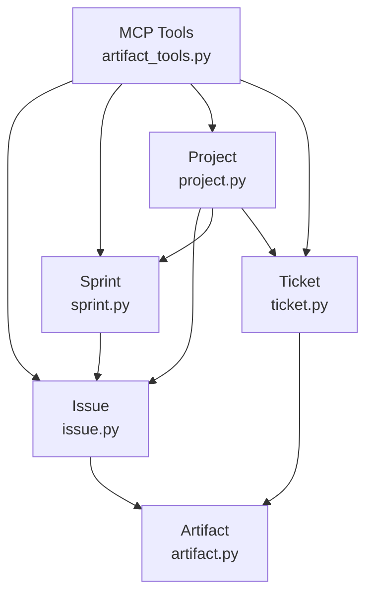
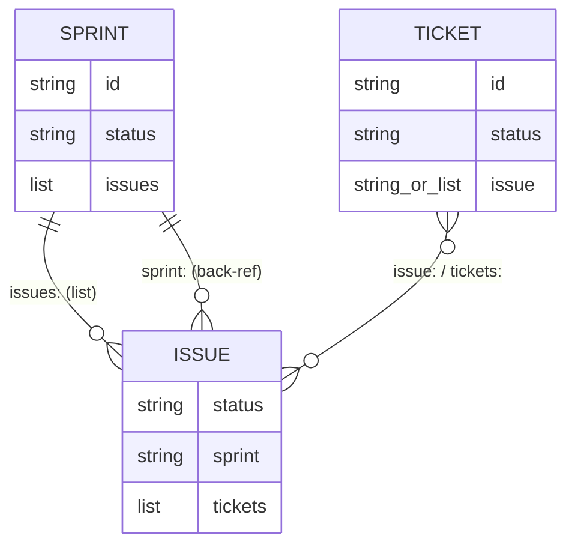
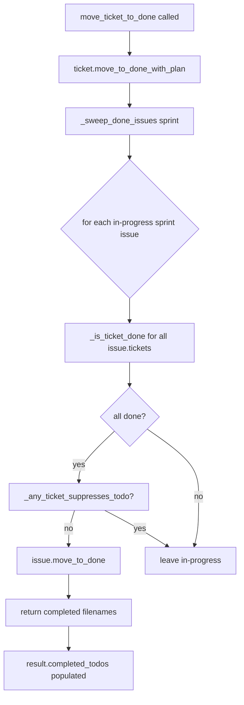

<!-- CLASI: Before changing code or making plans, review the SE process in CLAUDE.md -->

# Architecture Update -- Sprint 002: Issue-Ticket Linkage

## What Changed

### 1. New `add_issue_ref` MCP tool (clasi/tools/artifact_tools.py)

New `@server.tool()` placed near `create_ticket`.

**Signature:**
```
add_issue_ref(ticket_path: str, issue_filename: str) -> JSON {ticket_path, issue_filename, ticket_issue_refs, issue_ticket_refs}
```

**Behavior:**
- Resolve `ticket_path` via `resolve_artifact_path`. Accept absolute or sprint-relative paths.
- Read the ticket's `issue:` frontmatter field. Handle three cases: absent/empty → set to `issue_filename`; string → convert to `[existing, issue_filename]`; list → append `issue_filename`.
- Idempotent: if `issue_filename` is already in the list, skip without modifying.
- Call `project.get_issue(issue_filename)` and call `issue.add_ticket_ref(full_ticket_id)` to write the reverse link. `Issue.add_ticket_ref` is already idempotent.
- Return updated `issue:` value from ticket and updated `tickets:` value from issue.

No model changes required. `Issue.add_ticket_ref` (issue.py:113-122) already exists. The ticket-side write uses `ticket._artifact.update_frontmatter(issue=new_value)` directly — consistent with the rest of the codebase's frontmatter-write pattern.

### 2. New `link_sprint_issues` MCP tool (clasi/tools/artifact_tools.py)

New `@server.tool()` placed near `create_sprint` and `insert_sprint`.

**Signature:**
```
link_sprint_issues(sprint_id: str, issue_filenames: list[str]) -> JSON {sprint_id, linked, already_linked, not_found}
```

**Behavior:**
- Load the sprint via `project.get_sprint(sprint_id)`.
- For each filename in `issue_filenames`:
  - Call `project.get_issue(filename)`. If not found, add to `not_found`; continue.
  - If the issue's `sprint:` frontmatter already equals `sprint_id`, add to `already_linked`; continue.
  - Otherwise write `sprint: sprint_id` to the issue's frontmatter via `issue._artifact.update_frontmatter(sprint=sprint_id)`. Add to `linked`.
- Ensure the sprint's `sprint.md` frontmatter has an `issues:` list that includes all successfully linked filenames. Read current `issues:` list, append new ones (skip duplicates), write back.
- Return the three categorized lists.

**Sprint template update** (`clasi/templates/sprint.md`): Add `issues: []` to the YAML frontmatter block so `create_sprint` and `insert_sprint` produce sprint docs with the field pre-populated.

### 3. `_sweep_done_issues` shared helper (clasi/tools/artifact_tools.py)

New module-level function extracted from the auto-completion block in `move_ticket_to_done` (lines 719-742) and aligned with the precondition scan in `_close_sprint_full` (lines 985-1024).

**Signature:**
```python
def _sweep_done_issues(sprint: Sprint) -> list[str]:
```

**Behavior:**
1. Scan in-progress issues from two sources:
   - `<sprint>/issues/*.md` — files where `issue.sprint == sprint.id` and `issue.status == "in-progress"`.
   - Pending pool `project.issues_dir/*.md` — files where `issue.sprint == sprint.id` and `issue.status == "in-progress"`.
2. For each in-progress issue, read its `tickets:` list. Call `_is_ticket_done(ticket_id)` for each.
3. If all done and the list is non-empty, check `_any_ticket_suppresses_todo(ref_tickets, issue_filename)`.
4. If not suppressed, call `issue.move_to_done()`. Append filename to the return list.
5. Returns the list of filenames that were completed in this sweep.

**Pending-pool issue handling (important):** For issues found in the pending pool (not yet in `<sprint>/issues/`), `Issue.move_to_done()` would place the file in `<pool>/done/` — the wrong location. The helper must apply the two-step pattern from the existing `_close_sprint_full` precondition pass (lines 1038-1044): (a) compute target as `<sprint>/issues/done/<filename>`, (b) `mkdir`, (c) rename the file, (d) reattach `issue._artifact`, then (e) call `issue.move_to_done()` for frontmatter only (`skip_relocate=True` or equivalent guard). See the sprint 001 architecture update, section 4, "Pending-pool scan" for the full pattern.

This helper replaces the `if todo_refs is not None:` guarded block in `move_ticket_to_done` entirely. The guard is removed — the sweep runs unconditionally after every ticket move.

### 4. `move_ticket_to_done` auto-completion fix (clasi/tools/artifact_tools.py)

**Before (lines 719-742):** Guarded by `if todo_refs is not None:`. If the moved ticket has no `issue:` ref, the block does not execute.

**After:** Replace the entire guarded block with a single call to `_sweep_done_issues(sprint)`. If the returned list is non-empty, set `result["completed_todos"]` to it. The fix removes the faulty guard; all other behavior (idempotency via `issue.status` check, `completes_issue: false` suppression) is preserved inside `_sweep_done_issues`.

### 5. `_close_sprint_full` self-repair integration (clasi/tools/artifact_tools.py)

**Before:** The precondition pass at lines 985-1024 scans `<sprint>/issues/` and manually self-repairs done-tagged issues. The logic is equivalent to `_sweep_done_issues` but inline and only for the hard-fail path.

**After:** Call `_sweep_done_issues(sprint)` at the start of the precondition pass (step 1b) as a self-repair step. The existing scan that checks for remaining in-progress issues and hard-fails is retained after the sweep. This way, any issue that was in the "all tickets done but not yet swept" state is cleaned up before the hard-fail check runs.

The existing inline pending-pool relocation logic (lines 1038-1044) is moved into `_sweep_done_issues` so the helper handles both sources.

### 6. `create-tickets` skill guidance update

Two files updated with no code changes:
- `.claude/skills/create-tickets/SKILL.md`
- `clasi/plugin/skills/create-tickets/SKILL.md`

**Addition to Step 4 (Create ticket files):** After the existing issue lifecycle note, add:

> **Multi-issue tickets and propagation:** When multiple tickets implement the same source issue, every ticket must carry the `issue:` back-reference. Use `create_ticket(todo=filename)` for the first ticket. For subsequent tickets, call `add_issue_ref(ticket_path, issue_filename)` after creation. Before returning from ticket creation, verify that every ticket doing work toward an issue has a non-empty `issue:` field.

---

## Why

Three bugs observed during sprint 001 share a common root: the issue↔ticket link was written only at ticket creation time for the first ticket, and auto-completion was conditional on the moved ticket having the link.

Together they caused:
- Issues staying `in-progress` after their last ticket was done (requiring manual `move_issue_to_done`).
- No programmatic way to add issue refs to tickets post-creation.
- No automated roadmap-phase bidirectional link between sprints and the issues they implement (required manual edits by the sprint-planner).

The `_sweep_done_issues` extraction fixes the auto-completion bug structurally by making the sweep unconditional and reusable. The `add_issue_ref` tool fixes the propagation gap. The `link_sprint_issues` tool formalizes the roadmap-phase linking that was previously a manual convention.

---

## Impact on Existing Components

| Component | Impact |
|---|---|
| `move_ticket_to_done` | Guarded auto-completion block replaced with `_sweep_done_issues(sprint)` call; behavior extended to tickets without `issue:` refs |
| `_close_sprint_full` precondition | Calls `_sweep_done_issues` as first self-repair step; existing hard-fail logic unchanged |
| `Issue.add_ticket_ref` | Reused as-is by `add_issue_ref` tool; no changes |
| `create_ticket` | No changes; `add_issue_ref` is additive |
| `Ticket.issue_ref` property | No changes; `add_issue_ref` writes directly via `_artifact.update_frontmatter` |
| Sprint template (`sprint.md`) | `issues: []` field added to YAML frontmatter |
| `create_sprint` / `insert_sprint` | No code changes; benefit from template update automatically |
| `create-tickets` skill docs (both copies) | Guidance added for multi-ticket issue propagation via `add_issue_ref` |
| Existing tests | Tests asserting auto-completion requires `issue:` ref on moved ticket need updating |

---

## Migration Concerns

**No breaking API changes.** All existing MCP tool signatures are unchanged. Two new tools are added (`add_issue_ref`, `link_sprint_issues`).

**Existing sprint directories** with tickets missing `issue:` refs are unaffected at rest. The sweep helper handles them correctly when the next `move_ticket_to_done` is called.

**Sprint.md files** created before this sprint will not have the `issues:` field. The `link_sprint_issues` tool appends/creates the field on write. No migration script needed.

---

## Diagrams

### Module dependency (issue-ticket linkage)



### Entity relationship (bidirectional linkage, sprint 002)



### Auto-completion data flow (after fix)



---

## Design Rationale

**Decision: `add_issue_ref` as a new MCP tool rather than a `Ticket.add_issue_ref` model method.**
- Context: The fix needs to update two files atomically (ticket frontmatter + issue frontmatter). MCP tools are the established pattern for cross-artifact writes in this codebase.
- Alternatives: (1) Add `Ticket.add_issue_ref` model method. (2) Extend `create_ticket` to accept a post-creation ref list.
- Why this choice: `Issue.add_ticket_ref` already handles the issue side. The ticket side is a simple frontmatter write that does not need a dedicated model method. Thin tool layer is consistent with `split_issue` from sprint 001.
- Consequences: `Ticket` model stays minimal. A model method can be added later without breaking the MCP tool.

**Decision: `_sweep_done_issues` replaces the inline guard in `move_ticket_to_done` entirely.**
- Context: The inline guard `if todo_refs is not None:` is the root cause of the bug. Keeping it and adding a fallback path would leave dead code.
- Alternatives: (1) Add an `else:` branch that runs the sweep when `todo_refs is None`. (2) Keep both paths.
- Why this choice: Full replacement removes the faulty branch and produces identical results for tickets that do have refs (sweep reads from `issue.tickets:`, not from `ticket.issue_ref`).
- Consequences: `move_ticket_to_done` is slightly more expensive for tickets not linked to any issue — it scans `issues/` and finds nothing. Negligible for sprints with fewer than 20 issues.

**Decision: `link_sprint_issues` as a new tool rather than modifying `create_sprint`/`insert_sprint`.**
- Context: Roadmap planning is iterative — the planner edits `sprint.md` to add `issues:` after the sprint exists. A creation-time parameter would miss post-creation additions.
- Alternatives: (1) Add `issues: list[str]` parameter to `create_sprint`. (2) Auto-link on `detail_sprint`.
- Why this choice: A separate linking tool is explicit, composable, and idempotent. The planner calls it after finalizing the `issues:` list. Consistent with "explicit beats implicit" in the CLASI toolset.
- Consequences: Roadmap planning requires one extra tool call. The `sprint-roadmap` skill guidance should be updated to include it (scope question: see Open Questions).

---

## Open Questions

1. **`sprint-roadmap` skill update scope**: The `sprint-roadmap` skill guidance should be updated to call `link_sprint_issues` during the roadmap phase. This is a skill doc change (no code). It is not in the current sprint ticket list. The team-lead should confirm whether this belongs in sprint 002 or as a follow-on issue.

2. **`Issue.move_to_done` pending-pool guard**: `_sweep_done_issues` needs to handle pending-pool issues with the two-step relocation pattern (see section 3 above). The programmer should check whether `Issue.move_to_done` can accept a `target_dir` parameter to make this cleaner, or whether the caller must do the rename manually. Either approach is acceptable; the architecture does not prescribe which. If the programmer adds a `target_dir` parameter to `Issue.move_to_done`, that is a minor model change within scope — no exception required.
