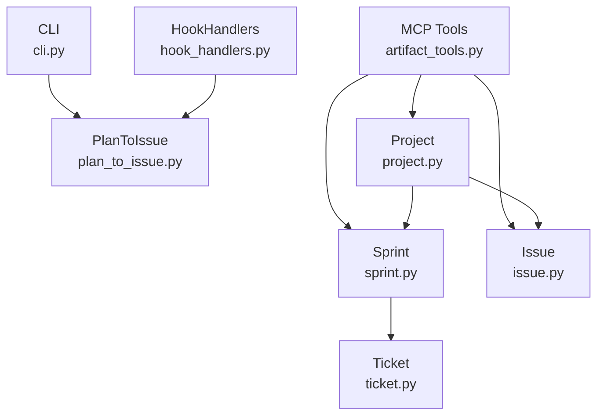

<!-- CLASI: Before changing code or making plans, review the SE process in CLAUDE.md -->

# Architecture Update -- Sprint 003: Finish TODO to Issue Rename

## What Changed

This sprint is a mechanical vocabulary consolidation. No new modules are
introduced and no module boundaries change. The changes are:

### 1. Parameter and variable renames in production code

**`clasi/plan_to_issue.py`** — `plan_to_issue` and `plan_to_issue_from_text`
both have a `todo_dir` parameter renamed to `issue_dir`. The `mkdir()` call
on the local variable follows. Callers in `clasi/cli.py` and
`clasi/hook_handlers.py` pass the renamed keyword argument.

**`clasi/sprint.py`** — `Sprint.create_ticket` has a `todo` keyword parameter
renamed to `issue`. The local `sprint_todos` variable renamed to
`sprint_issues`. The `artifact_tools.py` call site passes `todo=todo_arg` →
`issue=issue_arg`.

**`clasi/tools/artifact_tools.py`** — `create_ticket` MCP-tool wrapper: `todo`
parameter renamed to `issue`. Local variables renamed: `completed_todos` →
`completed_issues`, `moved_todos` → `moved_issues`, `unresolved_todos` →
`unresolved_issues`. Private helper names `_any_ticket_suppresses_todo` and
`_todo_is_deferred` renamed to `_any_ticket_suppresses_issue` and
`_todo_is_deferred` → `_issue_is_deferred`. The `close_sprint` result JSON
keys `moved_todos` and `unresolved_todos` are renamed to `moved_issues` and
`unresolved_issues` — this is the only externally observable API change in
the sprint.

### 2. Docstring prose updates

Five docstring / inline-comment locations updated to replace "TODO" (the
artifact noun) with "issue": `clasi/issue.py:15`, `clasi/plan_to_issue.py:33`,
and `clasi/hook_handlers.py:858, 863, 867, 894, 915`. No behavioral change.

### 3. Agent instruction prose updates

Three agent instruction files updated:
- `clasi/plugin/agents/sprint-planner/plan-sprint.md:56-57`
- `clasi/plugin/agents/sprint-planner/create-tickets.md:44-46`
- `clasi/plugin/agents/team-lead/agent.md:42-44`

No behavioral change; agents read these at runtime and the vocabulary
correction keeps instructions consistent with the live artifact model.

### 4. Documentation updates

- `clasi/plugin/instructions/software-engineering.md:211-212, 229-230` —
  frontmatter example and field reference table updated: `todo:` → `issue:`,
  `completes_todo` → `completes_issue`.
- `README.md:44, 117, 142, 162` — skill reference `/todo` → `/issue`;
  hook reference `codex-plan-to-todo` → `codex-plan-to-issue`; deprecated
  aliases marked as deprecated.
- `clasi/plugin/skills/se/SKILL.md:22, 25` — prose updated.

### 5. Test renames

Class and method names in `tests/unit/test_hook_handlers.py`,
`test_issue_tools.py`, `test_plan_to_issue.py`, and `test_issue_lifecycle.py`
renamed from `*todo*` to `*issue*`. No test logic changes.

---

## Rename / No-rename boundary

The following are explicitly **not renamed** in this sprint:

| Location | Reason |
|---|---|
| `hook_handlers.py:890, 926` — `handle_plan_to_todo`, `handle_codex_plan_to_todo` aliases | Required by pinned MCP server; removed when pin moves |
| `hook_handlers.py:980, 982` — registry keys `"plan-to-todo"`, `"codex-plan-to-todo"` | Pinned-MCP compatibility |
| `cli.py:274-276, 295-297` — deprecated CLI alias block | Already labeled deprecated; stays until pin moves |
| Path strings referring to `docs/clasi/todo/` | Deferred to the self-migration sprint |
| `docs/clasi/sprints/done/**` | Archives are never mutated |

---

## Why

Sprint 015 performed a hard-rename of the CLASI artifact from "TODO" to
"issue" on the high-visibility surface (class names, MCP tool names, CLI
subcommands). This sprint cleans up the remaining ~30 locations across three
layers (production identifiers, prose, tests) that were left incomplete.

The `close_sprint` JSON key rename (`moved_todos` → `moved_issues`,
`unresolved_todos` → `unresolved_issues`) is within scope because it is
consistent with the "hard rename" policy established in sprint 015. The only
callers are internal tests and the team-lead agent prompt, both updated in
this sprint.

---

## Impact on Existing Components

| Component | Impact |
|---|---|
| `clasi/plan_to_issue.py` | Parameter rename only; behavior unchanged |
| `clasi/sprint.py` `Sprint.create_ticket` | Parameter rename only; behavior unchanged |
| `clasi/tools/artifact_tools.py` `create_ticket` | Parameter rename; `_any_ticket_suppresses_todo` / `_todo_is_deferred` helper renames |
| `clasi/tools/artifact_tools.py` `close_sprint` | JSON output keys `moved_todos` / `unresolved_todos` → `moved_issues` / `unresolved_issues` |
| `clasi/cli.py` | Caller updated to pass renamed kwarg to `plan_to_issue`; deprecated alias block unchanged |
| `clasi/hook_handlers.py` | Caller updated to pass renamed kwarg; backward-compat aliases unchanged |
| `clasi/issue.py` | Docstring only |
| Agent instruction `.md` files | Prose only; no runtime behavior change |
| Documentation files | Prose only |
| Test files | Class/method name renames; no logic changes |

---

## Migration Concerns

**`close_sprint` JSON key rename**: The renamed keys (`moved_issues`,
`unresolved_issues`) are a breaking change to the MCP tool output schema.
Callers must be updated atomically:
- Internal tests in `test_issue_lifecycle.py` that assert on these keys are
  updated in the test-rename ticket.
- The team-lead agent prompt does not currently assert on these keys by name
  (it reads the JSON result but does not pattern-match on field names). No
  change needed there.
- External callers using the pinned MCP server version are not affected
  because the pinned server's `close_sprint` does not yet return these keys
  at all (it uses the old key names on a different code path).

All other changes are internal renames with no observable behavior change.

---

## Diagrams

### Module diagram (unchanged structure, vocabulary updated)

No new edges. No removed edges. Module boundaries are unchanged.

---

## Design Rationale

**Decision: Rename `close_sprint` JSON keys now rather than deferring.**
- Context: The sprint.md out-of-scope list defers the `create_sprint` `todo`
  parameter rename and the `moved_todos`/`unresolved_todos` key rename as
  "MCP surface changes." After re-reading the issue, the JSON output keys are
  produced by `_close_sprint_full` in the current source, not by the pinned
  MCP binary. Renaming them here is safe — the pinned binary is unaffected.
- Alternatives: (1) Defer with the MCP-pin upgrade. (2) Rename now.
- Why this choice: The issue's "locked-in scope" section explicitly includes
  these keys as in scope. Renaming now keeps the output consistent with the
  renamed local variables.
- Consequences: Tests asserting on these keys must be updated in the same
  ticket batch. Covered by the test-rename ticket.

**Decision: `create_sprint` `todo` parameter is still deferred.**
- Context: The `create_sprint` MCP tool's `todo` parameter is part of the
  MCP tool schema exposed to the running MCP server. Renaming it requires
  coordinating with the MCP-pin upgrade. The issue and sprint.md both list
  this as out of scope.
- Why this choice: Correct per the out-of-scope list. Not changed here.

---

## Open Questions

None. The issue contains a complete file-by-file audit with exact line
numbers. The rename/no-rename boundary is fully specified. No ambiguities
require stakeholder input.
