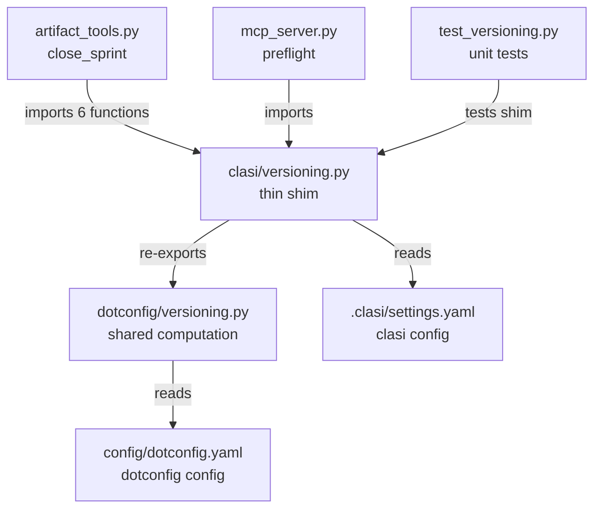
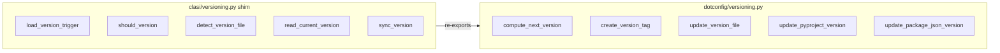

<!-- CLASI: Before changing code or making plans, review the SE process in CLAUDE.md -->

# Architecture Update -- Sprint 004: Versioning Consolidation

## What Changed

### 1. New runtime dependency: `dotconfig`

`pyproject.toml` gains `dotconfig>=0.20260507.2` in `[project.dependencies]`.
Dotconfig is already installed in the development environment (editable install
from `/Users/eric/proj/code-projects/dotconfig`). Adding it as a declared
dependency makes the relationship explicit and ensures any `pip install clasi`
environment gets dotconfig automatically.

### 2. `clasi/versioning.py` becomes a thin shim (~50 lines)

The module shrinks from ~500 lines to ~50 lines. Shared computation is deleted
from the clasi source tree and replaced with re-exports from `dotconfig.versioning`:

**Re-exported from dotconfig (no clasi implementation retained):**
- `compute_next_version`
- `create_version_tag`
- `update_version_file`
- `update_pyproject_version`
- `update_package_json_version`
- `parse_format`
- `format_has_auto`
- `build_version`
- `build_tag_regex`
- `VERSION_PATTERN` — compatibility alias using `build_tag_regex` on the default format, or re-exported as a constant if dotconfig exposes it

**Retained in `clasi/versioning.py` (clasi-specific, no dotconfig equivalent):**
- `load_version_trigger(project_root)` — reads `version_trigger` from `.clasi/settings.yaml`
- `should_version(trigger, context)` — decides whether to bump based on trigger + context
- `detect_version_file(project_root)` — auto-discovers version file (pyproject.toml / package.json); clasi reads `.clasi/settings.yaml` for `version_source`, dotconfig reads `config/dotconfig.yaml` — the clasi implementation stays because it uses a different config file
- `read_current_version(project_root)` — reads version from the file detected by `detect_version_file`; kept because it depends on the clasi-specific `detect_version_file`
- `sync_version(version, project_root)` — fan-out sync from `.clasi/settings.yaml`; kept because it reads the clasi config file
- `DEFAULT_FORMAT`, `DEFAULT_TRIGGER`, `VALID_TRIGGERS` — constants referenced by clasi-specific helpers
- `_load_settings(project_root)` — internal settings loader for `.clasi/settings.yaml`

**Bridge design (config file authority):**
Dotconfig's `compute_next_version` reads `config/dotconfig.yaml` for the
version format when `config_dir` is provided. Clasi's shim calls
`compute_next_version()` without a `config_dir` argument; dotconfig falls back
to `DEFAULT_FORMAT` when no config dir is supplied, and clasi's
`load_version_format` reads `.clasi/settings.yaml`. These two paths do not
conflict because `compute_next_version` in dotconfig accepts an optional
`config_dir` keyword — clasi passes none, so dotconfig uses its own default.
The version format is effectively controlled by whichever caller invokes the
function. For the clasi case (close_sprint), format comes from
`.clasi/settings.yaml` via `load_version_format`, which is passed to dotconfig
indirectly — see open question below.

### 3. Signature delta in `compute_next_version`

Dotconfig's `compute_next_version(major=0, config_dir=None)` has a `config_dir`
keyword that clasi's version does not have. The shim's re-export is a direct
passthrough. The one call site in `artifact_tools.py` calls
`compute_next_version()` with no arguments — no change required.

However, dotconfig's `compute_next_version` reads format from `config/dotconfig.yaml`
(via its own `load_version_format`), not from `.clasi/settings.yaml`. If a
project's format is in `.clasi/settings.yaml` but not in `config/dotconfig.yaml`,
the shim's current re-export would silently use dotconfig's default format.

**Resolution (design decision in this sprint):** Wrap `compute_next_version` in
the shim rather than re-exporting it bare. The wrapper calls clasi's own
`load_version_format()` to get the format, then calls dotconfig's
`compute_next_version` passing `config_dir` pointing at the project's
`config/` directory if it exists, or omitting it to use dotconfig's default.
This preserves the existing behavior: `.clasi/settings.yaml` wins for clasi
projects that have not yet migrated to `config/dotconfig.yaml`.

```python
# clasi/versioning.py shim (pseudocode)
from dotconfig.versioning import (
    compute_next_version as _dc_compute_next_version,
    create_version_tag,
    update_version_file,
    update_pyproject_version,
    update_package_json_version,
)

def compute_next_version(major: int = 0) -> str:
    # clasi-specific: respect .clasi/settings.yaml format
    fmt = load_version_format()  # reads .clasi/settings.yaml
    # Pass format via dotconfig's config_dir mechanism only if config/ exists;
    # otherwise let dotconfig compute using the same format string via a
    # monkey-patch-free adapter (see ticket 002 for exact implementation).
    ...
```

The exact implementation detail (whether to pass `config_dir` or to call
dotconfig lower-level helpers directly) is left to the programmer for ticket 002.

### 4. `.agents/.clasi-version` removal

`_markers.py` already opportunistically removes `.agents/.clasi-version` on
every install run (line 66-68). No new write path creates this file. The issue
is already structurally resolved; this sprint documents the intent and verifies
no code path creates the file. Any prose references to `.agents/.clasi-version`
are corrected.

### 5. Test suite migration

`tests/unit/test_versioning.py` retains only tests for clasi-specific functions.
Tests for `parse_format`, `build_version`, `build_tag_regex`, `format_has_auto`,
`compute_next_version`, `update_pyproject_version`, `update_package_json_version`,
`update_version_file`, and `create_version_tag` are deleted from the clasi suite
(they belong to dotconfig's own tests). Tests for `load_version_trigger`,
`should_version`, `detect_version_file`, `read_current_version`, and the
`VERSION_PATTERN` compat alias are retained.

### 6. MCP hot-reload list

`clasi.versioning` remains a module (the shim), so its entry in `mcp_server.py:126`
is unchanged.

---

## Why

`clasi/versioning.py` and `dotconfig/versioning.py` are forks of the same
logic. Sprint 004 closes this drift before it causes silent bugs: a fix in
dotconfig would not reach clasi, and vice versa. The chosen path (Option 2,
thin shim) is the lowest-risk migration: all call sites in `artifact_tools.py`
keep the same import path and the same function signatures. The only observable
change is that shared computation now executes in dotconfig's implementation.

---

## Impact on Existing Components

| Component | Impact |
|---|---|
| `pyproject.toml` | New runtime dep: `dotconfig>=0.20260507.2` |
| `clasi/versioning.py` | Shrinks ~480 lines; shared functions replaced by re-exports or wrappers |
| `clasi/tools/artifact_tools.py` | No change — all imports still resolve from `clasi.versioning` |
| `clasi/mcp_server.py` | No change — `clasi.versioning` shim still importable |
| `tests/unit/test_versioning.py` | ~80% of tests deleted; retained tests cover clasi-specific helpers |
| `clasi/platforms/_markers.py` | Stale-cleanup already handles `.agents/.clasi-version`; no code change needed, prose verified |
| `docs/` | Any reference to `.agents/.clasi-version` corrected |

---

## Diagrams

### Module dependency diagram



### Responsibility boundary



---

## Migration Concerns

**dotconfig not yet in uv.lock**: Dotconfig is currently installed as an editable
dev dependency (not declared in `pyproject.toml`). Adding it as a runtime dep
requires `uv lock` / `uv sync` after the `pyproject.toml` edit to update
`uv.lock`. The CI pipeline and any fresh installs will pull dotconfig automatically
after the lock file is committed.

**`compute_next_version` format source**: The wrapper approach (design decision
above) ensures the existing `.clasi/settings.yaml` format is respected during
the migration period. Projects that have migrated to `config/dotconfig.yaml` will
use dotconfig's own format loading; projects using only `.clasi/settings.yaml`
continue to work unchanged.

**Test coverage threshold**: Deleting ~80% of `test_versioning.py` will reduce
the number of lines covered. If the coverage threshold (`fail_under = 84`) is
breached, it must be adjusted to reflect that the deleted logic now lives in
dotconfig's own suite.

**No data migration**: `.agents/.clasi-version` is a stamp file written by the
installer, not a data file read by application logic. Its removal requires no
migration.

---

## Design Rationale

**Decision: Wrap `compute_next_version` rather than re-export it bare.**
- Context: Dotconfig's version reads format from `config/dotconfig.yaml` when
  `config_dir` is provided. Clasi projects store format in `.clasi/settings.yaml`.
  A bare re-export would silently ignore the clasi config.
- Alternatives: (1) Bare re-export — simpler but breaks `.clasi/settings.yaml`
  format configs. (2) Require projects to migrate to `config/dotconfig.yaml` —
  cleanest long-term but out of scope (Option 1 territory per sprint.md).
  (3) Wrapper that reads clasi config and bridges — chosen.
- Why this choice: Zero breakage for existing clasi projects. Aligns with the
  sprint's Option 2 mandate.
- Consequences: The shim contains one non-trivial wrapper function. Ticket 002
  specifies the exact implementation.

**Decision: Retain `detect_version_file` in the shim.**
- Context: Dotconfig does not expose `detect_version_file` as a public function;
  its equivalent (`seed_version_from_sources`) has different semantics and reads
  dotconfig.yaml. Clasi's version reads `.clasi/settings.yaml`'s `version_source`
  key.
- Why this choice: No safe re-export exists. Retaining it avoids a behavior
  change in `artifact_tools.py` call sites.

**Decision: Keep `clasi.versioning` as a module (not delete it).**
- Context: Sprint.md out-of-scope note: "Removing `clasi/versioning.py` entirely
  — the shim still needs a home for `close_sprint`'s bridge logic."
- Why this choice: Removing the module would require changing all import paths in
  `artifact_tools.py` and `mcp_server.py`. The shim approach costs nothing extra.

---

## Open Questions

1. **`compute_next_version` wrapper detail**: The precise mechanism for passing
   the format to dotconfig's implementation (pass `config_dir` pointing at the
   project root so dotconfig reads `.clasi/settings.yaml`? Or call dotconfig's
   lower-level `parse_format` + `build_version` directly?) is left to the
   programmer for ticket 002. Either approach is architecturally sound; the
   wrapper boundary is what matters.

2. **`VERSION_PATTERN` compat constant**: `clasi/versioning.py` currently exports
   `VERSION_PATTERN = re.compile(r"^v?(\d+)\.(\d{8})\.(\d+)$")`. Dotconfig does
   not export this constant. The shim should retain it as a compatibility alias.
   Ticket 002 should confirm no external caller imports it from `dotconfig.versioning`
   by mistake.
