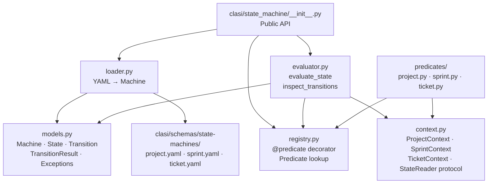
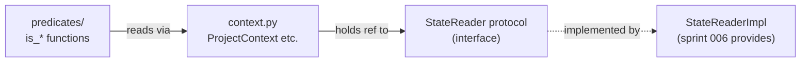
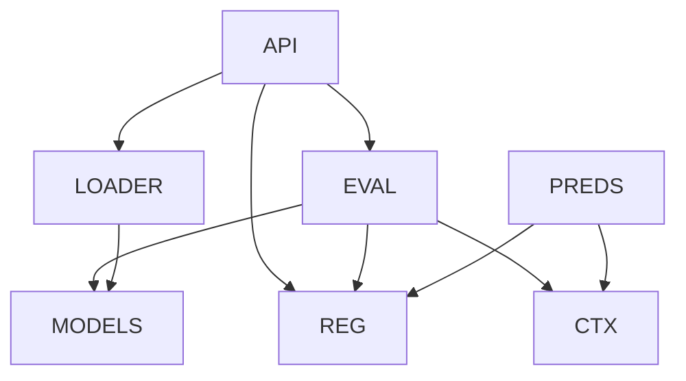

<!-- CLASI: Before changing code or making plans, review the SE process in CLAUDE.md -->

# Architecture Update -- Sprint 005: State Machine Engine

## What Changed

This sprint introduces `clasi/state_machine/` — a new subsystem with no
dependencies on existing CLASI business logic. It provides read-only state
evaluation and transition inspection for the three machines defined in
`docs/design/state-machines.md`.

### New package: `clasi/state_machine/`

| Module | Purpose |
|---|---|
| `__init__.py` | Public API: `load_machine`, `evaluate_state`, `inspect_transitions`, `evaluate_predicates` |
| `models.py` | Pure dataclasses: `Machine`, `State`, `Transition`, `TransitionResult` |
| `loader.py` | Reads `clasi/schemas/state-machines/*.yaml` → `Machine` objects |
| `registry.py` | `@predicate(name)` decorator; global registry; `get_predicate`, `list_predicates` |
| `evaluator.py` | `evaluate_state` and `inspect_transitions` implementations |
| `context.py` | `ProjectContext`, `SprintContext`, `TicketContext` dataclasses; `StateReader` protocol |
| `predicates/` | Sub-package; one module per machine (`project.py`, `sprint.py`, `ticket.py`) |
| `predicates/__init__.py` | Imports all three modules to trigger registration |

### New YAML files: `clasi/schemas/state-machines/`

| File | Content |
|---|---|
| `project.yaml` | Project state machine (3 states, 8 predicates, 3 actions) |
| `sprint.yaml` | Sprint state machine (7 states, 13 predicates, 6 actions) |
| `ticket.yaml` | Ticket state machine (4 states, 10 predicates, 5 actions) |

Transcribed verbatim from `docs/design/state-machines.md`. The design doc is
authoritative; the YAML files are its machine-readable form.

### New exceptions (in `clasi/state_machine/models.py`)

`MachineSyntaxError`, `DuplicatePredicateError`, `UnknownPredicateError`,
`NoMatchingStateError`, `AmbiguousStateError`.

---

## Why

Sprint 006 (`clasi status` command) needs to report current state and
available transitions for any CLASI artifact. That requires a read-only
engine that can answer two questions:

1. "Which state is this artifact currently in?" → `evaluate_state`
2. "What transitions can fire from here, and what is blocking the rest?" → `inspect_transitions`

The engine is a new subsystem because no existing module has this
responsibility, and embedding it in `state_db_class.py` or `tools/process_tools.py`
would create a god component. Isolating it in `clasi/state_machine/` keeps the
lifecycle logic separate from the MCP tool layer.

---

## Impact on Existing Components

| Component | Impact |
|---|---|
| `clasi/state_machine/` | **New package** — no existing code changes |
| `clasi/schemas/state-machines/` | **New directory** — three new YAML files |
| `clasi/state_db_class.py` | No change — existing phase/gate logic is untouched |
| `clasi/tools/process_tools.py` | No change — MCP tools continue to use StateDB directly |
| `clasi/project.py` | No change — sprint 006 will add a `StateReader` adapter here |
| `pyproject.toml` | No new runtime dependencies; `pyyaml` is already present |
| `tests/` | New `tests/unit/test_state_machine/` directory |

The engine has no outgoing dependencies on existing CLASI modules. It is a
greenfield subsystem.

---

## Migration Concerns

None. This sprint adds new files only. No existing data, schema, or behavior
changes.

---

## Diagrams

### Component diagram

### Context / StateReader dependency diagram

The `StateReader` protocol is defined in `context.py`; its concrete
implementation is deferred to sprint 006, where the MCP server's filesystem
and DB access already exist. Sprint 005 supplies a `NullStateReader` (returns
safe defaults) for testing.

### Module dependency graph

Dependencies flow in one direction: API → (EVAL, LOADER, REG) → MODELS.
Context and predicates depend only on `models.py` and `registry.py`.
No cycles.

---

## Design Rationale

### Decision: `clasi/schemas/state-machines/` for YAML file location

**Context**: The three machine definitions need a stable, importable location
inside the package so that installed CLASI instances (not just dev checkouts)
can load them via `importlib.resources`.

**Alternatives**:
1. `docs/design/state-machines/` — human-readable docs dir, not importable;
   breaks installed packages.
2. `.clasi/` — project-specific runtime data, not part of the package itself.
3. `clasi/schemas/state-machines/` — already the convention for CLASI schema
   files; importable via `importlib.resources.files("clasi.schemas")`.

**Why this choice**: Matches the existing `clasi/schemas/se-process/schema.yaml`
pattern. The `clasi/schemas/` package is already declared as a package with
`__init__.py`; adding a `state-machines/` sub-directory requires only that it
be listed in `MANIFEST.in` / `pyproject.toml` as package data (already handled
by the glob pattern `clasi/**/*.yaml`).

**Consequences**: The loader uses `importlib.resources.files("clasi.schemas").joinpath("state-machines", name + ".yaml")` — same pattern as `state_db_class.py` line 23.

---

### Decision: `@predicate("name")` decorator registration

**Context**: Predicates need to be registered at import time so that the engine
can look them up by the string names embedded in YAML. Two patterns were
considered:

1. **Decorator**: `@predicate("is_overview_present")` on the function
   definition. Registration happens when the module is imported.
2. **Explicit register-on-import**: `registry.register("is_overview_present", fn)`
   called at module level.

**Why the decorator**: Both patterns register on import. The decorator is
self-documenting — the registration is co-located with the function definition,
making it impossible to define a predicate and forget to register it. The
explicit pattern requires two pieces of code to stay in sync. The decorator is
the standard Python convention (same as `@click.command()`, `@pytest.fixture`).

**Consequences**: The `predicates/__init__.py` must import all three predicate
modules to trigger registration before the engine uses the registry. Sprint 006
(and anyone using the public API) must import `clasi.state_machine` to get
predicates auto-registered.

---

### Decision: `StateReader` protocol for predicate isolation

**Context**: Predicates must be pure/read-only, but they need facts about the
filesystem, git state, and SQLite DB. Three options:

1. **Direct access**: Each predicate reads files and calls `sqlite3` directly.
   Testable but duplicates path resolution logic from `Project` and `StateDB`.
2. **MCP tool calls**: Predicates call the MCP server's read-only tools
   (`list_sprints`, `get_sprint_phase`). Not testable without a running server;
   introduces an HTTP round-trip inside a synchronous call.
3. **Injected `StateReader` protocol**: Predicates call methods on a protocol
   object injected via the context. The protocol has a concrete implementation
   (wired up in sprint 006), and a `NullStateReader` for tests.

**Why the `StateReader` protocol**: Predicates stay pure by construction — they
cannot write anything because the protocol has no write methods. Unit tests
inject a mock or `NullStateReader`. The protocol boundary is explicit and
narrow (8-10 methods). Sprint 005 defines the protocol; sprint 006 implements
it against the actual filesystem and StateDB.

**Consequences**: Sprint 006 must implement `StateReaderImpl` before the
predicates are live in production. Until then, only the engine's structure and
unit tests (with mocks) exist. This is a deliberate boundary: sprint 005 = engine
shape; sprint 006 = engine wired to reality.

---

## Open Questions

1. **`StateReader` method surface**: Sprint 005 defines the protocol based on
   the predicates in `docs/design/state-machines.md`. The exact method list
   (`is_file_present(path)`, `get_lock()`, `get_git_branch()`, etc.) is
   determined during ticket 004 (predicate implementation). Sprint 006 will
   implement against whatever protocol sprint 005 defines. Flag for team-lead
   if the surface exceeds ~12 methods — that may signal the protocol is too
   wide.

2. **`importlib.resources` and the `state-machines/` sub-directory**: The
   directory name contains a hyphen, which is valid for file paths but unusual
   for Python packages. The loader should use `importlib.resources.files()`
   (Python 3.9+) with a path join rather than treating it as a dotted module
   name. Confirm the minimum Python version for this project supports
   `importlib.resources.files` before ticket 002.

3. **`NullStateReader` vs. real predicates in tests**: Sprint 005 delivers the
   engine shape and unit tests that mock the `StateReader`. Integration tests
   (predicates against a real filesystem fixture) belong to sprint 006. This
   boundary is explicit here so the programmer for ticket 004 does not
   overscope.
