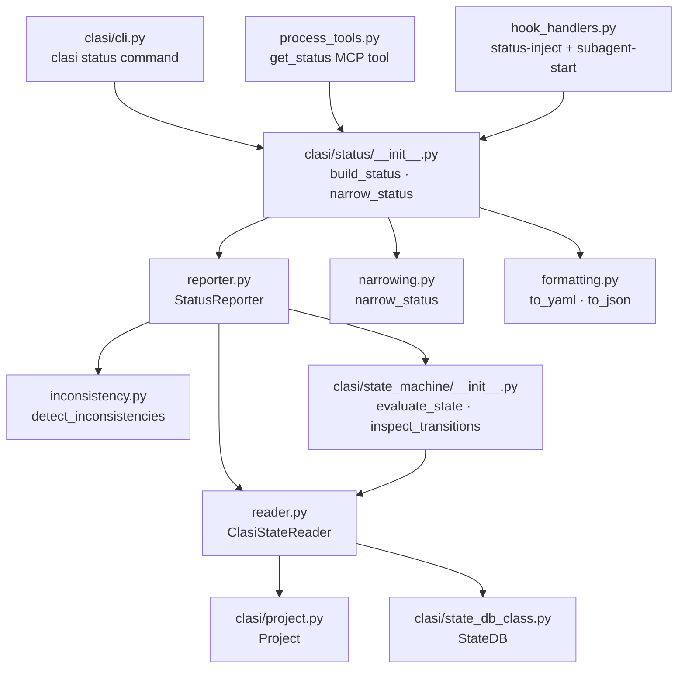
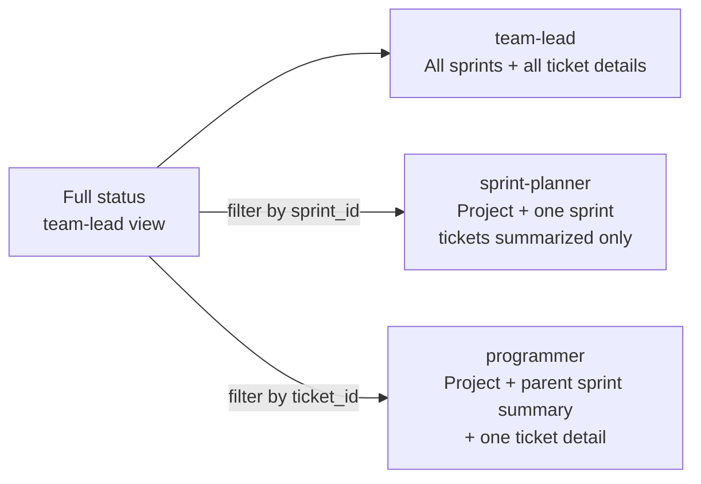
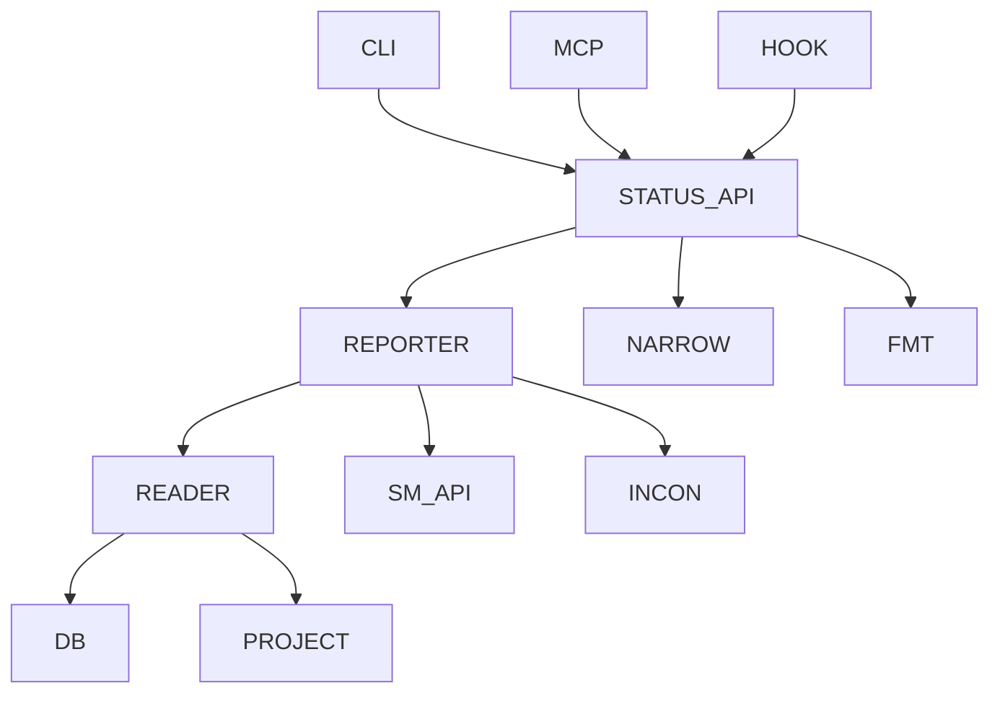
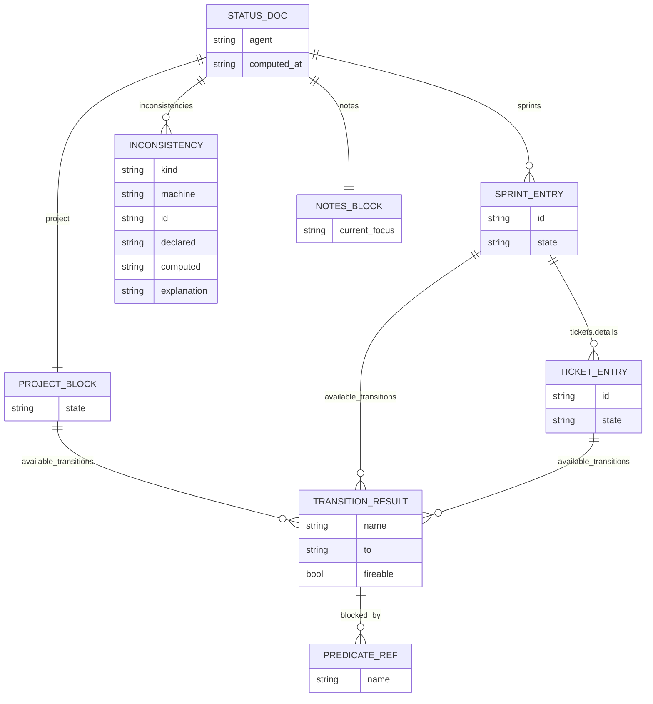

<!-- CLASI: Before changing code or making plans, review the SE process in CLAUDE.md -->

# Architecture Update -- Sprint 006: clasi status Command

## What Changed

This sprint wires the state machine engine (delivered in sprint 005) to real
project data and exposes the results through three surfaces: a CLI command, an
MCP tool, and an auto-injected hook context block.

### New package: `clasi/status/`

| Module | Purpose |
|---|---|
| `__init__.py` | Public API: `build_status`, `narrow_status` |
| `reader.py` | `ClasiStateReader` — production `StateReader` implementation against filesystem + git + StateDB |
| `reporter.py` | `StatusReporter` — assembles the full status dict from state machine evaluations |
| `narrowing.py` | `narrow_status(full, agent, sprint_id, ticket_id)` — filters full output to agent scope |
| `inconsistency.py` | `detect_inconsistencies(full, project)` — declared vs computed state drift |
| `formatting.py` | `to_yaml(status)`, `to_json(status)` — serialization helpers |

### Changes to existing modules

| Module | Change |
|---|---|
| `clasi/cli.py` | Add `clasi status` command (new `@cli.command()`) with `--agent`, `--sprint`, `--ticket`, `--format` flags |
| `clasi/tools/process_tools.py` | Add `get_status(agent, sprint_id, ticket_id)` MCP tool |
| `clasi/hook_handlers.py` | Add `handle_status_inject` for `UserPromptSubmit`; extend `handle_subagent_start` to prepend status block |
| `clasi/cli.py` hook event list | Add `status-inject` to valid hook event names |

---

## Why

Sprint 005 delivered the evaluation engine but left `NullStateReader` as the
only `StateReader` implementation. All three predicate sets (project, sprint,
ticket) call methods on a `StateReader` object; without a real implementation
they return safe defaults (all `False`), making `evaluate_state` and
`inspect_transitions` useless in production.

This sprint's primary obligation is to supply `ClasiStateReader` — the bridge
from the `StateReader` protocol to the filesystem, git, and `StateDB`. Once
that is in place, the reporter assembles the output shape defined in the issue,
the CLI and MCP tool expose it, and the hook injection delivers it automatically.

---

## Impact on Existing Components

| Component | Impact |
|---|---|
| `clasi/state_machine/` | Read-only consumer — no changes |
| `clasi/state_db_class.py` | Read-only consumer — `ClasiStateReader` calls `StateDB` read methods |
| `clasi/project.py` | Read-only consumer — `ClasiStateReader` constructed from a `Project` instance |
| `clasi/cli.py` | **Modified** — one new `clasi status` command; one new hook event name `status-inject` |
| `clasi/tools/process_tools.py` | **Modified** — one new `@server.tool()` for `get_status` |
| `clasi/hook_handlers.py` | **Modified** — `handle_subagent_start` extended to prepend status block; new `handle_status_inject` added |
| `clasi/status/` | **New package** — greenfield, six modules, no changes to any existing file required |
| `clasi/plugin/platforms/` | **Modified** — install templates updated to add `status-inject` hook for `UserPromptSubmit` |
| `tests/` | New `tests/unit/test_status/` directory |

---

## Migration Concerns

None. This sprint is purely additive. No existing data, schema, or behavior
changes. The `get_status` MCP tool is a new tool; existing tools are unchanged.
Projects already initialized with `clasi init` will need to re-run `clasi init`
or manually add the `status-inject` hook entry to pick up auto-injection.

---

## Diagrams

### Component diagram

### Agent scope narrowing

### Module dependency graph

Dependencies flow in one direction: presentation (CLI/MCP/hook) → status
package → engine and infrastructure. No cycles.

### Entity-relationship: status output shape

---

## Design Rationale

### Decision: `clasi/status/` as a new package rather than adding to `clasi/state_machine/`

**Context**: The reporter needs to access `StateDB`, `Project`, `Sprint`, and
`Ticket` objects — all of which are in the main `clasi/` package. Placing
reporter logic inside `clasi/state_machine/` would create an outward dependency
from the engine into the business-logic layer, reversing the intended dependency
direction established in sprint 005.

**Alternatives**:
1. Add reporter to `clasi/state_machine/reporter.py` — would introduce imports
   of `clasi.project`, `clasi.state_db_class`, etc. from inside the engine,
   violating the engine's stated "no outgoing dependencies on existing CLASI
   modules" design principle.
2. Add reporter inline to `clasi/tools/process_tools.py` — creates a large
   function in an already-crowded module; hard to unit-test; CLI and hook would
   have no clean import path.
3. New `clasi/status/` package — clean boundary, independently testable, imports
   the engine's public API without reverse-coupling.

**Why this choice**: Preserves the engine's greenfield isolation. `clasi/status/`
depends on `clasi/state_machine/`; `clasi/state_machine/` has zero knowledge
of `clasi/status/`.

**Consequences**: One new import path (`from clasi.status import build_status`).
The `clasi/status/` directory requires `__init__.py` and a `pyproject.toml`
package data entry if any YAML/templates are added (none anticipated for this
sprint).

---

### Decision: `ClasiStateReader` in `clasi/status/reader.py`, not in `clasi/project.py`

**Context**: Sprint 005's architecture note suggested `project.py` as a future
home for the `StateReader` adapter. On review, `project.py` is imported by
almost every module in the package; adding a `state_machine` import there would
widen the blast radius of any future engine change.

**Alternatives**:
1. `clasi/project.py` — convenient but adds a `clasi.state_machine` import to a
   central shared module used everywhere.
2. `clasi/state_machine/context.py` — would require importing `StateDB` and
   `Project` from inside the engine, violating the no-outward-dependencies rule.
3. `clasi/status/reader.py` — isolated, imported only where the status feature
   is used.

**Why this choice**: Keeps `project.py` and `state_machine/` independent.
`ClasiStateReader` is constructed from a `Project` instance at call sites in
`reporter.py`. This is a deliberate deviation from the sprint 005 architecture
note; that note was a suggestion, not a binding decision.

**Consequences**: `project.py` remains unchanged. The sprint 005 architecture
note's suggested location is not used; the architecture consolidation pass should
drop that stale suggestion.

---

### Decision: Inconsistency detection as a separate module

**Context**: Comparing declared vs computed state requires reading artifact
frontmatter (I/O) and comparing against the computed state. This is a distinct
concern from assembling the output shape.

**Why**: Cohesion test — `reporter.py`'s job is "assemble the output dict from
state machine evaluations"; `inconsistency.py`'s job is "identify state drift
between frontmatter and computed state." They change for different reasons (new
output fields vs new drift kinds). Separating them keeps each module focused and
independently testable with simple unit tests.

**Consequences**: `reporter.py` calls `detect_inconsistencies(full_dict, project)`
and merges the result into the output dict before returning.

---

### Decision: Hook injection via a new `status-inject` event for `UserPromptSubmit`

**Context**: The issue requires both `UserPromptSubmit` and `SubagentStart` to
inject a status block. `SubagentStart` is already handled; `UserPromptSubmit`
is not yet registered.

**Alternatives**:
1. Reuse an existing event (e.g. extend `subagent-start`) — muddies the event
   meaning; `subagent-start` fires only for subagents, not the top-level session.
2. New `status-inject` event — clean, explicit, independently configurable.

**Why**: A dedicated event name allows the hook entry to be added or removed
from `.claude/settings.json` without affecting other hooks. It also makes the
hook log (`hooks.log`) easy to grep for status-injection activity.

**Consequences**: `clasi/cli.py`'s `hook` command event list gains `status-inject`;
the platform install templates must add the hook binding for `UserPromptSubmit`.

---

## Open Questions

1. **`UserPromptSubmit` hook output format**: The Claude Code hook runner for
   `UserPromptSubmit` may require a JSON envelope rather than plain-text stdout
   to inject content into the context window. Ticket 7 implementer must verify
   the exact protocol before implementation. The existing `plan-to-issue`
   `PostToolUse` handler uses a JSON `decision`/`reason` envelope; whether
   `UserPromptSubmit` uses the same format must be confirmed.

2. **`StateReader.tests_passing` in status context**: Running the test suite on
   every `clasi status` call would be unacceptably slow. The ticket 1
   implementer should implement `tests_passing` as returning `False` unless a
   `.clasi/test-cache` marker file is present (written by CI or a post-commit
   hook). This defers the "are tests passing?" question to a cached signal.
   Alternatively, the status output could omit `tests_passing`-gated transitions
   entirely and note this in the `notes:` block.

3. **`programmer_dispatched` implementation**: The `active_agents` table records
   agents only while they are running; dispatch records are removed on stop.
   Ticket 1 must check whether any ticket frontmatter field or state DB record
   persists programmer dispatch history, or whether this predicate must always
   return `False` for status purposes.

4. **Hook install template location**: The install template files under
   `clasi/plugin/platforms/` vary by platform (Claude, Codex, Copilot). Ticket
   7 must identify which template(s) to update and whether the `status-inject`
   hook should be added to all three or only Claude Code.
