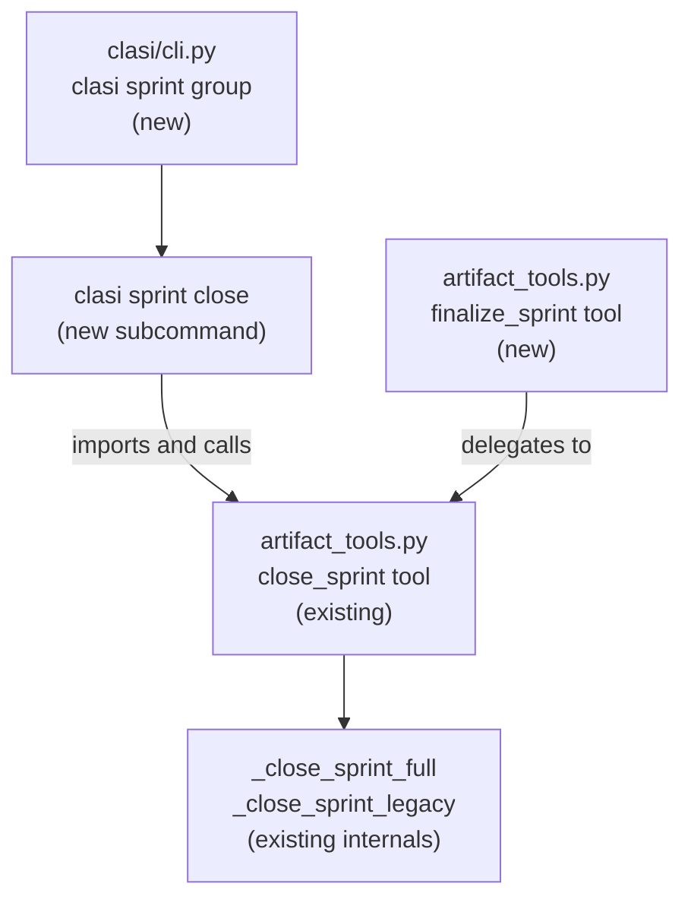
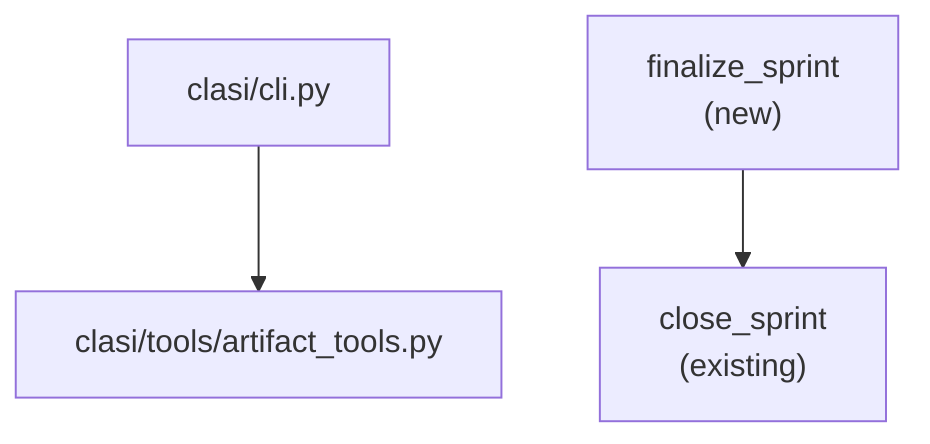

<!-- CLASI: Before changing code or making plans, review the SE process in CLAUDE.md -->

# Architecture Update -- Sprint 007: close_sprint MCP Workaround — finalize_sprint Alias and CLI

## What Changed

### Modified: `clasi/cli.py`

A new `sprint` click group is added, with a `close` subcommand that wraps
`close_sprint` from `artifact_tools.py`.

```
clasi sprint            — Sprint lifecycle commands (new group)
  close <sprint_id>     — Close a sprint (new subcommand)
    --branch            → branch_name
    --main-branch       → main_branch (default: master)
    --push-tags/--no-push-tags   → push_tags (default: True)
    --delete-branch/--no-delete-branch → delete_branch (default: True)
    --test-command      → test_command
```

The subcommand is a thin click wrapper. It imports `close_sprint` lazily
(inside the command body) and echoes the return value. No logic is duplicated.

### Modified: `clasi/tools/artifact_tools.py`

A new `finalize_sprint` function is added immediately after `close_sprint`.
It is decorated with `@server.tool()` and has an identical Python signature.
Its body is a single `return close_sprint(...)` call.

```python
@server.tool()
def finalize_sprint(
    sprint_id: str,
    branch_name: Optional[str] = None,
    main_branch: str = "master",
    push_tags: bool = True,
    delete_branch: bool = True,
    test_command: Optional[str] = None,
) -> str:
    """Alias for close_sprint. See close_sprint for full documentation."""
    return close_sprint(sprint_id, branch_name, main_branch,
                        push_tags, delete_branch, test_command)
```

No other files are changed.

---

## Why

A confirmed VS Code extension bug causes `mcp__clasi__close_sprint` calls to
arrive at the MCP server with an empty params dict, blocking affected users
from closing sprints. Two independent workarounds are needed:

- **CLI subcommand (SUC-001)**: provides a durable, MCP-independent escape
  hatch for any environment where the MCP layer is unreliable.
- **Tool alias (SUC-002)**: isolates tool name as a diagnostic variable. If
  `finalize_sprint` succeeds where `close_sprint` fails, the name is the
  trigger and the alias becomes the permanent workaround until upstream fixes.

---

## Impact on Existing Components

| Component | Impact |
|---|---|
| `clasi/cli.py` | Modified — new `sprint` group and `close` subcommand added |
| `clasi/tools/artifact_tools.py` | Modified — `finalize_sprint` function added after `close_sprint` |
| `close_sprint` function | Unchanged — no signature or behavior changes |
| MCP tool registry | One new tool registered: `finalize_sprint` |
| All other modules | No impact |

---

## Migration Concerns

None. Both changes are purely additive:
- The new CLI command does not alter any existing command.
- The new MCP tool does not alter `close_sprint`.
- No data model, schema, or state DB changes.

---

## Diagrams

### Component diagram



### Dependency graph



Dependencies flow one direction: CLI → artifact_tools, alias → existing
function. No cycles introduced.

---

## Design Rationale

### Decision: `clasi sprint close` (group) vs `clasi close-sprint` (flat command)

**Context**: The CLI already has two sub-groups: `tool` (for utility
commands) and `schema` (for schema management). A `sprint close` command
could be added as either a new group or a flat top-level command.

**Alternatives**:
1. `clasi close-sprint` (flat, top-level): smaller change — one `@cli.command()`
   decorator. No group needed. Works fine for a single command.
2. `clasi sprint close` (group): matches the existing `tool` and `schema`
   group patterns. Groups lifecycle operations cohesively. `close` is the
   first member; `advance-phase`, `acquire-lock`, etc. are plausible future
   additions noted in the TODO.

**Why this choice**: The TODO explicitly anticipates future lifecycle CLI
commands ("we should probably expose the other lifecycle operations the same
way over time"). A group now costs one decorator and zero conceptual overhead.
A flat command now forces a rename later if grouped structure is desired.

**Consequences**: `clasi sprint --help` becomes the discovery point for
lifecycle commands. The group itself has no flags — it is a pure namespace.

---

### Decision: `finalize_sprint` signature must be byte-for-byte identical to `close_sprint`

**Context**: The diagnostic value of the alias depends entirely on the tool
name being the *only* changed variable. If any other property differs —
param types, defaults, order, boolean presence — the test is confounded.

**Why**: If both tools fail, we need to rule out name and conclude the cause
is structural. That conclusion is only valid if structure is held constant.

**Consequences**: The ticket carries an explicit acceptance criterion requiring
`inspect.signature` equality between the two functions.

---

## Open Questions

None. Both changes are mechanical wrapping of an existing function. No
ambiguous design decisions require stakeholder input before implementation.
