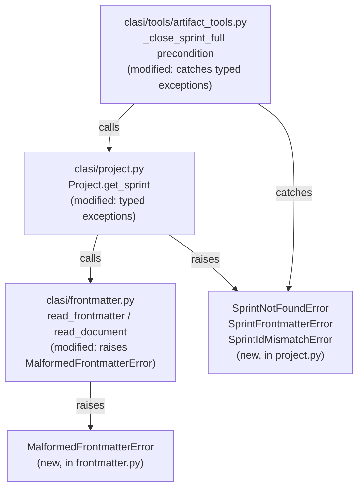
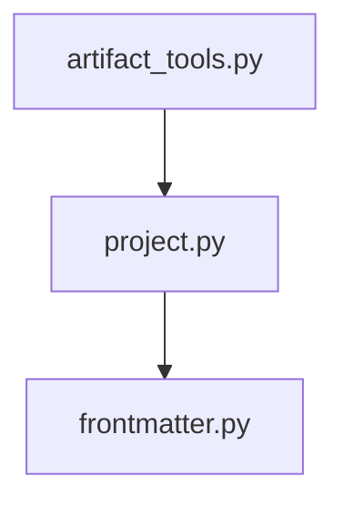

<!-- CLASI: Before changing code or making plans, review the SE process in CLAUDE.md -->

# Architecture Update -- Sprint 008: Frontmatter robustness and close_sprint diagnostics

## What Changed

### Modified: `clasi/frontmatter.py`

A new typed exception class `MalformedFrontmatterError` is added. It inherits
from `ValueError` for backwards compatibility with callers that already catch
`ValueError`.

The `_parse` function's guard clause is tightened: the check `if not
content.startswith("---")` is replaced with a stricter check that the file
content starts with the canonical two-character sequence `---\n` (or `---\r\n`
on Windows). When a file has content but the first line is not exactly `---`,
`_parse` raises `MalformedFrontmatterError` with a message that names the file
path (passed through from `read_document`) and the actual first-line text found.

`read_document` is updated to accept an optional `path` argument (already
provided) and thread it through to `_parse` for use in error messages.

No change to `write_frontmatter`, `_write_document`, or the happy path of
`read_frontmatter`.

### Modified: `clasi/project.py`

`get_sprint` is updated to distinguish three sub-cases instead of raising a
single undifferentiated `ValueError`:

1. **No matching directory** — `SprintNotFoundError` (subclass of `ValueError`)
   with the existing message.
2. **Directory present, frontmatter missing or unparseable** —
   `SprintFrontmatterError` (subclass of `ValueError`) naming the sprint file
   and the underlying parse failure.
3. **Directory present, frontmatter parsed, `id:` absent or mismatched** —
   `SprintIdMismatchError` (subclass of `ValueError`) naming the file and the
   actual `id` value found versus the one requested.

All three exception classes are defined at module level in `project.py`. They
remain subclasses of `ValueError` so any existing `except ValueError` handler
continues to match.

`list_sprints` is updated to catch `MalformedFrontmatterError` from
`read_frontmatter` per sprint file and log a `WARNING` naming the file, rather
than letting the exception propagate and halt iteration.

### Modified: `clasi/tools/artifact_tools.py`

`_close_sprint_full`'s precondition block (lines ~1141-1155) is updated to catch
the three typed sub-cases from `get_sprint` and return a structured error
response appropriate to each:

- `SprintNotFoundError` → existing message "Sprint not found — create or restore
  the directory" (unchanged).
- `SprintFrontmatterError` → new message naming the file and parse failure;
  `recovery.instruction` says to fix the frontmatter in the named file.
- `SprintIdMismatchError` → new message naming the file and the id mismatch;
  `recovery.instruction` says to correct the `id:` field.

The catch-all `except ValueError` is retained as a fallback for unanticipated
sub-classes, but the three typed cases are caught first with specific messages.

---

## Why

The changes address two paired defects (issues `frontmatter-silent-on-malformed-fence.md`
and `close-sprint-not-found-error-misleading.md`) discovered during sprint 007
debugging. Fixing the upstream parser (sprint 008 ticket 001) enables the
downstream error discrimination (ticket 002) to work without heuristic scanning.

---

## Impact on Existing Components

| Component | Impact |
|---|---|
| `clasi/frontmatter.py` | New `MalformedFrontmatterError` class; `_parse` raises it on corrupted fence |
| `clasi/project.py` | New typed exception classes; `get_sprint` raises typed exceptions; `list_sprints` catches and warns |
| `clasi/tools/artifact_tools.py` | `_close_sprint_full` catches typed exceptions with specific messages |
| All other callers of `read_frontmatter` | Receive `MalformedFrontmatterError` (a `ValueError`) on corrupted files — compatible with any existing `except ValueError` handler |
| Tests | New unit tests required; all existing tests must continue to pass |

---

## Migration Concerns

None for existing data. Existing sprint directories with valid frontmatter are
unaffected. The only behavioral change is that files with corrupted frontmatter
now raise rather than silently returning `{}` — which is the desired correction.

---

## Diagrams

### Component diagram

### Dependency graph

Dependencies flow one direction: `artifact_tools` → `project` → `frontmatter`.
No cycles. `frontmatter.py` has no project-level imports (unchanged).

---

## Design Rationale

### Decision: `MalformedFrontmatterError` as a subclass of `ValueError`

**Context**: `read_frontmatter` is called in many places. Some callers (e.g.
`list_sprints`) already handle "no frontmatter" gracefully via `fm.get(...)`.
Some callers (e.g. `get_sprint`) catch `ValueError` from downstream operations.
Raising a new exception type risks breaking callers that do not anticipate it.

**Alternatives considered**:
1. Return a sentinel value (e.g. `None` or a special dict) — callers would need
   type-checking logic everywhere; does not provide a stack trace; the dispatch
   said to prefer raising.
2. Raise a completely new, unrelated exception — breaks any existing
   `except ValueError` handler; requires all callers to be updated simultaneously.
3. Raise `MalformedFrontmatterError(ValueError)` — catches in all existing
   `except ValueError` blocks; provides a clear, typed class for callers that
   want to discriminate; stack trace names the file. Chosen.

**Consequences**: The change is backwards-compatible. A file with corrupted
frontmatter that previously returned `{}` now raises. The behavior change is
intentional and only affects the error path.

---

### Decision: Raise vs. warn in `read_frontmatter`

**Context**: The dispatch says "prefer raising a typed exception" but also notes
that "logging a warning in addition to raising" is acceptable and discusses
the tradeoff.

**Tradeoff**:
- **Raise only**: Clean; no ambiguity; the caller decides how to handle it. The
  downside is that callers like `list_sprints` that iterate many files will see
  one exception stop the iteration for that file — they must catch and continue.
- **Warn and return `{}`**: Non-breaking for all callers; silent corruption is
  detectable via logs. The downside is that the error continues to cascade
  silently if the log is not monitored — the original problem.
- **Raise and let callers catch to log-and-continue**: Provides both a stack
  trace and per-caller control. `list_sprints` can catch, warn, and skip;
  `get_sprint` can catch and re-raise as `SprintFrontmatterError`. Chosen.

**Consequences**: `list_sprints` is updated to catch `MalformedFrontmatterError`
and continue iteration with a `WARNING`. `get_sprint` re-raises as
`SprintFrontmatterError`. All other callers that do not catch will receive the
exception — which is the desired failure mode for unexpected corruption.

---

### Decision: Typed sprint exception hierarchy in `project.py` rather than discriminating in `artifact_tools.py`

**Context**: The discrimination between "no directory", "malformed frontmatter",
and "id mismatch" could be done either inside `get_sprint` (raising typed
exceptions) or inside `_close_sprint_full` (scanning the sprints directory
before calling `get_sprint`).

**Alternatives**:
1. Discriminate in `_close_sprint_full` — requires `artifact_tools.py` to know
   about sprint directory layout; duplicates iteration logic from `project.py`;
   violates the boundary between the tools layer and the domain layer.
2. Typed exceptions from `get_sprint` — the domain layer owns sprint lookup;
   it is the correct place to know why a lookup failed. Callers get precise
   exceptions without needing to re-inspect the filesystem.

**Why this choice**: Typing exceptions in `project.py` is cohesive and keeps
the tools layer thin. `_close_sprint_full` only needs to catch and translate —
it does not need to re-implement sprint scanning.

**Consequences**: Three new exception classes in `project.py`. Any future caller
of `get_sprint` gets precise diagnostics for free.

---

## Open Questions

None. The change boundaries are fully specified and no upstream architecture
decisions are overridden.
