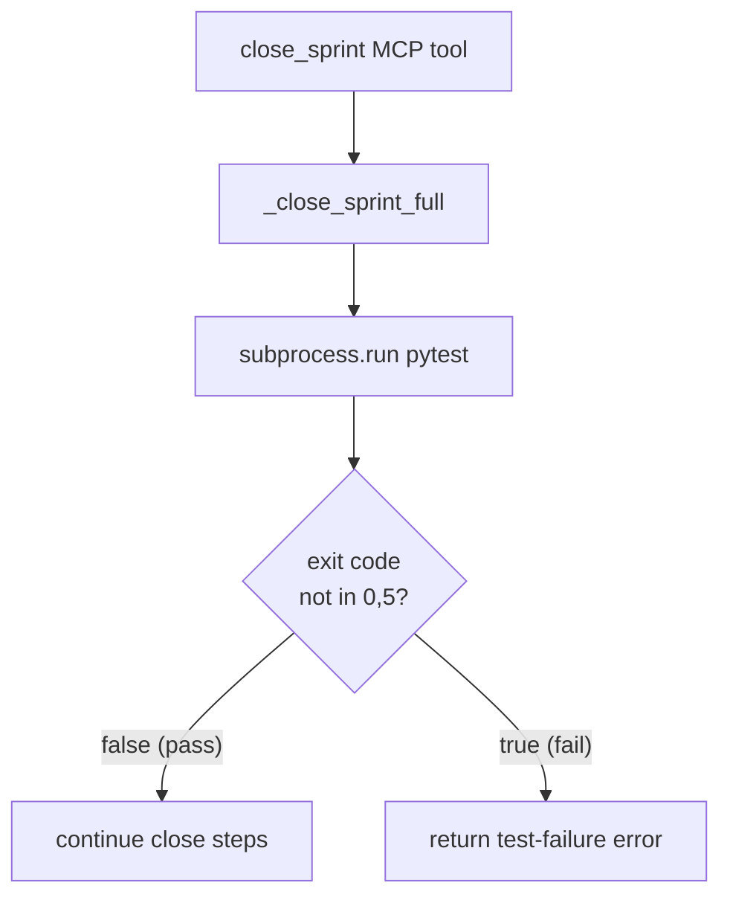

<!-- CLASI: Before changing code or making plans, review the SE process in CLAUDE.md -->

# Architecture Update -- Sprint 011: close_sprint treat pytest exit code 5 as pass

## What Changed

`clasi/tools/artifact_tools.py` — the exit-code guard in `_close_sprint_full`
is widened from `!= 0` to `not in (0, 5)`. An inline comment is added
documenting the pytest exit-code semantics (0 = all passed, 1 = some failed,
5 = no tests collected).

A new unit test is added covering the exit code 5 pass path.

No new modules, interfaces, or data-model changes are introduced.

## Why

SUC-001: repos with no test suite produce pytest exit code 5 ("no tests
collected"). The previous guard treated every non-zero exit code as a
test failure, causing `close_sprint` to return an error in those repos.
The agent then lost context and retried with empty arguments, surfacing a
misleading "parameter drop" symptom that obscured the true root cause.

Exit code 5 is a documented pytest code meaning the collection phase ran
cleanly but found nothing to execute. It is not a failure and should not
block sprint close.

## Impact on Existing Components

| Component | Change | Notes |
|---|---|---|
| `clasi/tools/artifact_tools.py` | Logic fix — exit code guard | Single expression + comment |
| Test suite | New unit test | Covers exit code 5 pass path |

All other components are unaffected. The MCP tool signature, sprint
lifecycle, and skill instructions are unchanged.

## Migration Concerns

None. The change is backward-compatible: repos with a test suite produce
exit code 0 (pass) or 1/2/3/4 (failure codes), all of which continue to
behave correctly.

## Design Rationale

**Decision**: Treat only codes 0 and 5 as pass; all other non-zero codes
remain failures.

**Context**: Pytest defines exit codes 1-4 as meaningful failure conditions
(tests failed, interrupted, internal error, usage error). Code 5 is the
sole "no work to do" code.

**Alternatives considered**: Treating all codes >= 5 as pass — rejected
because future pytest versions could assign new codes above 5. Explicit
enumeration is safer and self-documenting.

**Consequences**: Any repo with no tests no longer blocks close_sprint.
Users who previously worked around this by passing `test_command=""` still
work correctly.

## Open Questions

None.

## Component Diagram

