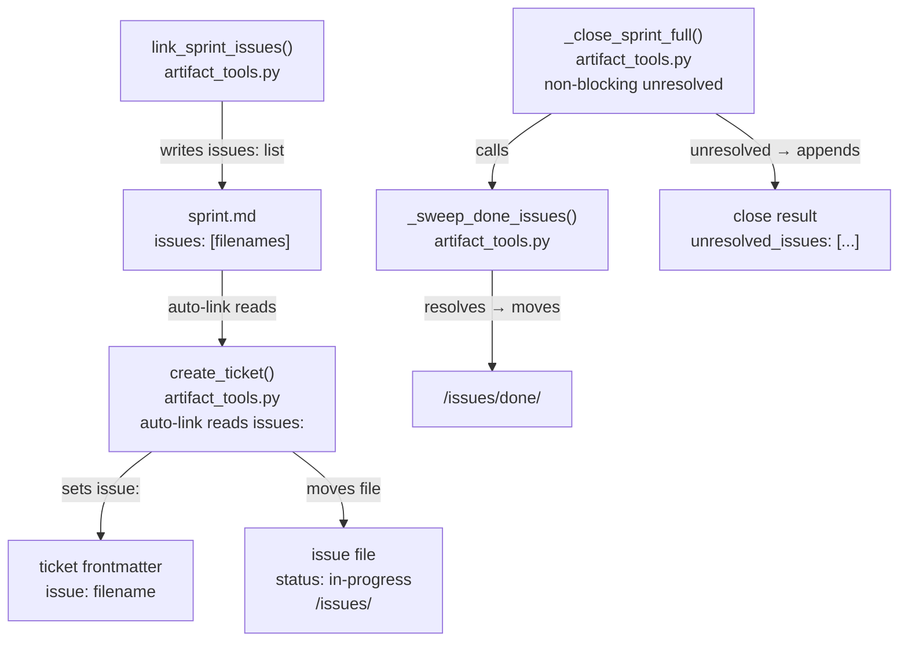

<!-- CLASI: Before changing code or making plans, review the SE process in CLAUDE.md -->

# Architecture Update — Sprint 014: Issue-ticket linkage and done lifecycle

## What Changed

### Changed: `create_ticket` auto-link reads `issues:` field (artifact_tools.py)

The auto-link logic in `create_ticket` (inside `clasi/tools/artifact_tools.py`,
in the block that runs when `issue=None`) currently reads the sprint's `todos:`
frontmatter field. This field is never populated by `link_sprint_issues`, which
writes `issues:` instead. The fix reads `issues:` first; if that field is absent
or empty, falls back to `todos:` for legacy sprint compatibility. No interface
changes — the auto-link is still transparent to callers.

### Changed: `_close_sprint_full` non-blocking on unresolved issues (artifact_tools.py)

`_close_sprint_full` currently hard-fails with an error JSON when any
sprint-scoped issue remains `in-progress` (not deferred). `_close_sprint_legacy`
already handles this by collecting filenames into `unresolved_issues` and
continuing. The fix mirrors the legacy path: collect unresolved issue filenames,
include them in the success result under `unresolved_issues`, and do not return
an error. The `_issue_is_deferred` check is preserved — deferred issues still
pass cleanly. Both close paths now behave identically for unresolved issues.

### Changed: Plugin skill docs — linkage instructions added

Five plugin documents in `clasi/plugin/` gain explicit linkage instructions.
These are behavioral contracts for agents; no code logic changes.

- **`clasi/plugin/skills/sprint-roadmap/SKILL.md`** — Step 4 (currently
  "Update TODOs") is replaced with: call `link_sprint_issues(sprint_id,
  [filenames])` for every issue claimed in the roadmap. The old `todos:` advice
  is removed; issues are the canonical link mechanism.

- **`clasi/plugin/skills/plan-sprint/SKILL.md`** — The skill currently
  delegates to `clasi/schemas/se-process/instructions/sprint-plan.md`. The
  instruction source is updated (or the SKILL.md stub itself extended) to
  instruct calling `link_sprint_issues` explicitly during the planning-docs phase
  rather than writing `issues:` manually via `write_artifact_frontmatter`.

- **`clasi/plugin/skills/create-tickets/SKILL.md`** — The existing "Issue
  lifecycle" section already documents `create_ticket(issue=)` and
  `add_issue_ref`. This sprint reinforces: every ticket that implements an issue
  must carry `issue:` in its frontmatter; the programmer verifies back-refs are
  present before closing a ticket.

- **`clasi/plugin/agents/team-lead/agent.md`** — A new "Issue Lifecycle
  Responsibility" section is added to the agent doc, describing four checkpoints:
  (1) link at roadmap via `link_sprint_issues`; (2) confirm tickets carry
  `issue:` back-refs after sprint planning; (3) after close, confirm resolved
  issues landed in `<sprint>/issues/done/`; (4) mop up any `unresolved_issues`
  reported in the close result.

- **`clasi/plugin/skills/close-sprint/SKILL.md`** — Expanded to document the
  auto-sweep performed by `_sweep_done_issues` at close, and that
  `unresolved_issues` in the result are non-blocking. The agent is instructed to
  read `unresolved_issues` from the result and surface them to the team-lead.

---

## Why

The issue → sprint → ticket → done chain is fully implemented in code but never
fires in practice because:

1. `create_ticket` reads `todos:` but `link_sprint_issues` writes `issues:` —
   a field-name mismatch means auto-link never fires even in a correctly-linked
   sprint (SUC-001).
2. `_close_sprint_full` hard-fails on any unresolved issue, while the legacy
   path treats them as non-blocking. This inconsistency makes the full close
   path (used in VS Code) more fragile than the legacy path (SUC-002).
3. Skill and agent docs never tell agents to call the linkage tools, so agents
   skip them regardless of what the tools support (SUC-003).

Fixing the field-name bug and the blocking behavior makes the chain work; adding
instructions ensures agents actually invoke it.

---

## Component Diagram

---

## Impact on Existing Components

**`clasi/tools/artifact_tools.py`** — Two targeted changes:
- `create_ticket` auto-link: read order changes from `todos:` to `issues:`
  with `todos:` as fallback. Callers are unaffected; the behavior only differs
  when `issue=None` is passed and the sprint has an `issues:` field.
- `_close_sprint_full`: the hard-fail block (error JSON + `write_recovery_state`
  call) for unresolved in-progress issues is replaced with the same
  collect-and-continue pattern already in `_close_sprint_legacy`. The
  `_issue_is_deferred` guard is preserved.

**Plugin docs** — Behavioral changes to five documents in `clasi/plugin/`. The
installed copies under `.claude/` are generated by the installer; they must be
regenerated (or manually mirrored) after the plugin source changes. This is
standard Sprint 013+ maintenance: always edit `clasi/plugin/`, let the installer
update `.claude/`.

**No new modules, interfaces, or data model changes** — This sprint is a
precision repair: two code-path fixes and five doc additions. No new tables,
no new public functions, no dependency additions.

---

## Migration Concerns

None. Both code fixes are backward-compatible: the `todos:` fallback in A1
preserves existing sprint behavior; the non-blocking change in A2 is strictly
less restrictive than the current hard-fail (callers that relied on the error
should instead check `unresolved_issues` in the result).

The plugin doc changes take effect when Claude Code reloads `.claude/`
skill/agent files. If the installer has not been run after this sprint merges,
the `.claude/` copies remain stale — this is the standard concern documented in
Sprint 013's architecture. Running `clasi init` or the plugin installer syncs
them.

---

## Design Rationale

**Decision**: Read `issues:` first, fall back to `todos:`.
**Context**: `link_sprint_issues` has always written `issues:`. The `todos:`
read in `create_ticket` is a latent bug introduced when the field name was
standardized. We cannot simply rename the field because some legacy sprints
may have `todos:` in their frontmatter.
**Alternatives**: Rename `todos:` to `issues:` everywhere. Rejected — breaks
existing sprint artifacts.
**Consequences**: Auto-link now works for all sprints created after
`link_sprint_issues` was added (Sprint 002+). Legacy sprints with `todos:` still
auto-link via fallback.

**Decision**: Mirror `_close_sprint_legacy` behavior exactly for unresolved
issues.
**Context**: Two close paths must behave identically for correctness. The legacy
path's non-blocking approach was confirmed correct with the stakeholder:
"collect `unresolved_issues`, add to result, continue."
**Alternatives**: Unify the two paths into one. Deferred — structural refactor
is out of scope for this precision-fix sprint.
**Consequences**: The result contract for `close_sprint` is extended: callers
may now see `unresolved_issues` in a success result from either code path.

---

## Open Questions

None. All design decisions were confirmed with the stakeholder in the sprint
planning issue (`issue-done-and-linkage-front-matter-not-updated.md`).
