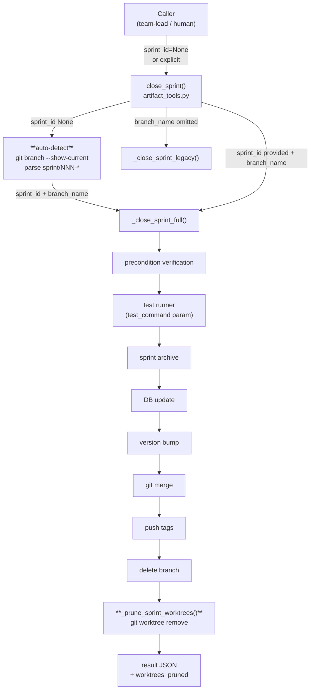
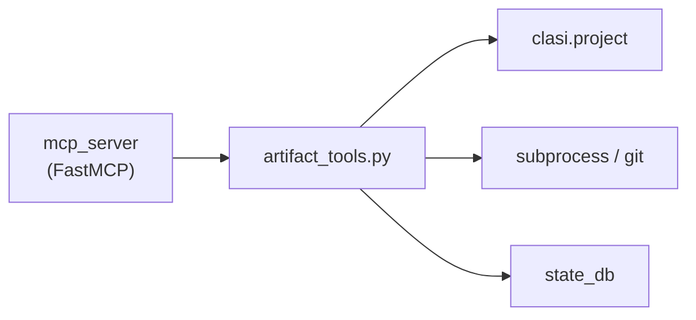

<!-- CLASI: Before changing code or making plans, review the SE process in CLAUDE.md -->

# Architecture Update — Sprint 015: close_sprint and sprint-lifecycle hardening

## Audit: What Is Already Done

**Item 1 — `test_command` parameter exposure**: Already implemented. The `close_sprint`
function in `clasi/tools/artifact_tools.py` (line 977) carries `test_command: Optional[str] = None`
and is decorated with `@server.tool()`, making it part of the MCP schema. The implementation
in `_close_sprint_full` already handles `test_command=""` (skip), `test_command=None` (default
to `uv run pytest`), and any custom string. No work is required for item 1.

## What Changed

This sprint makes three targeted changes, all contained within `clasi/tools/artifact_tools.py`
and associated test files:

### 1. `sprint_id` made optional in `close_sprint` (SUC-015-001)

The `close_sprint` function signature changes `sprint_id: str` to `sprint_id: Optional[str] = None`.
When `sprint_id` is `None` or empty, the function calls `git branch --show-current` and parses
the result against the pattern `sprint/NNN-*` to derive both `sprint_id` and `branch_name`.

If the current branch does not match `sprint/NNN-*`, the function returns a structured error JSON:
```json
{
  "status": "error",
  "error": {
    "step": "auto-detect",
    "message": "Not on a sprint branch. Provide sprint_id explicitly or check out the sprint branch.",
    "current_branch": "<branch>"
  }
}
```

Auto-detection is a convenience for interactive use, not a replacement for explicit `sprint_id` in
scripted or CI contexts.

### 2. Worktree cleanup added to `_close_sprint_full` (SUC-015-002)

A new `_prune_sprint_worktrees(sprint_id: str) -> list[str]` helper is added to
`clasi/tools/artifact_tools.py`. It is called as the final step of `_close_sprint_full`, after
the branch deletion step.

The helper:
1. Runs `git worktree list --porcelain` and parses the output.
2. Identifies worktrees whose `branch` field matches `refs/heads/sprint/NNN-*` for the closing sprint.
3. Calls `git worktree remove --force <path>` for each match.
4. Returns the list of pruned worktree paths (empty list if none).

Failures from individual worktree removals are caught and appended to `repairs` rather than
aborting the close. The `worktrees_pruned` list is included in the result JSON.

### 3. `finalize_sprint` alias removed (SUC-015-003)

The `finalize_sprint` function (lines 1014–1030 of `artifact_tools.py`) is deleted entirely.
The `@server.tool()` decorator on it is removed with it, unregistering it from the MCP schema.

Associated test and registration artifacts removed:
- `tests/unit/test_finalize_sprint_alias.py` — deleted entirely.
- `tests/unit/test_mcp_server.py` — `"finalize_sprint"` removed from `EXPECTED_ARTIFACT_TOOLS`.
- `clasi/plugin/skills/close-sprint/SKILL.md` — any `finalize_sprint` references removed.

## Why

- **Auto-detect `sprint_id`**: The sprint ID is always deterministic from the branch name. Requiring
  the caller to supply it when omitted causes unnecessary failures (empty-args bug, copy-paste
  omissions). Providing auto-detection as the fallback makes the tool robust without changing the
  normal explicit-arg path.
- **Worktree cleanup**: Sprint execution creates one worktree per ticket. These accumulate silently
  after close. Pruning them at close keeps the repository clean and avoids stale checkout confusion.
- **Remove `finalize_sprint`**: The alias was created in sprint 007 to diagnose a VS Code bug
  (sprint 011 fixed the root cause). It has been dead weight since sprint 011. Removing it
  reduces surface area and eliminates the alias test that currently duplicates the close_sprint
  contract.

## Impact on Existing Components

| Component | Change |
|---|---|
| `clasi/tools/artifact_tools.py` | `close_sprint`: `sprint_id` made optional; auto-detect logic added. `_close_sprint_full`: worktree cleanup step added. `_prune_sprint_worktrees`: new private helper. `finalize_sprint`: deleted. |
| `clasi/mcp_server` (via FastMCP decorators) | `finalize_sprint` tool unregistered; `close_sprint` schema updated (`sprint_id` now optional). |
| `tests/unit/test_finalize_sprint_alias.py` | Deleted. |
| `tests/unit/test_mcp_server.py` | `finalize_sprint` removed from expected tool set; tool count decremented. |
| `clasi/plugin/skills/close-sprint/SKILL.md` | `finalize_sprint` references removed; new parameter docs added. |

No new modules. No database schema changes. No cross-cutting changes beyond the files listed.

## Diagrams

### Component diagram: close_sprint lifecycle (Sprint 015 additions in bold)



### Dependency graph (unchanged; shown for reference)



## Design Rationale

### Decision: auto-detect uses `git branch --show-current`, not env var

**Context**: Need to derive the sprint ID when the caller omits it.

**Alternatives**:
1. Parse the branch from an env var (`CLASI_SPRINT_ID`).
2. Read from a `.clasi/current-sprint` file.
3. Call `git branch --show-current` at runtime.

**Why option 3**: The branch name is already the authoritative source of truth for the sprint
being executed. It is always present in sprint execution contexts (the close-sprint skill checks
out the sprint branch before closing). Env vars and files add state that can go stale; the branch
cannot lie about what sprint the model is on.

**Consequences**: Auto-detection fails clearly if the model somehow calls `close_sprint()` without
arguments while on a non-sprint branch. This is the desired behavior.

### Decision: worktree cleanup is non-blocking

**Context**: A worktree removal might fail if the worktree has untracked changes or is locked.

**Why non-blocking**: Worktree pruning is a hygiene step. A failure to clean up should not
prevent the sprint from being archived. The team-lead can manually run `git worktree prune`
if needed. Surfacing the error in the result JSON is sufficient.

## Open Questions

None. All design decisions are resolvable within existing architecture.

## Migration Concerns

None for items 1 and 3. For item 2: existing sprint worktrees created before this sprint will
be pruned at the next `close_sprint` call. This is the desired behavior; no migration needed.
