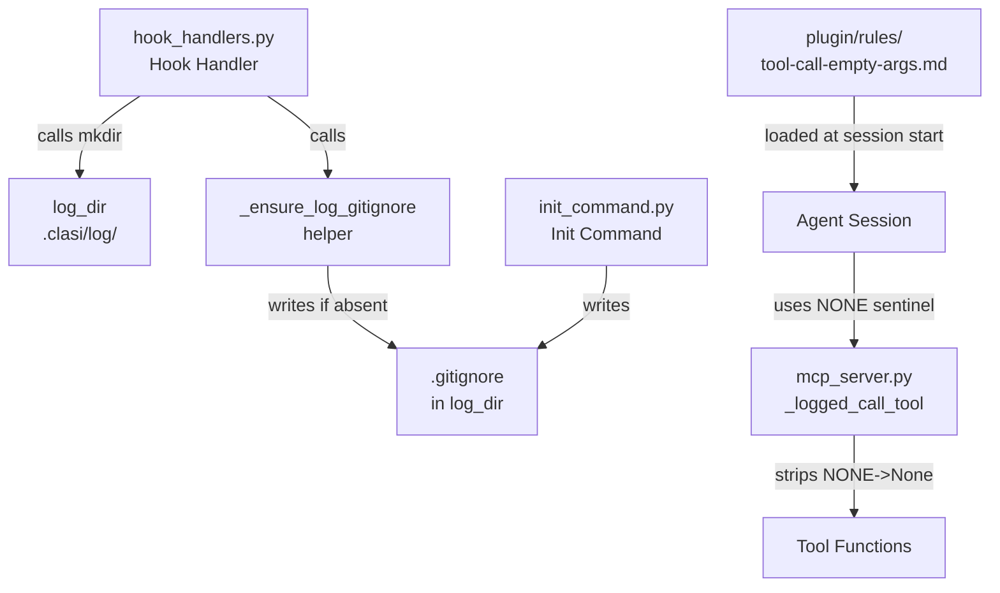

<!-- CLASI: Before changing code or making plans, review the SE process in CLAUDE.md -->

# Architecture Update — Sprint 016: Security and housekeeping

## Audit: What Is Already Done

### Security: Log directory gitignore protection

**Root `.gitignore`** — both `docs/clasi/log/` (old layout) and `.clasi/log/` (new default
layout) are already present in the repository's root `.gitignore` (lines 62–63). This
covers the default log path for all fresh installs.

**Log-dir self-contained `.gitignore`** — `clasi/init_command.py` (lines 212–215) already
writes `<log_dir>/.gitignore` containing `# Ignore all log files\n*\n!.gitignore` when
creating the log directory during `clasi init`. This is confirmed by existing tests
`test_creates_log_directory_with_gitignore` and `test_log_gitignore_idempotent` in
`tests/unit/test_init_command.py`.

**What is missing**: `clasi/hook_handlers.py` calls `log_dir.mkdir(parents=True,
exist_ok=True)` at lines 61 and 315 (runtime, not init-time) but does **not** write a
`.gitignore` afterward. If a project's log directory is first created by a hook invocation
rather than by `clasi init`, the directory exists without protection until `init` is run.
This is the remaining gap.

**Root `.gitignore` coverage for non-default paths**: The root `.gitignore` only contains
patterns for the two known paths (`docs/clasi/log/` and `.clasi/log/`). If a project
configures a custom `paths.logs` in `.clasi/config.yaml`, the root `.gitignore` will not
cover it. However, the self-contained `<log_dir>/.gitignore` written by `init_command.py`
does protect the configured path. The hook-handler gap above is the higher-priority fix.

### NONE-sentinel stripping

**Already implemented**: `clasi/mcp_server.py` lines 197–200 show `_logged_call_tool`
already strips `"NONE"` → `None` for all arguments before dispatching:

```python
arguments = {k: (None if v == "NONE" else v) for k, v in arguments.items()}
```

This covers all MCP tools in a single intercept point. The comment confirms intent.

**What is missing**: No unit tests exist for this behavior in
`tests/unit/test_mcp_server.py`. The test file only tests `content_path`, the server
instance, and tool registration — not the sentinel stripping logic.

**Rule file**: `clasi/plugin/rules/tool-call-empty-args.md` does not exist. Agents have
no authoritative, always-loaded documentation of the bug or the `"NONE"` convention.

---

## What Changed

### 1. Hook handlers ensure log-dir gitignore on runtime creation (SUC-016-002, SUC-016-003)

A new module-level helper `_ensure_log_gitignore(log_dir: Path) -> None` is added to
`clasi/hook_handlers.py`. It writes `<log_dir>/.gitignore` containing `*` and
`!.gitignore` if the file does not already exist.

Every call site in `hook_handlers.py` that calls `log_dir.mkdir(...)` is followed
immediately by `_ensure_log_gitignore(log_dir)`. This brings runtime-created log
directories to the same protection level as init-created ones, idempotently.

### 2. NONE-sentinel tests added (SUC-016-004)

Unit tests are added to `tests/unit/test_mcp_server.py` covering the `_logged_call_tool`
sentinel stripping behavior:

- Passing `"NONE"` as an argument value produces `None` in the dispatched call.
- Passing a legitimate non-`"NONE"` string passes through unchanged.
- Mixed arguments (some `"NONE"`, some real values) are handled correctly.

Testing approach: mock `_tm.call_tool` to capture the arguments it receives, then assert
on the captured values after calling `_logged_call_tool` directly.

### 3. Rule file documenting the empty-argument bug (SUC-016-005)

`clasi/plugin/rules/tool-call-empty-args.md` is created with `paths: ["**"]` frontmatter
so Claude Code loads it in every agent session.

Content covers:
- The confirmed harness bug: if any argument in a tool call is empty or null, all
  arguments are silently dropped and the tool receives `input_value={}`.
- The mitigation: pass the literal string `"NONE"` for optional parameters.
- Server-side stripping: `_logged_call_tool` converts `"NONE"` back to `None` before
  dispatch, so tool functions receive `None` as expected.
- The ToolSearch-first requirement for deferred tools.

`clasi init` installs this file via the existing platform installer (Claude installs all
files from `plugin/rules/` into `.claude/rules/`). No additional installer logic is needed.

---

## Why

### Hook-handler gap

The log directory is created at first hook invocation in any project that runs CLASI
without first running `clasi init`. A fresh clone with CLASI config already present (e.g.,
after pulling) will have the hook create the log directory without a `.gitignore`. This
matches the confirmed incident pattern: commits on a new checkout inadvertently staged log
files. The fix is a single helper function called at every creation site.

### NONE-sentinel tests

The stripping logic already exists but is untested. Without tests, a future refactor of
`_logged_call_tool` could silently remove this safety behavior. Sprint-closure failures
(sprints 007, 010, 011) demonstrate the real cost of this bug. Tests anchor the behavior.

### Rule file

Agents currently discover the `"NONE"` convention only from prior conversation context or
by failing and reading sprint retrospectives. A rule file loaded at session start removes
the rediscovery cost and prevents repeated failures.

---

## Impact on Existing Components

| Component | Change | Scope |
|---|---|---|
| `clasi/hook_handlers.py` | Add `_ensure_log_gitignore` helper; call at `log_dir.mkdir` sites | Additive |
| `clasi/mcp_server.py` | No code change; stripping already implemented | None |
| `tests/unit/test_mcp_server.py` | Add NONE-sentinel test class | Additive |
| `clasi/plugin/rules/tool-call-empty-args.md` | New rule file | Additive |

The rule file ships with the package immediately. Projects pick it up via `clasi init`.

---

## Component Diagram



---

## Design Rationale

### Decision: Strip ALL arguments equal to "NONE", not just Optional[str] typed ones

**Context**: An alternative to the blanket strip-all approach would be to introspect the
tool's JSON Schema and only strip parameters typed as `Optional[str]`.

**Alternatives considered**: Schema-introspective stripping (more precise, more complex);
parameter-name allowlist (fragile, must be maintained); current blanket approach.

**Why this choice**: The `"NONE"` sentinel is a convention specifically for string
arguments — no integer or boolean parameter should legitimately receive the string
`"NONE"`. Blanket stripping is simpler, requires no schema access, and covers future tools
automatically.

**Consequences**: A tool parameter that legitimately accepts the string `"NONE"` as a
real value would be incorrectly stripped. This is documented as a known limitation in the
rule file.

### Decision: _ensure_log_gitignore writes only if file is absent

**Context**: The file could be unconditionally overwritten on every call (simpler) or
skipped if it already exists (idempotent, preserves customizations).

**Why this choice**: Skip-if-exists preserves any legitimate user customization. If the
file exists, it was either placed by `init` (correct content) or by the user (intentional).
Overwriting on every hook invocation would be noisy and surprising.

---

## Open Questions

None. All design decisions are resolved. Scope is narrow and all code locations are
confirmed by grep audit.

---

## Migration Concerns

None. All changes are additive. The NONE-stripping code already runs in production; tests
are the only new artifact for that component.
