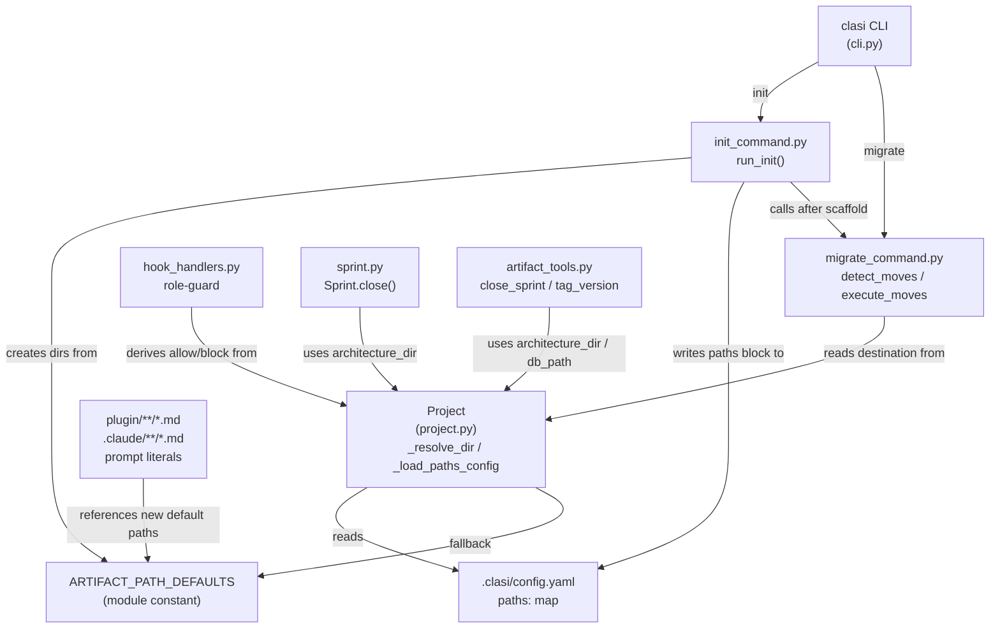
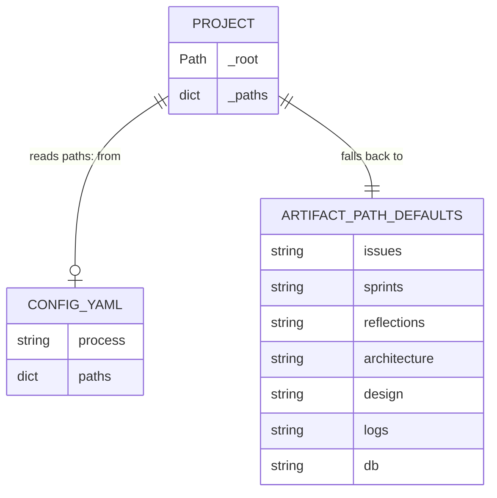

<!-- CLASI: Before changing code or making plans, review the SE process in CLAUDE.md -->

# Architecture Update — Sprint 013: Artifact layout reorganization and configurable paths

## What Changed

### New: Configurable path layer in `clasi/project.py`

A module-level `ARTIFACT_PATH_DEFAULTS` dict maps each artifact category
(`issues`, `sprints`, `reflections`, `architecture`, `design`, `logs`, `db`)
to a root-relative default path. These are the new built-in defaults:

```
issues:        clasi/issues
sprints:       clasi/sprints
reflections:   clasi/reflections
architecture:  docs/architecture
design:        docs/design
logs:          .clasi/log
db:            .clasi/.clasi.db
```

Two new private helpers are added to `Project`:

- `_load_paths_config(root)` — module-level function; reads
  `.clasi/config.yaml`, returns `data["paths"]` if it is a `dict[str, str]`,
  otherwise returns `{}`. Swallows `FileNotFoundError`, `YAMLError`, and
  wrong-type silently (mirrors the existing graceful pattern in
  `clasi/schemas/__init__.py`).
- `_path_config()` — instance method; lazily calls `_load_paths_config` and
  caches the result on `self._paths`. Returns `{}` if the call fails.
- `_resolve_dir(key)` — instance method; returns
  `self._root / (self._path_config().get(key) or ARTIFACT_PATH_DEFAULTS[key])`.

Every category property delegates to `_resolve_dir`:

| Property | Key | Old value | New default |
|---|---|---|---|
| `issues_dir` | `"issues"` | `.clasi/issues` | `clasi/issues` |
| `sprints_dir` | `"sprints"` | `.clasi/sprints` | `clasi/sprints` |
| `reflections_dir` | `"reflections"` | *(new)* | `clasi/reflections` |
| `architecture_dir` | `"architecture"` | `.clasi/architecture` | `docs/architecture` |
| `design_dir` | `"design"` | `docs/design` | `docs/design` *(unchanged default)* |
| `log_dir` | `"logs"` | `.clasi/log` | `.clasi/log` *(unchanged default)* |
| `db_path` | `"db"` | *(new)* | `.clasi/.clasi.db` |

`clasi_dir` is **not** configurable. It remains `.clasi/` — the fixed hidden
state anchor for `config.yaml`, `log/`, and `.clasi.db`. `db_path` now
resolves from the table; `db` property uses `db_path` instead of constructing
the path inline.

### Changed: Hardcoded path reads routed through `Project`

Four files currently construct paths outside `Project`:

- `clasi/sprint.py:501` — `project.clasi_dir / "architecture"` →
  `project.architecture_dir`
- `clasi/tools/artifact_tools.py:237` — same
- `clasi/tools/artifact_tools.py:1476` — `project.clasi_dir / ".clasi.db"` →
  `project.db_path`
- `clasi/hook_handlers.py` (~8 occurrences) — `get_project().clasi_dir /
  ".clasi.db"` → `get_project().db_path`; `base / "log"` →
  `get_project().log_dir`

### Changed: `init_command.py` iterates defaults table

`run_init` replaces the hardcoded `(issues_dir = clasi_dir / "issues")` and
`for subdir_name in ("sprints","architecture","reflections")` loop with
iteration over `ARTIFACT_PATH_DEFAULTS`. Each non-`db` entry resolves to
`target_path / rel`, creates the directory, and places a `.gitkeep` (plus
`.gitignore` for `logs`). The `paths:` block is written via
`config_data.setdefault("paths", ARTIFACT_PATH_DEFAULTS)` — so re-running
`init` never clobbers a user's customization.

### Changed: Role-guard rebuilds allow/block from `Project` properties

`clasi/hook_handlers.py` lines 179–197 currently allow team-lead writes only
under `clasi_dir` (`.clasi/`) and block `sprints_dir` (`.clasi/sprints/`).
With artifacts moving to `clasi/` and `docs/`, the guard is rebuilt to:

- **Allow** team-lead (tier 0) writes under: `issues_dir`, `reflections_dir`,
  `architecture_dir`, `design_dir`, `clasi_dir` (state files), `log_dir`,
  `.claude/`, `CLAUDE.md`, `AGENTS.md`.
- **Block** `sprints_dir` for tier 0 (must go through MCP tools).
- Sprint-planner (tier 1) may still write under `sprints_dir`.

Allow/block strings are derived at runtime from `_proj.*_dir` so they follow
any custom `paths:` config without code changes.

### Changed: Plugin prompt markdown updated to new default paths

All `clasi/plugin/` markdown files and their `.claude/` mirror copies that
reference `.clasi/issues`, `.clasi/sprints`, `.clasi/reflections`, or
`.clasi/architecture` are rewritten to `clasi/issues`, `clasi/sprints`,
`clasi/reflections`, `docs/architecture`. References to `.clasi/log` and
`.clasi/.clasi.db` are left unchanged.

### New: Config-driven detect-and-migrate tool in `migrate_command.py`

The existing one-shot `docs/clasi/ → .clasi/` migration is generalized into:

- `CANDIDATE_LOCATIONS: dict[str, list[str]]` — per category, an ordered list
  of legacy/alternate source locations to probe (e.g. `issues: [".clasi/issues",
  "docs/clasi/issues"]`). Static. The migration destination is always read live
  from `Project` so it honors custom `paths:`.
- `Move` dataclass — `(category, src: Path, dst: Path, mode: "move"|"merge",
  is_file: bool)`.
- `detect_moves(project) -> list[Move]` — pure; probes candidates, emits a
  `Move` for each category whose source exists and differs from the destination.
  Empty list ⇒ nothing to do; doubles as dry-run preview.
- `execute_moves(project, moves, dry_run=False)` — calls `_git_mv`/`shutil.move`,
  generalizes `_update_gitignore` to iterate moves, generalizes
  `_check_no_execution_lock` to scan all candidate db locations, never clobbers
  an existing dest file (skip + warn), cleans up empty parent dirs,
  resets `project._db = None` if the DB moved.
- `run_migrate` rewritten as a thin wrapper over detect/execute + `run_init`
  refresh + restart notice. The "`.clasi/` already exists" hard guard is removed
  (the tool now relocates into existing dirs).

`clasi init` calls `detect_moves` after scaffolding. If the list is non-empty
and the process is interactive (`sys.stdin.isatty() and sys.stdout.isatty()`):
prints proposed moves and calls `click.confirm(default=False)`. Non-interactive:
warns only, points at `clasi migrate`. `--yes`/`--relocate` on both `init` and
`migrate` trigger migration without a prompt.

### New: Backward-compat config pin for this repo

Because this repo's own artifacts remain physically in `.clasi/` until the
post-016 finale, `.clasi/config.yaml` is updated with an explicit `paths:`
block pointing at the current physical locations:

```yaml
process: se
paths:
  issues:        .clasi/issues
  sprints:       .clasi/sprints
  reflections:   .clasi/reflections
  architecture:  .clasi/architecture
  design:        docs/design
  logs:          .clasi/log
  db:            .clasi/.clasi.db
```

This ensures `clasi status` and all MCP tools keep resolving correctly after
the default-layout change, without moving any files.

---

## Why

The current hardcoded layout hides process artifacts (issues, sprints,
reflections) in `.clasi/`, a dotdir invisible by default in most file browsers.
The architecture directory, which is genuinely a document, is also buried there.
There is no mechanism to relocate categories or to detect and repair a misrouted
install. The absence of a `paths:` config reader means every artifact location
is a deployment assumption rather than a documented, overridable contract. The
overview-presence bug (this repo reports `uninitialized` because `design_dir`
resolved to `.clasi/design/` rather than `docs/design/`) is a concrete symptom
of this rigidity.

---

## Component Diagram



## Entity Diagram (path resolution)



---

## Impact on Existing Components

**`clasi/project.py`** — all category properties change return value (new
default paths). Callers that depended on `.clasi/issues` etc. get the new
default once upgraded; they need either a config pin or migration to stay
functional without moving files.

**`clasi/hook_handlers.py`** — role-guard logic changes significantly; the
hard `.clasi/` prefix is replaced by dynamic Project-property strings. The
behavioral change is that team-lead writes to `clasi/issues/` and
`docs/architecture/` are now allowed (they were previously blocked as
non-`.clasi/` paths).

**`clasi/migrate_command.py`** — public function `run_migrate` is rewritten.
Tests for the old hard guard (`dst.exists()` → exit 1) must be updated.

**`clasi/init_command.py`** — directory scaffold loop changes. Existing projects
re-running `init` will see new directories created at the new default locations,
but existing files are not moved.

**Plugin markdown / `.claude/` copies** — path literals change. Agents will
reference the new default paths in their prompts. For repos still in the legacy
layout, this is cosmetically wrong but functionally irrelevant (the code, not
the prompt, resolves the actual path).

---

## Migration Concerns

**No data migration is triggered automatically.** The configurable-path layer
defaults to the new layout for new installs; existing installs with files in
`.clasi/` degrade gracefully (empty lists) until the user runs `clasi migrate`
or pins their config.yaml.

**This repo's `.clasi/config.yaml` must be pinned** (ticket 004) before the
default-layout change (tickets 001–003) lands. The pin ensures the running MCP
server continues to find all sprints and tickets at their current physical
locations. The pin is explicit, not implicit, so it survives re-runs of `init`.

**Sprint-close copies `architecture-update-NNN.md` to `architecture_dir`.**
After this sprint lands, `architecture_dir` resolves via the config pin to
`.clasi/architecture/` for this repo, so `sprint.close()` continues to place
the file there correctly.

---

## Design Rationale

**Decision**: Keep `clasi_dir` fixed at `.clasi/` and non-configurable.
**Context**: `clasi_dir` contains `config.yaml` (which is the source of all
other path overrides) and `.clasi.db`. Making it configurable would require
a bootstrap resolver that doesn't depend on the config it is reading.
**Alternatives**: Allow full relocation of `.clasi/`. Rejected — circular
bootstrap problem; the directory is already a hidden "machine state" anchor.
**Consequences**: The hidden state dir stays hidden. Only the artifact dirs
become visible.

**Decision**: `ARTIFACT_PATH_DEFAULTS` is a single module-level dict shared by
`Project` (for reading) and `init_command` (for writing).
**Context**: Both consumers need to agree on the default paths. A divergence
between what `init` creates and what `Project` resolves is the class of bug
this sprint is fixing.
**Alternatives**: Duplicate constants in each module. Rejected — the bug would
recur. Alternative: store defaults in `config.yaml` only. Rejected — that
requires a valid install to bootstrap a new install.
**Consequences**: One canonical source of truth. Changes to defaults are a
single-line edit in `project.py`, propagating to both init and resolution.

**Decision**: `_load_paths_config` swallows all YAML errors rather than raising.
**Context**: Hook handlers call `get_project()` on every file save. A corrupt
config must not prevent the hook from running; it should fall back to defaults
instead of crashing Claude Code's hook chain.
**Consequences**: Config errors are silent. A future enhancement could emit a
warning to `log_dir`, but that is out of scope for this sprint.

**Decision**: `detect_moves` is pure (no side effects); `execute_moves` does all
I/O.
**Context**: Enables dry-run preview, unit testing without mocks, and reuse
of `detect_moves` as the interactive confirmation list.
**Consequences**: The two functions must be called in sequence by callers; they
cannot be merged.

---

## Open Questions

1. **`reflections_dir` property** — does any existing code reference
   `clasi_dir / "reflections"` directly (outside of `init`)? A grep is needed
   before ticket 001 implementation to avoid missed callsites.
2. **Merge mode in `execute_moves`** — when `mode == "merge"` (destination is
   populated), the spec says skip+warn individual files to avoid clobbering. Is
   there a case where we want to merge (non-conflicting files only)? The Sprint
   013 implementation will skip on any conflict. A more nuanced merge strategy
   is deferred.
3. **Coverage `omit` globs** — after the Phase 4 `src/` move (deferred), the
   `pyproject.toml` coverage paths will need updating. This sprint does not
   touch `pyproject.toml`.
