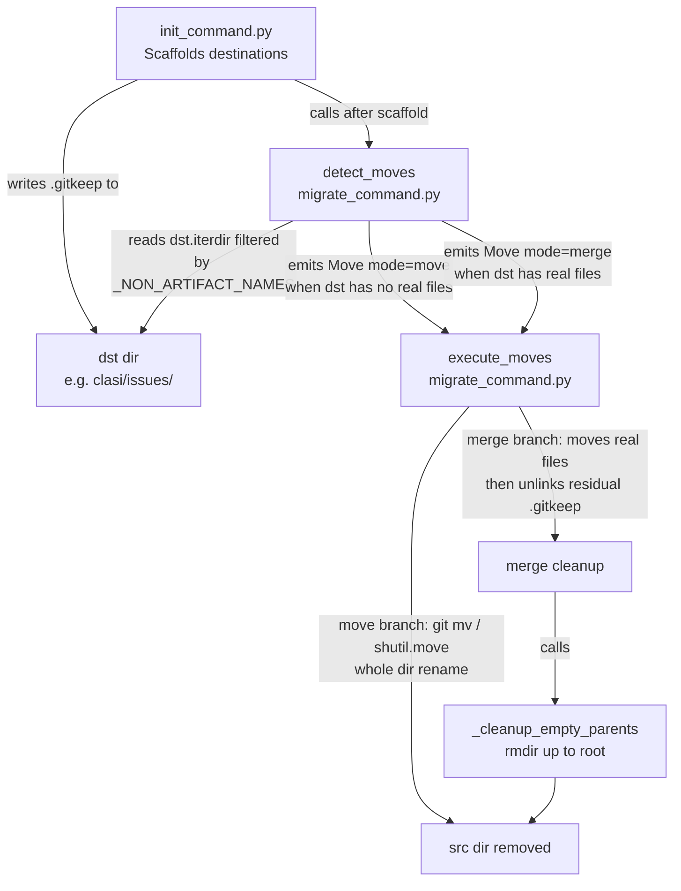

<!-- CLASI: Before changing code or making plans, review the SE process in CLAUDE.md -->

# Architecture Update — Sprint 017: Fix migration leaving empty source directories

## What Changed

### 1. `detect_moves` treats all-non-artifact destination as effectively empty (SUC-017-002)

**File**: `src/clasi/migrate_command.py`, `detect_moves` function (~line 254).

**Before**:
```python
mode = "merge" if (dst.exists() and any(dst.iterdir())) else "move"
```

**After**: the condition filters `dst.iterdir()` through `_NON_ARTIFACT_NAMES`
before deciding "non-empty", exactly as the source-side candidate check already
does:

```python
dst_artifact_files = [
    f for f in dst.iterdir()
    if f.name not in _NON_ARTIFACT_NAMES
] if dst.exists() else []
mode = "merge" if dst_artifact_files else "move"
```

This means a destination containing only `.gitkeep` (as scaffolded by
`init_command.py`) is treated as effectively empty: `mode="move"` is chosen
and the directory is renamed wholesale. No residual files are left in the
source.

A destination containing at least one real artifact file continues to yield
`mode="merge"` (no-clobber guarantee preserved).

### 2. Merge branch deletes residual non-artifact files from source before cleanup (SUC-017-001)

**File**: `src/clasi/migrate_command.py`, `execute_moves` function, merge
branch (~line 370, just before `_cleanup_empty_parents(src, root)`).

**After** the per-file move loop (which already moves all real artifact files
and skips non-artifact filenames), a new cleanup step removes any remaining
non-artifact files from the source tree:

```python
# Remove residual non-artifact files so _cleanup_empty_parents can rmdir.
for item in sorted(src.rglob("*")):
    if item.is_file() and item.name in _NON_ARTIFACT_NAMES:
        item.unlink()
```

This allows `_cleanup_empty_parents(src, root)` to call `rmdir` successfully
on the now-truly-empty source directory.

This fix is a safety net: with Fix 1 in place, the merge branch will only fire
when the destination has real artifact files. Fix 2 handles the edge case where
a `.gitkeep` or `.gitignore` ends up in the source for any other reason.

---

## Why

### Fix 1 — mode decision

`init_command.py` creates every destination directory with a `.gitkeep` before
calling `detect_moves`. The pre-existing `.any(dst.iterdir())` check sees this
`.gitkeep` and forces `mode="merge"` even though from the user's perspective
the destination is empty. `mode="move"` (a clean `git mv` / `shutil.move` of
the whole directory) is the correct outcome for an effectively-empty
destination. The fix aligns the destination emptiness test with the already-
existing source-side test (both use `_NON_ARTIFACT_NAMES`).

### Fix 2 — merge-branch cleanup

Even if Fix 1 is applied, future code paths could produce a situation where the
source contains a `.gitkeep` after the real-file move loop finishes. The current
`_cleanup_empty_parents` correctly uses `rmdir` (which is atomic and fails if
not empty), but has no mechanism to first evict non-artifact housekeeping files.
The explicit `unlink` loop gives the cleanup step a clean directory to work with
without changing `_cleanup_empty_parents` itself.

---

## Component Diagram



---

## Impact on Existing Components

| Component | Change | Scope |
|---|---|---|
| `src/clasi/migrate_command.py` — `detect_moves` | Replace `any(dst.iterdir())` with artifact-filtered check | Behaviour change, no interface change |
| `src/clasi/migrate_command.py` — `execute_moves` merge branch | Add residual non-artifact file removal before `_cleanup_empty_parents` | Additive; no interface change |
| `tests/unit/test_migrate_command.py` | Add `TestMergeModeCleansUpSourceDir`; tighten weak assertion in `test_file_moved_to_destination` | Test-only |
| `src/clasi/init_command.py` | No change | None |
| `_cleanup_empty_parents` | No change | None |

---

## Design Rationale

### Decision: Fix detect_moves rather than reordering init scaffold

**Context**: An alternative fix is to call `detect_moves` before the scaffold
loop in `init_command.py`, so the destination is not pre-created when the mode
decision runs. This would prevent `mode="merge"` from being triggered by a
scaffold-created `.gitkeep`.

**Alternatives considered**:
1. Reorder init scaffold (detect-before-scaffold).
2. Fix `detect_moves` mode test (this sprint's choice).
3. Fix only the merge-branch cleanup (Fix 2 alone).

**Why this choice**: Fix 1 (detect_moves) is the correct invariant: the mode
decision should reflect whether the destination contains real user artifacts,
not whether a housekeeping file happens to be there. This is symmetric with
the already-existing source-side test (`artifact_files` filter). The reorder
approach would require changing `init_command.py`, which has subtler ordering
dependencies (config must exist before `Project` can resolve paths). Fix 2
alone would solve the symptom but leave the wrong mode selected (merge instead
of move), causing unnecessary per-file iteration.

**Consequences**: The two-filter approach is slightly more verbose in
`detect_moves` but is internally consistent: both source and destination use
the same `_NON_ARTIFACT_NAMES` sentinel set to determine "effective emptiness."

### Decision: Remove non-artifact files with unlink, not shutil.rmtree

**Context**: An alternative is to call `shutil.rmtree(src)` after the real-
file move loop to nuke the entire source subtree.

**Why this choice**: `rmtree` would silently destroy any real artifact file
that was skipped by the no-clobber logic (i.e. a file already present at the
destination). The targeted `unlink` loop only removes files whose names are in
`_NON_ARTIFACT_NAMES`, preserving the no-clobber guarantee for real files that
could not be moved.

---

## Open Questions

None. All design decisions are resolved. Code locations are confirmed by
direct file reading (Sprint 017 planning, 2026-06-27).

---

## Migration Concerns

None. Both changes are behaviour fixes within a single module. No data model
changes, no new dependencies, no interface changes.
