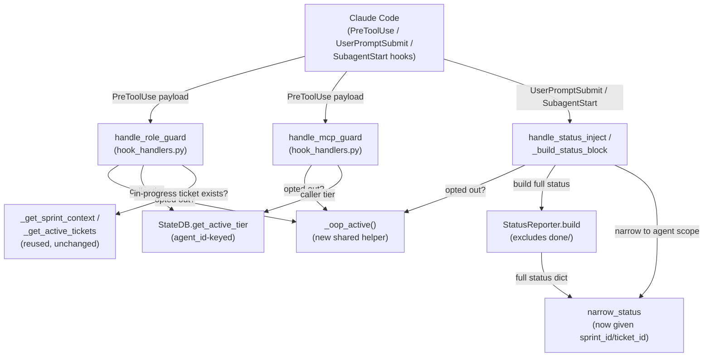
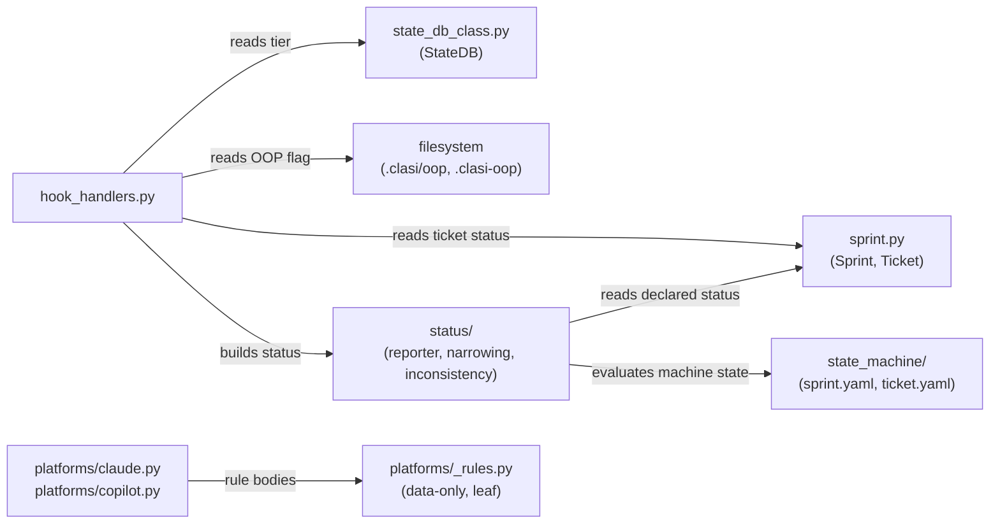

<!-- CLASI: Before changing code or making plans, review the SE process in CLAUDE.md -->

# Architecture Update -- Sprint 019: Enforcement guards fail open — role-guard payload, tier resolution, ticket gate, and status noise

## 1. Understand the Problem

CLASI's process enforcement runs as a chain of Claude Code hooks
(`role-guard`, `mcp-guard`, ticket-state gate) plus a per-prompt status
block (`status-inject`, `subagent-start`). Every failure in this chain has
the same shape: the hook cannot resolve some piece of its input (a file
path, a caller's tier, a ticket state) and, on failure to resolve, treats
the unresolved case as ALLOW rather than BLOCK — while logging a
confident-looking success line. A live incident in a downstream project
(sprint 101 in `radio-robot-elite`) shipped eight commits with the
tracker frozen at `roadmap`, and every guard that should have stopped it
logged `0 <reason>` (allow) the entire time.

This sprint does not add a subsystem. It repairs the existing enforcement
chain's failure policy from fail-open to fail-closed, closes the one gap
where no gate exists at all (ticket-state), and fixes the status-block
noise that made the "gate is broken" signal invisible even when guards
did block. Full defect list, file:line references, and empirical
verification: `clasi/issues/enforcement-guards-fail-open-role-guard-payload-and-tier-resolution.md`.

## 2. Identify Responsibilities

Seven responsibilities are touched, each changing for an independent
reason. (A second pass while verifying responsibility 5 surfaced that it
was under-scoped — see the note after the list.)

1. **Payload parsing** (role-guard) — extracting `file_path` from the
   hook's actual JSON shape. Changes because the shape assumption was
   wrong, not because the guard's write-scope logic is wrong.
2. **Caller identity / tier resolution** (state DB) — answering "what
   tier is the calling agent," not "what tier is *some* agent." Changes
   because the query has no identity filter.
3. **Ticket-state enforcement** (role-guard, new logic) — answering
   "is there an in-progress ticket backing this write." This
   responsibility does not exist today; it is being added, not fixed.
4. **OOP bypass resolution** — a single yes/no answer ("has the
   stakeholder opted out"), currently computed four different ways
   across four call sites with two different flag files.
5. **Rule reachability** (platform installers, `.claude/rules/*.md`
   generation) — ensuring every generated rule's `paths:` scope can
   actually match a real file in the target project, for whatever layout
   that project uses. Originally scoped as "layout-agnostic rule
   scoping" for `source-code.md` alone; broadened after verification
   found the identical defect in `clasi-artifacts.md` and drift between
   generator and disk in `todo-dir.md` (see below).
6. **Status summarization** (status reporter/narrowing) — building a
   bounded, accurate, actionable per-prompt summary instead of a full
   unfiltered dump.
7. **Archived-sprint terminology correctness** (frontmatter history) —
   making the 18 already-archived sprints' declared status agree with
   the state machine's actual vocabulary, not just future archives.

**Why responsibility 5 changed scope**: verifying the plan against
Claude Code's actual rules-engine behavior (no `exclude:` key, no
negated globs, `paths:`-scoped rules fire only on a matching file read)
established that `source-code.md`'s old scope
(`src/clasi/**`/`src/clasr/**`) was not merely *narrow* in
non-CLASI-layout projects — it was **unreachable**: a rule that can never
match any file is indistinguishable, in effect, from no rule at all.
That is the same fail-open shape as responsibilities 1-3, one layer up
(the rules engine, not the hook). Checking the other four generated
rules against reality in this repo found the identical defect in
`clasi-artifacts.md` (scoped to `.clasi/**`, but artifacts moved to
`clasi/**` in sprint 013) and a generator/disk divergence in
`todo-dir.md` (generator still emits `.clasi/issues/**`; this repo's
on-disk file was hand-corrected to `clasi/issues/**` and the generator
never caught up). Responsibility 5 now covers all three rule files
through one shared fix pattern plus one shared reachability test,
instead of `source-code.md` alone.

These seven responsibilities live in seven places in the codebase (see
Module Design). None of them needs to move. The fix is correctness
within each, plus one new cross-cutting helper (`_oop_active`) that
responsibility 4 collapses into, and one new cross-cutting test
(rule-path reachability) that responsibility 5 introduces.

## 3. Define Subsystems and Modules

### `hook_handlers.handle_role_guard` (modified)
- **Purpose**: Decide allow/block for a single Edit/Write/MultiEdit call
  based on caller tier, file path, and OOP/recovery bypass state.
- **Boundary**: Inside — payload parsing, tier lookup delegation,
  prefix-based path classification, the new ticket-state check. Outside —
  how tier is computed (delegates to state DB) and how ticket state is
  read (delegates to `_get_sprint_context`/`_get_active_tickets`, already
  present and reused, not reimplemented).
- **Use cases served**: SUC-001, SUC-002, SUC-004, SUC-005.

### `hook_handlers.handle_mcp_guard` (modified)
- **Purpose**: Decide allow/block for a single artifact-creation MCP call
  based on caller tier and OOP bypass state.
- **Boundary**: Inside — tier check, OOP check via the shared helper.
  Outside — tier computation itself.
- **Use cases served**: SUC-005.

### `hook_handlers._oop_active` (new)
- **Purpose**: Answer whether the stakeholder has opted out of process
  enforcement for this session.
- **Boundary**: Inside — checking `.clasi/oop` then legacy `.clasi-oop`.
  Outside — what any caller does with the answer.
- **Use cases served**: SUC-005 (consumed by role-guard, mcp-guard,
  status-inject, subagent-start, and the new ticket-state check).

### `state_db_class.StateDB.get_active_tier` (modified)
- **Purpose**: Return the tier of the calling agent, identified
  explicitly, or a fail-closed default if unresolvable.
- **Boundary**: Inside — the `WHERE agent_id = ?` lookup and the
  fail-closed default. Outside — how the caller obtained the agent
  identity to pass in (that is the hook payload's job) and how stale
  rows get purged (a separate lifecycle concern, see below).
- **Use cases served**: SUC-003.

### `state_db_class.StateDB` agent-lifecycle purge (modified call sites)
- **Purpose**: Ensure `active_agents` reflects only currently-live
  agents.
- **Boundary**: Inside — invoking the existing `clear_stale_agents` (TTL
  purge, TTL reduced well below 24h) from a frequently-hit path (e.g.
  `subagent-start`) as backstop, PLUS reliable removal on `SubagentStop`
  as the precise primary path. Both mechanisms, not either/or — see
  Design Rationale. Outside — the tier-lookup query itself (already
  correct once responsibility 2 is fixed).
- **Use cases served**: SUC-003.

### `platforms/claude.py` + `platforms/copilot.py` rule-path emission (modified, broadened)
- **Purpose**: Ensure every generated `.claude/rules/*.md` file's
  `paths:` scope (where one exists) can match at least one real path in
  the target project.
- **Boundary**: Inside — the `paths:` value (or its absence) written for
  `source-code.md`, `clasi-artifacts.md`, and `todo-dir.md`. Outside —
  the rule's prose body (`platforms/_rules.py`, a separate concern
  below) and the rules engine's own matching behavior (external,
  Claude Code — verified, not owned by CLASI).
- **Use cases served**: SUC-006, SUC-010.
- **Fix shape differs per rule** (this is not one mechanical change):
  - `source-code.md`: **drop `paths:` entirely.** Claude Code's rules
    frontmatter supports only positive `paths:` globs — no `exclude:`
    key, no negated globs (verified against official docs). There is no
    glob that means "everything except these four directories." A rule
    with no `paths:` key loads unconditionally at launch (same priority
    as CLAUDE.md) — always reachable, never silently dead. The
    exclusions move into the rule's prose.
  - `clasi-artifacts.md`: re-scope `paths:` from `.clasi/**` to
    `clasi/**` (or the specific `clasi/sprints/**` et al. subpaths) —
    a straightforward positive-glob correction, not a reachability
    redesign; `clasi/**` is a real, matchable path.
  - `todo-dir.md`: re-scope `paths:` from `.clasi/issues/**` to
    `clasi/issues/**` in the *generator* — the on-disk value in this
    repo is already correct (hand-corrected previously); only
    `platforms/claude.py`/`copilot.py` need to change so future
    `clasi init` runs stop regenerating the stale value.

### `platforms/_rules.SOURCE_CODE_BODY` (modified, content-only)
- **Purpose**: State the process rule text: a ticket must be in-progress,
  and only an MCP call — not a commit message — moves one; and (new)
  state the path exclusions in prose since they can no longer be
  expressed as a `paths:` glob.
- **Boundary**: Inside — prose only, data-only module (per its existing
  documented boundary). Outside — whether/how `paths:` is emitted (lives
  in the installers, immediately above).
- **Use cases served**: SUC-006.

### Rule-path reachability test (new, cross-cutting — not a production module)
- **Purpose**: After a fresh `clasi init`, assert every generated rule
  file's `paths:` (where present) matches at least one real path in the
  initialized project.
- **Boundary**: Inside — the test itself, run against a scratch/temp
  project. Outside — the rule generation logic it tests (immediately
  above).
- **Use cases served**: SUC-006, SUC-010. This is the single test that
  would have caught all three rule defects before any shipped; it
  targets the failure *class* (a generated rule that cannot match
  reality), not each instance.

### `status.reporter.StatusReporter` (modified)
- **Purpose**: Assemble the full status dict from state-machine
  evaluations, excluding archived (`done/`) sprints and tickets from the
  per-prompt view.
- **Boundary**: Inside — which sprints/tickets are included in the
  assembled dict. Outside — narrowing to an agent's scope (that is
  `narrow_status`'s job) and terminology reconciliation (see next).
- **Use cases served**: SUC-007.

### `status.inconsistency` / `sprint.Sprint.archive` (terminology reconciliation)
- **Purpose**: Make the declared frontmatter status for an archived
  sprint agree with the state machine's actual terminal state name
  (`closed`), so `state_drift` stops firing on every archived sprint.
- **Boundary**: Inside — the value `Sprint.archive()` writes to
  `status:` frontmatter. Outside — the state machine definition itself
  (`sprint.yaml` already names its terminal state `closed`; that file
  does not change).
- **Use cases served**: SUC-007 (folds in e2e-001 item 7).

### ~~Historical archive frontmatter correction (one-time script)~~ — CUT, NOT BUILT
- **Status**: Cut during execution by stakeholder decision (2026-07-15).
  This module was never written. It is retained here, struck through,
  because the reasoning is worth keeping.
- **Would have**: rewritten `status: done` → `status: closed` across the
  18 already-archived `clasi/sprints/done/*/sprint.md` files.
- **Why cut**: the archive is a record of what happened, and those
  sprints genuinely *were* archived carrying `status: done`. Editing them
  makes the record assert something untrue at the time. Nothing reads an
  archived sprint's declared status — `closed` is terminal with no
  outbound transitions — so no behavior depends on the correction. And
  the `done/`-exclusion shipped in ticket 006 means the drift warnings it
  was meant to silence no longer reach any consumer.
- **What replaces it**: nothing, for now. The genuine defect is that
  `detect_inconsistencies` drift-checks terminal, archived sprints at
  all — a question with no useful answer. Fixing the checker would cover
  every legacy sprint and touch zero data files. Filed as
  `clasi/issues/detect-inconsistencies-drift-checks-terminal-archived-sprints.md`,
  low priority precisely because 006 removed the symptom.
- **Use cases served**: SUC-007, partially — the writer fix
  (`Sprint.archive()`, responsibility above) satisfies it going forward.
  Retroactive correction is explicitly abandoned, not deferred.

### Verified non-regression: `handle_role_guard`'s artifact allow-list (no code change)
- **Purpose**: Confirm the payload-parsing fix (responsibility 1) does
  not unmask a *new* bug by making the guard live for the first time
  against a stale allow-list.
- **Finding**: `_allow_prefixes` in `handle_role_guard` is built from
  live `Project` properties (`issues_dir`, `reflections_dir`,
  `design_dir`, `clasi_dir`, `log_dir`), which resolve through
  `Project._resolve_dir()` against `ARTIFACT_PATH_DEFAULTS` —
  already correctly `clasi/issues`, `clasi/reflections`, `clasi/sprints`
  (no dot) since the sprint-013 layout migration. Only `clasi_dir`
  (`.clasi/`) and `log_dir` (`.clasi/log/`) stay dotted, by design (they
  are the state anchor, not artifacts). This is **not** the same class
  of drift found in responsibility 5 — role-guard's allow-list reads
  live `Project` properties, while the broken rules read hardcoded
  strings in `platforms/claude.py`/`copilot.py`. No fix needed here; the
  verification itself is the deliverable (a ticket must still assert
  this with a regression test, since "verified by inspection during
  planning" is not the same as "covered by a test").
- **Use cases served**: SUC-001 (as a required non-regression check
  alongside the payload fix, not a new use case of its own).

### `hook_handlers.handle_status_inject` / `_build_status_block` (modified)
- **Purpose**: Produce the per-prompt status block: real narrowing,
  bounded size, an imperative when a sprint is executing with no
  in-progress ticket, and a logged (not silent) failure path.
- **Boundary**: Inside — threading real `sprint_id`/`ticket_id` into
  `narrow_status`, the imperative sentence, and exception logging.
  Outside — how narrowing itself filters (that is
  `status.narrowing.narrow_status`, unchanged this sprint — it already
  supports `sprint_id`/`ticket_id`, it just was never given them).
- **Use cases served**: SUC-007.

## 4. Diagrams

### 4.1 Component Diagram — Enforcement Chain (as repaired)

### 4.2 Dependency Graph — Fixed Modules

No new edges cross module boundaries that did not already exist; the
dependency direction (`hook_handlers` → `state_db_class`/`sprint`/`status`,
`platforms/*` → `platforms/_rules`) is unchanged. `platforms/_rules.py`
remains a leaf (data-only, no imports from other CLASI modules), consistent
with its existing documented boundary.

No entity-relationship diagram is included: this sprint changes no data
model (the `active_agents` table schema is unchanged — only the query and
its call sites; sprint/ticket frontmatter schema is unchanged — only the
`status:` value written on archive).

## 5. What Changed

- `hook_handlers.handle_role_guard`: read `file_path` from
  `payload.get("tool_input", payload)` instead of the payload root
  (matching the pattern already correct at line 1014 in the same file).
  The no-path branch now fails closed (log WARN + block) for tier 0/1;
  tier 2 is unaffected.
- `hook_handlers.handle_role_guard`: new ticket-state gate — block
  source/test writes when a sprint is executing, zero tickets are
  `in-progress`, and no OOP flag is set. Applies to tier 2. The existing
  `if agent_tier == "2": allow` early-return moves below this new check.
- `hook_handlers`: new `_oop_active()` helper, checking `.clasi/oop` then
  `.clasi-oop`. `handle_role_guard`, `handle_mcp_guard`,
  `handle_status_inject`, and `handle_subagent_start` all call it instead
  of checking a flag file inline.
- `state_db_class.StateDB.get_active_tier`: takes an `agent_id` parameter,
  queries `WHERE agent_id = ?`, and returns a fail-closed sentinel (empty
  string, already the existing "unresolved" convention) when no row
  matches — never another agent's tier. Call sites in `hook_handlers.py`
  thread the payload's `agent_id`/`session_id` through.
- `state_db_class.StateDB`: `clear_stale_agents` is invoked from a
  frequently-hit path (e.g. `subagent-start`) as a TTL-based backstop
  (TTL reduced well below 24h), AND `handle_subagent_stop` reliably
  unregisters the agent's row as the precise primary path. Both, not
  either/or — see Design Rationale.
- `platforms/claude.py` `RULES["source-code.md"]` and
  `platforms/copilot.py` `_PATH_RULES` source-code entry: **`paths:`
  dropped entirely** (Claude Code's rules frontmatter has no `exclude:`
  key and no negated-glob support — verified against official docs, not
  assumed). The rule now loads unconditionally at launch; path
  exclusions move into prose.
- `platforms/claude.py` `RULES["clasi-artifacts.md"]` and the Copilot
  equivalent: `paths:` corrected from `.clasi/**` to `clasi/**` (the
  artifact layout moved in sprint 013; the generator never caught up —
  this rule was unreachable for every artifact edit until this fix).
- `platforms/claude.py` `RULES["todo-dir.md"]` and the Copilot
  equivalent: `paths:` corrected from `.clasi/issues/**` to
  `clasi/issues/**` in the generator (the on-disk file in this repo
  already has the correct value from a prior hand-fix; the generator was
  silently out of sync and would regenerate the stale value on the next
  `clasi init`).
- New test: after a fresh `clasi init`, every generated rule's `paths:`
  (where present) is asserted to match at least one real path in the
  initialized project — the general check that would have caught all
  three rule defects above before any shipped.
- `platforms/_rules.SOURCE_CODE_BODY`: adds a sentence that a commit
  message is not a process action; only an MCP call moves a ticket. Also
  adds the prose statement of path exclusions that `paths:` used to
  encode.
- `status.reporter.StatusReporter._build_sprints_block` /
  `_build_tickets_block`: exclude sprints under `sprints/done/` and
  tickets under `tickets/done/` from the assembled status dict.
- `sprint.Sprint.archive`: writes `status: "closed"` instead of
  `status: "done"` to sprint.md frontmatter on archive, matching the
  sprint machine's actual terminal state name.
- ~~One-time script: bulk-corrects all 18 existing
  `clasi/sprints/done/*/sprint.md` files from `status: done` to
  `status: closed`.~~ **CUT during execution** (stakeholder decision,
  2026-07-15). Rewriting the archive makes the record assert something
  that was not true at the time; nothing reads an archived sprint's
  declared status (`closed` has no outbound transitions); and the
  `done/`-exclusion above means the resulting drift warnings no longer
  surface anywhere. The 18 files are left as they are and legacy
  `status: done` is tolerated on read. The underlying defect —
  `detect_inconsistencies` drift-checking terminal, archived sprints at
  all — is filed as
  `clasi/issues/detect-inconsistencies-drift-checks-terminal-archived-sprints.md`
  rather than worked around by editing data.
- `hook_handlers._build_status_block` / `handle_status_inject`: threads
  the real active `sprint_id` (and `ticket_id` where known, e.g. inside
  `handle_subagent_start` for a programmer) into `narrow_status`; adds an
  imperative sentence to the notes block when a sprint is executing with
  zero in-progress tickets; replaces `except Exception: return ""` with a
  logged warning plus empty-string return.
- Deleted: `docs/architecture/architecture-update-018.md` and the
  resulting empty `docs/architecture/` directory.
- `clasi/issues/e2e-001-review.md`: archived in full to
  `clasi/review/e2e-001-review.md` (new directory, not a CLASI-tracked
  artifact type), then pruned to items 3 and 7 with a note on the
  disposition of items 2, 5, 6, 8.
- Test suite: `tests/unit/test_hook_handlers.py` `_role_guard_payload()`
  replaced with a real nested-payload fixture; new deny-path, ticket-gate,
  concurrent-tier, dual-OOP-flag, and real-status-block-size tests added
  (see sprint.md Test Strategy — ticketed explicitly, not incidental).

## 6. Why

Every defect here has the identical shape: a guard's (or, for
responsibility 5, a rule's) unresolved-or-unmatchable input defaults to
ALLOW-by-silence instead of BLOCK, and the resulting allow is logged (or
simply not flagged) as if it were a deliberate, successful policy
decision. That shape is what let a real process-bypass incident go
undetected — not a one-off typo. Fixing each instance individually
(payload shape, tier identity, missing ticket gate, split OOP flag,
unreachable/drifted rules, noisy/dead status narrowing, stale archive
terminology) closes the specific holes; the shared thread across "Why"
for all of them is: **an enforcement mechanism's default on uncertainty
must be the safe action, and its outcome must be observable.** That
principle is now enforced at each of the seven touched call sites, not
stated once and violated everywhere.

Responsibility 5's scope grew mid-sprint because the same audit
methodology that found `source-code.md` unreachable — checking a rule's
declared scope against what actually exists on disk — immediately found
the identical problem in `clasi-artifacts.md` and a silent
generator/disk divergence in `todo-dir.md`. This is the expected
behavior of applying the sprint's core lesson rigorously rather than
stopping at the first confirmed instance: the fix (a shared reachability
test) generalizes to the whole class, not just the one rule named in the
original issue.

The ticket-state gate (SUC-004) is new, not a fix, because no such gate
existed. It is the most direct answer to sprint-101: a programmer (tier
2) writing source with no in-progress ticket was — and without this
change, remains — indistinguishable from a programmer doing legitimate
ticketed work.

## 7. Impact on Existing Components

- **Tier-2 (programmer) callers**: previously unconditionally allowed to
  write anywhere. Now additionally gated on ticket state when a sprint is
  executing. This is a behavior change for every programmer dispatch —
  every programmer agent must have its ticket set to `in-progress` before
  writing, which is already the documented `execute-ticket` skill
  workflow, so no new agent-side behavior is required, only enforcement
  of an existing expectation.
- **Tier 0/1 callers hitting `no-path`**: previously silently allowed.
  Now blocked. Any legitimate hook payload shape CLASI does not yet
  recognize will surface as a block instead of a silent pass-through —
  intentional, but it means any *new* Claude Code payload shape
  (a future harness version) needs a corresponding parser update or it
  will newly block tier 0/1 writes. This is the correct trade (loud
  failure over silent bypass) but is a operational surface to watch.
  Tier 2 is unaffected by this specific change (no-path still allows for
  tier 2), bounding the blast radius of an unrecognized future shape to
  tier 0/1 only.
  A stray "recovery" bypass code path already exists for legitimate
  administrative overrides during recovery state (unchanged).
- **`clasi init` in downstream projects**: `source-code.md` now loads
  unconditionally at launch instead of being scoped (and unreachable) —
  every session in every project now carries this short rule in context,
  regardless of layout. Any project previously relying on the rule's
  absence (because it never fired) to write source code without a
  ticket in-progress will start seeing the reminder. This is a
  rules-file *reminder*, distinct from a hard block — the hard block is
  role-guard's new ticket-state gate (SUC-004). `clasi-artifacts.md` and
  `todo-dir.md` become reachable in every project too, surfacing their
  existing reminders where they previously never fired. Net token cost:
  one additional short rule now always in context per session
  (`source-code.md`), plus two rules that already existed becoming
  reachable rather than dead weight — not a new class of cost, a
  correction of an existing one.
- **Status consumers**: any agent or tooling that inspected the previous
  34KB status block's `done/`-sprint entries loses that visibility in the
  per-prompt block. `list_sprints`/`get_sprint_status` MCP tools are
  unaffected — they are a separate, on-demand query path, not the
  per-prompt injected block, and continue to return full history
  including `done/` sprints on request.
- **`active_agents` table**: no schema change. This repo's table is
  currently empty (ghost rows were manually cleared during triage before
  this sprint was planned) — do not write a test or migration assuming
  stale rows are present. The dual purge mechanism (TTL backstop +
  `SubagentStop` primary) prevents re-accumulation going forward; see
  Migration Concerns.
- **18 archived sprint files**: ~~bulk-corrected in place
  (`status: done` → `status: closed`)~~ **CUT — left untouched.** They
  still carry `status: done` and are tolerated on read. No behavior
  change either way for closed sprints — `sprint.yaml`'s `closed` state
  has no outbound transitions, so nothing downstream re-evaluates
  differently; this would have been purely a
  frontmatter-accuracy fix.

## 8. Design Rationale

### Decision: Fail closed on unresolved guard input, scoped by tier
- **Context**: The no-path and unresolved-tier cases previously defaulted
  to allow. A blanket fail-closed for *all* tiers would also block tier-2
  (programmer) on any payload-shape hiccup, which is a much higher
  operational cost (programmers are the highest-volume write path) for
  comparatively lower risk (tier 2 is already allowed full write scope by
  design).
- **Alternatives considered**: (a) fail closed universally regardless of
  tier — rejected, too disruptive to the common case and not where the
  actual risk lives; (b) fail open but alert loudly (e.g. non-blocking
  warning) — rejected, this is exactly the "confident-looking success
  line" failure mode the issue documents; a warning that doesn't block is
  still a bypass.
- **Why this choice**: Tier 0/1 writing source/tests/config is *already*
  supposed to be blocked by design (per the existing role-guard docstring
  matrix) — fail-closed there restores the documented policy rather than
  introducing a new one. Tier 2 keeps its existing full-scope allowance,
  now additionally gated by the new ticket-state check (SUC-004), which
  targets the actual sprint-101 failure mode more precisely than a blanket
  no-path block would.
- **Consequences**: A future unrecognized payload shape blocks tier 0/1
  writes until the parser is updated — an intentional trade favoring loud
  failure. Tier 2 remains available even under a payload-shape mismatch,
  bounded instead by the new ticket-state gate.

### Decision: Purge `active_agents` with BOTH a `SubagentStop` unregister and a TTL backstop
- **Context**: Ghost rows in `active_agents` are what caused
  responsibility 2's `LIMIT 1` bug to manifest as *arbitrary* tier
  assignment. `clear_stale_agents` (TTL-based) already exists but is
  never called; `SubagentStop` already fires reliably in the normal
  case but does nothing to clean up an agent that crashes, is killed, or
  times out without reaching its Stop hook.
- **Alternatives considered**: (a) `SubagentStop` unregister only —
  rejected, does not address the actual documented cause of the current
  ghosts (agents that did not exit cleanly); (b) TTL sweep only —
  rejected, leaves ghosts live for up to the TTL window even in the
  common clean-exit case, which is unnecessary imprecision when a
  precise signal already exists.
- **Why this choice**: A purge that depends solely on clean exit will
  silently re-accumulate — that is the exact failure mode already
  observed in this repo and in `radio-robot-elite`. Belt-and-braces
  costs one extra `clear_stale_agents` call from a cheap, frequently-hit
  path; the operational cost is negligible against the risk of
  recurrence.
- **Consequences**: `active_agents` now has two independent code paths
  that can delete a row. Both must be covered by tests (unregister on
  clean Stop; TTL sweep for a row artificially aged past the new,
  lowered threshold). The TTL value itself drops well below the
  previous 24h default — ticketing sets the exact number.

### Decision: `source-code.md` drops `paths:` entirely rather than attempting a positive-list workaround
- **Context**: Claude Code's rules frontmatter supports only positive
  `paths:` globs — confirmed no `exclude:` key, no negated-glob support.
  There is no glob expression for "everything except these four
  directories." Two implementable options exist: (a) positive-list the
  real source directories by inspecting the target repo at `clasi init`
  time (detect `src/`, `source/`, `host/`, `lib/`, etc.), or (b) drop
  `paths:` so the rule loads unconditionally and state exclusions in
  prose.
- **Alternatives considered**: (a) was seriously considered — it keeps
  the rule maximally scoped, which matters for token cost in large
  repos. Rejected as the default because it reintroduces exactly the
  failure mode this sprint exists to close: a positive list computed at
  init time silently goes stale the moment the project adds a new source
  directory later, and — unlike a hook that can be tested against live
  payloads — a silently-stale glob has no runtime signal that it stopped
  matching. The whole lesson of this sprint is that a rule which
  silently matches nothing is worse than one that is slightly
  over-broad.
- **Why this choice**: (b) cannot fail open the way (a) can. The rule
  body is short, so always-loaded is a cheap, bounded cost — and the
  real enforcement for this sprint's core risk (an untracked write) is
  the hard block in role-guard's new ticket-state gate (SUC-004), not
  this rule. This rule is advisory backup; its job is to be reliably
  present, not maximally scoped.
- **Consequences**: `source-code.md` is now injected into every
  session's context regardless of what the project's layout is, a small
  fixed token cost accepted project-wide. If a future project finds this
  rule too broad for its size, (a) remains available as a documented
  alternative — the door is not closed, just not the default.

### Decision: One `_oop_active()` helper, canonical `.clasi/oop`, accept legacy `.clasi-oop`
- **Context**: `.clasi/oop` is what every rule template and the `oop`
  skill document promises; `.clasi-oop` is what two of the four call
  sites actually check. Neither file is deprecated by users today — both
  need to keep working.
- **Alternatives considered**: (a) standardize on `.clasi-oop` and update
  all docs — rejected, `.clasi/oop` is more consistent with the rest of
  the `.clasi/` state-file convention and is already the majority
  documented answer; (b) require both files simultaneously — rejected,
  raises the bar for an escape hatch that exists precisely for urgent
  bypass situations.
- **Why this choice**: Minimizes doc churn (four of five doc references
  already say `.clasi/oop`) while not breaking any session that already
  created `.clasi-oop`.
- **Consequences**: Every guard must be migrated to call the shared
  helper — this is the point of centralizing it: a fifth ad hoc check
  site cannot reappear.

### Decision: Ticket-state gate applies to tier 2, ticket-status source uses filesystem frontmatter, not the state machine
- **Context**: The ticket-gate check needs to know "is any ticket
  in-progress" cheaply, on every Edit/Write call. `_get_active_tickets()`
  already does this by scanning ticket frontmatter directly; the full
  state-machine evaluation (`evaluate_state` against the `ticket` machine)
  is a heavier, multi-file, multi-predicate computation designed for the
  status block, not a hot guard path.
- **Alternatives considered**: Route through the ticket state machine for
  a fully "computed" answer instead of trusting frontmatter — rejected for
  this sprint as unnecessary weight on a PreToolUse hook that must stay
  fast; frontmatter `status: in-progress` is the same source of truth the
  state machine itself reads.
- **Why this choice**: Reuses existing, already-tested helpers
  (`_get_sprint_context`, `_get_active_tickets`) rather than introducing a
  new state-machine dependency into the hook's hot path.
- **Consequences**: If ticket frontmatter and the state machine's computed
  ticket state ever drift (a `state_drift` case, per `status/inconsistency.py`),
  the guard follows frontmatter, not the computed state. This is
  consistent with how the rest of the enforcement chain already treats
  frontmatter as authoritative for gating decisions.

### Decision: Reconcile `done`/`closed` by changing `Sprint.archive()`'s written value, not the state machine
- **Context**: The sprint state machine's terminal state has always been
  named `closed` (`sprint.yaml`, unchanged across all prior sprints).
  `Sprint.archive()` writes `status: "done"` to frontmatter on archive —
  the drift is in the writer, not the machine definition.
- **Alternatives considered**: Rename the machine's terminal state to
  `done` instead — rejected, `closed` is already the state name referenced
  by `is_close_report_present`/`is_branch_merged` invariants and by
  `close_sprint`'s own naming; renaming the machine touches more surface
  (the ticket machine also has states building on the same closed/done
  vocabulary) for no benefit over fixing the one writer.
- **Why this choice**: Smallest change that removes the drift at its
  actual source; `closed` unambiguously means "finished and archived" per
  the e2e-001 reviewer's own recommendation.
- **Consequences**: Fixing the writer alone only affects sprints archived
  *after* this sprint ships. The 18 sprints already in `sprints/done/`
  keep `status: "done"` — a state the machine does not define.

- **REVERSED DURING EXECUTION (2026-07-15).** This section originally
  read "Resolved for this sprint: bulk-correct them," and argued the
  rewrite was cheap, grep-verifiable, and lower-risk than leaving a
  standing exception to the machine's vocabulary. The stakeholder
  rejected that reasoning mid-sprint. The counter-argument, which won:

  1. **The archive is a record, not state.** Those sprints *were*
     archived carrying `status: done`. Rewriting them makes the record
     assert something that was not true when it was written. "If the
     sprint is done, it's done — why am I editing old sprints?"
  2. **The landmine is hypothetical; the edit is real.** The argument
     above rests on *future* code that might read archived status
     directly. No such code exists, and `closed` is terminal with no
     outbound transitions, so nothing can act on the value.
  3. **Ticket 006 removed the symptom.** The `done/`-exclusion means the
     drift warnings never surface. This section conceded 006 "does not
     depend on this correction for its own fix" — which, once 006
     shipped, left Part B fixing something invisible.
  4. **It treats the data as wrong when the checker is.** The real
     defect is that `detect_inconsistencies` drift-checks terminal,
     archived sprints at all. Fixing the checker covers all 18 legacy
     sprints *and* every sprint archived before the writer fix, without
     editing a byte of history.

  Outcome: Part A only. The 18 files are untouched; legacy `status: done`
  is tolerated on read. The checker defect is filed as
  `clasi/issues/detect-inconsistencies-drift-checks-terminal-archived-sprints.md`
  at low priority — 006 having removed the symptom means there is no
  longer anything driving it.

## 9. Open Questions

All three questions raised in the first draft of this document were
resolved during stakeholder review before ticketing began (rules
`exclude:` support verified against official docs — no such key exists;
purge mechanism — both TTL and `SubagentStop`; historical files — bulk
correct). No open questions remain from that pass.

**The third was re-opened and answered the other way during execution**:
historical files are NOT bulk-corrected. See Design Rationale — the
pre-ticketing review reached the wrong conclusion, and the stakeholder
reversed it mid-sprint once ticket 006 had removed the symptom the
correction was meant to address. One new item surfaced
during the same review and was resolved rather than left open (see
Design Rationale: `source-code.md` drops `paths:`; note added to Sprint
Changes that responsibility 5 covers all three drifted/unreachable
rules, not just `source-code.md`).

Remaining genuinely open item for ticketing:

- The positive-list alternative for `source-code.md` (detecting the
  target project's real source directories at `clasi init` time) was
  considered and rejected as the *default*, but not ruled out entirely
  — if a future project finds the always-loaded rule too costly in
  token terms, that alternative is available. Not blocking for this
  sprint; noted so it isn't re-litigated from scratch later.

## 10. Migration Concerns

- **`active_agents` ghost rows**: this repo's table is currently empty
  — ghost rows were manually cleared during triage before this sprint
  was planned. Do not write a test or migration that assumes stale rows
  are present; tests must create their own fixture rows (including
  artificially-aged ones for the TTL-sweep test) rather than relying on
  pre-existing state. No schema migration needed — `clear_stale_agents`
  already exists and operates on the current schema; only its call site
  and TTL value change.
- **Existing `status: "done"` sprint frontmatter**: ~~bulk-corrected in
  this sprint~~ **NOT corrected — the rewrite was cut** (see Design
  Rationale). All 18 `clasi/sprints/done/*/sprint.md` files still declare
  `status: done` and are left that way deliberately;
  `grep -lc "^status: done" clasi/sprints/done/*/sprint.md` still returns
  18, which is the intended end state, not a missed step. Readers must
  tolerate the legacy value.
  No sprint behavior changes as a result (the `closed` state has no
  outbound transitions); this is a frontmatter-accuracy fix only.
- **Downstream `clasi init` consumers**: dropping `paths:` from
  `source-code.md`, and correcting `paths:` on `clasi-artifacts.md` and
  `todo-dir.md`, are behavior changes for any project that has already
  run `clasi init` — new rule content only takes effect on that
  project's next `clasi init`/upgrade, not retroactively. This repo is
  self-affected: its own `.claude/rules/*.md` files must be regenerated
  (or hand-updated to match) as part of this sprint's own delivery, not
  left for a future `clasi init` run against itself.
- **Backward compatibility**: `.clasi-oop` continues to work
  (`_oop_active()` checks it as a fallback) — no breaking change for any
  session that already relies on it.
