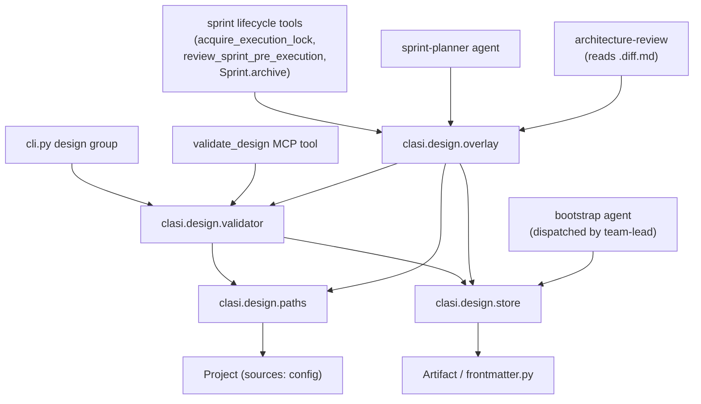
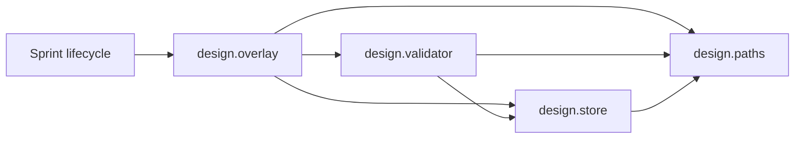

<!-- CLASI: Before changing code or making plans, review the SE process in CLAUDE.md -->

# Sprint 021: Persistent per-subsystem architecture docs with sprint update overlays

## Goals

Replace the per-sprint "Architecture section that never merges back" model
with a persistent, per-subsystem architecture document set in
`docs/design/`, maintained across sprints via sprint-time overlay copies
that are diffed, reviewed, and applied at sprint close. Add tool-supported
validation (CLI + MCP) for the doc set's structure and links, and rework
the affected skills and the team-lead role to author, review, and apply
these docs instead of writing a `sprint.md` Architecture section.

## Problem

Architecture currently lives as a `## Architecture` section inside each
sprint's `sprint.md`, authored once by the sprint-planner and never merged
back into anything persistent. There is no single document describing the
current architecture of any part of the system, so nothing durable exists
for an agent to read before touching a subsystem, and code drifts from any
architecture prose that does get written because nothing checks the two
against each other. `consolidate-architecture` can produce a one-off
`docs/design/architecture.md` on demand, but no such file exists in this
repo, and a single big document reintroduces the "no one reads or
maintains it" failure at a different scale.

## Solution

- A persistent `docs/design/design.md` (system-level) plus one document
  per logical subsystem, mapped 1:1 to top-level source-tree directories
  under one or more declared source roots (`.clasi/config.yaml` gains a
  `sources:` list; this repo has one root, `src/`, but the mechanism
  supports more, e.g. `tests/`).
- Deterministic slugified filenames derived from each subsystem's path
  (root name omitted for a single source root; root-qualified for
  multiple roots), so the doc set can be validated without a manual
  mapping file.
- Bidirectional, code-checked links: each subsystem directory gets a
  frontmattered `README.md` pointing at its design doc; each design doc's
  frontmatter points back at its source path(s) and README.
- A `DesignValidator` (mirroring the existing `clasi.schemas` /
  `clasi schema validate` pattern) checks structure, both link
  directions, and sprint overlay consistency — exposed as `clasi design
  validate` (CLI) and `validate_design` (MCP).
- Two new/reworked skills: a **bootstrap** skill (absorbs
  `consolidate-architecture`) that reads the source roots and writes the
  initial doc set, and a reworked **architecture-authoring** skill that
  covers maintaining subsystem docs and writing sprint overlays.
- Sprint-time updates become full-copy overlays in
  `clasi/sprints/NNN-slug/design/`, git-anchored: pristine canonical
  copies are committed at sprint creation before any edits, edits stay
  uncommitted through planning and review, and are committed at
  pre-execution approval — so execution starts on a clean tree exactly as
  it does today. `<name>.diff.md` files, generated from the pristine vs.
  edited copies, are what `architecture-review` reads.
- At sprint close, overlay copies are applied over the canonical
  `docs/design/` docs — this sprint reverses the "architecture never
  merges back" behavior that motivated the issue.
- The whole mechanism is stakeholder opt-in, recorded in
  `.clasi/config.yaml`; when not opted in, sprints carry no `design/`
  overlay and the architecture-review gate is skipped exactly as it is
  today for a trivial sprint.
- This sprint also runs the bootstrap once on this repo, producing the
  first real doc set, and is itself planned the old way (Architecture
  section in this `sprint.md`) since the new mechanism does not exist
  until this sprint ships.

## Success Criteria

- `clasi design validate` and `validate_design` (MCP) both pass on a
  correctly linked doc set and fail with actionable messages on: missing
  `design.md`, an unmapped source root, a design doc with no README
  backlink (or vice versa), and a sprint overlay file with a stale or
  missing `.diff.md`.
- After the bootstrap ticket runs on this repo, `docs/design/` contains
  `design.md` plus one doc per subsystem under `src/clasi/`, each
  subsystem directory has a frontmattered `README.md`, and validation
  passes.
- A sprint created after this ships can carry a `design/` overlay
  directory: pristine copies land and are committed at creation; edits
  remain uncommitted and visible via `git diff` through planning and
  review; the copies are committed at pre-execution approval; execution
  starts clean; at close, the copies are applied to `docs/design/` and
  validation still passes.
- With no opt-in recorded, `plan-sprint` and `close-sprint` behave exactly
  as they do today (Architecture section in `sprint.md`, no `design/`
  dir) — this sprint does not force adoption on existing behavior.
- Existing sprint/ticket/issue lifecycle tests continue to pass; new
  tests cover the validator, the overlay copy/commit/apply steps, and the
  opt-in skip path.

## Scope

### In Scope

- `.clasi/config.yaml` schema: `sources:` list under a new/extended
  `paths:`-adjacent section; opt-in flag for the architecture doc set.
- Slugification helper for subsystem paths (single-root and multi-root
  rules).
- `docs/design/` subsystem doc set structure: `design.md`, per-subsystem
  docs, subsystem `README.md` frontmatter contract.
- `DesignValidator` (structure, bidirectional links, sprint overlay
  checks) + `clasi design validate` CLI command + `validate_design` MCP
  tool.
- Overlay lifecycle: copy-and-commit-pristine at sprint creation,
  commit-edited-copies at pre-execution approval, diff generation
  (`<name>.diff.md`), apply-at-close.
- Bootstrap skill (new, absorbs `consolidate-architecture`'s reason for
  existing).
- Reworked `architecture-authoring` skill (subsystem docs + overlay
  authoring).
- Reworked `architecture-review` skill (reads `.diff.md` files instead of
  a `sprint.md` Architecture section).
- Reworked `plan-sprint` and `close-sprint` skills (overlay
  creation/application, opt-in skip path).
- Reworked `execute-sprint` dispatch context (pulls subsystem doc + sprint
  overlay instead of "relevant architecture sections").
- Team-lead role update: detect missing doc set, prompt stakeholder,
  dispatch bootstrap agent, record the opt-in/opt-out decision.
- One-time bootstrap run on this repo's own `src/clasi/` tree.
- Tests for all of the above.

### Out of Scope

- Retroactively converting sprints 001-020's `architecture-update.md` /
  `sprint.md` Architecture sections into the new doc set. Those remain a
  historical record, as already established for the single-doc rewrite
  (sprint 018).
- Automatic subsystem re-detection when the source tree is restructured
  mid-project — the bootstrap skill can be re-run manually; no file
  watcher or drift-detection daemon.
- Multi-root slugification beyond the two rules the issue specifies
  (single-root: unqualified; multi-root: root-qualified). No support for
  a source root nested inside another source root.
- A UI or dashboard for the doc set; VS Code's built-in git diff view is
  the review surface, per the issue.
- Removing `consolidate-architecture` as a callable skill entirely; it is
  absorbed into the bootstrap skill's guidance but may remain as a
  redirect/reference for sprints 001-017's historical model.

## Test Strategy

- **Unit**: slugification (single-root and multi-root cases, including
  nested-path subsystems like `src/clasi/tools/` -> `clasi-tools`),
  `DesignValidator` structural checks (each failure mode independently),
  frontmatter round-trip for design docs and subsystem READMEs.
- **Integration**: full overlay lifecycle against a throwaway git repo
  fixture — create sprint, verify pristine copies committed, edit
  copies, verify working tree dirty and `git diff` shows exactly the
  edit, simulate pre-execution approval, verify commit and clean tree,
  simulate close, verify canonical docs updated and validator passes
  afterward.
- **Opt-out path**: sprint created with no doc set and no `sources:`
  config produces no `design/` dir and the architecture-review gate
  records `skipped`, matching today's trivial-sprint behavior.
- **CLI**: `clasi design validate` exit codes and messages for each
  failure mode, mirroring the existing `clasi schema validate` test
  shape.
- **System-level**: this sprint's own bootstrap ticket run against
  `src/clasi/` is itself a live test — validation must pass on the real
  repo afterward, not just on fixtures.

## Architecture

Substantial — introduces a new persistent-documentation subsystem
(design-doc storage, slugification, validation) plus changes to the
sprint lifecycle (new overlay-copy git steps at three points: creation,
pre-execution approval, close) and to `.clasi/config.yaml`'s schema (new
`sources:`/opt-in fields). 3+ modules touched (`project.py`,
`sprint.py`/`artifact_tools.py` lifecycle tools, a new `design` package,
`cli.py`), a new cross-module dependency (sprint lifecycle now depends on
the design subsystem), and a config/data-model change — full 7-step
write-up with diagrams.

### 1. Understand the Problem

See Problem/Solution above. The core shift: architecture prose moves from
"write once per sprint, never reread" to "persistent per-subsystem file,
overwritten wholesale each sprint that touches it, applied back at
close." The git-anchored copy mechanism is the load-bearing idea — it
gets human-readable diffing for free from tools the stakeholder already
uses (VS Code), instead of building a diff renderer.

### 2. Identify Responsibilities

- **Locating and naming subsystems** — mapping source roots and their
  top-level directories to canonical design-doc filenames. Changes only
  when the source tree's top-level shape changes or `sources:` config
  changes.
- **Storing and reading the persistent doc set** — `docs/design/design.md`
  + per-subsystem docs + subsystem `README.md` frontmatter. Changes when
  content is authored (bootstrap or sprint apply).
- **Validating doc set structure and links** — pure read-only checking
  logic, independent of how docs are authored. Changes when a new failure
  mode needs detecting.
- **Producing the initial doc set (bootstrap)** — a one-time, agent-driven
  read of the codebase into the persistent store. Changes rarely, only
  when the bootstrap process itself changes.
- **Authoring sprint overlays** — an agent (sprint-planner) writing full
  updated copies of affected canonical docs into a sprint's `design/`
  dir. Changes when sprint planning behavior changes.
- **Overlay lifecycle git operations** — copy-and-commit pristine copies
  at sprint creation, commit edited copies at pre-execution approval,
  apply copies to canonical docs at close. This is infrastructure/plumbing
  distinct from what an agent writes into the copies; it changes only
  when the lifecycle's git mechanics change.
- **Reviewing overlays** — turning pristine-vs-edited into a
  human/agent-readable diff and gating on it. Changes independently of
  both authoring and the git plumbing.
- **Skills and role guidance** — the prose that tells agents how to do
  the above. Changes whenever any of the above responsibilities change
  their contract, but is itself not code.

These groups change for different reasons and at different times, so they
map to separate modules rather than one "architecture stuff" blob.

### 3. Define Subsystems and Modules

- **`clasi.design.paths`** (new) — Purpose: derive canonical design-doc
  and README paths from source-root and subsystem-directory configuration.
  Boundary: pure functions over `Project`'s resolved `sources:` config and
  path strings; no file I/O, no git. Outside: reading/writing any actual
  file. Serves: SUC-001, SUC-002.
- **`clasi.design.store`** (new) — Purpose: read and write the persistent
  `docs/design/` doc set (design.md, subsystem docs, README frontmatter)
  as `Artifact` objects. Boundary: wraps `Artifact`/`frontmatter.py` for
  the design-doc shape specifically; no validation logic, no git.
  Outside: deciding *what* content goes in a doc (that's an agent's job
  via a skill) and any cross-doc consistency checking. Serves: SUC-001,
  SUC-002, SUC-006.
- **`clasi.design.validator`** (new, mirrors `clasi.schemas.loader`) —
  Purpose: check the doc set's and a sprint overlay's structural and link
  correctness. Boundary: read-only; takes a `Project` and returns a
  structured pass/fail result with actionable messages (parallel to
  `SchemaError`). Outside: fixing anything it finds; no writes. Serves:
  SUC-003, SUC-005.
- **`clasi.design.overlay`** (new) — Purpose: perform the git-anchored
  copy lifecycle for a sprint's `design/` directory (seed pristine
  copies + commit, diff pristine vs. edited into `.diff.md`, commit
  edited copies, apply copies to canonical docs). Boundary: the only
  module that shells out to git for design-doc purposes; called by the
  sprint lifecycle tools at three hook points. Outside: deciding sprint
  phase transitions (that stays in `sprint.py`) and validation (delegates
  to `clasi.design.validator`). Serves: SUC-004, SUC-006, SUC-007.
- **`Project` (extended)** (`src/clasi/project.py`) — Purpose: resolve
  `sources:` config and the opt-in flag alongside existing path
  properties. Boundary: config resolution only, same role it plays for
  `design_dir` today; delegates all design-doc logic to the `clasi.design`
  package. Serves: SUC-001, SUC-003.
- **Sprint lifecycle tools** (`src/clasi/tools/artifact_tools.py`,
  `src/clasi/sprint.py`, extended, not new) — Purpose: call into
  `clasi.design.overlay` at the three existing hook points identified
  during research (`acquire_execution_lock` after `create_branch()`;
  `review_sprint_pre_execution`; `Sprint.archive()` inside
  `_close_sprint_full`), gated on the opt-in flag. Boundary: orchestration
  only — no design-doc-specific logic lives here beyond the call-out.
  Serves: SUC-004, SUC-006, SUC-007.
- **`cli.py` `design` command group** (extended) — Purpose: expose
  `clasi design validate` following the existing `schema` group's shape
  (`cli.py:245-266`). Boundary: argument parsing and message
  formatting only; delegates to `clasi.design.validator`. Serves:
  SUC-003.
- **`validate_design` MCP tool** (`src/clasi/tools/artifact_tools.py` or
  new `design_tools.py`, extended) — Purpose: expose the same validator
  to agents over MCP. Boundary: thin wrapper, same delegation as the CLI
  command. Serves: SUC-003.
- **Skills** (`.agents/skills/bootstrap-design` (new), `architecture-authoring`,
  `architecture-review`, `plan-sprint`, `close-sprint`, `execute-sprint`,
  team-lead `agent.md`, all reworked in place) — Purpose: prose guidance
  for agents performing the above. Boundary: no code; each skill governs
  exactly one lifecycle moment. Serves: SUC-001 through SUC-007 (guidance
  layer over all of them).

Each module above passes the cohesion test: one sentence, no "and."

### 4. Diagrams

**Component diagram** — required: a new cross-module dependency
(sprint lifecycle -> design subsystem) is introduced, and 3+ modules are
touched.

**Dependency graph** — module dependencies change (new dependency from
sprint lifecycle onto the design subsystem, and within the new subsystem
itself):

Dependency direction is one-way, innermost-first (`paths` has no
dependencies on anything else in the new subsystem; `store` depends only
on `paths`; `validator` depends on both; `overlay` depends on all three).
No cycles.

No ERD: the doc set's "entities" (design doc, subsystem, README) are
files with frontmatter, not database rows — there is no schema migration
concern that an ERD would clarify, and the existing frontmatter/`Artifact`
machinery already models "file with structured metadata."

### 5. Complete the Document

**What Changed**
- New `clasi.design` package: `paths.py`, `store.py`, `validator.py`,
  `overlay.py`.
- `Project` gains `sources` config resolution and an opt-in flag
  (`.clasi/config.yaml`).
- `cli.py` gains a `design` command group (`clasi design validate`),
  modeled on the existing `schema` group.
- `artifact_tools.py` gains a `validate_design` MCP tool.
- Sprint lifecycle tools (`acquire_execution_lock`,
  `review_sprint_pre_execution`, `Sprint.archive`/`_close_sprint_full`)
  gain calls into `clasi.design.overlay`, gated on the opt-in flag —
  behavior is unchanged when the flag is off.
- New skill `bootstrap-design` absorbs `consolidate-architecture`'s
  role for this repo's forward path (the latter remains available for
  sprints still on the old model).
- `architecture-authoring`, `architecture-review`, `plan-sprint`,
  `close-sprint`, `execute-sprint` skills reworked; team-lead `agent.md`
  updated to detect/prompt/record the opt-in decision.
- One-time bootstrap output: `docs/design/design.md` + per-subsystem docs
  + subsystem `README.md` files under `src/clasi/`.

**Why**

Architecture prose has no stable home today, so nothing enforces that it
describes the actual codebase, and nothing merges sprint-time updates
back — see Problem above. Persistent per-subsystem docs give each piece
of prose a home that outlives the sprint that touched it; git-anchored
overlay copies get free, tool-native diffing without building a diff
renderer; and validator + bidirectional links make drift detectable
instead of silent.

**Impact on Existing Components**

- `Project`: additive — new config resolution alongside existing
  properties, no removal.
- Sprint lifecycle tools: additive when opted in, no-op when not. The
  existing hook points (branch creation, pre-execution review, archive)
  already exist and already run at exactly the right moments per the
  research above — no new lifecycle phase is introduced, only new calls
  within existing phases.
  `_close_sprint_full`'s step ordering gains one step (apply overlay to
  `docs/design/`) placed immediately after `sprint.archive()` and before
  the version-bump/tag step, so a failed apply doesn't leave a tagged
  version with unapplied docs.
- `sprint.md` template: the Architecture section's instructions gain a
  note that, when the doc set is opted in, this section is no longer
  used — the sprint's `design/` overlay is authoritative instead. The
  section itself is not removed from the template (it remains the
  mechanism for opted-out projects and for trivial/compact sprints, which
  still get a lightweight prose note even under opt-in, per the open
  question resolved below).
- `consolidate-architecture` skill: retained for sprints still on the
  pre-021 model; not deleted.

**Migration Concerns**

- No forced migration: opt-in is per-project, recorded in
  `.clasi/config.yaml`, defaulting to not-opted-in. Existing sprints and
  their `sprint.md` Architecture sections are untouched.
- This repo's own opt-in and bootstrap run happen inside this sprint's
  scope (see Tickets), so `docs/design/` gains new files
  (`design.md`, subsystem docs, subsystem READMEs) alongside the existing
  frozen initiation docs (`overview.md`, `specification.md`,
  `state-machines.md`, `usecases.md`, `worktree-process.md`) — see Open
  Question 2 below for how they coexist.
- Sequencing risk: the overlay-apply-at-close step must run and succeed
  before the version bump/tag step, so a partially-applied doc set is
  never tagged as a release. If the apply step fails, close should fail
  the same way a failed test run fails close today (no tag, no merge),
  not partially complete.
- Git dirty-tree window: pristine copies are committed at sprint
  creation (on `main`, before the sprint branch exists — sprint branches
  are created later, at `acquire_execution_lock`, per the existing
  "late branching" model). This means the pristine-copy commit and the
  edited-copy commit happen on different branches (main, then the sprint
  branch) unless the design changes are also carried onto the sprint
  branch during branch creation. This is Open Question 3 below.

### 6. Design Rationale

**Decision: Full-copy overlays instead of hand-written diffs**
- Context: sprint-time architecture updates need to be reviewable before
  being applied.
- Alternatives considered: (a) hand-authored unified diffs written by the
  sprint-planner; (b) a custom structured-diff format; (c) full copies
  with diffs derived by tooling.
- Why this choice: agents write whole documents reliably; hand-built
  diffs drift from the documents they claim to describe, especially
  across a multi-turn planning session. Full copies also make "apply" a
  trivial file copy rather than a patch-application step that can fail on
  conflicting context lines.
- Consequences: diff generation becomes a derived, regenerable step
  (`<name>.diff.md`), not authored content — validated for staleness
  rather than trusted at face value.

**Decision: Git-anchored diffing via commit timing, not a custom diff
tool**
- Context: the stakeholder needs to review exactly what changed in each
  design doc before approving a sprint for execution.
- Alternatives considered: (a) build a diff-rendering tool; (b) rely on
  VS Code's git diff view by controlling *when* pristine vs. edited
  copies are committed.
- Why this choice: (b) needs no new rendering code — it repurposes a tool
  the stakeholder already uses daily. The cost is a git-mechanics
  dependency (commit ordering must be exact) rather than a UI dependency.
- Consequences: the overlay lifecycle becomes timing-sensitive (see Open
  Question 3) and the `.diff.md` files exist only for the
  agent reviewer, not the human, per the issue's own framing.

**Decision: Validator modeled on `clasi.schemas`/`clasi schema validate`
rather than a new pattern**
- Context: the project needs both CLI and MCP surfaces for design-doc
  validation.
- Alternatives considered: (a) invent a new validation pattern specific
  to design docs; (b) mirror the existing schema validator's shape
  (`loader.load()` returning a validated model, a `*Error` exception type,
  a CLI command that catches it).
- Why this choice: the existing pattern is already proven in this
  codebase, keeps the two validators recognizably similar for anyone
  reading both, and the issue explicitly names it as the model to follow.
- Consequences: `clasi.design.validator` should expose a `load`-like entry
  point and a `DesignError` type parallel to `SchemaError`, even though
  design-doc validation checks links and file presence rather than a
  single YAML file's internal structure.

### 7. Open Questions

Per the issue, these are genuine open questions; each gets a concrete
recommendation for stakeholder confirmation, not a deferral.

1. **Are `.diff.md` files needed if the stakeholder reviews via VS Code's
   git diff?** Recommendation: keep them, but scope them explicitly as
   agent-reviewer input, not human-facing — the architecture-review skill
   reads `.diff.md`, the stakeholder reviews `git diff` directly. Dropping
   them would require the review skill to shell out to `git diff` itself
   and parse/format it, which duplicates work the validator's
   staleness-check machinery already needs (comparing pristine vs. edited
   content) — cheaper to generate the file once than to build two
   consumers of two different diff sources.
2. **Do initiation docs coexist with subsystem docs in `docs/design/`, or
   do subsystem docs get a subdirectory?** Recommendation: coexist at the
   top level, no subdirectory. The initiation docs (`overview.md`,
   `specification.md`, `usecases.md`, `state-machines.md`,
   `worktree-process.md`) are prefixed by their own distinct names and
   don't collide with subsystem-slug filenames (`clasi-tools.md`,
   `clasi-schemas.md`, etc.) under the single-source-root slugification
   rule (root name omitted) — collision is already avoided by
   `design.md` being the one reserved top-level name. A subdirectory adds
   a path segment for no disambiguation benefit and complicates the
   slugification rule (which already has a root-qualification rule for
   the multi-root case; nesting subsystem docs under the doc directory
   itself would need a third rule).
3. **What branch do pristine copies land on, given sprints branch late
   (at `acquire_execution_lock`, not at creation)?** Recommendation:
   commit pristine copies on `main` at `create_sprint` time (as the issue
   states — "when the sprint is created"), consistent with all other
   roadmap-phase sprint.md writes, which also happen on `main` today.
   When the sprint branch is later created at `acquire_execution_lock`,
   it branches from `main` and therefore already contains the pristine
   copies' commit. The sprint-planner's edits (planning-docs and
   ticketing phases) also happen on `main`, matching today's "all
   planning happens on main" rule (see `plan-sprint` skill). The
   edited-copy commit at pre-execution approval therefore also happens on
   `main`, immediately before `acquire_execution_lock` branches off it —
   so the sprint branch, once created, starts from a tree that already
   has the committed edits, and execution's clean-tree property holds
   with no cross-branch reconciliation needed.
4. **Does a trivial or compact sprint under opt-in still get a
   `sprint.md` Architecture section, or does it get an empty/absent
   `design/` overlay?** Recommendation: no `design/` overlay is created
   when the sprint-planner's effort decision is trivial (matches today's
   "N/A — trivial" skip), and the architecture-review gate is recorded
   `skipped` exactly as it is today — the opt-in doesn't change trivial-
   sprint behavior, it only changes what a *substantial* or *compact*
   sprint's architecture output looks like (overlay instead of inline
   section).

## Use Cases

Substantial sprint — full use case treatment.

### SUC-001: Bootstrap the persistent design doc set
Parent: New capability (no prior UC)

- **Actor**: Bootstrap agent, dispatched by team-lead
- **Preconditions**: `docs/design/` has no `design.md`; stakeholder has
  authorized creation (see SUC-006); `.clasi/config.yaml` declares at
  least one `sources:` entry.
- **Main Flow**:
  1. Team-lead detects no doc set and stakeholder opt-in already recorded.
  2. Team-lead dispatches an agent following the bootstrap skill.
  3. Agent reads each declared source root's top-level directories.
  4. Agent derives canonical filenames via `clasi.design.paths`
     slugification.
  5. Agent writes `docs/design/design.md` plus one doc per subsystem via
     `clasi.design.store`, and a frontmattered `README.md` per subsystem
     directory.
  6. Agent runs `clasi design validate` (or `validate_design`); on
     failure, fixes and re-validates.
- **Postconditions**: `docs/design/` contains `design.md` plus one doc per
  subsystem; every subsystem directory has a frontmattered `README.md`;
  validation passes.
- **Acceptance Criteria**:
  - [ ] `design.md` exists and lists every declared subsystem.
  - [ ] Every top-level directory under every declared source root has a
        corresponding design doc and a frontmattered `README.md`.
  - [ ] `clasi design validate` exits 0 against the produced doc set.

### SUC-002: Slugify a subsystem path into a canonical doc filename
Parent: Supports SUC-001, SUC-004

- **Actor**: `clasi.design.paths` (called by store, validator, overlay)
- **Preconditions**: A subsystem directory path and the project's
  `sources:` config are available.
- **Main Flow**:
  1. Caller passes a subsystem directory path and the resolved `sources:`
     list.
  2. If exactly one source root is declared, the filename is derived by
     slugifying the path relative to that root (root name omitted), e.g.
     `src/clasi/tools/` -> `clasi-tools.md`.
  3. If multiple source roots are declared, the filename is derived by
     slugifying the path relative to the repo root (root name included),
     e.g. `tests/e2e/` -> `tests-e2e.md`.
  4. The top-level system document is always named `design.md`,
     regardless of root count.
- **Postconditions**: A deterministic, collision-free filename is
  returned for any valid subsystem path under a declared source root.
- **Acceptance Criteria**:
  - [ ] Single-root slugification omits the root name.
  - [ ] Multi-root slugification includes the disambiguating root name.
  - [ ] The function is pure (no file I/O) and total over any path under
        a declared source root.

### SUC-003: Validate the design doc set and a sprint overlay
Parent: Supports SUC-001, SUC-004, SUC-006

- **Actor**: Any agent (via `clasi design validate` or `validate_design`
  MCP tool), typically the team-lead or bootstrap/sprint-planner agent
- **Preconditions**: `.clasi/config.yaml` declares `sources:`.
- **Main Flow**:
  1. Caller invokes the validator against `docs/design/` and, if present,
     a sprint's `design/` overlay directory.
  2. Validator checks: `design.md` present; one doc per declared
     subsystem; every design doc has frontmatter referencing its source
     path(s) and README; every subsystem README has frontmatter
     referencing its design doc; no orphaned docs (doc with no matching
     source directory) or unmapped source roots (directory with no doc).
  3. For a sprint overlay, additionally checks: overlay filenames match a
     canonical doc; overlay frontmatter references resolve; every overlay
     file has a matching, up-to-date `<name>.diff.md`.
  4. Validator returns pass, or fail with one actionable message per
     violation.
- **Postconditions**: Caller knows exactly what is wrong, if anything,
  with enough detail to fix it without further investigation.
- **Acceptance Criteria**:
  - [ ] Each of the four doc-set failure modes in the issue's
        Verification section is independently detectable.
  - [ ] `clasi design validate` and `validate_design` produce equivalent
        results for the same input.
  - [ ] A stale `.diff.md` (edited copy changed after diff was generated)
        is detected as a sprint-overlay failure.

### SUC-004: Author a sprint architecture overlay
Parent: Supports SUC-006

- **Actor**: sprint-planner agent
- **Preconditions**: Doc set opt-in is recorded; sprint is in
  planning-docs phase; effort decision is compact or substantial (not
  trivial — see Open Question 4).
- **Main Flow**:
  1. Sprint-planner identifies which canonical docs the sprint's changes
     affect (system-level `design.md` and/or specific subsystem docs).
  2. For each affected doc, sprint-planner edits the sprint's already-
     committed pristine copy in `clasi/sprints/NNN-slug/design/<name>.md`
     in place (see SUC-005 for how the pristine copy got there) to
     reflect the sprint's planned changes — a complete updated copy, not
     a hand-written diff.
  3. Sprint-planner runs the diff-generation step (part of
     `clasi.design.overlay`) to produce `<name>.diff.md` for each edited
     doc.
  4. Sprint-planner runs `clasi design validate` against the sprint's
     `design/` directory before handing off to architecture-review.
- **Postconditions**: The sprint's `design/` directory contains one full
  updated copy and one `.diff.md` per affected canonical doc; the
  sprint's working tree is dirty exactly in those files.
- **Acceptance Criteria**:
  - [ ] Every edited overlay file is a complete document, not a partial
        patch.
  - [ ] Every edited overlay file has a corresponding `.diff.md`.
  - [ ] `sprint.md`'s Architecture section is not used for this sprint's
        architecture content when the doc set is opted in — the overlay
        is authoritative.

### SUC-005: Git-anchored overlay lifecycle (create, approve, close)
Parent: Supports SUC-004, SUC-006, SUC-007

- **Actor**: Sprint lifecycle tools (`create_sprint`,
  `acquire_execution_lock` path, `review_sprint_pre_execution` path,
  `close_sprint` path)
- **Preconditions**: Doc set opt-in is recorded.
- **Main Flow**:
  1. At `create_sprint`, for each canonical doc the new sprint is
     expected to touch (or, if unknown yet, deferred until the
     sprint-planner identifies them during Phase 2 — see Open Question 3
     discussion for exact timing), `clasi.design.overlay` copies the
     pristine canonical doc into the sprint's `design/` directory and
     commits it immediately, before any edits.
  2. Sprint-planner edits the copies (SUC-004). The working tree is dirty
     in exactly those files from this point through review.
  3. At `review_sprint_pre_execution` (stakeholder approval to run the
     sprint), `clasi.design.overlay` commits the edited copies.
     `acquire_execution_lock` then creates the sprint branch from a tree
     that already includes this commit.
  4. Execution proceeds on a clean tree; ticket commits, worktrees, and
     the close merge are unaffected by the overlay mechanism.
  5. At sprint close (`_close_sprint_full`, after `sprint.archive()`,
     before the version bump/tag step), `clasi.design.overlay` applies
     each overlay copy over its corresponding canonical doc in
     `docs/design/` and this is included in the close commit.
- **Postconditions**: Canonical `docs/design/` reflects the sprint's
  changes after close; validation passes; no step left the tree in a
  state where a tag was created before the apply succeeded.
- **Acceptance Criteria**:
  - [ ] Pristine copies are committed before any edit lands, verified via
        git log ordering in a test fixture.
  - [ ] `git diff` on the sprint's `design/` directory shows exactly the
        sprint-planner's edits at any point between creation and
        pre-execution approval.
  - [ ] After pre-execution approval, the working tree is clean with
        respect to the `design/` directory.
  - [ ] After close, canonical docs match the sprint's final overlay
        copies exactly (round-trip: copying the overlay file over the
        canonical file reproduces the applied state).
  - [ ] If the apply step fails, close does not proceed to the version
        bump/tag/merge steps.

### SUC-006: Stakeholder opt-in/opt-out for the doc set
Parent: Supports SUC-001, SUC-004, SUC-005

- **Actor**: Stakeholder, via team-lead
- **Preconditions**: No opt-in/opt-out decision recorded yet in
  `.clasi/config.yaml`.
- **Main Flow**:
  1. Team-lead finds no `docs/design/design.md` and no recorded decision.
  2. Team-lead asks the stakeholder whether to authorize creating the
     persistent doc set, explaining the tradeoff (durable, validated
     architecture docs vs. sprint-time overlay maintenance overhead).
  3a. If declined, team-lead records the opt-out in `.clasi/config.yaml`
      and does not ask again this session or in future sessions until the
      stakeholder changes it.
  3b. If approved, team-lead records the opt-in and dispatches the
      bootstrap agent (SUC-001).
  4. Stakeholder may change the decision at any later time by editing
     config or telling the team-lead directly.
- **Postconditions**: The decision is durably recorded; subsequent
  sessions do not re-prompt.
- **Acceptance Criteria**:
  - [ ] Declining produces no `design/` overlay directories on any future
        sprint and the architecture-review gate records `skipped` for
        architecture purposes exactly as today.
  - [ ] The decision survives a session restart (read from
        `.clasi/config.yaml`, not session state).
  - [ ] Re-running the team-lead after a decision is recorded does not
        re-prompt.

### SUC-007: Reworked architecture-review reads overlay diffs
Parent: Supersedes prior architecture-review behavior for opted-in
projects

- **Actor**: Architecture reviewer (agent, typically sprint-planner
  itself per its inline-review model, or team-lead-dispatched reviewer)
- **Preconditions**: Sprint has a `design/` overlay with `.diff.md` files
  generated (SUC-004).
- **Main Flow**:
  1. Reviewer reads each `<name>.diff.md` in the sprint's `design/`
     directory alongside the sprint's tickets.
  2. Reviewer applies the same five review categories (consistency,
     codebase alignment, design quality, anti-patterns, risks) against
     the diffs instead of a `sprint.md` Architecture section.
  3. Reviewer issues APPROVE / APPROVE WITH CHANGES / REVISE exactly as
     today.
  4. Gate result recorded via `record_gate_result`.
- **Postconditions**: Same gate semantics as today; input source changed
  from an inline section to overlay diffs.
- **Acceptance Criteria**:
  - [ ] Review verdict levels and REVISE-triggering conditions are
        unchanged from today's `architecture-review` skill.
  - [ ] A stale or missing `.diff.md` blocks review (caught by
        `clasi design validate` before review begins, per SUC-003).

## GitHub Issues

(None — this sprint implements a CLASI-internal issue file, not a GitHub
issue.)

## Definition of Ready

Before tickets can be created, all of the following must be true:

- [x] Sprint planning document is complete (sprint.md, including its
      Architecture and Use Cases sections)
- [ ] Architecture review passed (or skipped, for changes with no
      architectural impact)
- [ ] Stakeholder has approved the sprint plan

## Tickets

| # | Title | Depends On |
|---|-------|------------|
| 001 | Config: sources list and doc-set opt-in flag | — |
| 002 | Slugification: clasi.design.paths module | 001 |
| 003 | Design doc store: clasi.design.store module | 002 |
| 004 | Validator core: clasi.design.validator + clasi design validate CLI + validate_design MCP tool | 002, 003 |
| 005 | Overlay lifecycle: clasi.design.overlay (copy/commit, diff generation, apply) | 002, 003, 004 |
| 006 | Sprint lifecycle integration: hook overlay steps into create/acquire/pre-execution/close | 005 |
| 007 | Bootstrap skill: create/rework consolidate-architecture into bootstrap-design | 003, 004 |
| 008 | Rework architecture-authoring, architecture-review, plan-sprint, close-sprint, execute-sprint skills and team-lead role | 004, 005, 006, 007 |
| 009 | Bootstrap run: produce docs/design/ subsystem doc set for this repo | 001, 007 |

Tickets execute serially in the order listed.
