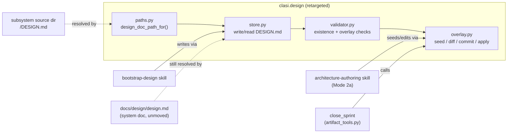

<!-- CLASI: Before changing code or making plans, review the SE process in CLAUDE.md -->

# Sprint 022: Co-locate subsystem design docs as DESIGN.md in source, replacing READMEs

## Goals

Invert sprint 021's central-`docs/design/` + paired source-`README.md`
model: each subsystem's design doc moves into its own source directory as
`DESIGN.md`, replacing the paired `README.md` outright (one file per
subsystem instead of two). Frontmatter is dropped from the co-located doc
unless a real link requires it. Sprint-change linkage (which design docs a
sprint touched) is preserved, retargeted to the new location. Migrates the
8 existing `docs/design/<slug>.md` docs and 8 source `README.md` files
(bootstrapped by sprint 021) into 8 `DESIGN.md` files. Resolves what
happens to `docs/design/`'s 5 project-level docs and the directory itself.

## Problem

021 built the opposite arrangement on the stated theory that architecture
prose needed one central, git-diffable home with a validated
doc<->README backlink. The stakeholder's actual intent (2026-07-16) is
that a subsystem's design should live beside its code as a single file,
not split across two paired files one directory apart. The
doc<->README bidirectional-link validation, the `readme_path`/
`source_paths` frontmatter contract, and the flat `docs/design/<slug>.md`
naming scheme all exist to serve the pairing this sprint removes.

## Solution

Retarget 021's `clasi.design` package (`paths.py`, `store.py`,
`validator.py`, `overlay.py`) from "central doc + paired README" to
"single co-located `DESIGN.md`, no README." Concretely:

- `paths.py`: `design_doc_slug` and `readme_path_for` are replaced by a
  single `design_doc_path_for(subsystem_path) -> subsystem_path /
  "DESIGN.md"`. No slugification, no collision handling, no source-root
  disambiguation — the doc's location *is* its identity, so two
  subsystems can never collide on a name the way two `docs/design/`
  slugs could.
- `store.py`: `write_design_doc`/`read_design_doc` write/read
  `<subsystem_path>/DESIGN.md` directly, no frontmatter required.
  `write_readme`/`read_readme` are removed. The system-level doc
  (`design.md`) stays where it is conceptually — see Migration below for
  where "where it is" now means.
- `validator.py`: the bidirectional doc<->README link check is replaced
  by a single-file existence/quality check — does `DESIGN.md` exist for
  every subsystem, is it non-empty. No backlink resolution because there
  is nothing to link back to.
- `overlay.py`: retargeted per the Architecture section's resolution of
  the self-hosting subtlety below — the four-step lifecycle
  (seed-and-commit / generate-diffs / commit-edits / apply) is kept, but
  `apply`'s canonical-target resolution changes from "flat
  `docs/design/<name>`" to "per-subsystem `<path>/DESIGN.md`".

The bootstrap-design, architecture-authoring, and create-tickets skills,
plus the packaged `subsystem-design.md` template, are updated to match.
`clasi design validate` must stay green throughout and at sprint close.

## Success Criteria

- Every one of the 8 existing subsystems (`design`, `platforms`, `plugin`,
  `schemas`, `state_machine`, `status`, `templates`, `tools`) has a
  `DESIGN.md` in its source directory; the paired `README.md` is gone.
- `clasi design validate` passes with no doc<->README check remaining.
- A sprint that changes a subsystem's design can still record which
  `DESIGN.md` path(s) it touched, and that linkage is queryable.
- The 5 project-level docs (`overview.md`, `specification.md`,
  `state-machines.md`, `usecases.md`, `worktree-process.md`) are handled
  deliberately (see Architecture's Migration Concerns), not silently
  dropped.
- Full test suite green. Every generator source (code, skills, template)
  referencing `docs/design/` or `README.md` in the old sense is updated —
  not just this repo's own generated doc set.

## Scope

### In Scope

- `src/clasi/design/{paths,store,validator,overlay}.py` retargeting.
- Migration of this repo's own 8 `docs/design/<slug>.md` + 8
  source-tree `README.md` pairs into 8 `DESIGN.md` files.
- Disposition of `docs/design/`'s 5 project-level docs and of
  `docs/design/design.md` (the system doc) per the Migration Concerns
  resolution below.
- `bootstrap-design`, `architecture-authoring`, `create-tickets` skill
  updates; packaged `clasi.design.templates.subsystem_template` update.
- `team-lead`/`execute-sprint` and any other agent/skill prose that
  references the old `docs/design/` + README pairing.
- Redesigning `overlay.py`'s `apply` step (and the `close_sprint`/
  `seed_sprint_design_overlay` MCP call sites in
  `tools/artifact_tools.py`) for co-located canonical targets — this is
  required, not optional, because the flat-directory `apply` assumption
  breaks the moment canonical docs are no longer all siblings under one
  directory. See Architecture's self-hosting resolution.
- This sprint's own design overlay (see Architecture) — required because
  `design_docs_opt_in` is `True` and this change is substantial.

### Out of Scope

- Re-deciding subsystem granularity (kept identical to 021: one
  `DESIGN.md` per top-level source directory, via the existing
  `_subsystem_dirs` one-level-down rule). No new granularity concept is
  introduced.
- The `clasi-core` loose-top-level-module gap (021's own Open Question,
  `docs/design/clasi-design.md` section 6) — unrelated to this sprint's
  co-location change and not reopened here.
- Any change to `.clasi/config.yaml`'s `sources:` list.

## Test Strategy

Unit tests for the retargeted `paths.py`/`store.py`/`validator.py`/
`overlay.py` functions (replacing, not just editing, 021's existing test
suite for the old shape — `design_doc_slug`/`readme_path_for`-specific
tests are removed, `design_doc_path_for`-specific tests added).
Integration-level test for the full `apply` lifecycle against a
multi-subsystem fixture tree, since that is the riskiest retarget (was
flat-directory copy, becomes per-subsystem-directory copy with the
subsystem's own source tree as the destination — must not clobber
unrelated files in that directory). `clasi design validate` run against
this repo's own migrated doc set is the end-to-end acceptance check.
Existing 021 test coverage for the doc<->README backlink checks is
deleted along with the code it tested, not left as dead/skipped tests.

## Architecture

**Sizing: Substantial.** Four modules in `clasi.design` change together
with a real cross-cutting concern (co-location changes the *identity* and
*resolution* of a canonical doc, which every one of `paths` -> `store` ->
`validator` -> `overlay` depends on in sequence), a dependency-direction-
relevant behavior of `overlay.apply` changes (single flat target
directory -> N per-subsystem target directories), and the sprint-linkage
data model changes (drop `readme_path`/`source_paths` frontmatter). This
clears the substantial bar on module count and data-model-change grounds
independently; a diagram is warranted because the four-module dependency
chain and its consumers (skills, MCP tools, `close_sprint`) are exactly
what a component diagram clarifies.

Per project convention this design's canonical output for a project with
`design_docs_opt_in: True` and a substantial sizing decision is a sprint
`design/` overlay (Mode 2a of `architecture-authoring`), not a `sprint.md`
Architecture section. **This section documents the sizing decision, the
self-hosting resolution, and points to the overlay** — the actual updated
design content (What Changed / Why / Impact / Migration Concerns per
affected doc) lives under `clasi/sprints/022-co-locate-subsystem-design-docs-as-design-md-in-source-replacing-readmes/design/`,
per the arrangement below.

### The Self-Hosting Subtlety: What Gets Overlaid, and Why

This sprint changes the very mechanism (`clasi.design`) that
`close_sprint`'s `design_overlay_apply` step uses to close *this sprint
itself*. Two constraints collide if not resolved explicitly:

1. `close_sprint`'s `design_overlay_apply` step (`tools/artifact_tools.py`,
   around line 1665-1696) calls `apply_design_overlay(sprint.design_dir,
   project.design_dir)`, which copies every overlay `.md` file in the
   sprint's `design/` directory over `project.design_dir / <same name>` —
   a **flat, single-target-directory** copy. It has no notion of "this
   overlay file's canonical target is actually
   `src/clasi/<subsystem>/DESIGN.md`, not `docs/design/<subsystem>.md`."
2. This sprint's own tickets relocate the very docs a naive overlay of
   all 8 subsystem docs would seed, edit, and try to apply back to
   `docs/design/` — the location this sprint is deleting them from. If
   the overlay seeded all 8 subsystem docs, `apply` would faithfully
   write them straight back into `docs/design/<slug>.md` at close,
   silently undoing the migration the tickets just performed. That is
   not a hypothetical edge case; it is exactly what the unmodified
   `apply` function does today, applied literally.

**Resolution — split by what changes structurally vs. what changes
mechanically:**

- **Overlay only `docs/design/design.md`** (the system-level doc) through
  the existing, unmodified overlay lifecycle. `design.md` is the one
  canonical doc whose *location* does not move in this sprint (Migration
  Concerns below keeps the system doc at the project-config-defined
  `design_dir`) — only its *content* changes, to describe the new
  co-located model instead of the old central-doc-plus-README model. A
  content-only change to a doc whose location is unchanged is exactly
  what the existing overlay lifecycle is built for; no mechanism change
  needed for this one file.
- **Do not seed the 8 subsystem docs into the overlay at all.** Their
  relocation is handled by ticket 003 (Migration ticket) as a direct,
  ticket-scoped file operation — write `<subsystem>/DESIGN.md`, delete
  `docs/design/<slug>.md` and `<subsystem>/README.md` — not through the
  overlay's seed/edit/diff/apply cycle. This sidesteps the flat-apply
  assumption entirely for the one sprint where naively using it would be
  actively wrong.
- **`overlay.apply`'s flat-target assumption is fixed anyway, as ticket
  005** (not deferred) — future sprints that touch a subsystem's
  `DESIGN.md` need overlay support for a co-located target, and shipping
  this sprint without fixing `apply` would leave 021's overlay lifecycle
  permanently unusable for the doc type this sprint just made canonical.
  Ticket 005 changes `apply`'s canonical-target resolution from
  "`project.design_dir / overlay_file.name`" to "resolve each overlay
  file's subsystem from its recorded source path and target
  `<subsystem_path>/DESIGN.md`" (mechanism detailed in ticket 005's own
  plan). Ticket 005 is validated against a throwaway fixture tree, not
  against this sprint's own live self-hosting case — this sprint never
  exercises subsystem-doc overlay/apply on itself, by the seeding
  decision above.
- **Net effect for this sprint's own close**: `close_sprint`'s
  `design_overlay_apply` step applies exactly one file
  (`docs/design/design.md`) through the unmodified flat-apply path
  (correct, since `design.md`'s target is unchanged), while the 8
  subsystem relocations already landed on disk via ticket 003's direct
  file operations earlier in the sprint, committed as ordinary ticket
  work. `apply` never touches a `DESIGN.md` path during this sprint's own
  close — ticket 005's new co-located `apply` behavior is exercised for
  the first time by whatever *future* sprint next edits a subsystem's
  `DESIGN.md`, not by this one.

### Step 1-2: Problem and Responsibilities

Four independently-changing responsibilities, matching 021's existing
module boundaries (no new module is introduced; each existing module's
*contract* changes):

- **Naming/path resolution** (`paths.py`): today, "what filename does
  this subsystem's design doc get in `docs/design/`, and what's its
  paired README path." After: "what is this subsystem's `DESIGN.md`
  path" — one function, no slugification, no collision handling.
- **Read/write storage** (`store.py`): today, writes two files per
  subsystem (design doc + README) with cross-linking frontmatter. After:
  writes one file per subsystem, no required frontmatter.
- **Structural validation** (`validator.py`): today, checks a
  bidirectional link between two files. After: checks existence/
  non-emptiness of one file. A strictly simpler check.
- **Sprint overlay lifecycle** (`overlay.py`): today, copies between two
  flat sibling directories (`docs/design/` and
  `clasi/sprints/NNN/design/`). After: `seed`/`generate_diffs`/
  `commit_edits` are location-agnostic already (they operate on whatever
  paths they're given) and need no change; `apply` alone needs the
  per-subsystem-target fix (ticket 005).

### Step 3: Modules (unchanged set, changed contracts)

| Module | Purpose (one sentence) | Boundary | Depends on |
|---|---|---|---|
| `clasi.design.paths` | Resolve a subsystem's `DESIGN.md` path from its source directory. | Pure path logic, no I/O, no frontmatter knowledge. | none |
| `clasi.design.store` | Read/write a subsystem's `DESIGN.md` as plain markdown. | Owns the file I/O and (optional) frontmatter shape; no cross-doc validation, no git. | `paths` |
| `clasi.design.validator` | Check every subsystem has a non-trivial `DESIGN.md`, plus sprint-overlay structural checks. | Read-only; collects all failures; no backlink resolution. | `paths`, `store` |
| `clasi.design.overlay` | Git-anchored seed/diff/commit/apply lifecycle for a sprint's design-doc changes. | Only module that shells out to git for design-doc purposes; `apply` now resolves per-subsystem targets. | `paths`, `store`, `validator` |

This is the same one-way dependency chain 021 established
(`paths -> store -> validator -> overlay`, no cycles); this sprint keeps
the chain and changes what each link means, which is why it is
substantial (a contract change propagating through 4 modules) rather
than compact (one module's local change).

### Step 4: Diagram

No entity-relationship diagram — no persistent data model beyond
markdown files on disk; no new dependency-graph diagram beyond the one
above, since the module dependency order itself is unchanged.

### Step 5: What Changed / Why / Impact / Migration Concerns

**What Changed**: `clasi.design`'s naming, storage, and validation
contracts move from "central doc + paired README with bidirectional
frontmatter links" to "single co-located `DESIGN.md`, no frontmatter
required, no pairing." `overlay.py`'s `apply` step gains per-subsystem
target resolution. Eight existing subsystem docs and READMEs are migrated.
`docs/design/` stops holding subsystem docs; it keeps the system doc and
gains an explicit home for the project-level docs (see Migration
Concerns).

**Why**: Stated stakeholder intent (see issue) — one file per subsystem,
co-located with the code it describes, is a simpler mental model than two
paired files one directory apart, and removes an entire validation
category (backlink resolution) that existed only to keep the pairing
consistent.

**Impact on Existing Components**: `bootstrap-design`,
`architecture-authoring` (Mode 2a's "identify affected canonical docs"
step now names a subsystem path, not a `docs/design/` filename), and
`create-tickets` skills all reference the old model in prose and need
updating. `team-lead/agent.md` (lines ~133, ~151, ~227) references
`docs/design/design.md` existence checks that must be preserved (the
system doc doesn't move) but reads that assumed subsystem docs also lived
there need correction. The packaged `subsystem-design.md` template's
frontmatter block (currently `source_paths`/`readme_path` placeholders)
is deleted; its body content moves largely as-is (it was already written
at co-location-ready prose level, per its own top comment: "Place one copy
of this file in each subsystem's subdirectory (e.g. DESIGN.md)" — that
comment predates this sprint and already anticipated this direction).

**Migration Concerns**:

- **Subsystem docs (8) + READMEs (8) -> DESIGN.md (8)**: for each of
  `design`, `platforms`, `plugin`, `schemas`, `state_machine`, `status`,
  `templates`, `tools`: read the existing `docs/design/<slug>.md` body
  (drop its `source_paths`/`readme_path` frontmatter), write it as
  `<subsystem>/DESIGN.md`, delete both the old `docs/design/<slug>.md`
  and the old `<subsystem>/README.md`. No content is rewritten from
  scratch — this is a location + frontmatter migration, not a rewrite,
  since the existing subsystem docs (bootstrapped yesterday) already
  describe current-state reality.
- **Project-level docs (5: `overview.md`, `specification.md`,
  `state-machines.md`, `usecases.md`, `worktree-process.md`)**: none of
  these has a single owning source directory — they describe the whole
  project or the SE process itself, not one subsystem. **Resolution: they
  stay in `docs/design/`, unmoved.** `docs/design/` survives specifically
  as their home (and the system doc's), not as a subsystem-doc
  repository. This matches the validator's own existing "non-subsystem
  doc, informational only" treatment of these five files (021's
  `validator.py`, "Informational vs. error messages" — they already carry
  no `source_paths`/`readme_path` frontmatter and are already exempted
  from orphan-checking). No validator change is needed for this
  decision; it already does the right thing for these files today.
- **System doc (`docs/design/design.md`)**: stays in `docs/design/`
  (see the self-hosting resolution above for why this is also the one
  doc still overlaid through the unmodified lifecycle). Its content is
  rewritten to describe the new co-located model and to change its
  Subsystem Map links from `docs/design/<slug>.md` to
  `<subsystem>/DESIGN.md`.
- **`docs/design/` itself**: survives, now holding exactly 6 files (the
  system doc + 5 project-level docs) instead of 14 (system doc + 8
  subsystem docs + 5 project-level docs). This is a smaller, more
  honestly-scoped directory: everything in it after this sprint is
  genuinely project-level, nothing in it is a stand-in for
  subsystem-local content that arguably belongs next to the code.
- **Backward compatibility**: none needed — 021 closed yesterday
  (v0.20260716.2), this is the immediate next sprint per the issue's own
  sequencing note, and no external consumer depends on the
  `docs/design/<slug>.md` + README shape yet.
- **Deployment sequencing**: ticket 003 (migration) must land before
  ticket 004 (skill/template updates reference the new location in
  worked examples) and before ticket 006 (validator/test updates that
  assert against the migrated tree) can be meaningfully verified against
  this repo's own doc set — see ticket dependency order.

### Design Rationale

**Decision: overlay only `design.md`, not the 8 subsystem docs, for this
sprint's own design-change tracking.**
- *Context*: `architecture-authoring` Mode 2a says "identify which
  canonical docs this sprint's changes touch" — read literally, that's
  all 9 (system + 8 subsystem docs), since this sprint changes what every
  one of them means.
- *Alternatives considered*: (a) overlay all 9, and manually intervene at
  close to prevent `apply` from writing subsystem overlays back to
  `docs/design/`; (b) overlay none, and treat this sprint's design
  narrative as living entirely in `sprint.md`'s prose (the not-opted-in
  path) rather than the overlay mechanism; (c) overlay only `design.md`
  (chosen).
- *Why this choice*: (a) requires a manual, undocumented deviation from
  the standard close-sprint flow — exactly the kind of silent special-
  casing that makes a process untrustworthy the next time someone reads
  `close_sprint`'s code and doesn't know this sprint was an exception.
  (b) throws away the opt-in decision the project already made
  (`design_docs: enabled`) for no reason — `design.md` genuinely is a
  content-only change this sprint, so there's no reason to skip the
  overlay for it. (c) uses the overlay exactly where it fits (a doc whose
  location is stable, content changes) and uses ordinary ticket-scoped
  file operations exactly where the overlay's assumptions don't hold (docs
  whose location is the thing changing) — no special-casing of
  `close_sprint`, no thrown-away tooling.
- *Consequences*: the 8 subsystem-doc migrations are not "diffed" through
  the overlay's human-readable `.diff.md` mechanism — they're reviewed as
  ordinary ticket diffs (`git diff` on the ticket's commits) instead.
  This is an acceptable trade because a location-plus-frontmatter-removal
  migration is not the kind of prose change the `.diff.md` mechanism is
  optimized to make readable anyway (its unified-diff rendering shines on
  edited prose, not on "this file moved and lost 3 frontmatter lines").

**Decision: drop frontmatter from `DESIGN.md` entirely rather than
keeping a minimal id/slug field.**
- *Context*: the issue explicitly raises this as an open question,
  preferring "no frontmatter if the sprint side can carry the link."
- *Alternatives considered*: (a) no frontmatter; (b) minimal frontmatter
  (e.g. a stable `subsystem:` name field) to give tooling something to
  key off without re-deriving it from the path.
- *Why this choice*: (a). The subsystem's identity is already fully
  determined by its path — `<subsystem_path>/DESIGN.md` — the same way
  `docs/design/clasi-design.md`'s own body already says "filenames and
  paths are never hand-constructed... `design_doc_slug` is the only
  sanctioned way." A `subsystem:` field would be redundant with the path
  the moment it's read, and redundant data is a drift risk (the field
  could say one thing while the path says another) with no compensating
  benefit — nothing in this sprint's ticket list needs to look up a
  `DESIGN.md` by subsystem name without already knowing its path.
- *Consequences*: `Artifact`'s frontmatter parsing becomes optional
  rather than required for `DESIGN.md` — `store.py`'s `write_design_doc`/
  `read_design_doc` operate on plain markdown body text, no
  `python-frontmatter` delimiter block expected. If a future sprint
  needs per-doc metadata (e.g. last-reviewed date as structured data
  rather than the existing "Owner/Last reviewed/Status" prose header),
  it can add frontmatter without a breaking migration — the co-located
  file is a superset-compatible target.

**Decision: sprint-change linkage is a list of touched `DESIGN.md` paths
recorded on the sprint artifact, not a continuation of the overlay-only
model for every touched doc.**
- *Context*: the issue's open question directly compares "keep the
  overlay model" against "the sprint simply lists the `DESIGN.md` paths
  it changed," preferring the latter as simpler and sufficient.
- *Alternatives considered*: (a) overlay-for-every-touched-doc (status
  quo mechanism, retargeted); (b) sprint records a plain list of touched
  `DESIGN.md` paths, with the overlay lifecycle retained but used
  selectively (as this sprint itself uses it — see above); (c) drop the
  overlay lifecycle entirely, replacing it with only the plain list.
- *Why this choice*: (b). The overlay mechanism's value — pristine-vs-
  current diffing, staleness detection, stakeholder-reviewable
  `.diff.md` files — is real and worth keeping for docs whose *location*
  is stable across a sprint (the common case: most sprints editing a
  `DESIGN.md` are not simultaneously relocating it). (c) would throw away
  021's diff/staleness machinery for every future sprint, not just this
  self-hosting one, to solve a problem that's actually specific to *this*
  sprint's relocation work. The plain list (a `design_docs:` array of
  repo-relative `DESIGN.md` paths in ticket/sprint frontmatter,
  overlapping in spirit with the existing `use-cases:` field's role of
  "declare what this artifact touched") is the right *default* linkage
  mechanism per the issue's own preference, while the overlay lifecycle
  remains available (and is what ticket 005 preserves/fixes) for sprints
  that want diff-reviewable design-doc edits. Ticket 004 implements the
  plain-list recording; it is additive to, not a replacement for, the
  overlay mechanism ticket 005 fixes.
- *Consequences*: a sprint touching a `DESIGN.md` has two available
  mechanisms going forward — record it in the plain list (lightweight,
  always available, no git-commit side effects) and/or run it through the
  overlay lifecycle (heavier, diff-reviewable, requires the doc's
  location to be stable for the sprint's duration). `architecture-
  authoring`'s Mode 2a needs a one-line update noting the co-located
  target changes but the seed/diff/apply steps themselves are unchanged
  in shape (ticket 004 scope).

### Process Notes

The session's running MCP server process was stale at planning time
(`get_version()` reported running `0.20260716.1` vs. installed
`0.20260716.2`), so the `seed_sprint_design_overlay` and `validate_design`
MCP tools were not resolvable via `ToolSearch`. Per team-lead direction,
overlay seeding, diff generation, and validation for this sprint's `design/`
overlay were performed by calling the same underlying library functions
directly (`clasi.design.overlay.seed_and_commit`, `.generate_diffs`, and
`clasi.design.validator.validate` / `clasi design validate --overlay`) via
`uv run python`/`uv run clasi` against the freshly installed
`0.20260716.2` code — not hand-constructed, since the MCP tools are thin
wrappers over these same functions. `docs/design/design.md` was seeded and
committed, edited to describe the new co-located model, diffed
(`design.diff.md`), and validated clean (`Design doc set valid.`, 5
informational-only entries for the unrelated project-level docs, as
expected). All sprint/ticket process operations (`create_sprint`,
`link_sprint_issues`, `detail_sprint`, `record_gate_result`,
`advance_sprint_phase`, `create_ticket`) used the running MCP server
normally throughout, since those were unaffected. **Team-lead should use
the same library-call equivalence at pre-execution commit
(`commit_edits`) and at close-time apply (`apply`) if the MCP server has
not been restarted to `0.20260716.2` by then.**

### Open Questions

- Should `clasi design validate`'s existence/non-emptiness check for
  `DESIGN.md` also check for the presence of specific sections (e.g.
  "Purpose," "Constraints") the way the packaged template structures
  them? Deferred — out of scope for this sprint; the issue's verification
  criteria ask only for existence, not section-level structural
  validation. A future sprint could add this if doc quality drift becomes
  a problem in practice.
- The `clasi-core` loose-top-level-module gap (files in `src/clasi/` with
  no enclosing subsystem directory, currently described narratively
  inside `design.md`'s `clasi-core` section) is unaffected by this
  sprint and stays as-is — flagged here only so it isn't mistaken for
  something this sprint should have resolved.

## Use Cases

### SUC-001: Subsystem design lives beside its code as a single file
Parent: (none — first co-location use case; supersedes 021's SUC-001/
SUC-003 pairing behavior for this project)

- **Actor**: Any agent or human authoring or reading a subsystem's design.
- **Preconditions**: The subsystem is a top-level directory under a
  declared `sources:` root.
- **Main Flow**:
  1. An agent (via `bootstrap-design` or `architecture-authoring`) calls
     `clasi.design.store.write_design_doc(project, subsystem_path,
     content)`.
  2. `store.py` resolves the target path via
     `clasi.design.paths.design_doc_path_for(subsystem_path)` ->
     `<subsystem_path>/DESIGN.md`.
  3. The file is written with no required frontmatter.
- **Postconditions**: The subsystem's design doc exists at
  `<subsystem_path>/DESIGN.md`. No `README.md` is required or expected
  in that directory for design purposes.
- **Acceptance Criteria**:
  - [ ] `write_design_doc` writes to `<subsystem_path>/DESIGN.md`.
  - [ ] No `readme_path`/`source_paths` frontmatter is written.
  - [ ] Writing a `DESIGN.md` does not require a paired `README.md` to
        exist or be created.

### SUC-002: Validator confirms every subsystem has a design doc, no backlink check
Parent: (none)

- **Actor**: `clasi design validate` (CLI) / `validate_design` (MCP tool),
  invoked by an agent or CI-equivalent check.
- **Preconditions**: `Project.sources` is configured.
- **Main Flow**:
  1. For each top-level subsystem directory under each declared source
     root, check that `<subsystem_path>/DESIGN.md` exists and is
     non-empty.
  2. Report one message per missing/empty doc; collect all failures
     before returning (unchanged "collect everything" behavior from 021).
  3. No bidirectional link resolution is attempted — there is no second
     file to resolve against.
- **Postconditions**: `ValidationResult.ok` is `True` iff every subsystem
  has a non-empty `DESIGN.md`.
- **Acceptance Criteria**:
  - [ ] Validator reports a specific, actionable message per missing
        `DESIGN.md`.
  - [ ] No test or code path references `readme_path`/`design_doc_slug`/
        `readme_path_for` after this sprint.
  - [ ] Running `clasi design validate` against this repo's migrated
        tree passes cleanly.

### SUC-003: Sprint records which DESIGN.md files it touched
Parent: (none)

- **Actor**: sprint-planner (recording), any downstream consumer querying
  "what design docs did sprint NNN touch" (retrospective/audit).
- **Preconditions**: A sprint has made or is making changes described in
  one or more `DESIGN.md` files.
- **Main Flow**:
  1. The sprint's `sprint.md` frontmatter carries a `design_docs:` list
     of repo-relative `DESIGN.md` paths the sprint touched (this sprint's
     own `sprint.md` sets an example: `["docs/design/design.md"]`, since
     that is the only canonical doc it overlays — the 8 relocated docs
     are tracked via their tickets' normal file-change record, not this
     field, per the Design Rationale above).
  2. Optionally, for a doc whose location is stable during the sprint,
     the sprint additionally runs it through the `design/` overlay
     lifecycle (seed/edit/diff/apply) for diff-reviewable tracking.
- **Postconditions**: Given a sprint ID, the set of `DESIGN.md` paths it
  touched is queryable from `sprint.md`'s frontmatter without needing to
  inspect git history.
- **Acceptance Criteria**:
  - [ ] `sprint.md` frontmatter supports a `design_docs:` field (list of
        paths).
  - [ ] The overlay lifecycle (seed/diff/commit/apply) still functions
        for a `DESIGN.md` whose location is unchanged during the sprint.

### SUC-004: Overlay apply resolves a co-located target, not a flat directory
Parent: (none)

- **Actor**: `close_sprint` (via `design_overlay_apply`), any future
  sprint that overlays a subsystem's `DESIGN.md`.
- **Preconditions**: A sprint's `design/` overlay directory contains an
  edited copy of a subsystem's `DESIGN.md`.
- **Main Flow**:
  1. `overlay.apply` resolves each overlay file's canonical target not as
     `project.design_dir / overlay_file.name` (the old flat assumption)
     but as the subsystem source path the overlay file was seeded from,
     recovered via the mechanism ticket 005 defines (e.g. a recorded
     source path, since `DESIGN.md` is not a globally unique filename the
     way `docs/design/<slug>.md` was).
  2. `apply` copies the overlay content to `<subsystem_path>/DESIGN.md`.
- **Postconditions**: The subsystem's live `DESIGN.md` matches the
  overlay's edited content. `docs/design/design.md` (the system doc)
  still resolves and applies via the unmodified flat path, since its
  location is unchanged.
- **Acceptance Criteria**:
  - [ ] `apply` correctly resolves a co-located subsystem target from an
        overlay file, verified against a throwaway multi-subsystem
        fixture (not this sprint's own live doc set — see the
        self-hosting resolution).
  - [ ] `apply` still correctly resolves `docs/design/design.md`'s
        unchanged flat target.
  - [ ] `apply`'s fail-fast, no-partial-write contract (resolve every
        target before writing any) is preserved.

## GitHub Issues

(GitHub issues linked to this sprint's tickets. Format: `owner/repo#N`.)

## Definition of Ready

Before tickets can be created, all of the following must be true:

- [ ] Sprint planning document is complete (sprint.md, including its
      Architecture and Use Cases sections)
- [ ] Architecture review passed (or skipped, for changes with no
      architectural impact)
- [ ] Stakeholder has approved the sprint plan

## Tickets

| # | Title | Depends On |
|---|-------|------------|
| 001 | Retarget clasi.design.paths for co-located DESIGN.md | — |
| 002 | Retarget clasi.design.store for co-located DESIGN.md, drop README writers | 001 |
| 003 | Migrate this repo's 8 subsystem docs + READMEs to DESIGN.md | 002 |
| 004 | Retarget clasi.design.validator to single-file existence check, add design_docs linkage field | 002 |
| 005 | Fix overlay.apply to resolve co-located per-subsystem targets | 001, 002 |
| 006 | Update bootstrap-design, architecture-authoring, create-tickets skills and packaged template | 003, 004, 005 |
| 007 | Finalize docs/design/design.md content and update team-lead/agent references | 003, 006 |
| 008 | Full-suite green and clasi design validate clean end-to-end | 001-007 |

Tickets execute serially in the order listed.
