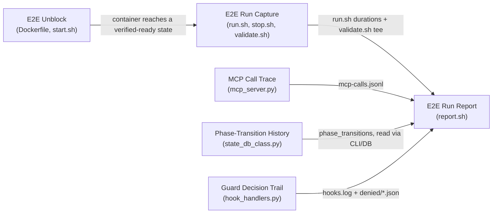
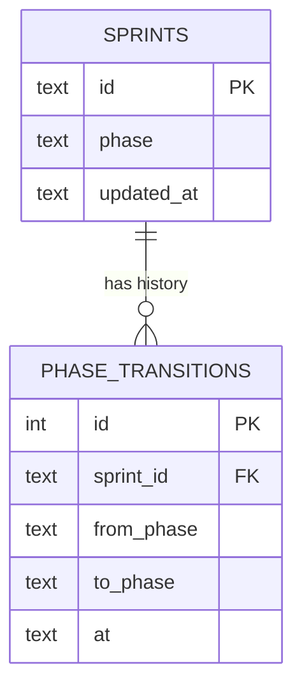

<!-- CLASI: Before changing code or making plans, review the SE process in CLAUDE.md -->

# Sprint 028: E2E instrumentation and unblock

## Goals

A full E2E run completes on a working auth path and leaves a
self-contained, machine-assembled run report. This is Phase 0 of the
three-sprint reliability arc from the comprehensive review
(`docs/reviews/2026-08-reliability/00-review.md`, Part 5): it is the
baseline measurement instrument the next two sprints depend on —
Phase 1 (fail-closed guards, `get_project()` root discovery) and
Phase 2 (single state-stage vocabulary, resumable `close_sprint`) both
need a before/after run report to validate against, and Phase 1's
guard replay tests need the real denial-payload corpus this sprint's
capture work produces. Nothing here changes guard or state-machine
behavior; this sprint only makes the E2E runnable and observable.

## Problem

Per the review's C13/C14 findings, the E2E currently cannot complete a
run on its default path — the CLI is unpinned in the Dockerfile, the
default `--auth=openrouter` path is dead (the CLI rejects every model
through the redirect), and `start.sh`'s readiness check is tmux-only,
so a dead model path is discovered 20 minutes into a run. Even a
successful run today leaves no replayable evidence: subject `claude -p`
sessions die with the container, `validate.sh` output goes to stdout
only, MCP calls have no durations or machine-readable trace, sprint
phase transitions carry no timestamps, and guard decisions log *what*
was decided but not *why* (denials leave no payload to replay). Without
this evidence, every later reliability fix in the campaign can only be
trusted, not measured.

## Solution

Six phase-0 issues, unblock-then-instrument:

1. `e2e-pin-cli-preflight-subscription-auth.md` — pin the CLI version,
   default `start.sh` to subscription auth, add an in-container
   preflight probe. This is the unblock: nothing else in this sprint
   is measurable until a run can complete.
2. `e2e-run-capture-and-artifact-collection.md` — `run.sh` wrapper
   capturing every subject exchange, plus container-log and session
   capture in `stop.sh`, into a per-run `.e2e-runs/<id>/` directory.
3. `mcp-call-trace-with-durations.md` — per-call duration logging and
   an `mcp-calls.jsonl` trace in the MCP server.
4. `sprint-phase-transition-history.md` — a `phase_transitions` table
   recording timestamped phase changes.
5. `guard-decision-trail-and-deny-payload-capture.md` — decision-trail
   tokens on every hooks.log line, and full-payload capture on every
   guard denial.
6. `e2e-single-run-report.md` — `report.sh` assembling all of the
   above into one self-contained `run-report.md` per run.

## Success Criteria

- One complete E2E run finishes on subscription auth from a clean
  image build, with the preflight probe passing before the subject
  session starts.
- That run's directory contains captured subject sessions, container
  logs, an `mcp-calls.jsonl` trace, phase-transition timestamps, and
  at least one guard denial payload (or a documented reason none
  occurred).
- `report.sh` produces a single `run-report.md` from that run
  directory, readable top to bottom with no other artifact needed.
- This run report becomes the recorded "before" baseline for Phase 1
  and Phase 2 of the arc.

## Scope

### In Scope

The six phase-0 issues listed under Solution above — all E2E harness,
MCP server logging, and state-DB instrumentation changes needed to
unblock a run and assemble its report. `e2e-single-run-report.md` is
last by construction: its own acceptance criteria declare it depends
on the outputs of the other five (run capture, MCP trace, phase
history, and guard decision trail all have to exist before there is
anything to assemble into a report), so ticket sequencing in Detail
Mode should preserve that order with the report-assembly ticket last.

### Out of Scope

- Fixing the OpenRouter auth path itself — stays parked in
  `clasi/issues/later/claude-cli-rejects-models-through-openrouter-redirect-in-e2e.md`
  per the review's Part 6 decision; this sprint routes around it via
  subscription auth instead.
- Phase 1 work (guard exception boundary, `get_project()` upward root
  discovery, `run_git(cwd=...)`, atomic frontmatter writes) — next
  sprint in the arc.
- Phase 2 work (single stage vocabulary, resumable `close_sprint`,
  impossible-predicate fixes) — third sprint in the arc.
- Any guard or state-machine behavior change — this sprint is
  observability-only; nothing it adds should change what a guard
  allows or denies.
- The coverage harness (`05-e2e-test-infra.md`'s instrumentation plan
  item 8: editable/local install under `COVERAGE_PROCESS_START`,
  `.coveragerc` with `parallel = true`, a combine step in `report.sh`,
  `[tool.coverage.paths]` remap, dropping the stale `role_guard.py`
  omit) — deliberately not one of the six phase-0 issues this sprint
  implements. It lives in
  `clasi/issues/later/test-system-improvements-real-app-coverage-from-the-e2e-a-leaner-faster-suite.md`
  as part of a broader test-system improvement effort, not this
  sprint's narrower unblock-then-instrument scope.

## Test Strategy

Each of the five instrumentation/unblock modules carries its own unit
tests, per its issue's explicit acceptance criteria; the sixth (report
assembly) is validated end-to-end since it has no independent logic to
unit test in isolation — it is a pure reader of the other five's output.

- **E2E Unblock**: no unit tests (shell script, not importable code);
  covered by the end-to-end validation below (preflight pass/fail is
  directly observable in a real run).
- **E2E Run Capture**: no unit tests; covered by the end-to-end
  validation below (run-directory contents are directly inspectable
  after a run).
- **MCP Call Trace**: unit test asserting the `mcp-calls.jsonl` record
  shape for one success and one failure (explicit acceptance criterion).
- **Sprint Phase-Transition History**: unit test(s) for the schema
  migration (additive, no manual step) and for `advance_phase` writing
  one history row per transition in the same DB transaction as the phase
  update; a test that `get_sprint_phase` (backed by
  `StateDB.get_sprint_state`) returns the transition list.
- **Guard Decision Trail**: unit tests asserting decision-token emission
  for at least one allow path and one deny path, and that a denial writes
  a payload file to `.clasi/log/denied/` (explicit acceptance criteria).
- **E2E Run Report**: no unit tests; covered by the end-to-end validation
  below.

**End-to-end validation** (the sprint's own success criterion): one
complete `start.sh` → driven session → `stop.sh` → `report.sh` run
driven from this sprint's own tree — not literal `master`, where none
of this sprint's instrumentation exists yet, but `start.sh`'s default
build path (`uv build --wheel` from the local working tree, per
`tests/e2e/start.sh`'s own header comment), run from the sprint-028
branch once all six tickets have landed on it. In effect: "master plus
Phase 0 instrumentation, before the Phase 1/2 fixes" — the recorded
baseline this sprint's Success Criteria section calls the "before"
measurement for Phase 1 and Phase 2, which have not touched the tree
yet at the point this run is taken. On subscription auth, from a clean
image build. Manual or tester-scripted, not a pytest-collected test.
Confirms: the preflight
probe passes; the run directory contains captured subject sessions,
container logs, `mcp-calls.jsonl`, phase-transition timestamps, and at
least one guard denial payload (or a documented reason none occurred);
`report.sh` produces a single, complete `run-report.md`. This run becomes
the recorded "before" baseline for Phase 1 and Phase 2 of the arc.

## Architecture

**Substantial** — this sprint touches 4+ modules and includes a
data-model change, both of which are independent substantial-tier
triggers on their own: the E2E test harness (`tests/e2e/` — Dockerfile,
`start.sh`, `stop.sh`, new `run.sh`, new `report.sh`, `validate.sh`,
`AGENTS.md` — treated as one cohesive unit for sizing purposes, per
sprint 023's precedent, since `tests/e2e/` is not one of the `sources:
[src/clasi]` subsystems this project's design-doc opt-in covers),
`src/clasi/mcp_server.py` (MCP call trace), `src/clasi/state_db_class.py`
(a new `phase_transitions` table — a data-model change by itself,
regardless of module count), `src/clasi/hook_handlers.py` (guard
decision-trail tokens and deny-payload capture), and a small
`src/clasi/tools/artifact_tools.py` change (`get_sprint_phase` exposes
the new phase history). That is both 3+ modules and a data-model
change.

This is worth stating plainly because the dispatching brief described the
sprint as compact ("touching shell scripts, mcp_server.py logging,
state_db_class.py schema, and hook_handlers.py logging, with NO behavior
changes to guards or process logic — instrumentation only"). That
framing is accurate about *behavior* — nothing here changes what a guard
allows or denies, what phase-advancement rules require, or how a subject
session behaves — but "no behavior change" is not the same test as "no
architectural impact." A new table and a new cross-cutting trace format
are structural additions regardless of whether they change decisions, so
this sprint is sized substantial, not compact, per the sizing rule's own
concrete signals rather than the intent behind the change.

Per this project's design-doc opt-in (`design_docs: enabled` in
`.clasi/config.yaml`), the `src/clasi`-side portion of this write-up
(modules 3-5 below) is additionally mirrored into this sprint's
`design/` overlay for the two affected canonical docs — root `DESIGN.md`
and `tools-DESIGN.md` — seeded via `seed_sprint_design_overlay`, edited,
diffed, and validated; see Impact on Existing Components below for the
manifest. The `tests/e2e/` portion (modules 1, 2, 6) is not mirrored,
following sprint 023's precedent: harness-only content has no covered
canonical doc to seed.

### 1. Understand the Problem

See Problem above. In short: the E2E cannot complete a run on its default
path today (unpinned CLI, a dead openrouter path, a tmux-only readiness
check that surfaces the dead path only after a full build —
`05-e2e-test-infra.md` finding 1), and even a successful run leaves no
replayable evidence (findings 2-3): subject sessions die with the
container, `validate.sh` output is stdout-only, MCP calls carry no
duration or machine-readable trace, sprint phase transitions carry no
timestamps, and guard denials leave no payload to replay
(`03-hooks-guards.md` recommendation 3, fail-open inventory #15 — zero
`plan_to_issue` events in 3,021 logged hook events because the plan
handlers never route through `_exit_hook`). The six linked issues are the
review's own instrumentation plan (`05-e2e-test-infra.md` items 1-7),
broken into implementable units, in the same unblock-then-instrument
order used under Solution above. Nothing in this sprint changes what a
guard allows or denies, what phase-advancement requires, or how a
subject session behaves — every change is either observational (logging,
capture, reporting) or a harness-level unblock (CLI pin, auth default,
preflight) that lets an already-intended path run at all.

### 2. Identify Responsibilities

1. **Unblock the E2E harness** — get a subject session onto a
   known-good, verified path before anything else is measurable (pin the
   CLI, default to subscription auth, preflight-probe before driving any
   milestone). Changes for a different reason than everything else below:
   this is "make the instrument work," not "add a channel to the
   instrument."
2. **Capture every subject exchange and run artifact** — durable,
   per-run evidence of what the harness actually did, independent of the
   container's lifetime.
3. **Trace MCP call durations and outcomes** — machine-readable timing
   and success/failure for every MCP tool call, inside the MCP server
   itself (applies to any session, not just E2E).
4. **Record sprint phase-transition history** — timestamped history of
   when a sprint entered each lifecycle phase, inside the state DB
   (applies to any sprint, not just E2E).
5. **Record why a guard decided what it decided, and preserve denial
   payloads** — decision-trail tokens on `hooks.log` lines and a
   replayable payload corpus for every denial, inside the hook handlers
   (applies to any hook invocation, not just E2E).
6. **Assemble one run report** — read everything (2)-(5) produced for one
   run and render it as a single markdown file.

(1) and (2) both live in `tests/e2e/`'s shell scripts but change for
different reasons and were filed as separate issues with separate
acceptance criteria, so they are separate modules below, sequenced by
dependency (1 before 2). (3), (4), and (5) each live in a different
`src/clasi` module, are useful independent of E2E, and change
independently of each other and of (1)/(2) — none of their acceptance
criteria references another. (6) depends on the *outputs* of (2)-(5) but
is implemented entirely in `tests/e2e/report.sh` and touches none of
their code, so it is its own module, last by construction (its own
issue file states this dependency explicitly).

### 3. Define Subsystems and Modules

1. **E2E Unblock** (`tests/e2e/Dockerfile`, `tests/e2e/start.sh`).
   Purpose: gets a subject session running on a known-good, verified
   auth path. Boundary: inside — CLI version pin, `--auth=subscription`
   default with an explicit openrouter opt-out flag and warning, the
   in-container preflight probe (`claude -p --max-turns 1 "Reply READY"`
   + `clasi --version`) and its abort-on-failure behavior. Outside —
   actually fixing the openrouter model-gate rejection (parked,
   out of scope), and run capture itself (module 2). Use case: SUC-001.
2. **E2E Run Capture** (new `tests/e2e/run.sh`, `tests/e2e/start.sh`
   [run-id/version/digest recording], `tests/e2e/stop.sh`,
   `tests/e2e/validate.sh`, `tests/e2e/AGENTS.md`). Purpose: records
   everything a driven session produced into a durable per-run directory.
   Boundary: inside — the `run.sh` wrapper and its per-milestone capture
   contract, `stop.sh`'s pre-removal container-log and session-directory
   capture, `validate.sh`'s tee-to-run-dir and host-path checks, the
   `AGENTS.md` mandate to use `run.sh` instead of raw `docker exec`.
   Outside — the preflight probe (module 1), report assembly (module 6).
   Use case: SUC-002.
3. **MCP Call Trace** (`src/clasi/mcp_server.py`). Purpose: records a
   machine-readable, timed trace of every MCP tool call. Boundary:
   inside — wrapping `_logged_call_tool`'s existing await in
   `time.monotonic()`, the duration appended to the existing human log
   line, one JSON line per call to `.clasi/log/mcp-calls.jsonl`. Outside
   — `hooks.log` (module 5, a different log for a different event kind),
   report assembly (module 6, a consumer, not a producer). Use case:
   SUC-003.
4. **Sprint Phase-Transition History** (`src/clasi/state_db_class.py`,
   `src/clasi/tools/artifact_tools.py`). Purpose: records when a sprint
   entered each lifecycle phase. Boundary: inside — the new
   `phase_transitions` table in `_SCHEMA`, the write inside
   `advance_phase` (same transaction as the `sprints.phase` update), and
   exposing the history through `get_sprint_phase`
   (`StateDB.get_sprint_state`) — corrected during ticketing from an
   earlier draft that named `detail_sprint`/`get_sprint_status`, neither
   of which actually reads DB phase state; see ticket 004 for the
   verified call chain.
   Outside — gate recording, ticket lifecycle, any other DB table.
   Use case: SUC-004.
5. **Guard Decision Trail** (`src/clasi/hook_handlers.py`). Purpose:
   records why a guard reached its decision, preserving denial payloads
   for replay. Boundary: inside — the per-invocation `decisions:
   list[str]` handlers append to, `_exit_hook`/`_log_hook_event` emitting
   those as trailing tokens on the existing `hooks.log` line, dumping the
   full payload to `.clasi/log/denied/<ts>-<hook>.json` on `exit_code ==
   2` or a guard-internal exception, and routing `handle_plan_to_issue`/
   `handle_codex_plan_to_issue` through `_exit_hook` so plan-mode events
   log at all. Outside — the guard decision logic itself (unchanged by this
   sprint, by design), MCP call tracing (module 3). Use case: SUC-005.
6. **E2E Run Report** (new `tests/e2e/report.sh`). Purpose: assembles one
   run's scattered evidence into a single readable report. Boundary:
   inside — reading `validate.sh`'s tee'd output, `run.sh`'s
   per-milestone durations/exit codes, phase timings, `mcp-calls.jsonl`'s
   top-N slowest calls and all failures, `hooks.log`'s deny count and
   reasons histogram, the dispatch-log inventory from `.clasi/log/NNN-
   *.md` frontmatter, and a scan of `mcp-server.log` for `input_value={}`
   validation-error signatures; writing the single `run-report.md`.
   Outside — producing any of that underlying data (modules 2-5 already
   do that); `validate.sh`'s own checks (stays a pure checker, per its
   issue's explicit note). Use case: SUC-006.

### 4. Diagrams

**Component diagram** — included: report.sh is a new composition point
that fans in from four independent producers, which is exactly the kind
of new cross-module composition the sizing rule's diagram trigger is
for.

**Entity-relationship diagram** — included, because the data model
changes (new `phase_transitions` table):

**Dependency graph** — omitted. The only structural relationships this
sprint introduces are the Unblock-before-Capture sequencing and Report's
fan-in read of file/DB outputs, both already shown in the component
diagram above. No module's Python import graph changes: `run.sh` and
`report.sh` are new shell scripts, not new `src/clasi` imports, and the
MCP-trace/phase-history/decision-trail changes are all internal to their
existing modules — none of them starts importing another.

### 5. What Changed / Why / Impact / Migration Concerns

**What Changed**

- `tests/e2e/Dockerfile`: pin `@anthropic-ai/claude-code` to a known-good
  version instead of `npm install -g` unpinned.
- `tests/e2e/start.sh`: `--auth` defaults to `subscription`; openrouter
  stays available behind an explicit flag with a warning referencing the
  parked issue; after the container reaches its tmux-ready state, run an
  in-container preflight (`claude -p --max-turns 1 "Reply READY"` +
  `clasi --version`), write results to the run directory, abort loudly on
  failure; mint the run id and record `claude --version`, `clasi
  --version`, and the image digest into the run directory.
- New `tests/e2e/run.sh`: wrapper the tester uses instead of raw `docker
  exec`; each call writes
  `.e2e-runs/<run-id>/<NN>-<slug>/{prompt.txt, output.jsonl, exit-code,
  duration}` using `--output-format stream-json --verbose`.
- `tests/e2e/stop.sh`: before removing the container, save `docker logs`
  and copy the subject's `~/.claude/projects` session directory into the
  run dir.
- `tests/e2e/validate.sh`: tee output into the run directory; read host
  paths where possible so checks work after the container is gone.
- `tests/e2e/AGENTS.md`: mandate `run.sh` for all subject sessions.
- New `tests/e2e/report.sh`: assembles `.e2e-runs/<run-id>/run-report.md`
  from the sources listed in module 6 above; `validate.sh` stays a pure
  checker.
- `src/clasi/mcp_server.py`: `_logged_call_tool` wraps the await in
  `time.monotonic()`, logs `OK name (NNNms)`, and appends one JSON line
  per call to `.clasi/log/mcp-calls.jsonl` (`ts, agent, tool, args, ok,
  ms, result_len`).
- `src/clasi/state_db_class.py`: `_SCHEMA` gains `phase_transitions
  (sprint_id, from_phase, to_phase, at)`; `advance_phase` (and any other
  phase writer) writes one history row in the same transaction as the
  phase update.
- `src/clasi/tools/artifact_tools.py`: `get_sprint_phase` (via
  `StateDB.get_sprint_state`) exposes the transition list with
  timestamps.
- `src/clasi/hook_handlers.py`: `_exit_hook`/`_log_hook_event` gain a
  per-invocation `decisions: list[str]` that handlers append to
  (`tier=2(db)`, `match=clasi/issues/`, `gate=ticket-state:skipped(db-
  error)`, `missing=[file_path]`, etc.), emitted as trailing tokens on
  the existing `hooks.log` line; on `exit_code == 2` or a guard-internal
  exception, the full hook payload is dumped to
  `.clasi/log/denied/<ts>-<hook>.json`; `handle_plan_to_issue` and
  `handle_codex_plan_to_issue` are routed through `_exit_hook` so
  plan-mode events log at all.

**Why**

Per the Problem section: the review's C13/C14 findings mean the E2E
cannot complete a run today, and even a successful run leaves no
replayable evidence. This sprint is Phase 0 of the reliability arc — the
baseline measurement instrument Phase 1 (fail-closed guards, `get_
project()` root discovery) and Phase 2 (single state-stage vocabulary,
resumable `close_sprint`) both validate against, and Phase 1's guard
replay tests consume the real denial-payload corpus module 5 produces.

**Impact on Existing Components**

- `mcp_server.py`'s `_logged_call_tool`: additive wrap around the
  existing await; the existing `CALL`/`OK`/`FAIL` log lines are
  unchanged except for the appended duration. No signature change.
- `hook_handlers.py`'s `_exit_hook`/`_log_hook_event`: gain an optional
  `decisions` parameter; existing callers that don't pass it behave
  exactly as before (empty token list, unchanged log line shape apart
  from the trailing space). No guard decision logic changes — every
  existing allow/deny outcome is preserved bit-for-bit; only what gets
  logged about that outcome changes.
- `state_db_class.py`: additive schema (`CREATE TABLE IF NOT EXISTS
  phase_transitions`); no existing table or row is touched.
- `artifact_tools.py`'s `get_sprint_phase` (`StateDB.get_sprint_state`):
  gains a new field in an already dict-shaped return; backward
  compatible for any caller reading existing fields.
- `tests/e2e/*`: test-infra only; no production code path is affected,
  and `tests/e2e` is excluded from `protected_paths`/role-guard scope
  already (`.clasi/config.yaml`'s `excluded_paths: [tests/e2e]`).
- Canonical design docs: this write-up's modules 3-5 (all inside
  `src/clasi`) are mirrored into
  `clasi/sprints/028-e2e-instrumentation-and-unblock/design/{DESIGN.md,
  tools-DESIGN.md}` as "As of sprint 028, ..." additions to the existing
  narrative — the same append-only convention sprints 026 and 027 used
  on the same two docs. Modules 1, 2, 6 (`tests/e2e/`) are not mirrored;
  no canonical doc covers that tree (sprint 023's precedent).

**Migration Concerns**

- The `phase_transitions` schema migration is additive
  (`CREATE TABLE IF NOT EXISTS`) — existing project databases gain the
  table automatically on next `init()`, no manual step, per the issue's
  explicit acceptance criterion. No backfill of historical transitions:
  sprints that completed phases before this sprint lands have no
  retroactive history (see Open Questions).
- `.e2e-runs/` (new, under the already-gitignored `tests/e2e/e2e-project/`
  tree) and `.clasi/log/denied/`/`.clasi/log/mcp-calls.jsonl` (new,
  under the already-gitignored `.clasi/log/` tree via the existing
  `_ensure_log_gitignore` mechanism) need no new gitignore engineering —
  both reuse an existing auto-gitignore pattern rather than introducing
  one.
- No deployment sequencing concern: this is a single-process sqlite
  schema plus code changes bundled in one package release; there is no
  running service to sequence a migration against.

### 6. Design Rationale

**Decision: default E2E auth to subscription instead of fixing
OpenRouter now.**
Context: the openrouter model-gate rejects every model through the
base-URL redirect (parked issue
`claude-cli-rejects-models-through-openrouter-redirect-in-e2e.md`).
Alternatives considered: (a) fix the openrouter redirect now, (b) block
this sprint on that fix, (c) route around it via subscription auth.
Why this choice: (c) unblocks the baseline run immediately without
absorbing an orthogonal CLI-behavior investigation into this sprint's
scope; the review's Part 6 decision already made this call. Consequences:
subscription auth requires a host with a logged-in Claude Code session
(Keychain or credentials file) — a headless/CI environment without one
cannot run the E2E until openrouter is fixed or another auth path is
added (flagged as Open Question 3, not a defect of this sprint).

**Decision: `report.sh` aggregates from already-materialized files/DB,
not a live query service.**
Context: run evidence is scattered across host-mounted directories, the
sqlite state DB, and container-only paths that die with `docker rm`.
Alternatives considered: (a) a dedicated reporting service or new MCP
tool, (b) a shell script reading already-materialized artifacts. Why
this choice: (b) matches the existing pattern (`validate.sh` already
reads host-mounted paths); avoids standing up a new long-lived service
for a one-shot post-run aggregation step; keeps report.sh a pure
consumer that cannot itself affect process state, preserving this
sprint's "no behavior change" boundary by construction rather than by
convention. Consequences: the implementing ticket must choose how
`report.sh` reads phase-transition history — direct sqlite read via
`StateDB`, or a shell-out to a `clasi` CLI command — both satisfy the
acceptance criteria; recommended in Open Questions below.

**Decision: decision-trail tokens are additive trailing strings on the
existing `hooks.log` line, not a structured/JSON reformat.**
Context: `hooks.log` is a stable, splittable single-line-per-event
format. Alternatives considered: (a) reformat each line as structured
JSON, (b) append free-form trailing tokens to the existing line. Why
this choice: (b) is what the issue and the review's recommendation 3
both specify ("trailing tokens on the existing hooks.log line"); it is a
minimal diff, and any line with no tokens (a caller that hasn't been
updated yet) parses exactly as it did before. Consequences: the token
vocabulary is informal (free-form `key=value` strings) rather than a
fixed schema — acceptable because `report.sh`'s consumption is a deny
count and a reasons histogram, not a strict per-token parse; a future
phase could formalize this if a consumer needs it.

### 7. Open Questions

1. Should `report.sh` read phase-transition history via a `clasi` CLI
   subcommand, a direct sqlite read through `StateDB`, or a new
   lightweight query helper? All three satisfy the acceptance criteria.
   Recommendation: direct sqlite read via `StateDB`, to avoid spinning up
   an MCP client from a shell script — but this is an implementation
   choice for the ticketing/execution phase, not one this architecture
   needs to force.
2. Historical sprints (pre-028) have no `phase_transitions` rows — is a
   backfill from existing `updated_at` timestamps wanted, or is "history
   starts now" acceptable? Recommendation: the latter. A backfill would
   fabricate per-phase timestamps from a single `updated_at` value (only
   one timestamp exists per sprint today, not one per phase), which is
   worse than an honest gap.
3. `--auth=subscription` requires a logged-in host Claude Code session —
   this makes the E2E unrunnable in a headless/CI environment. Matches
   today's manual-run reality and is explicitly out of scope for this
   sprint, but should be flagged for whoever eventually wants CI-driven
   E2E runs.
4. The decision-trail token vocabulary (`tier=2(db)`,
   `gate=ticket-state:skipped(db-error)`, etc.) is informal and expected
   to grow organically as handlers are extended — should a fixed prefix
   set be enumerated now instead? Recommendation: no; `report.sh`'s own
   consumption (a count and a histogram over the `reason` field) doesn't
   need one, and premature enumeration risks under-covering the real
   decision space this sprint hasn't fully inventoried.
5. `src/clasi/DESIGN.md` and `tools-DESIGN.md` have now accumulated three
   consecutive "As of sprint NNN, ..." append-only paragraphs each
   (026, 027, and this sprint). Worth flagging for `consolidate-
   architecture` attention at some point, not blocking this sprint: an
   append-only doc that never folds its own history back into prose
   eventually reads as a changelog rather than a design doc.

## Use Cases

### SUC-001: Tester reaches a verified-ready subject session
Parent: UC — E2E validation

- **Actor**: E2E tester (human or scripted driver of the container)
- **Preconditions**: image built with the pinned CLI version; for
  `--auth=subscription` (the new default), the host has a logged-in
  Claude Code session (Keychain or credentials file)
- **Main Flow**:
  1. `start.sh` builds the image with a pinned `@anthropic-ai/claude-code`
     version
  2. `start.sh` launches the container defaulting to `--auth=subscription`
     (openrouter stays available behind an explicit flag with a warning)
  3. After the container reaches its tmux-ready state, `start.sh` runs an
     in-container preflight: `claude -p --max-turns 1 "Reply READY"` and
     `clasi --version`
  4. Preflight output is written to the run directory
  5. On preflight failure, `start.sh` aborts loudly rather than leaving
     the tester to discover a dead auth path 20 minutes into milestone 1
- **Postconditions**: the tester knows, before driving any milestone,
  that the auth path and CLI are both functional
- **Acceptance Criteria**:
  - [ ] Dockerfile pins a known-good `@anthropic-ai/claude-code` version
  - [ ] `start.sh` defaults to `--auth=subscription`; openrouter remains
        available behind an explicit flag with a warning referencing the
        parked issue
  - [ ] `start.sh` runs the preflight after container start and writes
        results to the run directory
  - [ ] Preflight failure aborts the run loudly

### SUC-002: Developer reconstructs a run after the container is gone
Parent: UC — E2E validation

- **Actor**: developer diagnosing a completed or failed E2E run
- **Preconditions**: the run was driven via `run.sh`, not raw `docker
  exec`
- **Main Flow**:
  1. Each `run.sh` call writes
     `.e2e-runs/<run-id>/<NN>-<slug>/{prompt.txt, output.jsonl,
     exit-code, duration}` using `--output-format stream-json --verbose`
  2. `start.sh` mints the run id and records `claude --version`, `clasi
     --version`, and the image digest into the run directory
  3. Before `stop.sh` removes the container, it saves `docker logs` and
     copies the subject's `~/.claude/projects` session directory into
     the run dir
  4. `validate.sh` output is tee'd into the run directory, and its
     checks read host paths where possible
- **Postconditions**: the run directory alone — no running container
  needed — reconstructs every subject exchange, the container's own log,
  and the validation result
- **Acceptance Criteria**:
  - [ ] `run.sh` wrapper exists and is used instead of raw `docker exec`
  - [ ] `start.sh` records run id, versions, and image digest
  - [ ] `stop.sh` saves container logs and session directory before
        removing the container
  - [ ] `AGENTS.md` mandates `run.sh` for all subject sessions
  - [ ] `validate.sh` output is tee'd into the run directory and checks
        read host paths

### SUC-003: Developer finds the slowest or failing MCP call in a run
Parent: UC — Observability

- **Actor**: developer, or `report.sh` on their behalf, analyzing a run
  or a live session
- **Preconditions**: the MCP server is running with the updated
  `_logged_call_tool`
- **Main Flow**:
  1. Every MCP tool call is timed with `time.monotonic()`
  2. The human-readable `mcp-server.log` line includes the duration
     (`OK name (NNNms)`)
  3. One JSON line is appended to `.clasi/log/mcp-calls.jsonl` per call,
     with `ts, agent, tool, args, ok, ms, result_len`
- **Postconditions**: calls can be ranked by duration and every failure
  isolated without re-running anything
- **Acceptance Criteria**:
  - [ ] Every MCP tool call appends one JSONL record with the fields
        above
  - [ ] The human-readable log line includes the duration
  - [ ] The JSONL file is covered by the existing log-dir gitignore
        mechanism
  - [ ] A unit test asserts the record shape for one success and one
        failure

### SUC-004: Stakeholder sees how long a sprint spent in each phase
Parent: UC — Observability / Sprint planning

- **Actor**: stakeholder, team-lead, or sprint-planner reviewing sprint
  pacing
- **Preconditions**: the sprint has advanced through at least one phase
  transition since this sprint's schema migration
- **Main Flow**:
  1. `advance_phase` writes a `phase_transitions` row (`sprint_id,
     from_phase, to_phase, at`) in the same transaction as the
     `sprints.phase` update
  2. `get_sprint_phase` (`StateDB.get_sprint_state`) returns the
     transition list with timestamps
- **Postconditions**: per-phase wall time is computable from the
  returned history without querying the DB directly
- **Acceptance Criteria**:
  - [ ] Every phase change writes one history row in the same
        transaction as the phase update
  - [ ] `get_sprint_phase` (backed by `StateDB.get_sprint_state`)
        returns the transition list with timestamps
  - [ ] Schema migration is additive; existing databases gain the table
        with no manual step

### SUC-005: Developer learns why a guard denied an action, and can replay it
Parent: UC — Observability / Enforcement

- **Actor**: developer investigating a guard denial, or a future Phase 1
  replay test
- **Preconditions**: a guard handler ran (allow or deny), or a plan-mode
  handler ran
- **Main Flow**:
  1. Handlers append decision tokens (`tier=2(db)`, `match=clasi/
     issues/`, `gate=ticket-state:skipped(db-error)`,
     `missing=[file_path]`, etc.) to a per-invocation `decisions:
     list[str]`
  2. `_exit_hook` emits those tokens as trailing fields on the existing
     `hooks.log` line
  3. On `exit_code == 2` (or a guard-internal exception), the full hook
     payload is dumped to `.clasi/log/denied/<ts>-<hook>.json`
  4. `handle_plan_to_issue` and `handle_codex_plan_to_issue` are routed
     through `_exit_hook` so plan-mode events appear in `hooks.log` at
     all
- **Postconditions**: every denial leaves a replayable payload; every
  guard log line explains itself
- **Acceptance Criteria**:
  - [ ] Every guard decision line carries the decision tokens that
        produced it
  - [ ] Every denial leaves a replayable payload file
  - [ ] Plan-to-issue events appear in `hooks.log`
  - [ ] Tests assert token emission for at least one allow and one deny
        path

### SUC-006: Tester reads one report and knows what happened in a run
Parent: UC — E2E validation

- **Actor**: E2E tester, after a run completes (successfully or not)
- **Preconditions**: SUC-002 through SUC-005's outputs all exist for the
  run (run capture, `mcp-calls.jsonl`, phase-transition history,
  `hooks.log` + `denied/` payloads)
- **Main Flow**:
  1. Tester runs `report.sh <run-id>`
  2. `report.sh` assembles `.e2e-runs/<run-id>/run-report.md` from:
     `validate.sh` output, `run.sh` per-milestone durations/exit codes,
     phase timings, `mcp-calls.jsonl`'s top-N slowest calls and all
     failures, `hooks.log`'s deny count and reasons histogram, the
     dispatch inventory from `.clasi/log/NNN-*.md` frontmatter
     durations, and a scan of `mcp-server.log` for `input_value={}`
     validation-error signatures
- **Postconditions**: one markdown file, readable top to bottom, is the
  complete evidence record for the run — no other artifact needed
- **Acceptance Criteria**:
  - [ ] One command produces the report from a finished run's directory
  - [ ] The report is self-contained markdown a human can read top to
        bottom
  - [ ] Depends on: e2e-run-capture-and-artifact-collection,
        mcp-call-trace-with-durations, sprint-phase-transition-history,
        guard-decision-trail-and-deny-payload-capture (all land first)

## GitHub Issues

(GitHub issues linked to this sprint's tickets. Format: `owner/repo#N`.)

## Definition of Ready

Before tickets can be created, all of the following must be true:

- [ ] Sprint planning document is complete (sprint.md, including its
      Architecture and Use Cases sections)
- [ ] Architecture review passed (or skipped, for changes with no
      architectural impact)
- [ ] Stakeholder has approved the sprint plan

## Tickets

| # | Title | Depends On | Issue |
|---|-------|------------|-------|
| 001 | E2E unblock: pin CLI, subscription-auth default, preflight probe | — | `e2e-pin-cli-preflight-subscription-auth.md` |
| 002 | E2E run capture: run.sh, stop.sh, validate.sh tee | 001 | `e2e-run-capture-and-artifact-collection.md` |
| 003 | MCP call trace with durations | — | `mcp-call-trace-with-durations.md` |
| 004 | Sprint phase-transition history | — | `sprint-phase-transition-history.md` |
| 005 | Guard decision trail and deny-payload capture | — | `guard-decision-trail-and-deny-payload-capture.md` |
| 006 | E2E single run report | 002, 003, 004, 005 | `e2e-single-run-report.md` |

Tickets execute serially in the order listed. 003, 004, and 005 have no
dependency on each other or on 001/002 and could in principle run in any
relative order within that constraint, but this sprint is not opted into
parallel worktree execution (`worktree: false` in frontmatter), so they
still execute one at a time, in the numbered order above.
