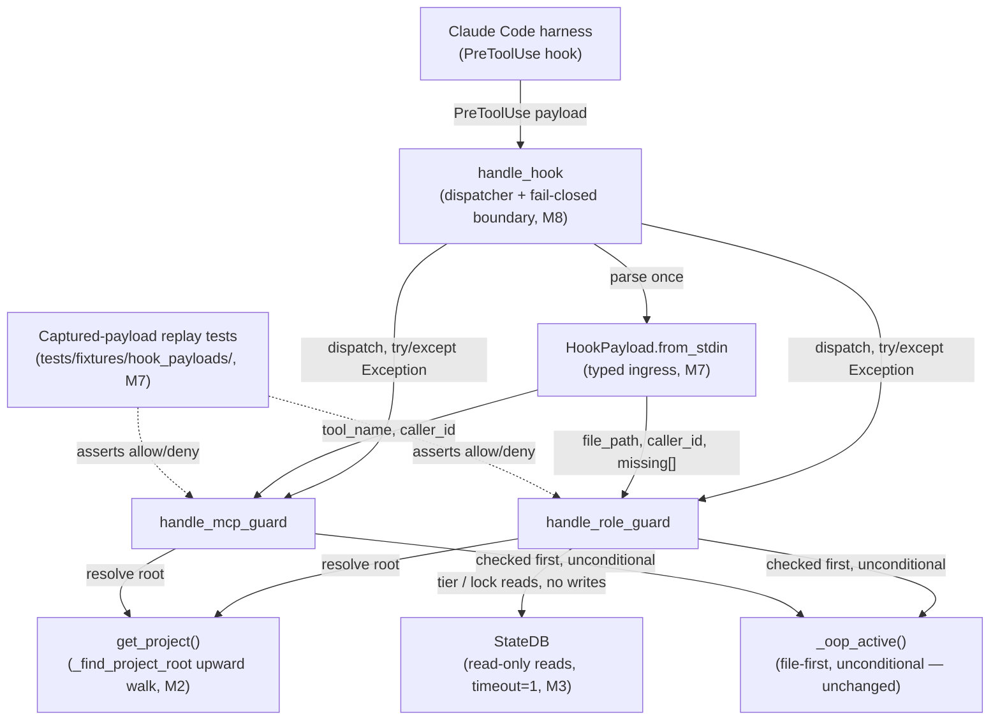
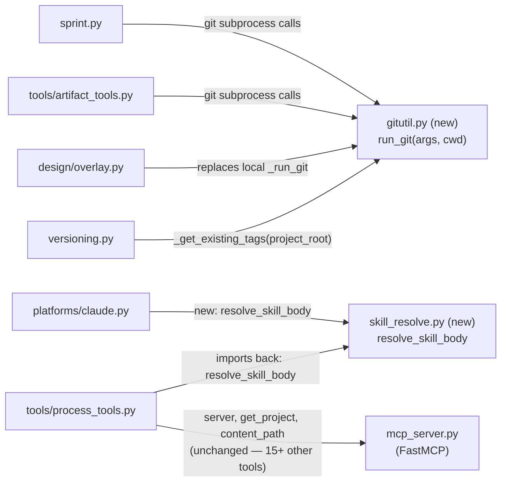

<!-- CLASI: Before changing code or making plans, review the SE process in CLAUDE.md -->

# Sprint 029: Fail closed and resolve roots

## Goals

No guard failure is ever a silent allow, and nothing in the hook or
tools layer depends on the process's working directory. This is Phase
1 of the three-sprint reliability arc from the comprehensive review
(`docs/reviews/2026-08-reliability/00-review.md`, Part 5): sprint 028
built the instrumented E2E and started capturing a real deny-payload
corpus; this sprint spends that instrument on the two highest-leverage
root causes (RC-2 "failure is silent," RC-3 "everything trusts cwd")
before Phase 2 touches state vocabulary. The review estimates the
headline fixes at under 200 lines total across the five changes below
— small, surgical diffs, not a rewrite.

## Problem

Per the review's C1/C2/C6 findings (and the RC-2/RC-3 root-cause
sections): the Claude Code harness only blocks a tool call on hook
exit code 2, so any crash, timeout, or spawn failure inside a CLASI
guard is an unlogged **allow** — `hooks.log` already shows 876 events
from a stretch when role-guard ran fail-open unnoticed. Separately,
`get_project()` is `Project(Path.cwd())` with no upward search for
`.clasi/`, so a hook fired from a subdirectory resolves every path
against the wrong root; because every DB **read** auto-creates a
fresh schema'd database at whatever path it's handed, the wrong root
gets a phantom DB where the OOP flag is off, the lock is invisible,
and the agent tier is unset — guards fail open with benign-looking
logs. The same cwd trust runs through the tools layer (most git
subprocesses spawn with no `cwd=`, relative artifact paths resolve
against the server process's directory) and through staleness
detection (`check_staleness` cannot see same-version drift — the exact
gap noted in project memory). Frontmatter parsing is not line-anchored
and writes are not atomic, so a crash mid-write corrupts a sprint or
ticket file and `list_sprints` silently drops it. None of this is
theoretical: sprint 028's guard-decision-trail work starts capturing
real deny payloads specifically so this sprint's fixes can be tested
against genuine data instead of hand-written fixtures.

## Solution

Nine issues (seven from the original Phase-1 plan, plus two discovered
mid-planning by the sprint-028 baseline E2E shakedown — see the
Architecture section's revision note for how and why). Listed here in
their original discovery grouping; **execution order in the Tickets
table below differs** — the exception-boundary issue (1 below) is
deliberately sequenced *last*, not first, once this repo's own
dogfooding is accounted for (see Architecture Design Rationale):

0. `mcp-2-breaks-every-fresh-install.md` — cap the unbounded `mcp`
   dependency below 2.0 and decouple `clasi init` from the MCP server
   import chain, so a fresh install doesn't crash before anything else
   in this sprint can be validated. Discovered by, and blocking, the
   sprint-028 baseline E2E run.
1. `guard-fail-closed-exception-boundary.md` — exception boundary in
   `handle_hook`: any guard crash becomes exit 2 plus a `guard-crash`
   log line, instead of falling through to an allow.
2. `get-project-has-no-upward-root-discovery.md` — `get_project()`
   walks upward via `_find_project_root` to find `.clasi/`, so a hook
   fired from any subdirectory resolves the correct project root.
3. `state-db-reads-stop-creating-databases.md` — DB reads stop
   creating databases as a side effect; SQLite opens with a short
   `timeout=1` so contention fails fast and visibly instead of eating
   a guard's latency budget.
4. `root-anchored-git-and-artifact-paths.md` — one `run_git(args,
   cwd=project.root)` helper used across the tools layer and
   `sprint.py`, plus root-anchored artifact path resolution; commits
   use explicit pathspecs instead of bare `git commit -m`.
5. `atomic-line-anchored-frontmatter-io.md` — frontmatter reads become
   line-anchored and writes become atomic (write-temp-then-rename), so
   a crash mid-write can no longer corrupt a sprint or ticket file.
6. `staleness-detect-same-version-drift.md` — an mtime-vs-import-time
   check in `check_staleness` closes the same-version-drift gap (a
   long-lived MCP process can hold pre-fix code in memory with no
   version-string change to detect it by).
7. `hook-payload-typed-ingress-and-replay-corpus.md` — replay the deny
   payloads sprint 028's guard-decision-trail capture starts writing,
   as tests that assert the deny path fires on real, previously-seen
   malformed payloads rather than synthetic ones.
8. `stop-sh-teardown-gated-on-run-id.md` — `stop.sh` always tears down
   (container removal, staged-credential deletion) even when no run id
   resolves; only the capture half is skipped. Discovered in the same
   baseline shakedown, immediately after the mcp-2.0 crash.

## Success Criteria

- A guard crash produces exit 2 and a `guard-crash` log line — no
  crash path returns an allow.
- `get_project()` resolves the correct `.clasi/` root when invoked
  from a subdirectory of the project.
- A DB read against a path with no existing database does not create
  one; only an explicit write path does.
- Git subprocesses in the tools layer and `sprint.py` run with
  `cwd=project.root`; artifact paths resolve against the project root
  regardless of the server process's own working directory.
- A crash mid-frontmatter-write leaves the prior valid content intact
  (no partial-write corruption), and frontmatter parsing tolerates
  content that isn't perfectly formatted.
- `check_staleness` flags a same-version drift case (source changed,
  version string unchanged) that it currently misses.
- At least one replay test asserts a deny decision against a real
  payload captured by sprint 028's corpus.
- The E2E guard-probe, subdirectory-cwd, and stale-server scenarios
  all pass under the instrumented run from sprint 028.
- The diff stays small and surgical — the review's under-200-line
  estimate for the headline fixes is a useful sanity check, not a hard
  cap to engineer toward.
- `clasi init` succeeds from a fresh dependency resolve (no reliance on
  this repo's own `uv.lock` pin).
- `./tests/e2e/stop.sh` leaves no container and no staged credential
  file behind, even when it cannot resolve a run id.

## Scope

### In Scope

The nine phase-1 issues listed under Solution above — the guard
exception boundary, upward root discovery, DB-read side-effect
removal, root-anchored git/artifact paths, atomic frontmatter I/O,
same-version staleness detection, the deny-payload replay corpus, and
the two issues discovered mid-planning by the sprint-028 baseline E2E
shakedown (the `mcp` 2.0 install crash and `stop.sh`'s gated teardown).

### Out of Scope

- Phase 2 of the arc (single sprint-stage vocabulary, resumable
  `close_sprint`, the impossible-predicate fixes) — third sprint,
  planned separately.
- Phase 3 (gate-order fix, tier-0 relaxation, doc/process
  consolidation) and Phases 4-5 (deletion, decomposition, test-suite
  activation) — later, per the review's Part 5 sequencing; this sprint
  does not touch process docs or delete dead code.
- Any change to what a guard's *policy* allows or denies — this
  sprint changes what happens when a guard **fails**, not the
  decisions a healthy guard makes.
- The OpenRouter E2E auth path — stays parked in
  `clasi/issues/later/claude-cli-rejects-models-through-openrouter-redirect-in-e2e.md`
  per the review's Part 6 decision.

## Test Strategy

(To be detailed when this sprint is promoted to Detail Mode. At a
minimum: unit tests for the `handle_hook` exception boundary and
`_find_project_root` walking from nested subdirectories; a DB-read
test asserting no file is created at a fresh path; replay tests over
sprint 028's captured deny-payload corpus. Primary validation is the
instrumented E2E from sprint 028: guard-probe scenario — a malformed
payload denies rather than allows; subdirectory-cwd scenario — a hook
fired from a subdirectory resolves the real project root; stale-server
scenario — the new mtime drift signal trips.)

## Architecture

**Substantial** — nine modules touched (see Step 3), including two new
shared leaf modules (`gitutil.py`, `skill_resolve.py`) that introduce
real new cross-module dependencies, and a deliberate reordering of the
enforcement chain's own failure behavior. No data-model change (every DB
schema, frontmatter schema, and file format touched below is read/written
the same way it always was — only side effects and failure behavior
change), which is why no entity-relationship diagram appears, but module
count and new dependencies alone clear the substantial-tier bar on their
own.

**Revision note**: this section originally covered the seven issues named
in the roadmap-phase Solution list above. Two additional issues surfaced
during planning from the sprint-028 baseline E2E shakedown — the very
first attempt to run the instrumented E2E crashed before any of this
sprint's own validation could run at all — and were linked to this sprint
mid-planning: `mcp-2-breaks-every-fresh-install.md` (P0: `clasi init`
crashes on any fresh dependency resolve) and
`stop-sh-teardown-gated-on-run-id.md` (a failed early run leaves a
container and staged OAuth credentials on disk with no cleanup path).
Both are folded in below as modules M0 and M1 and tickets 001-002 — see
Design Rationale for why they belong in this sprint rather than as
separate hotfixes. The Problem/Solution/Scope/Success-Criteria sections
above are updated to match (nine issues, not seven); this note records
the mid-planning change per the architecture-authoring skill's revision
convention rather than silently rewriting history.

### 1. Understand the Problem

See Problem above, plus the revision note. In short: two independent root
causes make CLASI's enforcement chain unsafe to trust — RC-2, a guard
crash is a silent allow, and RC-3, every guard trusts the process's
working directory, which cascades into phantom databases, wrong git
targets, and unreachable artifact paths. Frontmatter I/O can corrupt a
file on a crash mid-write, and staleness detection cannot see the most
common real drift (same-version, source-changed). Sprint 028 built the
instrument (decision-trail tokens, deny-payload capture, MCP/phase
tracing) this sprint spends to convert failure from silent to loud. The
first attempt to use that instrument — the sprint-028 baseline run —
immediately surfaced two more defects of the identical shape (a crash
that blocks all further validation, a cleanup path that silently does
nothing on the exact failure it exists to handle), which is why they are
folded into this sprint rather than deferred: fixing the campaign's own
measurement instrument is a precondition for trusting every other change
below.

**The one fact that changes how this sprint must be sequenced**: this
repo dogfoods its own enforcement. `handle_role_guard`/`handle_mcp_guard`
gate every `Edit`/`Write`/`MultiEdit` call any agent — including the
agents implementing this sprint's own tickets — makes against this
repo's own source. Converting a guard crash from a silent allow into a
hard `exit 2` (module M8) means that any *currently-latent* bug in the
guard chain — one that has always been there, silently allowing, unnoticed
— will, the moment M8 lands, start hard-blocking ordinary work, possibly
including the work needed to fix it. This is not hypothetical: the
876-event historical precedent cited in Problem above is exactly this
class of latent bug. Every module-ordering decision in Step 3 and the
sequencing Decision in Design Rationale exists because of this one fact.

### 2. Identify Responsibilities

Nine responsibilities, each changing for an independent reason:

0. **Keep the install path importable** — `clasi init` must not crash
   before any of the other eight responsibilities can even be validated.
   Discovered mid-sprint; a hard precondition, not a "fix," for
   everything below.
1. **Keep the E2E harness's own teardown reliable** — cleanup after a
   failed run must not itself depend on the thing that failed. Also
   discovered mid-sprint, also a precondition for trusting this sprint's
   own validation loop, but independent of responsibility 0 (a shell
   script vs. a Python import chain) and of every `src/clasi` change
   below.
2. **Resolve the real project root from any cwd** — every other hook
   handler's correctness depends on this; changes because the discovery
   walk was never implemented, not because it was implemented wrong.
3. **Answer a state-DB read without a side-effecting write** — changes
   because reads and writes were never separated, not because either is
   individually wrong.
4. **Anchor every tools-layer filesystem operation to the project root**
   — git subprocesses, artifact paths, and version-tag lookups each
   currently trust the server process's cwd independently; they change
   together because they share one fix (root-anchoring), not because
   they are one component.
5. **Guarantee atomic, line-anchored frontmatter I/O** — changes because
   the parser and writer were never hardened against a `---` inside a
   value or a crash mid-write, not because the frontmatter format itself
   is wrong.
6. **Detect same-version source drift** — changes because no existing
   signal covers this case, not because an existing signal is broken.
7. **Parse a hook payload once, into one typed shape, and prove it
   against real captured payloads** — changes because six handlers
   currently hand-roll their own extraction (drifting once already), not
   because any one extraction is currently wrong.
8. **Convert a guard crash from a silent allow into a logged, blocking
   exit** — changes because no exception boundary exists, not because
   the existing boundary is wrong. Deliberately the *last* responsibility
   in execution order despite being first in the original roadmap list —
   see Design Rationale.

Responsibilities 2-8 are the review's RC-2/RC-3 root-cause work (the
sprint's original seven issues); 0 and 1 are the mid-sprint additions.
None of the nine needs to move to a different module to be fixed — the
fix in every case is correctness within the responsibility's existing
home, plus two new shared leaf modules (`gitutil.py` for responsibility
4, `skill_resolve.py` for responsibility 0) that did not exist before.

### 3. Define Subsystems and Modules

**M0 — Install-path dependency safety** (`pyproject.toml`, new
`src/clasi/skill_resolve.py`, `src/clasi/tools/process_tools.py`,
`src/clasi/platforms/claude.py`)
- **Purpose**: Keep `clasi init` importable without pulling in the MCP
  server.
- **Boundary**: Inside — the `mcp` dependency's upper bound, the pure
  `resolve_skill_body` function (regex-based `Load from:` directive
  resolution, zero dependency on `clasi.mcp_server`/FastMCP) and its
  import sites in `platforms/claude.py` (two call sites, currently
  importing from `process_tools`) and `process_tools.py` (three call
  sites, importing the relocated function back). Outside — the MCP
  server itself and the eventual mcp 2.x migration, explicitly deferred
  (see Design Rationale and Open Questions).
- **Use cases served**: SUC-001.

**M1 — E2E harness teardown safety** (`tests/e2e/stop.sh`,
`tests/e2e/start.sh`)
- **Purpose**: Guarantee E2E teardown completes regardless of whether a
  run id resolves.
- **Boundary**: Inside — `stop.sh`'s split between its teardown half
  (container removal, `.creds-stage` deletion — always runs) and its
  capture half (saving logs/session dir — skipped with a clear message
  when no run id resolves), `start.sh`'s `cleanup()` trap extended to
  remove `.creds-stage` on any early-exit path. Outside — the Run-ID
  Handoff Contract itself, unchanged for `run.sh`/`validate.sh`/
  `report.sh`, which correctly still fail loudly with no run id (they
  have nothing to do without one — `stop.sh` is the one script whose
  primary job, cleanup, does not share that dependency).
- **Use cases served**: SUC-002.
- **Not mirrored to the design/ overlay**: `tests/e2e/` is not one of
  the `sources: [src/clasi]` subsystems this project's design-doc opt-in
  covers, per sprint 023's and sprint 028's precedent for the same tree.

**M2 — Upward project-root discovery** (`hook_handlers.py: get_project()`)
- **Purpose**: Resolve the real project root from any working directory
  a hook fires from.
- **Boundary**: Inside — reusing the already-proven `_find_project_root`
  walk (currently used only by `_oop_active()` and `cli.py`'s `oop`
  command), falling back to cwd unchanged when no `.clasi/` is found in
  any ancestor. Outside — what any caller does with the resolved
  `Project` (every other handler already calls `get_project()` and
  inherits the fix automatically, with no call-site changes).
- **Use cases served**: SUC-003.

**M3 — State DB read/write separation** (`state_db_class.py`)
- **Purpose**: Answer a state-DB read truthfully without a side-effecting
  write.
- **Boundary**: Inside — `init()` runs at most once per `StateDB`
  instance and only on a write path (never implicitly inside a read
  method), `_connect`'s busy timeout drops to `timeout=1` on hook paths,
  every read method returns its existing "absent"/default value when the
  DB file doesn't exist instead of creating it. Outside — the schema
  itself (unchanged) and what a caller does with a returned default
  (unchanged — every caller already handles "unresolved"/empty-string
  results).
- **Use cases served**: SUC-004.

**M4 — Root-anchored git and artifact paths** (new `src/clasi/gitutil.py`,
`sprint.py`, `tools/artifact_tools.py`, `design/overlay.py`,
`versioning.py`)
- **Purpose**: Anchor every tools-layer filesystem operation to the
  project root instead of the server process's cwd.
- **Boundary**: Inside — the new shared `run_git(args, cwd)` helper
  (promoted from `design/overlay.py`'s already-correct local `_run_git`,
  which is deleted in favor of the shared one) and every call site listed
  above; `resolve_artifact_path` anchored to `project.root`;
  `versioning.compute_next_version`/`_get_existing_tags` taking an
  explicit `project_root` parameter instead of implicit cwd; CLASI's own
  commits using explicit pathspecs (`git commit -m msg -- <paths>`).
  Outside — the git operations' own semantics (merge/tag/prune logic is
  unchanged, only correctly rooted).
- **Use cases served**: SUC-005.

**M5 — Atomic, line-anchored frontmatter I/O** (`frontmatter.py`)
- **Purpose**: Guarantee an artifact file's on-disk state is always
  either the old content or the new content, never a corrupt
  intermediate.
- **Boundary**: Inside — line-anchored `---` delimiter detection (or
  delegating to `python-frontmatter`'s own serializer), temp-file +
  `os.replace` writes, `yaml.safe_dump` in place of `yaml.dump`. Outside
  — the frontmatter schema itself and how `Artifact`/`Sprint`/`Ticket`
  interpret the parsed dict (unchanged).
- **Use cases served**: SUC-006.

**M6 — Same-version staleness detection** (`staleness.py`,
`clasi/__init__.py`)
- **Purpose**: Detect that the running process's imported source is
  newer on disk than what it loaded.
- **Boundary**: Inside — a new `_IMPORT_TIME` recorded at package import,
  a new signal in `check_staleness` comparing it against the newest
  `.py` mtime under `Path(clasi.__file__).parent`. Outside — the two
  existing signals (unchanged) and every consumer of a stale report
  (`get_version()`, guards — unchanged call shape, one more possible
  reason string).
- **Use cases served**: SUC-007.
- **Verified during planning — directly relevant to M8's sequencing**:
  `check_staleness(_proj.root, _running_version)` is called directly
  inside both `handle_role_guard` (`hook_handlers.py:798-806`) and
  `handle_mcp_guard` (`:1004-1012`), with **no local
  `except Exception:`** around either call (confirmed by inspection: the
  nearest preceding local exception handlers in `handle_role_guard`'s
  body close at line 770, before the staleness gate begins at 774/798).
  A bug in this module's new mtime-scanning signal is therefore not
  locally swallowed — it propagates straight into `handle_hook`'s
  dispatch, which is exactly the chain M8 wraps. This is the concrete
  reason M6 is one of the few modules that must land *before* M8 for
  more than general hygiene — see the correction in Design Rationale.

**M7 — Typed hook payload ingress + replay corpus** (`hook_handlers.py`
new `HookPayload` dataclass, new `tests/fixtures/hook_payloads/*.json`)
- **Purpose**: Parse a hook's raw stdin into one typed, validated shape
  every handler consumes.
- **Boundary**: Inside — `HookPayload.from_stdin(raw)` built once in
  `handle_hook`, its fields (`tool_name`, `tool_input`, `file_path`,
  `caller_id` + source, `agent_type`, `transcript_path`,
  `plan_file_path`, `missing: list[str]`), the six handlers reading from
  it instead of hand-rolling extraction, and the parametrized replay test
  reading sprint 028's captured `.clasi/log/denied/*.json` corpus plus a
  small set of temporarily-teed allow-path fixtures. Outside — each
  handler's own decision logic (unchanged; only how it reads its input
  changes) and the corpus-capture mechanism itself (sprint 028's, already
  shipped).
- **Use cases served**: SUC-008.

**M8 — Guard fail-closed exception boundary** (`hook_handlers.py:
handle_hook`, `handle_role_guard`, `handle_mcp_guard`, `read_payload`)
- **Purpose**: Guarantee a guard crash becomes a logged, blocking exit
  rather than a silent allow.
- **Boundary**: Inside — converting sprint 028's ticket-005
  catch/log/re-raise-unchanged (`hook_handlers.py:1928-1932`, verified
  against `git show 5b3079b` during planning) into
  catch/log/`_exit_hook(event, payload, 2, "guard-crash")`;
  `isinstance(tool_input, dict)` at role-guard's payload ingress;
  mcp-guard's tier check becomes an allowlist (`in ("1", "2")`) instead
  of `not in ("", "0")`; a `bad-payload` decision token when stdin was
  non-empty but unparseable. Outside — the guard's own allow/deny policy
  for any non-crash payload (bit-for-bit unchanged) and `_oop_active()`'s
  unconditional file-first bypass (unaffected — it runs inside the
  handler body, before this boundary can matter, exactly as today).
- **Use cases served**: SUC-009.
- **Sequenced last, not first**: see Design Rationale.

### 4. Diagrams

**Component diagram** — included: the hook/guard reliability chain gains
a new typed-ingress stage and a repositioned failure boundary, which is
exactly the kind of control-flow restructuring the sizing rule's diagram
trigger is for.

On a crash inside the `RG`/`MG` dispatch, `HH` now logs a `guard-crash`
line and exits 2 (M8) instead of re-raising past the harness; that
control-flow change is a property of `HH` itself and isn't drawn as a
separate node so the diagram doesn't imply a new component exists for it.

**Dependency graph** — included: two new leaf modules are added, each
with real fan-in from existing modules, which is the class of change the
substantial-tier trigger names explicitly ("a new cross-module
dependency is introduced").

The edge `platforms/claude.py -> tools/process_tools.py` that exists
today (for `resolve_skill_body` alone) is removed, not shown — M0's whole
point is that the install path no longer reaches `process_tools.py` (and
therefore `mcp_server.py`/FastMCP) at all.

No entity-relationship diagram: no schema changes anywhere in this
sprint (see the sizing note above).

### 5. What Changed / Why / Impact on Existing Components / Migration Concerns

**What Changed** — one line per module, detail in Step 3 above:

- M0: `pyproject.toml` caps `mcp` at `>=1.0,<2.0`; `resolve_skill_body`
  moves from `tools/process_tools.py` to new `skill_resolve.py`
  (`_PACKAGE_ROOT` becomes `Path(__file__).parent.parent`, one level
  shallower than its old location — verified during planning, flagged so
  the implementing ticket doesn't trip on it); both consumers'
  import sites are redirected.
- M1: `stop.sh` always tears down; capture is best-effort and reports
  clearly when skipped; `start.sh`'s `cleanup()` trap also removes
  `.creds-stage`.
- M2: `get_project()` calls `_find_project_root(Path.cwd())`, falling
  back to `Path.cwd()` unchanged when no `.clasi/` is found upward.
- M3: DB read methods stop calling `init()` implicitly; `_connect` takes
  `timeout=1`; a missing DB file returns the method's existing default
  instead of creating a schema'd file.
- M4: new `gitutil.run_git(args, cwd)`; every listed git call site
  passes `cwd=project.root` (or an explicit `project_root` parameter);
  `resolve_artifact_path` anchors relative input to `project.root`;
  CLASI's own commits use explicit pathspecs.
- M5: `frontmatter.py`'s body split becomes line-anchored (or delegates
  to `python-frontmatter`'s serializer); `_write_document` writes to a
  temp file and `os.replace`s it; `yaml.dump` becomes `yaml.safe_dump`.
- M6: `clasi/__init__.py` records `_IMPORT_TIME`; `check_staleness` gains
  a third signal comparing it against the newest source `.py` mtime.
- M7: new `HookPayload` dataclass and `from_stdin`; all six handlers
  read from it; new captured-payload replay test module.
- M8: `handle_hook`'s try/except around role-guard/mcp-guard dispatch
  calls `_exit_hook(event, payload, 2, "guard-crash")` instead of
  re-raising; role-guard's `isinstance(tool_input, dict)` check;
  mcp-guard's tier allowlist; `read_payload`'s `bad-payload` token.

**Why** — Problem above states the review's root-cause diagnosis for
M2-M8; M0 and M1 exist because the campaign's own measurement instrument
(sprint 028's E2E) could not survive its first run without them (see
Step 1). The shared thread across all nine: an enforcement or
reliability mechanism's default on an unresolved or unanticipated input
must be the safe, loud action — not a silent success — and this sprint
makes that true at each of the nine touched call sites, including the
two that block the campaign's own ability to measure itself.

**Impact on Existing Components**

- **Every downstream CLASI-installed project**, not just this repo:
  once M8 ships, a guard crash that previously silently allowed will
  start hard-blocking, for any payload shape the current handlers don't
  yet anticipate — the identical trade-off sprint 019's architecture
  update made for the `no-path` case, now applied to the crash case.
  `.clasi/oop` remains the unconditional, file-checked-first escape
  hatch for any project that hits an unexpected block after upgrading —
  unchanged by this sprint, and the reason the sequencing Decision below
  is a risk-reduction measure, not the only safety net.
- **`process_tools.py`**: loses one function (`resolve_skill_body`)
  but keeps its `@server.tool()` surface and its `clasi.mcp_server`
  dependency for every other tool — `tools-DESIGN.md`'s documented
  invariant ("all three modules import `server`/`get_project`/
  `content_path` from `clasi.mcp_server`") is unchanged for
  `process_tools.py` itself; only `platforms/claude.py`'s indirect path
  through it is removed.
- **`design/overlay.py`**: its local `_run_git` is deleted in favor of
  the shared `gitutil.run_git` — no behavior change (it already passed
  `cwd` correctly), a pure consolidation.
- **Every hook handler**: after M7, none touches a raw payload dict
  directly; after M2, every handler's `get_project()` call transparently
  resolves the correct root with no call-site change.
- **Consumers of `check_staleness`**: `get_version()` and the guards gain
  one more possible `stale: true` reason; existing signals and their
  callers are unaffected.

**Migration Concerns**

- No DB schema migration: M3 changes read/write *behavior*, not the
  schema; every table is unchanged.
- No frontmatter schema migration: M5 changes *how* the file is parsed
  and written, not what fields it holds.
- `mcp` dependency cap (M0) narrows compatibility for any environment
  currently resolving `mcp>=2.0` — but no such environment is known to
  exist in a working state today (that resolve is exactly what crashes),
  so the cap cannot regress a currently-functioning install.
- `gitutil.py`/`skill_resolve.py` are pure internal refactors with no
  external API surface; nothing outside `src/clasi` imports either
  module's old location.
- **Residual risk this sprint does not close** (flagged, not fixed —
  out of the nine linked issues' scope): the harness's own 5-second
  `PreToolUse` timeout can still kill the hook *process* itself (a spawn
  failure, a lock wait that still exceeds `timeout=1` under heavy
  contention plus process startup) before any CLASI code — including
  M8's new exception boundary — ever runs. M8 converts every *in-process*
  crash into a loud block; it cannot convert an *external* process kill,
  because by definition no CLASI code executes in that case. M3's short
  timeout narrows this window (a fast, catchable `OperationalError`
  instead of a slow hang) but does not close it. See Open Questions.
- **Residual risk this sprint does not close** (also flagged, also out
  of scope): the tier-2 ticket-state gate's own `except Exception: pass`
  around `_get_sprint_context`/`_get_active_tickets`
  (`03-hooks-guards.md` fail-open inventory row 5, finding F3) already
  swallows a DB-error exception locally, before it would ever reach M8's
  boundary in `handle_hook` — M8 cannot convert a failure that never
  propagates. M3's fix (no phantom-DB creation, `timeout=1`) reduces how
  often this specific swallow triggers, but does not remove the swallow
  itself. None of the nine linked issues names this call site. See Open
  Questions.

### 6. Design Rationale

**Decision: sequence the fail-closed exception boundary (M8) last in
execution order, reversing the roadmap sprint.md's originally stated
"exception boundary first" order.**
- **Context**: the roadmap-phase Solution list above enumerates the
  exception-boundary issue first, "so the exception boundary and root
  discovery... land before the narrower path-hygiene and replay work
  that depends on them being correct." That reasoning is sound for
  *root discovery* (M2) — nothing depends on M2 being wrong — but wrong
  for M8 specifically, once this repo's dogfooding is accounted for (see
  Step 1's "one fact"). Arming M8 first means every subsequent ticket's
  implementation work happens *under* the new hard-block regime, against
  a codebase whose crash surface (payload shapes, DB contention behavior,
  frontmatter corruption paths) has not yet been reduced by M2-M7.
- **Alternatives considered**: (a) keep the roadmap's original order
  (M8 first) — rejected per the above; (b) land M8 first but keep
  `.clasi/oop` primed as a standing bypass for the rest of the sprint —
  rejected as strictly worse than reordering: it would mean implementing
  M2-M7 with enforcement *nominally* off, defeating the point of
  dogfooding the fix while building it, for no benefit over simply
  sequencing M8 last; (c) land M8 first but scope it to tier 0/1 only
  (mirroring sprint 019's tier-scoped precedent for the `no-path` case)
  — rejected because the crash class, unlike the `no-path` class, is not
  knowably bounded to a tier: `handle_mcp_guard` and the DB-contention
  paths in `handle_role_guard` are reachable by any tier, so a
  tier-scoped boundary would leave exactly the tier-2 (highest-volume,
  programmer-dispatched) path still silently fail-open — the worst tier
  to leave uncovered, and the tier every other ticket's own implementing
  agent runs under.
- **Why this choice**: landing M2 (root discovery), M3 (DB reads no
  longer create phantom databases or hang past a short timeout), M4
  (git/artifact paths correctly rooted), M5 (frontmatter can't corrupt
  mid-write), and M7 (typed payload ingress, validated against sprint
  028's real captured corpus, replacing six hand-rolled extractors) all
  land *before* M8 means every one of them reduces — and M7 in
  particular directly reduces — the population of latent bugs M8 would
  otherwise convert into hard blocks. M7 is the single highest-risk
  ticket in the sprint (it touches all six handlers' payload handling)
  and lands right before M8 specifically so its own replay-corpus tests
  catch any regression it introduces while the safety net is still
  sprint 028's catch/log/re-raise-unchanged — not M8's catch/log/exit(2).
  Only once M2-M7 are green does M8 arm the boundary against a codebase
  that has already had its known crash surface reduced and its riskiest
  refactor validated against real data.
- **Consequences**: the ticket table's execution order (below) now
  diverges from the roadmap Solution list's enumeration order — M8 is
  ticket 009, not ticket 001. `.clasi/oop` remains available throughout
  as the standing escape hatch (unconditional, file-checked first,
  unaffected by any of M2-M8) if an unexpected block occurs even with
  this ordering — the reordering reduces the *likelihood* of a
  self-inflicted lockout during this sprint's own execution, it does not
  claim to eliminate the possibility, and the escape hatch is the
  backstop for the residual case.
- **Self-review correction (recorded here rather than silently fixed)**:
  an earlier draft of this Decision claimed ticket 009 (M8) should wait
  on tickets 003-006 and 008 (M2-M5, M7) uniformly. Verifying that claim
  against the actual guard code during the architecture self-review
  (Phase 3) found it imprecise: `handle_role_guard`'s body has exactly
  four local `except Exception:` blocks (the plans-dir path check,
  OOP-bypass-adjacent tier lookup, and recovery-state lookup among them,
  at `hook_handlers.py:645,654,707,769`), and every DB read M3 (ticket
  004) touches is already inside one of those — M3 changes read
  *behavior* (no phantom-DB creation, `timeout=1`), not whether an
  exception from that behavior would newly reach M8's boundary, because
  it already wouldn't have, before or after M3. M4 (ticket 005,
  git/artifact-path anchoring) touches no code `handle_role_guard`/
  `handle_mcp_guard` execute at all — confirmed by inspection, zero
  `subprocess`/git/`resolve_artifact_path` references in either
  function's body. M5 (ticket 006, frontmatter atomicity) is read, not
  written, inside the guard chain (via `_get_sprint_context`/
  `_get_active_tickets`), and both of those callers already wrap their
  own bodies in `except Exception: return`/`pass` (`hook_handlers.py`
  fail-open inventory rows 5 and 14) — a bug M5 introduces there is
  already locally swallowed, unaffected by M8. Only three tickets have a
  **verified, unprotected** call-chain path into `handle_hook`'s
  dispatch: **003** (M2 — `get_project()` is the first line of
  substantive logic in `handle_role_guard`, resolved outside any local
  try/except), **007** (M6 — `check_staleness` is called directly with
  no local exception handler in either guard function, see M6's Step 3
  entry above for the exact lines), and **008** (M7 — rewrites the
  payload-parsing code path itself). Ticket 009's `depends-on` is
  corrected to **003, 007, 008** to reflect this. Tickets 004, 005, and
  006 remain sequenced *before* 009 in the ticket table's execution
  order — they still reduce real risk (external harness-timeout kills
  for 004, general path-correctness for 005, corruption-on-crash for
  006 — none of which M8 can address on its own, per Migration
  Concerns' residual-risk notes) — but the table's row order, not a
  formal `depends-on` entry, is what encodes that general-hardening
  rationale for those three; only 003/007/008 are genuine prerequisites
  in the sense that their code executes, unprotected, inside the exact
  chain M8's boundary wraps.

**Decision: `gitutil.py` is a small, new, root-level module scoped to
exactly this issue's acceptance criteria — not the larger
`tools/_common.py` the review's own decomposition proposal names.**
- **Context**: `02-mcp-tools.md`'s decomposition proposal groups a future
  `run_git` helper into a bigger `tools/_common.py` alongside the uniform
  `@clasi_tool` envelope/decorator and NONE-sentinel-stripping — that
  work is explicitly Phase 3/4 (`uniform-mcp-tool-envelope.md`, filed for
  sprint 030, confirmed by the mcp-2 issue's own cross-reference).
- **Alternatives considered**: (a) build the fuller `tools/_common.py`
  now, ahead of Phase 3/4; (b) a minimal `gitutil.py` scoped only to
  `run_git`. Why not (a): Phase 3/4 owns the envelope/decorator design,
  which is not yet decided — building the container module now would
  mean either leaving it half-empty (confusing) or making envelope
  decisions this sprint doesn't own and Phase 3/4 hasn't made yet.
- **Why this choice**: (b) satisfies this sprint's acceptance criteria
  (`root-anchored-git-and-artifact-paths.md`) without foreclosing or
  duplicating Phase 3/4's design.
- **Consequences**: Phase 3/4 will likely absorb `gitutil.py`'s contents
  into `tools/_common.py` near-verbatim when that work lands — an
  expected, low-cost future migration, not a design smell created here.

**Decision: `resolve_skill_body` moves to a new leaf module
(`skill_resolve.py`), not into `platforms/_rules.py` or inline into
`platforms/claude.py`.**
- **Context**: `resolve_skill_body` needs a home with zero dependency on
  `clasi.mcp_server`, reachable from both of its real consumers —
  `platforms/claude.py` (2 call sites, the ones that must not drag in
  FastMCP) and `process_tools.py`'s `get_skill_definition` tool (3 call
  sites, verified during planning — this function was not previously
  known to be a second consumer).
- **Alternatives considered**: (a) inline the function into
  `platforms/claude.py` — rejected, `process_tools.py` would then need
  its own duplicate copy or import from `platforms/`, an inverted and
  surprising dependency for an installer-adjacent module to impose on a
  tools module; (b) `platforms/_rules.py` — rejected, that module is
  documented (sprint 019) as data-only with no imports from other CLASI
  modules; `resolve_skill_body` is logic, not data, so placing it there
  would violate that module's own stated boundary; (c) a new leaf module
  — adopted.
- **Why this choice**: a new leaf module is importable by both real
  consumers with no dependency inversion and no boundary violation, and
  needs nothing from the rest of the package beyond `pathlib`/`re`.
- **Consequences**: `_PACKAGE_ROOT`'s relative-parent count changes (see
  What Changed) — a one-line trap flagged here so the implementing
  ticket doesn't rediscover it by a failing test.

**Decision: fold the two mid-sprint-discovered defects (M0, M1) into
this sprint rather than filing them as separate hotfixes.**
- **Context**: both were discovered by the sprint-028 baseline E2E run,
  which is this sprint's own validation instrument — M0 blocks that
  instrument from running at all (`clasi init` crashes before a subject
  session can start); M1 means every *use* of that instrument, once M0
  is fixed, risks leaking a real OAuth credential file and an orphaned
  container on any run that fails early — and this sprint, by design,
  exercises failure paths (guard-crash, malformed-payload, stale-server
  scenarios) more than a normal sprint would.
- **Alternatives considered**: (a) file as separate out-of-process
  hotfixes, land independently of this sprint; (b) fold into this sprint
  as the first two tickets. Why not (a): both are hard blockers for this
  sprint's own Success Criteria ("E2E guard-probe, subdirectory-cwd, and
  stale-server scenarios all pass under the instrumented run") — a
  hotfix landing on `master` out-of-band while this sprint's branch is
  open would need to be merged/rebased in anyway, with no benefit over
  just doing the work here first.
- **Why this choice**: (b) is strictly simpler, and both defects are
  themselves instances of the exact reliability-review pattern this
  sprint exists to fix (an unbounded dependency silently admitting a
  breaking major version; a cleanup path that silently does nothing on
  its own failure case) — thematically as well as operationally in
  scope.
- **Consequences**: the sprint's issue count grows from seven to nine;
  the Problem/Solution/Scope/Success-Criteria sections above are updated
  to match (see revision note at the top of this Architecture section).

### 7. Open Questions

1. **The two residual fail-open paths flagged in Migration Concerns**
   (harness-level process kill past the hook's own timeout; the tier-2
   ticket-state gate's local `except Exception: pass` around
   `_get_sprint_context`/`_get_active_tickets`) are not covered by any of
   the nine linked issues. Recommendation: track both as follow-up
   issues rather than silently expanding this sprint's scope — the first
   needs a different mechanism entirely (a watchdog or similar, per the
   fail-open inventory's own suggested fix), and the second is a small,
   contained fix (`03-hooks-guards.md` F3's own suggestion: "for tier 2
   with an unreadable lock table, fail closed with `gate-db-error`") that
   fits naturally as a small addition to a future sprint, not necessarily
   this one. Not blocking — flagged for stakeholder awareness before
   ticketing proceeds.
2. **The mcp 2.x migration itself** (required eventually — mcp 1.x is
   not maintained forever) is explicitly out of scope here and needs a
   tracked follow-up issue per `mcp-2-breaks-every-fresh-install.md`'s
   own acceptance criteria; that migration must land Phase 3/4's
   `@clasi_tool` decorator *first* (per `02-mcp-tools.md` F5 — the
   NONE-sentinel stripping and call-logging taps three private FastMCP
   internals that mcp 2.x does not have, so migrating the dependency
   before owning that stripping would silently reintroduce a fail-open).
   Recommendation: file the follow-up issue during ticket 001's
   execution, not during this planning pass — it needs the same
   verification-before-filing rigor `get-project-has-no-upward-root-
   discovery.md` got, not a rushed placeholder.
3. **Whether `HookPayload` (M7) should live in a new module of its own**
   rather than inside `hook_handlers.py` — the issue's own phrasing
   ("built once in `handle_hook`") reads as same-module, and
   `hook_handlers.py` already owns every payload-shape concern today, so
   this plan keeps it there; a future decomposition (per `03-hooks-
   guards.md` F13's observation that `hook_handlers.py` mixes several
   concerns in one 1,835-line module) could extract it later without
   this sprint needing to decide that now.

## Use Cases

### SUC-001: A new user installs CLASI on a fresh environment
Parent: UC-001 — Bootstrap a New Project

- **Actor**: New CLASI user, or the E2E container on a clean image build
- **Preconditions**: A fresh dependency resolve (no pinned lockfile
  matching this repo's own `uv.lock`)
- **Main Flow**:
  1. User runs `pip install clasi` (or the E2E builds a fresh image)
  2. User runs `clasi init` in their project
  3. `init` installs skills, agents, and hooks without importing
     `clasi.mcp_server` or `mcp.server.fastmcp`
  4. `init` completes successfully
- **Postconditions**: The project is initialized; the MCP server, when
  later launched separately, still works exactly as before
- **Acceptance Criteria**:
  - [ ] `pyproject.toml` caps `mcp` at `>=1.0,<2.0`
  - [ ] `clasi init`'s import chain is free of `clasi.mcp_server` /
        `mcp.server.fastmcp` — a subprocess-based test shadows `mcp` with
        a stub that raises on `mcp.server.fastmcp` and asserts init still
        succeeds
  - [ ] The E2E container reaches a running Claude Code session (the
        failure that surfaced this)
  - [ ] A follow-up issue is filed for the mcp 2.x migration itself (not
        implemented here)

### SUC-002: A failed E2E run still leaves a clean host
Parent: UC — E2E validation

- **Actor**: E2E tester, after `start.sh` fails before minting a run
  directory
- **Preconditions**: The container started but the readiness/preflight
  wait failed, so `.e2e-runs/current` never existed
- **Main Flow**:
  1. Tester runs `./tests/e2e/stop.sh`
  2. `stop.sh` removes the container and deletes
     `tests/e2e/.creds-stage/.credentials.json` regardless of whether a
     run id resolves
  3. If no run id resolves, `stop.sh` reports clearly that log/session
     capture was skipped and why — it does not abort
- **Postconditions**: No container and no staged credential file survive
  a failed run without operator intervention
- **Acceptance Criteria**:
  - [ ] `stop.sh` always performs teardown (container removal,
        `.creds-stage` deletion) regardless of run-id resolution
  - [ ] Capture is skipped (not the whole script aborted) with a clear
        message when no run id resolves
  - [ ] `start.sh`'s `cleanup()` trap also removes `.creds-stage`
  - [ ] A test or documented manual check runs `stop.sh` with no
        `.e2e-runs/current` and asserts the container and `.creds-stage`
        are both gone afterward

### SUC-003: A hook fired from a subdirectory resolves the real project root
Parent: UC — Reliability / Enforcement

- **Actor**: Any hook handler, invoked with cwd below the project root
- **Preconditions**: `.clasi/` exists at the true project root; the hook
  process's cwd is a subdirectory of it
- **Main Flow**:
  1. A handler calls `get_project()`
  2. `get_project()` walks upward from cwd via `_find_project_root`
     looking for `.clasi/`
  3. `get_project()` returns a `Project` rooted at the discovered
     directory, falling back to cwd unchanged if no `.clasi/` is found in
     any ancestor
- **Postconditions**: Every `Project` property (`issues_dir`, `db_path`,
  `protected_paths`, etc.) resolves against the true root regardless of
  invocation cwd
- **Acceptance Criteria**:
  - [ ] `get_project()` resolves the correct root when cwd is a
        subdirectory
  - [ ] No regression for legitimate non-project cwds (isolated
        `tmp_path` fixtures with no ancestor `.clasi/`)
  - [ ] Test coverage across multiple hook handlers that call
        `get_project()`, not just `_oop_active()` (already covered)

### SUC-004: A DB read against a fresh path creates no database
Parent: UC — Reliability / Enforcement

- **Actor**: Any hook handler or tool reading state-DB data
- **Preconditions**: The DB file at the resolved path does not exist
- **Main Flow**:
  1. A caller invokes a `StateDB` read method
  2. The method returns its documented "absent"/default value
  3. No file is created as a side effect
- **Postconditions**: A wrong-root or not-yet-initialized project never
  seeds a phantom database; DB contention under parallel agents fails
  fast (within `timeout=1`) instead of eating a guard's harness timeout
  budget
- **Acceptance Criteria**:
  - [ ] Read methods return defaults for a missing DB file without
        creating it
  - [ ] `sqlite3.connect` uses `timeout=1` (or similar) on hook paths
  - [ ] `init()` runs at most once per `StateDB` instance
  - [ ] A test asserts a read against a nonexistent path creates no file

### SUC-005: Tools-layer operations target the project root regardless of server cwd
Parent: UC — Reliability / Enforcement

- **Actor**: `close_sprint`, `seed_sprint_design_overlay`, and any other
  tool or `sprint.py` operation that spawns git or resolves an artifact
  path
- **Preconditions**: The MCP server process's own cwd differs from
  `project.root`
- **Main Flow**:
  1. A tool or `sprint.py` method calls `gitutil.run_git(args,
     cwd=project.root)` instead of a bare `subprocess.run(["git", ...])`
  2. A tool resolves a relative artifact path against `project.root` via
     `resolve_artifact_path`
  3. A CLASI-generated commit stages and commits only the specific paths
     it wrote
- **Postconditions**: Merge, tag, prune, and artifact-path resolution
  always target the correct repository and file, regardless of the
  server process's own working directory
- **Acceptance Criteria**:
  - [ ] One `run_git(args, cwd=project.root)` helper used by every git
        call in the tools layer, `sprint.py`, and `design/overlay.py`;
        no bare `subprocess` git invocations remain there
  - [ ] CLASI commits use explicit pathspecs
  - [ ] `resolve_artifact_path` anchors relative paths to `project.root`
  - [ ] `compute_next_version`/`_get_existing_tags` take an explicit
        `project_root` instead of implicit cwd
  - [ ] A test runs a representative tool with cwd set elsewhere and
        asserts correct behavior

### SUC-006: A crash mid-frontmatter-write leaves the prior content intact
Parent: UC — Reliability / Enforcement

- **Actor**: Any process writing a sprint/ticket/issue artifact file
- **Preconditions**: A write is interrupted (crash, kill) partway through
- **Main Flow**:
  1. A writer calls `write_frontmatter`/`update_frontmatter`
  2. The new content is written to a temp file, then `os.replace`d over
     the target — an interruption before the replace leaves the original
     file untouched
  3. A `---` inside a frontmatter value no longer mis-slices the body on
     read, because delimiter detection is line-anchored
- **Postconditions**: `list_sprints`/`get_sprint` never silently drops an
  artifact due to a partial write; a malformed file (if one exists)
  surfaces a loud, named error where it is read
- **Acceptance Criteria**:
  - [ ] Frontmatter delimiter detection is line-anchored (or delegated
        to `python-frontmatter`'s serializer)
  - [ ] All artifact writes go through temp-file + `os.replace`
  - [ ] A round-trip test with a `---` inside a frontmatter value passes
  - [ ] A malformed file surfaces a loud, named error where it is read —
        not a silent drop from listings

### SUC-007: A long-lived MCP server serving stale source is detected
Parent: UC — Reliability / Enforcement

- **Actor**: `get_version()` caller, or any guard consulting
  `check_staleness`
- **Preconditions**: A long-lived `clasi mcp` process has an editable
  install whose source changed on disk after the process imported it,
  with no version-string change
- **Main Flow**:
  1. `clasi/__init__.py` records `_IMPORT_TIME` at import
  2. A source file under `Path(clasi.__file__).parent` is touched after
     that
  3. `check_staleness` compares the newest `.py` mtime against
     `_IMPORT_TIME` and flags `stale: true`, naming the newer file
- **Postconditions**: Same-version source drift is detected without
  relying on a version-string or install-path signal
- **Acceptance Criteria**:
  - [ ] Touching a source file after import makes `get_version()` report
        `stale: true` with a reason naming the newer file
  - [ ] The existing two signals are unchanged; the new signal has a unit
        test
  - [ ] The E2E stale-server scenario (rebuild wheel mid-run) trips the
        guard

### SUC-008: A guard decision replays correctly against a real captured payload
Parent: UC — Reliability / Enforcement

- **Actor**: A developer investigating a past denial, or the replay test
  suite itself
- **Preconditions**: Sprint 028's guard-decision-trail work has captured
  at least one real deny payload under `.clasi/log/denied/`
- **Main Flow**:
  1. `handle_hook` builds one `HookPayload` via `from_stdin(raw)`
  2. All six handlers (role-guard, mcp-guard, subagent-start,
     subagent-stop, plan-to-issue, codex-plan-to-issue) consume the typed
     payload instead of hand-rolling their own extraction
  3. A parametrized test replays each captured fixture through
     `read_payload` → the relevant handler and asserts the expected
     decision
- **Postconditions**: A future harness-side payload-shape change is
  caught by a failing replay test instead of silently drifting a second
  time (as the file-path rule already did once)
- **Acceptance Criteria**:
  - [ ] All six handlers consume `HookPayload`; no handler touches the
        raw dict directly
  - [ ] The replay test covers every hook event type with at least one
        captured fixture, including at least two deny-path fixtures
  - [ ] Deny-path assertions use real captured payloads, not
        hand-written ones

### SUC-009: A crashing guard fails closed instead of silently allowing
Parent: UC — Reliability / Enforcement

- **Actor**: Any agent whose Edit/Write/MultiEdit call triggers a guard
  that crashes internally
- **Preconditions**: Tickets 003, 007, and 008 (M2, M6, M7) — the three
  verified to have code executing unprotected inside the guard dispatch
  chain — have already landed on this sprint's branch; tickets 004-006
  (M3-M5) are also sequenced earlier for general hardening, though not
  formal call-chain prerequisites. See Design Rationale for the verified
  basis of this ordering and its self-review correction
- **Main Flow**:
  1. `handle_role_guard` or `handle_mcp_guard` raises an unanticipated
     exception
  2. `handle_hook`'s try/except catches it, logs a `guard-crash` line
     (with a payload dump, same treatment as any other denial), and
     calls `_exit_hook(event, payload, 2, "guard-crash")`
  3. The tool call is blocked; the agent sees a clear denial rather than
     a silent pass-through
- **Postconditions**: No crash path in the guard chain returns an allow;
  `.clasi/oop` remains available as the unconditional escape hatch if an
  unexpected block occurs
- **Acceptance Criteria**:
  - [ ] A guard handler that raises produces exit 2 and a `guard-crash`
        log line with traceback — verified by a test that injects a
        fault
  - [ ] Malformed payload shapes (null `tool_input`, missing keys) deny
        rather than crash-allow, with distinct logged reasons
  - [ ] Unknown tier strings do not allow
  - [ ] No existing guard's allow/deny outcome changes for any payload
        that isn't a guard-internal crash

## GitHub Issues

(GitHub issues linked to this sprint's tickets. Format: `owner/repo#N`.)

## Definition of Ready

Before tickets can be created, all of the following must be true:

- [ ] Sprint planning document is complete (sprint.md, including its
      Architecture and Use Cases sections)
- [ ] Architecture review passed (or skipped, for changes with no
      architectural impact)
- [ ] Stakeholder has approved the sprint plan

## Tickets

| # | Title | Depends On | Issue |
|---|-------|------------|-------|
| 001 | mcp dependency cap and install-path decoupling | — | `mcp-2-breaks-every-fresh-install.md` |
| 002 | E2E stop.sh teardown safety | — | `stop-sh-teardown-gated-on-run-id.md` |
| 003 | Upward project-root discovery in get_project() | — | `get-project-has-no-upward-root-discovery.md` |
| 004 | State DB reads stop creating databases | — | `state-db-reads-stop-creating-databases.md` |
| 005 | Root-anchored git and artifact paths | — | `root-anchored-git-and-artifact-paths.md` |
| 006 | Atomic, line-anchored frontmatter I/O | — | `atomic-line-anchored-frontmatter-io.md` |
| 007 | Same-version staleness detection | — | `staleness-detect-same-version-drift.md` |
| 008 | Typed hook payload ingress and replay corpus | — | `hook-payload-typed-ingress-and-replay-corpus.md` |
| 010 | Role-guard ticket-state gate must not block edits to completed tickets | — | `role-guard-cannot-see-done-tickets.md` |
| 009 | Guard fail-closed exception boundary | 003, 007, 008 | `guard-fail-closed-exception-boundary.md` |

Tickets execute serially in the order listed. Ticket 001 is the sprint's
(and the campaign's) current hard blocker — no other ticket's changes
can be validated against a real E2E run until it lands. Ticket 009's
`depends-on` reflects a verified call-chain finding from the
architecture self-review (see Architecture Design Rationale), not a
blanket "everything before the boundary" rule — tickets 004-006 remain
sequenced before 009 for general risk-reduction even though they are
not formal prerequisites.

**Ticket 010, added mid-execution** (discovered via
`role-guard-cannot-see-done-tickets.md`, reported after tickets 001-008
had already landed): the ticket-state gate's `_get_active_tickets` glob
is non-recursive, so it cannot see tickets already relocated to
`tickets/done/` — editing a completed ticket (e.g. to record after-the-
fact evidence) raises a false, permanently-unsatisfiable
`no ticket is in-progress` violation. Deliberately placed **before**
ticket 009 in this table, out of numeric order: ticket 009 converts every
guard failure, including this gate's false denials, from a silent allow
into a hard block, so this fix must land first or the false violation
becomes materially worse the moment 009 arms. No formal `depends-on` was
added to ticket 009 itself for this — it is out of scope for the dispatch
that added ticket 010 — so this row-order note is the operative
constraint; whoever executes 009 should treat 010 as a real predecessor
despite the absence of a `depends-on` entry.
