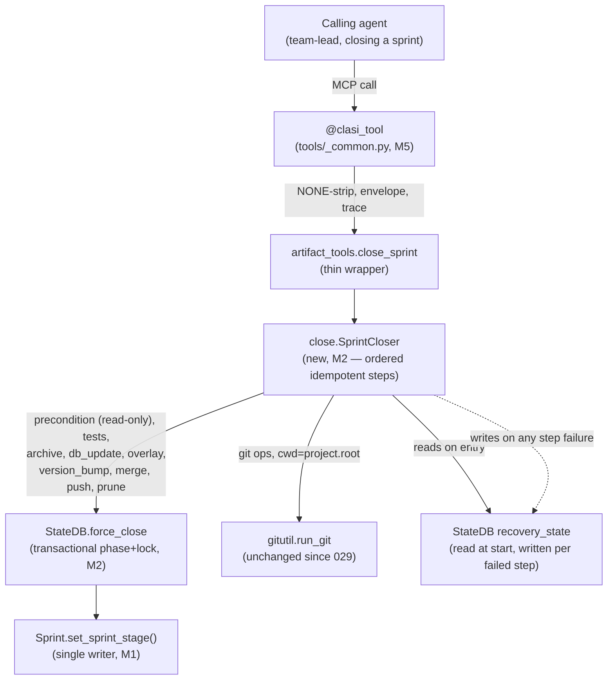
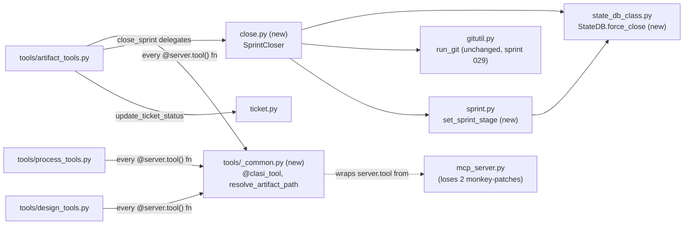

<!-- CLASI: Before changing code or making plans, review the SE process in CLAUDE.md -->

# Sprint 030: One truth for state and an unwedgeable close

## Goals

Sprint stage has exactly one vocabulary and one writer; a failed
`close_sprint` is resumable and can never leave the execution lock
wedged or mint duplicate version tags; the state-machine predicates
describe the process that actually runs. This is Phase 2 — the final
phase — of the three-sprint reliability arc from the comprehensive
review (`docs/reviews/2026-08-reliability/00-review.md`, Part 5).
Sprint 028 built the instrumented E2E baseline and started capturing a
real deny-payload and call-trace corpus; sprint 029 spent that
instrument on the fail-closed and root-discovery root causes (RC-2,
RC-3). This sprint spends it on RC-1 — "four disagreeing vocabularies
for one sprint stage" — before any later phase touches process docs or
deletes code.

## Problem

Per the review's RC-1 and C3-C8 findings (`01-state-layer.md` findings
1-4, 6-10, 14, 20; `02-mcp-tools.md` F1, F2, F5, F6, F9, F15): a
sprint's stage lives in four disagreeing vocabularies — DB phase,
frontmatter `status:`, computed machine state, and directory location —
plus a fifth, `list_sprints`-advertised vocabulary that nothing writes.
The drift detector compares two of these vocabularies that are disjoint
by construction, so it flags every healthy sprint. `close_sprint`
wraps its DB update in `except: pass`, so a failed close can archive
the sprint directory while the DB keeps the old phase and the
execution lock held — the next sprint cannot start. Retry re-runs the
version bump (double tags) because `close_sprint` writes recovery
state on failure but never reads it back; `git push --tags` pushes
every local tag instead of the sprint's own. The state-machine
predicates reference phase strings the toolchain cannot produce
(`"ticketed"` when the DB only ever holds `"ticketing"`) and a
`sprint_review` gate that `record_gate` rejects, so the `closed`
invariant can never hold and `enter-sprint` is permanently blocked.
Ticket `done`-move and `status: done` are two uncoordinated operations,
so frontmatter-based and directory-based ticket counts can diverge.
The 34 artifact MCP tools have a three-way inconsistent error contract
(raise / `{"error": ...}` / a third close_sprint-specific shape), and
the `"NONE"` sentinel mitigation is installed by monkey-patching
private MCP-library internals — a library upgrade silently disables
it. None of today's state-machine tests exercise real writers, so this
whole drift class has shipped repeatedly as a "weird runtime bug"
instead of a red test.

## Solution

Six phase-2 issues, ordered so the vocabulary fix lands first (nothing
else can be verified against a stable ground truth until stage has one
writer), the close and predicate fixes follow, and the integration
test lands last as the phase's acceptance test:

1. `single-sprint-stage-vocabulary.md` — the DB phase list becomes the
   single stage vocabulary; frontmatter `status:` is derived from it
   at write time by one `set_sprint_stage()`; the other vocabulary
   strings are deleted from writers, templates, tool docstrings, and
   `.claude/rules/clasi-artifacts.md`; `detect_inconsistencies` and
   `list_sprints(status=...)` compare and filter on values that
   actually exist.
2. `resumable-transactional-close-sprint.md` — `StateDB.force_close`
   sets phase to done and releases the execution lock in one
   transactional step, surfaced — never swallowed — on failure; retry
   reads recovery state and skips completed steps (no re-run tests, no
   repeat version bump); self-repair becomes read-only before the test
   gate, mutations only after; git failures in the bump/tag/merge
   sequence fail loudly, and only the sprint's own tag is pushed.
3. `fix-unsatisfiable-state-machine-predicates.md` — every phase
   string a predicate references exists in the enforced phase list;
   `sprint_review` is either made recordable or removed along with the
   writer-less skip flags; gate predicates check
   `result in {"passed", "skipped"}`; `evaluate_state` defines
   most-advanced-match-wins and the exception-message parser is
   deleted.
4. `ticket-status-single-writer.md` — `update_ticket_status(path,
   "done")` performs the frontmatter write and the done-directory move
   in one call; a shared ticket-listing helper excludes `*-plan.md`
   companion files everywhere ticket counts are computed.
5. `uniform-mcp-tool-envelope.md` — a `@clasi_tool` decorator wrapping
   `server.tool()` strips the `"NONE"` sentinel in owned code, anchors
   relative paths to `project.root`, and converts domain exceptions
   into one `{"ok": false, "error": {...}}` shape across all 34
   artifact tools; the decorator also absorbs the `mcp-calls.jsonl`
   call-trace instrumentation sprint 028 added ad hoc, so tracing and
   envelope normalization live in the same wrapper instead of two.
6. `sprint-lifecycle-three-way-integration-test.md` — one integration
   test drives a sprint through the real writers (create → detail →
   gates → tickets → in-progress → done → close) against a real
   temporary project, asserting DB phase, frontmatter status, and
   computed machine state agree at every step, gate predicates and
   `advance_phase` agree on gate semantics, and `detect_inconsistencies`
   reports zero drift on the healthy path. This is deliberately last:
   it only passes once issues 1-5 have landed, and it is the acceptance
   test for the whole phase, not just its own ticket.

## Success Criteria

- The E2E close-failure scenario passes: kill tests mid-close,
  re-run, and assert a single version tag, the execution lock released
  or held correctly per the failure point, and resumption skips
  completed steps.
- The instrumented run report (from sprint 028) shows zero self-repairs
  on the happy-path close.
- The new writer-to-reader integration test
  (`sprint-lifecycle-three-way-integration-test.md`) passes, and a
  deliberately reintroduced vocabulary regression fails it.
- `detect_inconsistencies` reports zero drift entries for a healthy
  active sprint; `list_sprints(status=...)` filters on values that
  actually exist.
- The status block's `enter-sprint` transition is no longer blocked by
  a predicate that cannot be true.

## Scope

### In Scope

The six phase-2 issues listed under Solution above — single stage
vocabulary and its one writer, transactional/resumable `close_sprint`,
the state-machine predicate fixes, single-writer ticket status, the
uniform MCP tool envelope (absorbing sprint 028's call-trace
decorator), and the writer-to-reader integration test that closes out
the phase.

### Out of Scope

- Phase 3 of the arc (gate-order fix, tier-0 relaxation, one-canonical-
  text-per-topic documentation consolidation, sprint-review/close
  ownership) — planned separately, next in the review's Part 5
  sequencing.
- Phase 4 (deleting the worktree parallel-path lifecycle, dead
  versioning surface, `dispatch_log`; installer fixes;
  `artifact_tools.py` decomposition; the mtime frontmatter cache) —
  later phases.
- Any change to guard fail-closed behavior or root discovery — that
  was sprint 029's scope and is not reopened here.
- The OpenRouter E2E auth path — stays parked in
  `clasi/issues/later/claude-cli-rejects-models-through-openrouter-redirect-in-e2e.md`
  per the review's Part 6 decision.

## Test Strategy

(To be detailed when this sprint is promoted to Detail Mode. At a
minimum: unit tests for `set_sprint_stage()`, `StateDB.force_close`
transactionality and recovery-state resumption, the fixed state-machine
predicates, and single-writer ticket status; the writer-to-reader
integration test itself is the phase's acceptance test and runs in the
default suite tier. Primary end-to-end validation is the instrumented
E2E close-failure scenario from sprint 028's harness: kill tests
mid-close, re-run, assert single tag / released lock / resumed steps.)

## Architecture

**Substantial** — six responsibilities across ten modules (`sprint.py`,
`state_db_class.py`, `ticket.py`, `state_machine/predicates/{project,sprint,ticket}.py`,
`state_machine/evaluator.py`, `status/inconsistency.py`, `status/reporter.py`,
`tools/artifact_tools.py`, plus two new modules — `close.py` and
`tools/_common.py`), including a new cross-module dependency (every tool
module depends on the new `tools/_common.py`; `close.py` depends on
`state_db_class`/`gitutil`/`sprint`) and a genuine behavior-contract change
to the state-machine evaluator. This is the heaviest of the campaign's three
sprints by design — it is where RC-1's four-vocabulary problem and the
`close_sprint` reliability defects (C3-C5) actually get fixed, not just
instrumented (028) or bounded (029). No data-model change: no SQLite table
gains or loses a column, and no frontmatter schema gains a new key — every
fix here changes *which value* gets written to an existing field, or
*when* an existing write happens, never the shape of the record. That is
why no entity-relationship diagram appears despite the module count; see
Step 4.

### 1. Understand the Problem

See Problem above. Concretely, four defects compound into one failure
class ("the tool that closes a sprint can leave it unclosable"):

1. **No single writer for sprint stage.** DB `sprints.phase` (8 values,
   `roadmap`→`done`), frontmatter `status:` (historically only 3 of those
   8 values — `roadmap`/`planning-docs`/`closed`), and the computed
   sprint-machine state (7 *different* names — `open`/`planned`/
   `pre-flight`/`ticketed`/`executing`/`review`/`closed`) are three
   independent representations, written independently, with no
   reconciliation. `detect_inconsistencies` compares frontmatter against
   the computed-machine vocabulary — two sets that share only the string
   `"closed"` by construction — so it is structurally guaranteed to flag
   every healthy sprint. This is not hypothetical: this repo's own DB
   right now has sprint `012` (archived under `sprints/done/`, frontmatter
   `status: done`) sitting at DB phase `"ticketing"` — a live three-way
   disagreement, verified during this planning pass
   (`sqlite3 .clasi/.clasi.db "SELECT phase FROM sprints WHERE id='012'"`
   → `ticketing`).
2. **`close_sprint` treats failure as an implementation detail.** The DB
   phase-advance/lock-release step is wrapped in
   `except (ValueError, Exception): pass` (`artifact_tools.py:1811`) — a
   failure there archives the sprint directory while the DB keeps the old
   phase *and* the execution lock, so the next `acquire_execution_lock`
   fails until someone hand-edits the DB. Retry re-runs the version bump
   unconditionally (Step 5 has no "already bumped" check), and
   `write_recovery_state` is called on every failure but never read back
   by `close_sprint` itself. Self-repair (ticket move, issue relocation,
   DB phase advance, lock re-acquire) all happens in Step 1, *before* the
   test gate in Step 2 — so a test failure after self-repair has already
   run leaves the repo in a state that never existed before the call,
   with no `unclose_sprint`.
3. **State-machine predicates reference values nothing produces.**
   `is_any_sprint_ticketed` queries DB phase `"ticketed"`; the DB phase
   list only ever contains `"ticketing"` (`_ArtifactGraph.phases()`,
   confirmed against `se-process/schema.yaml`) — so the project machine's
   `enter-sprint` transition is permanently blocked. `is_review_satisfied`
   requires a `sprint_review` gate `record_gate` rejects
   (`VALID_GATE_NAMES = {"architecture_review", "stakeholder_approval"}`)
   or a `post_review: skip` flag nothing writes; `is_close_report_present`
   checks for a `close-report.md` nothing writes either (grepped: zero
   writers repo-wide) — the sprint machine's `closed` state can never be
   reached by evaluation, only inferred by the terminal-state fallback.
   `is_tests_passing` (ticket machine) reads a `.clasi/test-cache` marker
   nothing writes; `is_reopen_requested` likewise. Separately, the sprint
   machine's `open` and `planned` states have byte-identical invariant
   lists (`[is_sprint_doc_present]`), so `evaluate_state`'s "exactly one
   match" contract is violated on nearly every evaluation, and the
   *actual* running behavior — `AmbiguousStateError` → regex the message
   text for `"simultaneously: \[...\]"` → `ast.literal_eval` → take the
   last name (`status/reporter.py:516-539`) — has no test coverage over
   the regex/parse path itself.
4. **Ticket status is two uncoordinated writes.** `update_ticket_status`
   sets frontmatter only; `move_ticket_to_done` moves the file but never
   sets `status: "done"` (confirmed by reading both functions —
   `artifact_tools.py:944-970`, `1043-1075`). Skip either call (or call
   them in the wrong order) and `all_tickets_done` (frontmatter-based) and
   `is_ticket_in_done_dir` (directory-based) permanently disagree.

Sprint 029 already fixed the *mechanics* this sprint depends on: root-
anchored `run_git`, atomic frontmatter writes, DB reads that no longer
create phantom databases. This sprint does not re-touch any of that — it
builds directly on it.

### 2. Identify Responsibilities

Six responsibilities, matching the six linked issues, each changing for
an independent reason:

1. **Collapse sprint-stage vocabulary to one writer** — changes because
   three independent writers exist for what should be one fact, not
   because any single writer is individually wrong.
2. **Make `close_sprint`'s state transition transactional and resumable**
   — changes because failure handling was never designed, not because the
   happy path is wrong (29 sprints have closed successfully under the
   current code).
3. **Make every state-machine predicate satisfiable by the shipped
   toolchain** — changes because some predicates reference values or
   gates nothing writes, not because the predicates' *logic* is wrong
   given a value that did exist.
4. **Unify ticket status into one writer** — changes because moving a
   file and recording its status are one conceptual operation split into
   two uncoordinated calls, not because either call is wrong alone.
5. **Give every MCP tool one call/response contract** — changes because
   three different error shapes and a monkey-patched sentinel-stripping
   mechanism coexist by accident of incremental history, not because any
   one tool's individual contract is wrong.
6. **Prove the above four hold together, with real writers** — changes
   because today's state-machine tests stub the reader to agree with
   whatever the predicate asks, making the exact drift class above
   structurally undetectable by any existing test.

None of the six needs to relocate to a different subsystem to be fixed.
Responsibilities 2 and 5 each introduce one new module (`close.py`,
`tools/_common.py`) because their fix is a decomposition, not a patch —
see Design Rationale for why patching in place was rejected for both.

### 3. Define Subsystems and Modules

**M1 — Single sprint-stage vocabulary and its one writer**
(`sprint.py`, `state_db_class.py`, `templates/sprint.md`,
`tools/artifact_tools.py` docstrings, `.claude/rules/clasi-artifacts.md`,
`status/inconsistency.py`)
- **Purpose**: Make the DB phase list the sole recorded vocabulary for a
  sprint's stage, with frontmatter `status:` written as its mirror by the
  same call.
- **Boundary**: Inside — a new `set_sprint_stage()` writer (on `Sprint`,
  alongside its existing `sprint_doc`/`self._project.db` access) that
  writes the DB phase and the frontmatter `status:` value together and
  raises loudly if either half fails, used internally by
  `detail_promote`, `advance_phase`, `archive`, and `force_close` (M2) in
  place of each doing its own independent frontmatter write; the
  drift-detection redesign in `status/inconsistency.py` (see Design
  Rationale); deleting the `"planning, active, done"` vocabulary
  `list_sprints` docstrings and `clasi-artifacts.md` advertise but no
  writer produces. Outside — the *computed* sprint-machine vocabulary
  (`open`/`planned`/`pre-flight`/…) in `sprint.yaml`, which is not one of
  the vocabularies being deleted — see Design Rationale for why it stays.
- **Use cases served**: SUC-001.

**M2 — Resumable, transactional `close_sprint`** (new `close.py`;
`tools/artifact_tools.py`'s `_close_sprint_full`; `state_db_class.py`)
- **Purpose**: Guarantee a failed close never leaves the execution lock,
  DB phase, or version tags in a state a retry can't recover from.
- **Boundary**: Inside — a new `StateDB.force_close(sprint_id)`
  (transactional phase→`done` + lock release in one commit, replacing the
  `except (ValueError, Exception): pass`-wrapped loop); a new `close.py`
  module holding the step sequence as an ordered set of small,
  independently idempotent steps (precondition check — read-only;
  tests; archive; `force_close`; design-overlay apply; version bump; git
  merge; tag push; branch delete; worktree prune); self-repair moved to
  *after* the test gate, each repair recorded in recovery state as it
  happens; version-bump idempotency checked against git's own tag
  list (does the computed tag already exist?) rather than a
  separately-tracked completed-steps ledger; `run_git` return codes
  checked at every step that currently ignores them; tag push targets
  the sprint's own tag name (`git push origin v{version}`), not `--tags`.
  Outside — the test-subprocess mechanism itself and `Sprint.merge_branch`
  (unchanged; already root-anchored by sprint 029).
- **Use cases served**: SUC-002.

**M3 — Fix unsatisfiable and never-true state-machine predicates**
(`state_machine/predicates/{project,sprint,ticket}.py`,
`state_machine/evaluator.py`, `schemas/state-machines/{sprint,ticket}.yaml`,
`status/reporter.py`)
- **Purpose**: Make every predicate and invariant the shipped toolchain
  references satisfiable by something the toolchain actually writes.
- **Boundary**: Inside — `is_any_sprint_ticketed` querying `"ticketing"`
  instead of `"ticketed"`, and `any_sprint_in_phase` scoped to active
  (non-archived) sprints only (see Design Rationale — this also resolves
  the live sprint-012 drift found in Step 1, as a side effect of a
  correct semantic, not a special case); `is_architecture_review_recorded`/
  `is_pre_flight_satisfied` checking `result in {"passed", "skipped"}`
  instead of `is not None`; removing `sprint_review`/`is_review_satisfied`,
  `is_close_report_present`, the writer-less `pre_flight_review`/
  `post_review` flag predicates, `is_tests_passing`, and
  `is_reopen_requested` from the two YAML machines and their invariant/
  condition lists; `evaluate_state` defining most-advanced-match-wins
  (returns the last-declared matching state rather than raising when more
  than one state's invariants hold) in place of
  `AmbiguousStateError`; deleting `_last_matching_state_from_error` and
  its three call sites in `reporter.py`. Outside — the "conditions +
  destination invariants" rule in `inspect_transitions` itself (a
  separate, structural question surfaced but not fixed here — see Open
  Questions) and the readiness-machine's role in status display
  (unchanged in kind, now just returns a determinate answer without an
  exception-message round-trip).
- **Use cases served**: SUC-003.

**M4 — Ticket status single writer** (`ticket.py`,
`tools/artifact_tools.py`'s `update_ticket_status`/`move_ticket_to_done`,
`sprint.py`/`status/reader.py` ticket-listing glob)
- **Purpose**: Make one call move a ticket's file and record its status
  together.
- **Boundary**: Inside — `update_ticket_status(path, "done")` performing
  both the frontmatter write and the `tickets/done/` move in one call;
  `move_ticket_to_done` becoming a thin alias over the same path; one
  shared ticket-listing helper (excluding `*-plan.md` companions) used by
  every ticket-count computation (`list_tickets`, `all_tickets_done`,
  `ticket_count`). Outside — `reopen_ticket`'s existing converse logic
  (already correct, unchanged).
- **Use cases served**: SUC-004.

**M5 — Uniform MCP tool envelope** (new `tools/_common.py`;
`mcp_server.py`; every `@server.tool()` function in `artifact_tools.py`,
`process_tools.py`, `design_tools.py`)
- **Purpose**: Give every MCP tool one call/response contract instead of
  three.
- **Boundary**: Inside — a new `@clasi_tool` decorator (composed with
  `@server.tool()` on every tool function) that strips the `"NONE"`
  sentinel per-call in owned code, converts a domain exception into one
  `{"ok": false, "error": {...}}` shape, and absorbs the
  `mcp-calls.jsonl` call-trace (`_write_call_trace`, already written in
  sprint 028 to be liftable "without rewriting it" — confirmed by reading
  its own docstring); `resolve_artifact_path` moving from
  `artifact_tools.py` into `tools/_common.py` alongside the decorator
  (already root-anchored by sprint 029 — this is a relocation, not a
  behavior change); the two `mcp_server.py` monkey-patches
  (`_tool_manager.call_tool`, the NONE-stripping half of it) removed;
  `close_sprint` gaining an explicit `test_command="SKIP"` sentinel,
  replacing the unreachable empty-string mechanism. Outside — the
  separate raw-RPC diagnostic tap (`JSONRPCMessage.model_validate_json`)
  — debug scaffolding for a closed investigation, out of scope here (see
  Open Questions); `gitutil.run_git` itself, which stays at the top level
  and is *not* absorbed into `tools/_common.py` (see Design Rationale —
  this corrects the review's own proposed layout).
- **Use cases served**: SUC-005.

**M6 — Writer-to-reader integration test** (new
`tests/system/test_sprint_lifecycle_integration.py`)
- **Purpose**: Prove three-way agreement (DB phase, frontmatter status,
  computed machine state) holds through a real sprint lifecycle driven by
  real writers, against a real temporary project and a real DB — no
  reader stubbing.
- **Boundary**: Inside — the test itself, driving create → detail →
  gates → tickets → in-progress → done → close through the actual MCP
  tool functions (or the `Sprint`/`Ticket`/`StateDB` methods they wrap),
  asserting agreement at every step and asserting `detect_inconsistencies`
  reports zero drift for the healthy path; a deliberately reintroduced
  vocabulary regression (e.g. a stray status string) must fail it.
  Outside — the fixes it exercises (M1-M4).
- **Use cases served**: SUC-006. Deliberately last, both in this document
  and in execution order — it is the acceptance test for the whole phase,
  not just its own ticket, and can only pass once M1-M4 exist.

### 4. Diagrams

**Component diagram — the `close_sprint` path, before and after.**
Included: this is the sprint's highest-risk change, and the diagram is
the clearest way to show the decomposition M2 introduces.

Self-repair (ticket/issue relocation, phase catch-up) is not drawn as a
separate node — after M2 it is a *behavior* of `CLOSER`'s precondition
and post-test-gate steps, not a distinct component, matching the note in
sprint 029's own diagram convention for control-flow changes that don't
add a component.

**Dependency graph — new module edges.** Included: `tools/_common.py`
and `close.py` are new modules with real fan-in from existing code, the
class of change the substantial-tier trigger names explicitly.

`COMMON` deliberately does *not* depend on `GITUTIL` — `run_git` stays a
top-level leaf module both `sprint.py` (core) and the tools layer need,
so it stays outside `tools/`, not inside it (see Design Rationale). No
new edge points from `sprint.py`/`ticket.py`/`state_db_class.py` back
into the tools layer — dependency direction (tools → core, never the
reverse) is unchanged.

No entity-relationship diagram: confirmed against every touched
module — no SQLite table gains a column, no frontmatter document gains a
new key. `recovery_state`'s existing `step`/`reason` columns are reused,
unchanged, as the resumability signal (see Design Rationale).

### 5. What Changed / Why / Impact on Existing Components /
Migration Concerns

**What Changed** — one line per module, detail in Step 3:

- M1: new `Sprint.set_sprint_stage()`; `detail_promote`/`archive`/
  `advance_phase` route through it instead of writing frontmatter
  independently; `archive()` writes `status: "done"` (the DB-phase
  terminal string) instead of `"closed"` (reversing sprint 019's
  choice — see Design Rationale); `detect_inconsistencies` stops
  comparing frontmatter against the computed-machine vocabulary and
  instead checks DB-phase-vs-frontmatter agreement plus
  directory-vs-phase-terminality, skipping any sprint physically under
  `sprints/done/` regardless of which legacy status string it carries.
- M2: new `close.py`; new `StateDB.force_close`; self-repair moves after
  the test gate; version-bump idempotency checked against existing git
  tags; tag push targets the sprint's own tag.
- M3: `is_any_sprint_ticketed` query string fixed and scoped to active
  sprints; gate predicates check result value, not presence;
  `sprint_review`/`is_close_report_present`/writer-less flag predicates/
  `is_tests_passing`/`is_reopen_requested` removed from both YAML
  machines; `evaluate_state` returns the most-advanced match instead of
  raising; `_last_matching_state_from_error` deleted.
- M4: `update_ticket_status("done")` performs the move; shared
  plan-file-excluding ticket-listing helper.
- M5: new `tools/_common.py` (`@clasi_tool`, relocated
  `resolve_artifact_path`); `mcp_server.py`'s call-logging/NONE-stripping
  monkey-patches removed; `close_sprint` gains `test_command="SKIP"`.
- M6: new integration test, last ticket in execution order.

**Why**: Problem and Step 1 above state the diagnosis per module. The
shared thread: a sprint's stage, a close attempt's progress, and a
ticket's completion should each have exactly one authoritative
representation, written by exactly one code path — every defect this
sprint fixes is an instance of that principle being violated somewhere
specific.

**Impact on Existing Components**

- **Every downstream CLASI-installed project**: frontmatter `status:`
  values change vocabulary going forward (8 DB-phase strings instead of
  3 ad hoc ones); any external tooling that pattern-matches on
  `status: closed` specifically (rather than "sprint is under
  `sprints/done/`") would need updating — no such consumer is known to
  exist inside this repo (grepped: only `detect_inconsistencies` and the
  status-block's `_is_terminal_sprint` read the value programmatically,
  both updated by this sprint).
- **`artifact_tools.py`**: loses roughly 950 lines of close-orchestration
  logic to `close.py` — this preempts part of the review's own Phase 4
  decomposition plan ("split `artifact_tools.py`... starting with
  `close.py`"); see Design Rationale for why doing it now, not patching
  in place, is the right call for *this* fix specifically.
- **Every MCP tool caller**: response shape becomes uniform
  (`{"ok": bool, ...}`); a caller that currently distinguishes "raised"
  from "`{"error": ...}`" from close_sprint's own three-field shape can
  simplify to one check. No tool's *parameter* signature changes except
  `close_sprint` gaining the additive `test_command="SKIP"` value.
- **Status consumers**: `clasi status` / `get_status` output is
  unaffected in shape; the sprint-machine's computed state names
  (`open`/`planned`/…) are unchanged — only which sprints get
  drift-checked, and against what, changes.
- **The 29 already-archived sprints in `sprints/done/`** (19 carrying
  `status: done`, 10 carrying `status: closed`, per this repo's own
  disk state, checked during planning): **zero files rewritten.** See
  Migration Concerns.

**Migration Concerns**

- **No DB schema migration**: no table gains a column; `force_close` and
  the resumability logic reuse the existing `sprints.phase`,
  `execution_locks`, and `recovery_state` tables exactly as they are
  today.
- **No frontmatter schema migration**: no artifact type gains a new
  key; `status:` changes *which values* are valid, not the field's
  existence or type.
- **The vocabulary-collapse migration is derivation, not rewrite.**
  Constraint from the team-lead's dispatch: existing artifacts must keep
  working, and a derivation needing no historical rewrite is preferred
  over one that needs it. This sprint has one: a sprint is "terminal" (and
  therefore exempt from stage drift-checking) when its directory is
  physically under `sprints/done/` — a signal every one of the 29
  archived sprints already satisfies correctly today, independent of
  which legacy `status:` string each one happens to carry. Going forward,
  every *newly* archived sprint writes `status: "done"` (matching the DB
  phase's own terminal string) via `set_sprint_stage`; the two legacy
  strings already on disk (`done`, `closed`) are tolerated on read
  forever, exactly as sprint 019 already decided to tolerate `status:
  done` on the pre-019 archives rather than bulk-rewrite them — this
  sprint extends the identical policy to the `closed` cohort sprint 019
  itself produced, and does not reopen that sprint's own settled
  decision to skip a bulk rewrite.
- **Sprint 012's live drift**: not repaired by editing data. Once
  `any_sprint_in_phase` is scoped to active sprints (M3) and
  drift-checking exempts anything under `sprints/done/` (M1), sprint
  012's stale DB phase (`"ticketing"`) stops being read by anything that
  makes a decision from it. No DB update, no file edit.
- **`sprint_review`/`is_close_report_present`/`is_tests_passing`/
  `is_reopen_requested` removal**: these predicates never evaluated
  `True` in this toolchain's history (no writer ever existed for any of
  their backing signals), so removing them changes zero currently-observed
  behavior — the `closed`/`done` state invariants that referenced them
  become satisfiable by what already gets written, not newly permissive
  by dropping a check that was doing real work.
- **`docs/design/state-machines.md`** documents the "exactly one state
  must match" contract `evaluate_state` is changing (per
  `evaluator.py`'s own docstring, which names that file). This sprint
  does not audit or rewrite that doc — flagged as a required follow-up in
  Open Questions, not silently left inconsistent.
- **This sprint closes itself, and the closing MCP process may be
  running pre-030 code.** `close_sprint("030")` is called by the
  team-lead shortly after this sprint's own tickets land — and a
  long-lived `clasi mcp` process holds whatever code it imported at
  startup, which may predate every fix in M1-M5. Both risks are
  deliberately bounded, not merely hoped away:
  - **If the server is stale**, `close_sprint` runs the *old*
    (pre-030) implementation: non-transactional DB update, self-repair
    before the test gate, unconditional version-bump-on-retry. That
    implementation has closed 29 sprints successfully, including
    sprint 029's own; its known fragility is specifically on the
    *failure* path (a test failure or merge conflict mid-close), not the
    happy path this sprint's own close is expected to take. If sprint
    030's own close fails partway under stale code, the pre-existing
    manual fallback — read `recovery_state`, hand-repair per its
    `instruction` field, retry, or `clear_sprint_recovery` — is
    unchanged and still available; this sprint does not remove or
    weaken it. Recommended practice, not a new mechanism: call
    `get_version()` immediately before `close_sprint("030")` and restart
    the MCP session if `stale: true` is reported, exactly as
    `mcp-required.md` already instructs for any stale-server finding.
  - **If the server is fresh**, the new transactional/resumable path
    runs, and a mid-close failure is safely retryable by construction
    (M2) — strictly safer than the old path, not merely equally safe.
  - **Either way, the frontmatter value sprint 030's own archive step
    writes is compatible with the migration design.** A stale server
    still running `archive()`'s pre-030 code writes `status: "closed"`;
    a fresh server writes `status: "done"` (M1). Both are tolerated
    forever by the directory-location-based terminal check — this is
    not a coincidence, it is why that check is directory-based rather
    than value-based (see the Migration Concerns entry above): the same
    design decision that avoids rewriting the 29 prior archives is what
    makes this sprint's own self-referential close safe regardless of
    which code version performs it.
  - **No tool signature changes** in a way that could break a stale
    caller or a fresh caller against a stale server — `close_sprint`'s
    only new parameter value (`test_command="SKIP"`) is additive; a
    caller that doesn't know about it behaves exactly as before.

### 6. Design Rationale

**Decision: DB phase is the single sprint-stage vocabulary; the computed
sprint-machine vocabulary is kept, not deleted, and demoted to a pure
readiness/next-step signal.**
- **Context**: the review's own recommendation says "DB phase (or machine
  state — pick one) authoritative." Two genuinely different questions are
  being asked by the two vocabularies today: "what stage is this sprint
  recorded at" (DB phase, frontmatter) versus "what can happen next, and
  what's blocking it" (the computed machine, feeding `available_transitions`
  and its `blocked_by` lists in the status block). Collapsing both into
  one vocabulary would either lose the readiness/blocked-by computation
  entirely, or force the DB-phase vocabulary to also encode fine-grained
  readiness distinctions (e.g. "tickets written but lock not yet
  acquired" vs "lock acquired") it was never designed to carry.
- **Alternatives considered**: (a) make the computed machine authoritative
  and derive frontmatter from *it* instead of DB phase — rejected, the
  computed machine has no persistent store of its own (it's evaluated
  fresh from other signals every time), so there is nothing to make
  "the writer" in the sense `set_sprint_stage()` needs; (b) delete the
  computed machine entirely, losing `available_transitions` — rejected,
  that output is real, used, load-bearing status-block content with no
  replacement designed in this sprint's scope; (c) keep both vocabularies
  but stop comparing them for drift (adopted, alongside (already-decided)
  DB phase as the recorded-stage vocabulary).
- **Why this choice**: the two vocabularies were never actually redundant
  representations of the same fact — comparing them for "drift" was a
  category error from the start (finding 2's own evidence: "share only
  the string `closed`" is a symptom of asking two different questions,
  not of one writer failing to update the other). Retiring the comparison
  is not "declining to fix the drift", it's recognizing the drift check
  itself was checking the wrong thing.
- **Consequences**: `detect_inconsistencies` no longer produces
  `state_drift` entries by comparing frontmatter against the computed
  machine's state name; it instead checks DB-phase-vs-frontmatter
  (should always agree, one writer) and directory-vs-phase-terminality
  (should always agree, `set_sprint_stage`+`archive` write both
  together). A genuinely stale `available_transitions`/`blocked_by`
  computation is still possible in principle (e.g. a git branch renamed
  out from under a sprint) but is a *readiness* bug, not a *stage*
  vocabulary bug — out of this sprint's scope, unchanged from today.

**Decision: remove `sprint_review`/`is_close_report_present`/the
writer-less skip flags/`is_tests_passing`/`is_reopen_requested`, rather
than making them recordable.**
- **Context**: the issue's acceptance criteria offer both options
  ("either recordable... or removed"). Making `sprint_review` recordable
  would mean deciding, in this sprint, what a post-execution human review
  step actually *is* — but that is explicitly Phase 3 territory per the
  review's own Part 5 sequencing ("sprint-review interprets
  `review_sprint_pre_close`") and this sprint's own Out of Scope section
  ("sprint-review/close ownership — planned separately").
- **Alternatives considered**: (a) add gate recording for `sprint_review`
  inside `force_close` now — rejected, it would invent process semantics
  Phase 3 hasn't decided yet, and a hastily-designed gate now is worse
  than an honestly-absent one later; (b) leave the predicates in place,
  unsatisfiable, documented as "known broken" — rejected, that is the
  exact status quo the issue exists to fix, and leaves `clasi status`
  reporting against states that can never be reached; (c) remove them —
  adopted.
- **Why this choice**: every one of these predicates has zero writers
  anywhere in the codebase today (verified by grep during planning, not
  assumed) — removing them changes no currently-observed behavior, only
  makes the machine's stated invariants match what the toolchain actually
  produces.
- **Consequences**: the sprint machine's `closed` state invariants become
  `is_branch_merged` only (dropping `is_close_report_present`,
  `is_review_satisfied`); the ticket machine's `finish` transition drops
  `is_tests_passing` from its conditions (keeping
  `is_acceptance_criteria_met`); the `reopen` transition drops
  `is_reopen_requested` (see Open Questions for the residual
  "conditions + destination invariants" question this exposes but does
  not resolve). Phase 3, when it defines real sprint-review semantics,
  adds a new gate and predicate from scratch rather than resurrecting
  these.

**Decision: resumability via per-step idempotency against ground truth,
not a new "completed steps" DB column.**
- **Context**: the acceptance criteria say "reads its recovery state and
  skips completed steps." `recovery_state` today stores exactly one
  failed `step` name plus a `reason` — not a list of *successfully
  completed* steps.
- **Alternatives considered**: (a) add a `completed_steps` JSON column to
  `recovery_state` and maintain it explicitly — rejected, it is a second,
  independently-maintained bookkeeping mechanism that could itself drift
  from reality (the exact failure class this whole sprint exists to
  remove), and every step already has cheap ground truth to check
  instead: does the computed version's git tag already exist; is the DB
  phase already `done`; is the sprint directory already under
  `sprints/done/` (Step 3's existing `already_archived` check, kept
  unchanged — it was already correct); (b) ground-truth idempotency
  checks, with `recovery_state.step` reused as a coarse "resume from
  here" pointer rather than an exhaustive ledger — adopted.
- **Why this choice**: (b) satisfies the acceptance criteria's literal
  requirement using the *existing* schema, and is self-correcting even if
  the recorded pointer is stale or a step was completed by a process that
  crashed before writing recovery state at all.
- **Consequences**: no DB schema migration (see Migration Concerns); each
  step in `close.py` owns its own "have I already done this" check rather
  than a single central ledger — slightly more code per step, in exchange
  for correctness that doesn't depend on the ledger itself staying
  accurate.

**Decision: `close.py` is created now, as part of this fix, not patched
in place inside `artifact_tools.py`.**
- **Context**: the review's Phase 4 plan lists `close.py` extraction as
  later, separate decomposition work ("split `artifact_tools.py`... after
  1-4, so the move is mechanical").
- **Alternatives considered**: (a) implement resumability/transactionality
  as further edits to the existing ~950-line `_close_sprint_full`
  function in place, deferring the `close.py` extraction to Phase 4 as
  planned; (b) extract `close.py` now. Why not (a): the fix this issue
  requires — read-only precondition check, ordered idempotent steps,
  recovery-state-aware resumption — *is* a step-runner shape; bolting
  that structure onto the existing single giant function while trying to
  preserve its current shape for a "mechanical later move" produces
  worse code now for no benefit, since the later move would just
  re-derive the same structure this ticket already needs to write
  correctly.
- **Why this choice**: (b) produces the same end state Phase 4 wanted
  anyway, one sprint earlier, as a direct consequence of doing this fix
  correctly rather than as scope creep chasing the decomposition for its
  own sake.
- **Consequences**: Phase 4's own future work has one less item
  (`close.py` extraction) already done; `artifact_tools.py`'s
  `close_sprint` tool function becomes a thin wrapper calling into
  `close.py`, matching the shape sprint 029's `skill_resolve.py`
  extraction already established as this codebase's pattern for "pull a
  cohesive piece out to its own module, leave a thin re-export/wrapper at
  the call site."

**Decision: `tools/_common.py` owns `@clasi_tool` and
`resolve_artifact_path`; `gitutil.run_git` stays a top-level module, not
absorbed into `tools/_common.py`.**
- **Context**: the review's own decomposition proposal lists `run_git`
  as living inside `tools/_common.py`. Sprint 029 deliberately kept
  `gitutil.py` separate and small, noting "Phase 3/4 will likely absorb
  `gitutil.py`'s contents into `tools/_common.py` near-verbatim when that
  work lands" — this sprint is that moment, so the question is live, not
  hypothetical.
- **Alternatives considered**: (a) move `run_git` into `tools/_common.py`
  as the review proposed — rejected: `sprint.py` and `design/overlay.py`
  (both core modules, outside the `tools/` MCP-facing layer) depend on
  `run_git` directly; moving it into `tools/_common.py` would make two
  core modules import from the tools layer, inverting the dependency
  direction this codebase's own `src/clasi/DESIGN.md` states as an
  invariant ("no component trusts..."; more precisely, `tools/` wraps
  `clasi-core`, not the reverse — see that doc's own `## 3. Constraints
  and Invariants`); (b) leave `run_git` in `gitutil.py`, a shared leaf
  both layers depend on — adopted.
- **Why this choice**: (b) is the only option that doesn't create a
  backward dependency; the review's proposed layout conflated "helpers
  the tools layer happens to use" with "a leaf utility multiple
  architectural layers need," and this sprint corrects that distinction
  rather than importing it uncritically.
- **Consequences**: `tools/_common.py` imports `gitutil.run_git` like any
  other consumer; it does not own or re-export it as its own symbol.

**Decision: sequence `close_sprint` (ticket 004) after vocabulary (001),
predicates (002), and ticket-status-writer (003) — moved from position 2
in the roadmap-phase Solution list to position 4.**
- **Context**: the roadmap-mode sprint.md's Solution list enumerates
  close_sprint second, immediately after vocabulary. `force_close` has a
  genuine, hard dependency on `set_sprint_stage` (001) — that ordering
  constraint was already correct. But close_sprint's post-test repair
  step also *shrinks* once ticket-status-single-writer (003) lands
  (there is less to repair, because the divergence it used to correct —
  ticket moved without status set, or vice versa — can no longer occur
  going forward), and this is the sprint's single highest-risk change per
  the team-lead's own framing ("this sprint rewrites the code that closes
  this sprint").
- **Alternatives considered**: (a) keep the original position-2 ordering,
  implementing close_sprint's fix against the *current* two-call ticket
  model (its own self-repair loop already handles that divergence, so
  this is not a hard blocker) — viable, but ships the riskiest ticket
  with more surface area to get right than necessary; (b) move it to
  position 4, after 002/003 — adopted.
- **Why this choice**: predicates (002) and ticket-status-writer (003)
  are mutually independent and independent of close_sprint at the code
  level (confirmed: no file overlap with `close.py`'s planned contents),
  so reordering them ahead of close_sprint costs nothing and reduces the
  repair surface the highest-risk ticket has to reason about.
- **Consequences**: the ticket table's row order (below) is 001, 002,
  003, 004, 005, 006 — not the roadmap Solution list's 001, 002(close),
  003, 004(ticket-writer), 005, 006 enumeration order. `depends-on` for
  004 lists 001 (hard) and notes 003 as sequencing-only (soft), matching
  the distinction sprint 029's own ticket table drew for its M4-M6
  general-hardening-but-not-formal-dependency rows.

### 7. Open Questions

1. **The "conditions + destination invariants" rule can reference a
   transition's own side effect.** Discovered during this planning pass
   while deciding how to remove `is_tests_passing`/`is_reopen_requested`:
   `inspect_transitions` unions a transition's `conditions` with its
   *destination* state's invariants, evaluated against the *current*
   (pre-action) context. For the ticket machine's `finish` transition,
   the destination (`done`) state's own invariant `is_ticket_in_done_dir`
   is false until the `move_ticket_to_done` action itself runs — so, independent of
   `is_tests_passing`, `finish` may never show as `"fireable": true` in
   status output even for a ticket that is legitimately ready to close.
   This is a structural property of the rule (documented in
   `docs/design/state-machines.md` per `evaluator.py`'s own docstring),
   affects all three machines' displayed transitions, and is not named by
   any of this sprint's six issues. Not fixed here — flagged as a
   follow-up issue. Recommendation: file it during ticket 003's or 006's
   execution, once the removal of `is_tests_passing`/`is_reopen_requested`
   makes it independently observable without those two predicates'
   permanent-`False`-ness masking it.
2. **`docs/design/state-machines.md` needs a follow-up edit** for the
   `evaluate_state` contract change (Step 6) — not audited or rewritten
   in this planning pass; flagged so it isn't silently left describing a
   contract the code no longer implements.
3. **Whether `Sprint.phase` (DB-first, directory-fallback) and
   `Sprint.status` (frontmatter mirror) should collapse into one property**
   now that they represent the same fact, or stay separate (`phase` as
   the DB-backed source of truth; `status` as a cheap frontmatter-only
   read that avoids opening the DB) is a ticket-level implementation
   choice, not resolved here.
4. **The mcp 2.x migration** (`clasi/issues/migrate-to-mcp-2-x-api.md`)
   stays out of scope, per the team-lead's own framing: `@clasi_tool`
   (M5) is its prerequisite (mcp 2.x deletes
   `mcp.server.fastmcp`/the private internals the current monkey-patches
   tap), but the migration itself is separate, tracked, later work.
5. **Whether `{"ok": bool, ...}` wraps a tool's existing return value
   under a new key, or merges `"ok"`/`"error"` alongside the existing
   top-level fields**, is not decided here — a ticket-level
   implementation choice for M5, deliberately left open at the module
   level (staying at "no function signatures, no payload schemas" per
   this document's own scope). Whichever shape is chosen, it must be the
   *same* shape for all 34 tools — that uniformity, not the specific
   shape, is what SUC-005 requires.

## Use Cases

### SUC-001: A sprint's stage is recorded once and read consistently everywhere
Parent: UC — Reliability / Process State

- **Actor**: Any code path that writes or reads a sprint's lifecycle
  stage (`detail_sprint`, `advance_sprint_phase`, `close_sprint`,
  `list_sprints`, `detect_inconsistencies`)
- **Preconditions**: A sprint is registered in the state DB
- **Main Flow**:
  1. A writer (`detail_promote`, `advance_phase`, `archive`, or
     `force_close`) calls `set_sprint_stage(new_phase)`
  2. `set_sprint_stage` writes the DB `sprints.phase` row and the
     sprint's frontmatter `status:` field together, raising loudly if
     either write fails
  3. Any reader (`Sprint.status`, `list_sprints(status=...)`,
     `detect_inconsistencies`) sees the same value from both stores
- **Postconditions**: DB phase and frontmatter `status:` never disagree
  for a sprint written after this sprint ships; `detect_inconsistencies`
  reports zero stage-drift entries for a healthy active sprint;
  archived sprints (any status string, any sprint number) are exempt
  from stage drift-checking by directory location, requiring no
  historical rewrite
- **Acceptance Criteria**:
  - [ ] A single `set_sprint_stage()` writer updates DB phase and
        frontmatter status together; `detail_promote`/`advance_phase`/
        `archive` all route through it
  - [ ] The `"planning, active, done"` vocabulary is deleted from
        `list_sprints` docstrings and `.claude/rules/clasi-artifacts.md`
  - [ ] `detect_inconsistencies` compares DB phase against frontmatter
        status (not the computed sprint-machine vocabulary) and produces
        zero entries for a healthy active sprint (new test)
  - [ ] `list_sprints(status=...)` filters correctly on the 8 DB-phase
        values
  - [ ] None of the 29 sprints already under `sprints/done/` are edited

### SUC-002: A failed close_sprint is resumable, never a permanent lockup
Parent: UC — Reliability / Sprint Close

- **Actor**: Any agent calling `close_sprint`, including on retry after a
  prior failure
- **Preconditions**: A sprint is in a closeable state (tickets done,
  issues resolved) and the execution lock is held by it, or a prior
  `close_sprint` call failed partway through
- **Main Flow**:
  1. `close_sprint` reads any existing recovery state for this sprint
  2. Steps run in order (precondition check — read-only; tests; archive;
     `force_close`; design-overlay apply; version bump; merge; push tag;
     delete branch; prune worktrees), each checking its own idempotency
     before acting
  3. On any step's failure, recovery state is written naming the failed
     step and the paths the caller may act on; the error is returned to
     the caller, never swallowed
  4. On retry, already-completed steps (verified against ground truth —
     git tags, DB phase, directory location) are skipped; only the
     failed step and remainder run
- **Postconditions**: A failed close never leaves the execution lock held
  by an archived sprint; a retry never re-runs tests unnecessarily, never
  mints a second version tag for the same close, and never pushes tags
  other than the sprint's own
- **Acceptance Criteria**:
  - [ ] `StateDB.force_close(sprint_id)` sets phase to `done` and
        releases the lock in one transaction; failure is surfaced in the
        tool result, never swallowed by a bare `except: pass`
  - [ ] Self-repair (ticket/issue relocation, phase catch-up) runs only
        after the test gate passes, and each repair is recorded in
        recovery state as it happens
  - [ ] A simulated failed close (kill tests mid-close), followed by a
        retry, produces: a single version tag, the lock released (not
        held by an archived sprint), and no re-run of already-completed
        steps
  - [ ] `git push` targets the sprint's own tag name, not `--tags`
  - [ ] Git command failures in the bump/tag/merge sequence fail the
        step loudly, with the git output included in the error

### SUC-003: The status block reports against a process the toolchain can actually complete
Parent: UC — Reliability / State Machine

- **Actor**: `clasi status` / `get_status`, and any predicate evaluation
  over the project, sprint, or ticket machines
- **Preconditions**: A project has at least one sprint in a ticketed or
  later phase
- **Main Flow**:
  1. `is_any_sprint_ticketed` queries the DB phase value the toolchain
     actually writes (`"ticketing"`), scoped to active (non-archived)
     sprints
  2. Gate predicates check the recorded gate's `result` value
     (`passed`/`skipped` satisfy; `failed` does not), matching
     `advance_phase`'s own semantics
  3. `evaluate_state` returns the most-advanced matching state when more
     than one state's invariants hold, instead of raising
     `AmbiguousStateError`
  4. `sprint_review`/`is_close_report_present`/the writer-less
     `pre_flight_review`/`post_review` flags/`is_tests_passing`/
     `is_reopen_requested` no longer appear as invariants or conditions
     anywhere in the sprint or ticket machines
- **Postconditions**: The project machine's `enter-sprint` transition is
  no longer permanently blocked; the sprint machine's `closed` state is
  reachable by evaluation, not only by directory-based fallback; no
  status computation depends on parsing an exception's message text
- **Acceptance Criteria**:
  - [ ] A test asserts every phase string referenced by any predicate
        exists in `ArtifactGraph.phases()`
  - [ ] This repo's own status block no longer reports `enter-sprint`
        blocked by a predicate that cannot be true
  - [ ] `evaluate_state` is exercised against a context matching both
        `open` and `planned` simultaneously and returns a determinate
        state, not an exception
  - [ ] `_last_matching_state_from_error` and its regex/`ast.literal_eval`
        parsing are deleted, with no remaining caller
  - [ ] `sprint_review`, `is_close_report_present`, `is_tests_passing`,
        and `is_reopen_requested` are removed from both YAML machine
        definitions and their predicate modules

### SUC-004: Marking a ticket done is one operation, not two
Parent: UC — Reliability / Ticket Lifecycle

- **Actor**: Any agent or tool marking a ticket complete
- **Preconditions**: A ticket exists in a sprint's `tickets/` directory
- **Main Flow**:
  1. Caller calls `update_ticket_status(path, "done")`
  2. The call writes `status: "done"` to frontmatter and moves the file
     into `tickets/done/` in the same operation
- **Postconditions**: Frontmatter-based ticket counts (`ticket_counts`,
  `all_tickets_done`) and directory-based checks (`is_ticket_in_done_dir`)
  always agree; a stray `*-plan.md` companion file never inflates a
  ticket count
- **Acceptance Criteria**:
  - [ ] `update_ticket_status(path, "done")` performs both the
        frontmatter write and the directory move
  - [ ] `move_ticket_to_done` becomes a thin alias over the same path (no
        behavior divergence between the two entry points)
  - [ ] One shared ticket-listing helper, excluding `*-plan.md`
        companions, is used by `list_tickets`, `all_tickets_done`, and
        `ticket_count`
  - [ ] A test asserts frontmatter and directory agree after every status
        transition, and that a stray plan file affects no count

### SUC-005: Every MCP tool returns one predictable result shape
Parent: UC — Reliability / MCP Tool Contract

- **Actor**: Any agent calling a CLASI MCP tool
- **Preconditions**: None — applies to all 34 artifact tools
- **Main Flow**:
  1. Agent calls a tool, optionally passing `"NONE"` for an omitted
     optional parameter
  2. `@clasi_tool` strips the sentinel in owned code (no monkey-patched
     library internals involved)
  3. On success, the tool returns its normal result; on a domain
     exception, `@clasi_tool` converts it to `{"ok": false, "error":
     {...}}`
  4. The call is traced to `mcp-calls.jsonl` with duration, by the same
     decorator
- **Postconditions**: An agent can check one field (`ok`) to know whether
  any tool call succeeded, instead of learning three different failure
  shapes; a future `mcp` library upgrade cannot silently disable
  NONE-sentinel stripping, because it no longer depends on any private
  library internal
- **Acceptance Criteria**:
  - [ ] A `@clasi_tool` decorator wraps every `@server.tool()` function
        across `artifact_tools.py`, `process_tools.py`, and
        `design_tools.py`
  - [ ] The `mcp_server.py` monkey-patches
        (`_tool_manager.call_tool`-based NONE-stripping and call-logging)
        are removed; sentinel stripping is exercised by unit tests, not
        only reachable through the live server path
  - [ ] `list_tickets` on an unknown sprint id returns an error shape,
        not `[]`
  - [ ] `close_sprint` accepts `test_command="SKIP"` and actually skips
        tests when passed
  - [ ] `resolve_artifact_path` lives in `tools/_common.py`; every tool
        taking a path argument uses it

### SUC-006: A vocabulary regression fails a test, not a stakeholder's sprint
Parent: UC — Reliability / Regression Coverage

- **Actor**: The default test suite, and any future change to a writer
  touched by SUC-001 through SUC-004
- **Preconditions**: SUC-001 through SUC-004 have landed
- **Main Flow**:
  1. A new integration test drives a sprint through the real writers —
     create, detail, gates, tickets, in-progress, done, close — against a
     real temporary project and a real (temp-file) state DB, with no
     reader stubbing
  2. At every lifecycle step, the test asserts DB phase, frontmatter
     status, and computed machine state agree, gate predicates and
     `advance_phase` agree on gate semantics, and `detect_inconsistencies`
     reports zero drift
  3. A deliberately reintroduced vocabulary regression (e.g. a stray
     status string written outside `set_sprint_stage`) fails the test
- **Postconditions**: The vocabulary/wiring drift class this sprint fixes
  is a red test from now on, not a "weird runtime bug" discovered later
- **Acceptance Criteria**:
  - [ ] The test exists in the default suite tier (not a separate,
        rarely-run tier) and passes only after SUC-001 through SUC-004
        land
  - [ ] The test uses real writers and a real DB — no stubbed
        `StateReader` that echoes back whatever the predicate asks
  - [ ] A deliberately reintroduced vocabulary regression fails the test

## GitHub Issues

(GitHub issues linked to this sprint's tickets. Format: `owner/repo#N`.)

## Definition of Ready

Before tickets can be created, all of the following must be true:

- [ ] Sprint planning document is complete (sprint.md, including its
      Architecture and Use Cases sections)
- [ ] Architecture review passed (or skipped, for changes with no
      architectural impact)
- [ ] Stakeholder has approved the sprint plan

## Tickets

| # | Title | Depends On | Issue |
|---|-------|------------|-------|
| 001 | Single sprint-stage vocabulary and its one writer | — | `single-sprint-stage-vocabulary.md` |
| 002 | Fix unsatisfiable state-machine predicates | — | `fix-unsatisfiable-state-machine-predicates.md` |
| 003 | Ticket status single writer | — | `ticket-status-single-writer.md` |
| 004 | Resumable, transactional close_sprint | 001 | `resumable-transactional-close-sprint.md` |
| 005 | Uniform MCP tool envelope | 004 | `uniform-mcp-tool-envelope.md` |
| 006 | Sprint-lifecycle three-way integration test | 001, 002, 003, 004 | `sprint-lifecycle-three-way-integration-test.md` |

Tickets execute serially in the order listed. 001-003 are mutually
independent at the code level (no file overlap) but are sequenced ahead
of 004 deliberately: 004 is the sprint's highest-risk change (it rewrites
the code that will close this very sprint), and landing the independent,
lower-risk fixes first — 001 as 004's one hard dependency, 003 because it
shrinks the self-repair surface 004's post-test-gate step has to handle —
gives it maximum foundation underneath it. 005 depends on 004 because it
wraps `close_sprint`'s post-004 shape (including the new
`test_command="SKIP"` sentinel). 006 is the phase's acceptance test,
sequenced last per the sprint's own scope note; its `depends-on` lists
the four fixes it actually asserts against (001-004) — 005 is not a
formal dependency, but the row order still places it after 005 since a
clean full-suite state at that point is the natural moment to prove the
whole phase holds together. No tool signature or execution-lock
implication changes as a result of this table — closing sprint 030 itself
happens only after all six tickets are done, is a separate action by the
team-lead, and is explicitly out of scope for any individual ticket's own
testing (see ticket 004's Testing section).
