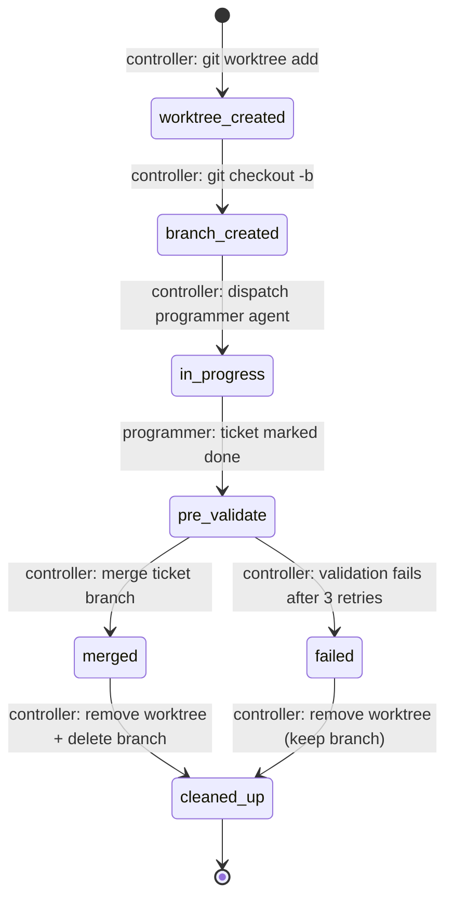

# Worktree Process for Parallel Ticket Execution

This document is the authoritative specification for the parallel-execution
worktree lifecycle in CLASI. It is a design document only — it does not
execute. When the stakeholder re-enables parallel ticket execution, the
implementation must satisfy this specification.

**Current state**: Parallel execution is disabled. The serial-only mandate in
`clasi/schemas/se-process/instructions/execution.md` is in effect and is not
modified by this sprint. This document captures the design intent so that
future implementers have a clear spec to work from.

---

## 1. Opt-In Gate

Parallel worktree execution is controlled by a sentinel file:

```
docs/clasi/.parallel-exec-enabled
```

**Enabled**: The file exists (any content; presence is the signal).
**Disabled**: The file is absent.

The controller checks for this file as the very first step of sprint execution.
If the file is absent, the controller uses the serial path unconditionally.
The serial path is unaffected by whether the file exists or not.

**Rationale**: A sentinel file is visible in `git status`, committable, and
requires no config-file parsing. It is harder to accidentally set than a boolean
in a JSON config. Removing it is a one-liner rollback. Compared to an environment
variable (not persisted, easy to forget) or a config key (harder to inspect), the
file sentinel is the most explicit and auditable choice.

---

## 2. Preconditions for Parallel Execution

All of the following conditions must be true before the controller creates any
worktree:

1. **Sprint phase is `executing`** — checked via `get_sprint_phase(sprint_id)`.
2. **Execution lock is held** — the controller must have acquired the lock via
   `acquire_execution_lock` before starting any ticket work.
3. **No tickets currently `in-progress`** — the controller must confirm that
   all previously dispatched tickets have completed (status `done` or `failed`)
   before starting a new parallel batch.
4. **Opt-in flag present** — `docs/clasi/.parallel-exec-enabled` exists.
5. **Independence check passes** — the candidate set of tickets must pass the
   independence determination algorithm (see Section 3).

If any precondition is not met, the controller falls back to the serial path for
the affected tickets.

---

## 3. Ticket Independence Determination

Two tickets are **independent** if their planned file-touch sets have no overlap
and they do not share a test module.

### Algorithm

1. **Extract file sets**: For each ticket, extract the set of files it plans to
   create or modify. The source for this set is, in priority order:
   a. `files_to_create` and `files_to_modify` keys in ticket frontmatter (if
      present).
   b. All paths listed in the `### Files to create` and `### Files to modify`
      subsections of the `## Implementation Plan` section in the ticket body.
   c. If neither source is available, the ticket is conservatively treated as
      **dependent** on all others.

2. **Source file overlap**: If `file_set(A) ∩ file_set(B) ≠ ∅`, tickets A and B
   are **dependent**.

3. **Test module overlap**: For each source file `f`, derive its test module
   path using the project's test-file naming convention (e.g., `clasi/foo.py`
   maps to `tests/test_foo.py`). If the derived test modules for A and B overlap,
   A and B are **dependent**, even if their source files are disjoint.

4. **Result**: Partition the ready tickets into independent groups. All tickets
   within a group may run in parallel. Groups themselves run in the serial order
   imposed by their dependency ordering.

### Precision caveat

Static extraction from ticket markdown is low-precision: files are listed by a
human planner, not computed from code analysis. This approach is acceptable for
an initial implementation because: (a) file lists in tickets are relatively
stable and curated by the sprint planner, and (b) false positives (treating
dependent tickets as independent) lead to merge conflicts, which are escalated to
the stakeholder (see Section 8), not silently corrupted. A future enhancement may
replace this with `git diff --name-only` from a dry-run or a pre-analysis pass.

---

## 4. Ownership

| Responsibility | Owner |
|----------------|-------|
| Worktree creation | Controller (team-lead / execute-sprint skill) |
| Per-ticket branch creation | Controller |
| Dispatch of programmer agent into worktree | Controller |
| Implementation and validation | Programmer agent |
| Pre-completion validation | Controller |
| Merge-back of ticket branch to sprint branch | Controller |
| Worktree cleanup | Controller |
| Audit record writes | Controller |

**The programmer agent does NOT create or destroy its own worktree.** It operates
within the worktree directory it was given, implements the ticket, runs tests, and
marks the ticket done. All lifecycle scaffolding is the controller's
responsibility.

Git hooks (`pre-commit`, `post-merge`) may observe lifecycle events and append
to the audit record, but they must not enforce lifecycle gates or block execution.
See Section 9 (Hooks vs. Controller).

---

## 5. Naming Conventions

### Worktree path pattern

```
../worktree-<sprint-id>-<ticket-id>/
```

The path is relative to the repository root but resolves to a sibling directory
of the repo root (i.e., outside the repo working tree). Using a path outside the
working tree prevents worktree directories from appearing as untracked entries in
the main repo's `git status` and prevents accidental `git add .` from picking up
worktree contents.

**Examples**:
- Sprint 022, ticket 001: `../worktree-022-001/`
- Sprint 022, ticket 003: `../worktree-022-003/`

### Per-ticket branch name pattern

```
ticket/<sprint-id>-<ticket-id>-<slug>
```

Where `<slug>` is derived from the ticket title by lowercasing and replacing
non-alphanumeric characters with hyphens, truncated to 40 characters.

**Examples**:
- Sprint 022, ticket 001, "Audit current state": `ticket/022-001-audit-current-state`
- Sprint 022, ticket 003, "Stub worktree module": `ticket/022-003-stub-worktree-module`

The branch lives in the worktree only during execution. After a successful
merge-back, the branch is deleted (see Section 7, Cleanup Rules).

---

## 6. Lifecycle State Machine

Each worktree passes through the following states in order:



### ASCII alternative (for environments without Mermaid rendering)

```
[worktree_created]
      |
      v  (controller: git checkout -b <ticket-branch>)
[branch_created]
      |
      v  (controller: dispatch programmer agent)
[in_progress]
      |
      v  (programmer: ticket status = done)
[pre_validate]
      |                     |
      v  (checks pass)      v  (checks fail, retries exhausted)
  [merged]              [failed]
      |                     |
      v  (remove worktree)  v  (remove worktree, keep branch)
[cleaned_up]          [cleaned_up]
```

Each state transition is written to the audit record immediately after the
transition completes (see Section 10).

---

## 7. Pre-Completion Validation

Before the controller initiates a merge-back, it must verify all three of the
following:

1. **Tests pass**: Run the project's test suite from within the worktree
   (`uv run pytest` or the project's equivalent). All tests must pass. A single
   test failure is grounds for retrying (see Section 8, Error Paths).

2. **Clean working tree**: The worktree must have no untracked files and no
   staged-but-uncommitted changes. Verified by `git status --porcelain` returning
   empty output. Any dirty state indicates the programmer agent left uncommitted
   work.

3. **Ticket status is `done`**: The ticket file's YAML frontmatter must have
   `status: done`. Verified by reading the ticket file directly.

If all three checks pass, the controller proceeds to merge. If any check fails,
the controller retries by re-dispatching the programmer agent (up to 3 total
attempts). If retries are exhausted, the controller escalates (see Section 8).

---

## 8. Merge Strategy and Conflict Resolution

### Fast-forward preference

The controller attempts a fast-forward merge first:

```
git merge --ff-only <ticket-branch>
```

This succeeds when the sprint branch has not advanced since the worktree was
created (i.e., no other ticket has merged in the interim). Fast-forward is
preferred because it produces a linear history and leaves no merge commit.

### Merge commit fallback

If fast-forward is not possible (the sprint branch has advanced), the controller
falls back to a standard merge commit:

```
git merge --no-ff <ticket-branch> -m "Merge ticket/<sprint-id>-<ticket-id>-<slug>"
```

**No rebase**: Rebase is explicitly prohibited. Rebasing rewrites the
per-ticket branch history, destroying the audit trail. The merge-commit approach
preserves both the sprint branch history and the per-ticket branch history.

### Conflict resolution

If `git merge` reports a conflict, the controller:

1. Aborts the merge (`git merge --abort`).
2. Retains the worktree (does not remove it).
3. Writes a `conflict` state to the audit record.
4. Escalates to the stakeholder with:
   - Which ticket branch conflicted with the sprint branch.
   - The names of the conflicting files.
   - The path to the retained worktree.
   - Recommended next action (manual resolution in the worktree, then re-run
     the merge validation step).

The controller does **not** attempt automatic conflict resolution.

---

## 9. Cleanup Rules

### On successful merge

After a ticket branch is successfully merged into the sprint branch:

```bash
git worktree remove --force <worktree-path>
git branch -d <ticket-branch>
```

Both operations are performed by the controller. The `--force` flag is used on
worktree removal to handle any lingering lock files (a non-force removal would
fail if the worktree was not cleanly exited).

### On failure or abandonment

When a ticket is marked `failed` (retries exhausted) or when the controller
aborts a worktree due to a conflict:

```bash
git worktree remove --force <worktree-path>
# Branch is RETAINED (no git branch -d)
```

The ticket branch is retained so that a human can inspect the partial work,
recover commits, or diagnose the failure. The branch name follows the standard
pattern so it is easily identified by the abandoned-branch detection mechanism
(see Section 10, Error Paths).

---

## 10. Audit and Recovery State

### Audit file location

```
docs/clasi/sprints/<NNN>-<slug>/.worktree-audit.json
```

This file is sprint-local. It is created when the first worktree is created for
the sprint and updated after each state transition.

### Schema

```json
{
  "sprint_id": "<sprint-id>",
  "worktrees": [
    {
      "ticket_id": "<ticket-id>",
      "path": "../worktree-<sprint-id>-<ticket-id>",
      "branch": "ticket/<sprint-id>-<ticket-id>-<slug>",
      "state": "<state>",
      "created_at": "<iso8601>",
      "merged_at": "<iso8601 or null>",
      "failed_at": "<iso8601 or null>",
      "error": "<error description or null>"
    }
  ]
}
```

Valid values for `state`: `worktree_created`, `branch_created`, `in_progress`,
`pre_validate`, `merged`, `failed`, `cleaned_up`.

### Write protocol

The controller writes the audit record after each state transition using an
atomic write (write to a temp file, then rename). This prevents partial writes
from corrupting the audit file.

### Read protocol

On session start (or after a controller crash), the controller reads
`.worktree-audit.json` to discover any worktrees that were not cleaned up. It
then proceeds per the recovery paths below.

### Audit file format rationale

The sprint-local JSON file (`.worktree-audit.json`) was chosen over a global
append-only log (`.clasi-audit.log`) for the following reasons:

- Sprint-local: Each sprint's audit is self-contained and moves with the sprint
  directory when archived. A global log requires filtering by sprint ID.
- Structured: JSON supports random reads and partial updates without line
  parsing. Recovery reads only need to open one file.
- Atomic: Rename-based writes make the file safe against partial writes in a
  way that append-based logs are not.

A global audit log may be added in the future for cross-sprint observability,
but it is not required for the initial implementation.

---

## 11. Hooks vs. Controller

Git hooks (`pre-commit`, `post-commit`, `post-merge`) **may** observe lifecycle
events and append observational records to `.worktree-audit.json`, but they
**must not**:

- Block a commit or merge (by returning a non-zero exit code for lifecycle
  reasons — as opposed to linting or test failures).
- Enforce worktree lifecycle gates (e.g., refusing a commit because the ticket
  is not `done`).
- Create or destroy worktrees.
- Change branch state.

**All enforcement is in controller code.** The controller is the single source
of truth for lifecycle state. Hook-based enforcement creates a hidden dependency
between the git repository state and the hook installation, which makes
the system fragile in CI environments, fresh checkouts, and worktrees where
hooks may not be installed.

Hooks are optional. The lifecycle is correct even if no hooks are installed.

---

## 12. Error Paths

### Merge conflict

**Trigger**: `git merge` exits with a conflict.

**Controller action**:
1. Abort merge.
2. Write `state: conflict` to audit record.
3. Retain worktree.
4. Escalate to stakeholder (see Section 8).

### Test failure with retry cap

**Trigger**: Pre-completion validation (Section 7) finds a test failure.

**Controller action**:
1. Log the failure to the audit record.
2. If attempt count < 3: re-dispatch programmer agent into the worktree with
   the test failure output as context.
3. If attempt count = 3: write `state: failed` to audit record, retain worktree
   and branch, escalate to stakeholder.

**Escalation message** must include: ticket ID, test output, worktree path, number
of attempts made.

### Orphaned worktree (controller crash)

**Trigger**: The controller crashes or is killed between state transitions,
leaving a worktree in a non-terminal state (`worktree_created`, `branch_created`,
or `in_progress`).

**Detection**: On the next session start, the controller reads
`.worktree-audit.json`. Any worktree entry with a non-terminal state and no
running programmer agent is considered orphaned.

**Controller action**:
1. Report the orphaned worktrees to the stakeholder.
2. Prompt for one of: resume (re-dispatch programmer agent), abandon (remove
   worktree, retain branch), or inspect (no action, just acknowledge).
3. Do not auto-resume without stakeholder confirmation.

### Abandoned branch

**Trigger**: After a failure or orphaned-worktree cleanup, a `ticket/<sprint-id>-*`
branch exists but no corresponding worktree is registered as active.

**Detection**: On session start, the controller lists all `ticket/<sprint-id>-*`
branches and cross-references against `.worktree-audit.json`. Any branch whose
audit entry is `failed`, `cleaned_up`, or missing is considered abandoned.

**Controller action**: Report to stakeholder and prompt for deletion or retention.

---

## 13. Current State Preamble

As of sprint 022 (2026-05-07), the worktree surface in the active codebase is:

| Location | Status | Nature |
|----------|--------|--------|
| `clasi/schemas/se-process/instructions/execution.md` | Active | Behavioral — serial-only mandate, prohibits worktrees; references this spec |
| `clasi/worktree.py` | Active (stub) | Public API stubs — all functions raise `NotImplementedError`; created in sprint 022 ticket 003 |
| `clasi/cli.py` line 291 | Active | Log label only, unrelated to worktree execution |
| `clasi/plugin/agents/old/sprint-executor/execute-ticket.md` | Archived | Historical narrative of old parallel path |
| `clasi/plugin/agents/old/project-architect/agent.md` | Archived | General narrative |
| `clasi/plugin/instructions/git-workflow.md` | Active | Minimal narrative, no worktree logic |
| All `docs/clasi/` references | Archive/planning | Narrative only |

`clasi/worktree.py` was created in sprint 022 (ticket 003) as an API attachment
point. All functions are stubs that raise `NotImplementedError`. No other active
module imports this module. The deleted files (`worktree-protocol.md`,
`parallel-execution/SKILL.md`) have no surviving implementations beyond the stubs.

This design document describes what must be built when the stakeholder lifts the
serial-only mandate.

---

## Open Questions

The following questions were open at the end of sprint 022. They are carried
forward for resolution in the implementation sprint.

### Q1: `clasi/worktree.py` necessity

The audit (ticket 001) found no existing production code to consolidate into a
worktree module. The only worktree references in active source code are:
(a) the prohibitive language in `execution.md`, and (b) an unrelated log label
in `cli.py`. Sprint 022 ticket 003 creates stub functions in `clasi/worktree.py`
as a code attachment point. When the implementation sprint begins, the team-lead
should confirm whether the stub functions are still the right starting point or
whether the module structure has evolved.

**Recommended resolution**: Keep the stub module. It serves as a compile-time
dependency anchor: any future module that imports from `clasi.worktree` will
immediately surface if the worktree module is deleted. The stub functions' docstrings
are the primary implementation contract.

### Q2: Audit file format — sprint-local JSON vs. global append log

This document chose sprint-local JSON (see Section 10 rationale). An alternative
is a global `.clasi-audit.log` with structured JSON lines, one per event.

**Recommendation for implementation sprint**: Start with sprint-local JSON. If
cross-sprint audit queries become a use case, add a global log as a secondary
mirror — do not replace the sprint-local file, since sprint archiving depends on
it being co-located.

### Q3: Independence check precision

Static extraction from ticket markdown is acknowledged to be low-precision
(Section 3, Precision Caveat). The initial implementation should use static
extraction. A follow-on improvement (separate ticket) may add a computed approach
(`git diff --name-only` against the ticket's branch tip) for higher precision.

**Decision**: Static extraction is acceptable for initial implementation. False
positives (spurious dependence detection) cause the system to fall back to serial
execution — a safe degradation. False negatives (missed dependence) cause merge
conflicts, which are escalated to the stakeholder. Neither failure mode causes
silent data corruption.
