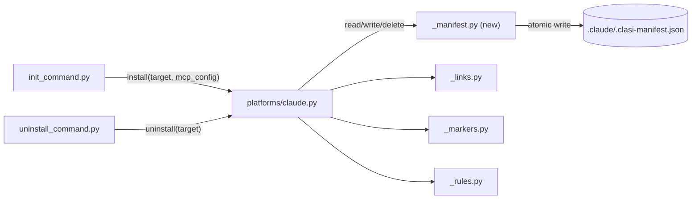

# clasi.platforms

**Owner:** clasi maintainers · **Last reviewed:** 2026-08-21 (sprint 033) · **Status:** stable

---

## 1. Purpose

`clasi.platforms` installs and uninstalls CLASI's file-based integration with a supported host AI coding tool in a target repository. **As of sprint 032**, Claude Code is the only platform adapter in master — `codex.py` and `copilot.py` were archived to the `archive/codex-copilot-adapters` branch (never dogfooded, reachable only via explicit `--codex`/`--copilot` flags, carrying a live bug where installing Codex after Claude overwrote Claude's resolved skill canonical). It remains its own subsystem — even at one adapter — because "detect which platform is in use and materialize its file layout" stays a self-contained problem or, if Codex/Copilot are ever un-archived, again becomes the "N near-identical instantiations sharing primitives" problem this subsystem was originally split out to hold. Nothing else in the codebase needs to know Claude's directory conventions.

## 2. Orientation

One advisory entry point plus one platform installer, sharing three leaf utility modules (the leaf/installer split was built for N platforms and is retained even at N=1, since it is what makes restoring an archived adapter additive rather than a redesign):

- `detect.py` — `detect_platforms(target)` scores observable signals (project files, installed commands, user config dirs, env var *names* only — never values) and returns an advisory `PlatformSignals` recommendation. **As of sprint 032**: with Codex/Copilot archived, live scoring and the CLI's install-choice prompt cover Claude only; the module's scoring fields for the archived platforms are inert dead weight pending ticket 001's cleanup pass, not a live three-way decision. Never writes files or makes an irreversible decision itself.
- `claude.py` — exposes `install(target, mcp_config)` / `uninstall(target)`: writing the host markdown file (CLAUDE.md/AGENTS.md), copying skills/agents/hooks from `plugin/`, updating Claude-specific settings and permissions files. **As of sprint 032**: `install`'s hooks step merges per event type instead of replacing `settings["hooks"]` wholesale (fixing F3 — a full-object replace previously deleted any user-defined hook silently on every `clasi init`), `uninstall`'s CLAUDE.md step strips CLASI's marker block via `strip_section` instead of `_links.unlink_alias`-ing the whole file (fixing F2 — matching what the AGENTS.md step two lines below it already did correctly), and `_create_rules` compares existing file content before writing and skips unchanged files, matching its own docstring's pre-existing claim (fixing F13). **As of sprint 033**: two independent uninstall-correctness fixes, both scoped to `uninstall()`. First (F14 / review finding, `port-clasr-manifest-uninstall-to-clasi-platforms.md`): `install()` now builds a manifest — a flat list of `{path, kind}` entries for every skill alias, agent file, rule file, CLAUDE.md/AGENTS.md marker block, and settings.local.json permission entry it writes — via the new `_manifest.py` leaf module (adapted from the archived `clasr` fork's `src/clasr/manifest.py`; see that module's own docstring for the schema this one intentionally simplifies). Before writing the new manifest, `install()` reads the *previous* manifest (if one exists) and deletes any path present there but absent from the new entries list — this reconciliation step, not present in `clasr`'s own port (which only used the prior manifest for install-time conflict detection, not cleanup), is what actually closes F14 for the common case: a project that re-runs `clasi init` after an upgrade that renamed a skill or split an agent file. `uninstall()` now reads the manifest and, when present, removes exactly the paths it lists — replaying what was actually written, not re-deriving "what should be there" from the currently-installed package's current name list — falling back to the pre-033 name-based enumeration only when no manifest exists (an install that predates this sprint). Second (`uninstall-hook-removal-uses-exact-match.md`, surfaced during 032/004's implementation): `uninstall()`'s `.claude/settings.json` hooks step now removes entries via the same per-entry `_is_clasi_hook_entry` predicate `install()`'s `_merge_hooks` already uses, instead of comparing each event type's entire entry list for exact equality against the plugin's `hooks.json` — the exact-match form silently stopped matching, and so stopped removing anything, the moment a user hook could legitimately coexist under the same event key (which sprint 032's own per-event merge fix made possible for the first time). Both fixes land in one ticket: both are `uninstall()` correctness fixes to the same function, and splitting them would mean two dispatches editing overlapping code with no independent value in doing so.
- `_links.py`, `_markers.py`, `_rules.py`, `_manifest.py` — shared leaf utilities with no CLASI imports of their own: symlink-with-copy-fallback, idempotent named marker-block read/write in host markdown files, the canonical prose bodies for CLASI's five path-scoped rules (single source of truth), and (new, sprint 033) atomic per-install manifest read/write/delete. **As of sprint 031**: `_rules.py`'s `source-code.md` body — loaded on every source edit — no longer points at "the execute-ticket skill" (a skill that does not exist anywhere under `plugin/skills/`; the only file by that name lives under the retired `plugin/agents/old/sprint-executor/`) — it points at the programmer agent definition instead. **As of sprint 032**: with only `claude.py` reading from `_rules.py`, the "both `claude.py` and `codex.py` import from here" framing in this doc's prior revision is obsolete — the single-canonical-source property still holds, now trivially (one reader), and is worth re-establishing rather than dropping if Codex is ever un-archived. **As of sprint 033**: `_manifest.py` is a deliberate simplification of `clasr`'s reference implementation, not a verbatim port — `clasr` keyed each manifest by `provider` because one host directory (e.g. `.claude/`) could hold content from several distinct provider packages layered together; `clasi` has exactly one installer identity, so the `provider` dimension is dropped and the manifest is a single file, `.claude/.clasi-manifest.json`, holding one `{"version": 1, "entries": [...]}` document. `manifest_path`/`write_manifest`/`read_manifest`/`delete_manifest` keep `clasr.manifest`'s names and atomic-write behavior (write to `.tmp`, `os.replace` over the final path — the same crash-safety pattern sprint 029 established for frontmatter writes) unchanged; only the provider-keyed path segment is removed.

## 3. Constraints and Invariants

- **`detect.py` never reads environment variable values, only names, and never writes anything:** it is explicitly advisory — a violation would make platform detection a covert credential-reading path, which the module's own docstring calls out as a hard boundary.
- **`_links.py`, `_markers.py`, `_rules.py` are leaf nodes:** no CLASI imports, no platform-specific knowledge. Adding a CLASI import to any of these re-couples modules the split was meant to decouple.
- **Rule content lives only in `_rules.py`:** `claude.py` may not hardcode a rule body inline.
- **Marker blocks must preserve user content outside the block:** `_markers.py`'s create/update/append semantics are idempotent specifically so re-running install never destroys content a user added to CLAUDE.md/AGENTS.md outside the CLASI section.
- **`claude.py`'s writes merge or compare; none may overwrite wholesale (sprint 032):** the `.mcp.json` server entry (owned by `init_command.py`, see below), hooks, CLAUDE.md, and rule files each follow a "leave what's already there unless it's ours to update" rule. A future write site in this subsystem that replaces a whole file or a whole JSON object instead of merging/comparing reintroduces exactly the F1-F4/F13 failure class sprint 032 fixed — the CLASI-owned this-repo `.mcp.json` incident (2026-07-16) is the concrete cost of getting this wrong once already.
- **Uninstall's source of truth for what to remove is the recorded manifest, not the currently-installed package's current name list (sprint 033):** `uninstall()` replays `.claude/.clasi-manifest.json` when present, closing the class of bug where a file written by an older `clasi` under a name the current version no longer uses is orphaned forever. This does not conflict with the merge-or-compare rule above — reconciliation and uninstall only ever delete paths *this subsystem itself previously wrote and recorded*, never a path outside the manifest's own entries, so a user-owned file is never at risk regardless of manifest state. An install that predates sprint 033 has no manifest; `uninstall()` falls back to the pre-033 name-based enumeration exactly once per such project (the next `clasi init` writes a manifest, after which the fallback is never exercised again for that project).

## 4. Design

The one remaining platform installer follows the same shape a multi-platform version would: copy `plugin/skills`, `plugin/agents`, `plugin/hooks` content into Claude's expected location (symlinked where supported, copied where not — see `_links.link_or_copy`'s `copy` fallback flag), write/update CLAUDE.md/AGENTS.md's CLASI-managed section via `_markers.write_named_section`, and write the five path-scoped rule files from `_rules.py`'s canonical bodies, comparing before writing. `detect.py` is called by `init_command.py` (outside this subsystem) to recommend which installer to run, not by the installer itself — detection and installation stay deliberately decoupled so a caller can override the recommendation, the same reason this held when there were three installers to choose among.

**As of sprint 033**: `claude.py` gains its first dependency on a new leaf module, `_manifest.py`, on both the install and uninstall paths:

`install()` writes the manifest last, after every other artifact (skills,
agents, rules, marker blocks, permissions) has already been written —
matching the existing "write plugin content, then hooks, then rules,
then version stamp" ordering already in the function, and matching
`clasr`'s own "manifest write is step 6, last" convention. `uninstall()`
reads the manifest first, before touching any file, so a manifest read
failure (corrupt JSON) is caught before any deletion begins rather than
mid-removal; on a read failure it falls back to the pre-033 path the
same as a missing manifest, rather than raising and leaving the target
project's CLASI integration in a stuck, un-removable state.

Separately (not shown in the diagram above — it is a same-function
predicate reuse, not a new module dependency), `install()`'s
`_merge_hooks` and `uninstall()`'s hooks-removal step now both call the
same `_is_clasi_hook_entry(entry)` predicate to decide whether a
`hooks.json` entry is CLASI's own. Before this sprint, install used that
predicate and uninstall used a separate exact-match comparison of an
entire event type's entry list — the two could and did drift apart the
moment `install`'s per-event merge (sprint 032) made it possible for a
CLASI entry and a user entry to coexist under one event key. Stating the
symmetry once, as one predicate two call sites share, is what prevents
that drift from recurring: a future change to what counts as "CLASI's
own" now has exactly one place to change.

## 5. Interfaces

### Exposes
- **`detect_platforms(target: Path) -> PlatformSignals`:** advisory-only platform recommendation; read-only, no side effects. Codex/Copilot scoring fields remain in the return shape (harmless, unused) pending ticket 001's cleanup pass.
- **`install(target: Path, mcp_config: dict) -> None`** and **`uninstall(target: Path) -> None`**, `claude.py`'s pair (the only one in master as of sprint 032). Neither knows about shared scaffolding (TODO dirs, log dir, `.mcp.json`) — that remains `init_command.py`'s job.

### Consumes
- **`plugin/` (this repo's `clasi-core` narrative in `design.md`):** the source content the installer copies from — skills, agents, hooks, instructions, rules.
- **`init_command.py` (top-level, not its own subsystem):** the caller that orchestrates detection and installation together, owns shared scaffolding outside any single platform's concern, and (as of sprint 032) leaves an existing `.mcp.json` `clasi` server entry untouched rather than unconditionally rewriting it to the consumer default.

## 6. Open Questions / Known Limitations

- Whether to fully remove `detect.py`'s Codex/Copilot scoring fields now versus leaving them as inert dead weight until/unless the adapters are un-archived is left to ticket 001's implementer — either is safe; this doc doesn't mandate one.
- If Codex/Copilot are ever restored from `archive/codex-copilot-adapters`, the shared canonical-skill-writer requirement this doc's pre-032 revision described (install order must not change the resolved-skill result) becomes live again and should be re-ticketed at that time — it was deliberately not built speculatively in sprint 032 (see sprint 032's `sprint.md` Design Rationale).
- `detect.py`'s "all scores zero -> default to claude" fallback is now closer to "the only meaningful default," but the fallback logic itself is unchanged by sprint 032.
- **(sprint 033)** The manifest model closes F14 for the case sprint 033 scoped: a project that re-runs `clasi init` after upgrading (reconciliation deletes what the old manifest recorded and the new one doesn't). It also correctly handles the case where a project upgrades the `clasi` package but never re-runs `init` at all before uninstalling — the stale-but-present manifest from the last install still correctly describes what's on disk, and replay removes it correctly, no reconciliation needed for that path. Not handled, and out of this sprint's scope: a project that hand-edits or deletes `.claude/.clasi-manifest.json` between install and uninstall gets whatever `uninstall()`'s fallback does (pre-033 name-based enumeration, same limitations as before this sprint) — the manifest is trusted, not re-verified against disk state.
- **(sprint 033)** `codex.py`/`copilot.py`, if ever restored from `archive/codex-copilot-adapters`, will need their own `_manifest.py` integration (or a shared one, if the leaf module's provider-less simplification still holds for a multi-adapter future — worth revisiting at that time, since it was dropped specifically because `clasi` had exactly one adapter when this sprint made the call) — left to that future restoration ticket, same as the other Codex/Copilot open questions above.
