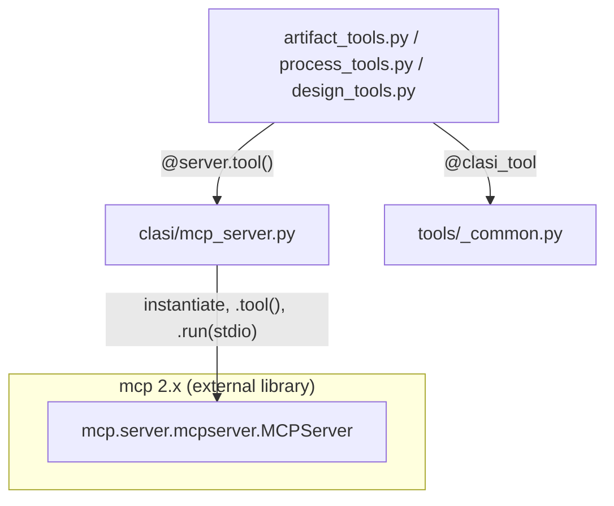

<!-- CLASI: Before changing code or making plans, review the SE process in CLAUDE.md -->

# Sprint 033: Finish the debt: mcp 2.x, manifest uninstall, hook symmetry

This is the last sprint of the reliability campaign
(`docs/reviews/2026-08-reliability/00-review.md`). Sprints 028-032 are
closed and merged (version 0.20260821.1); this sprint clears the three
remaining tracked debt items the campaign's own review deferred rather
than fixing inline.

## Goals

- Migrate CLASI's own MCP server off the `mcp` 1.x API before the
  `mcp>=1.0,<2.0` cap in `pyproject.toml` becomes a permanent liability,
  without ever leaving the team-lead's own MCP tooling non-functional
  mid-sprint.
- Close review finding F14 (uninstall orphans files written by an older,
  differently-named version of `clasi`) by porting `clasr`'s
  manifest-based uninstall model into `clasi.platforms`.
- Fix uninstall's hook-removal exact-match regression surfaced during
  sprint 032 ticket 004's implementation, so a user hook coexisting
  under a CLASI event key no longer blocks CLASI's own entries from
  being stripped.

## Problem

Three linked issues, wildly different in size and risk:

1. **`migrate-to-mcp-2-x-api.md`** — `mcp_server.py` still imports `from
   mcp.server.fastmcp import FastMCP`, an API surface `mcp` 2.x deletes
   entirely. Sprint 029 ticket 001 papered over this with a version cap
   after an unbounded `mcp>=1.0` dependency resolved to `mcp==2.0.0` and
   broke every fresh `clasi init`. Sprint 030 ticket 005 built the
   precondition this migration needs — an owned `@clasi_tool` decorator
   in `tools/_common.py` that no longer depends on monkey-patched FastMCP
   internals for NONE-sentinel stripping — but `mcp_server.py` itself was
   deliberately left untouched. It still has three more private-internal
   touches `@clasi_tool` never covered, because they predate it and serve
   different purposes: a diagnostic tool-schema dump
   (`server._tool_manager._tools`, unguarded — a future private-shape
   change here would crash startup outright, not just degrade), a
   staleness-warning append (`server._mcp_server.instructions`, already
   guarded), and a raw-RPC diagnostic tap
   (`mcp.types.JSONRPCMessage.model_validate_json`, already guarded).
2. **`port-clasr-manifest-uninstall-to-clasi-platforms.md`** —
   `platforms/claude.py`'s `uninstall()` enumerates the skill/agent/rule
   names the *currently installed* package uses and removes files
   matching those names. A file written by an older `clasi` under a name
   that has since been renamed or split is never found, and is orphaned
   forever. `clasr` (archived to the local branch `archive/clasr` in
   sprint 032) solved this with a per-install manifest recording exactly
   what was written; `clasi.platforms` never adopted that model.
3. **`uninstall-hook-removal-uses-exact-match.md`** — sprint 032 ticket
   004 made `install()`'s hook merge per-entry
   (`_is_clasi_hook_entry`/`_merge_hooks`), so a user hook can now
   legitimately coexist with CLASI's own entries under one event key.
   `uninstall()`'s hook-removal step was not updated to match: it still
   compares an entire event type's entry list for exact equality against
   the plugin's `hooks.json`, which no longer matches once a user entry
   is mixed in — so CLASI's own hook entries survive an uninstall and
   keep firing against a project that no longer has CLASI installed.

## Solution

Two tickets. Issues 2 and 3 are both `uninstall()` correctness fixes in
the same function of the same file and share one ticket (see Architecture
Design Rationale for why). Issue 1 is a full ticket on its own, ordered
*after* the uninstall-correctness ticket for risk isolation — not because
of a code dependency, but so that if the mcp migration needs its own
rollback near the end of the sprint, the other deliverable is already
committed and unaffected.

- **Ticket 001 — Uninstall correctness (manifest + hook symmetry).** Port
  a simplified, single-tenant version of `clasr`'s manifest model
  (`platforms/_manifest.py`, new) into `platforms/claude.py`'s
  `install()`/`uninstall()`, including install-time reconciliation
  against the previous manifest (a step `clasr`'s own port does not have,
  needed to actually close F14 for the common "re-run `clasi init` after
  upgrading" case — see Design Rationale). Fix `uninstall()`'s hook
  removal to reuse `_is_clasi_hook_entry` instead of exact-match.
- **Ticket 002 — Migrate `mcp_server.py` to the mcp 2.x API.** Replace
  `FastMCP`/`mcp.server.fastmcp` with `MCPServer`/`mcp.server.mcpserver`
  (verified against an installed `mcp==2.0.0` — see Architecture); fix or
  guard the three private-internal touches `@clasi_tool` doesn't cover;
  remove `pyproject.toml`'s cap as the ticket's last step, only after
  local verification passes; the end-of-sprint E2E run is the final,
  fresh-dependency-resolve proof.

## Success Criteria

- `clasi mcp` starts and serves every tool under `mcp>=2.0`, with the
  `pyproject.toml` cap removed.
- `@clasi_tool`'s NONE-sentinel stripping is proven, by a unit test that
  does not depend on FastMCP/MCPServer, to still strip `"NONE"` to `None`
  under `mcp` 2.x — not merely inferred from "the server starts."
  (`tests/unit/test_tools_common.py` already provides this test
  independent of the library surface; ticket 002 confirms it stays green
  and does not regress it.)
- A fresh-resolve container run (`uv build --wheel` + throwaway `pip
  install`, no lockfile) confirms both `clasi init` and `clasi mcp` work,
  per the end-of-sprint E2E.
- `clasi uninstall` removes every path a prior install actually wrote,
  including a path written under a name a later version no longer uses,
  proven by a test that installs, simulates a renamed skill by
  re-installing with a different skill set, and asserts the old file is
  gone.
- A test proves a user-defined hook under a CLASI event key survives
  `clasi uninstall` while every CLASI `hooks.json` entry under that same
  key is removed.

## Scope

### In Scope

- `src/clasi/mcp_server.py` (FastMCP → MCPServer migration and its three
  private-internal touches).
- `src/clasi/tools/_common.py` (verified, not modified — see Architecture
  Design Rationale for why this is stated as an explicit check rather
  than assumed).
- `tests/unit/test_mcp_server.py`, `tests/unit/test_tools_common.py`.
- `pyproject.toml`'s `mcp` dependency cap.
- `src/clasi/platforms/claude.py`'s `install()`/`uninstall()`.
- `src/clasi/platforms/_manifest.py` (new).
- `tests/unit/test_platform_claude.py`, `tests/unit/test_uninstall_command.py`.

### Out of Scope

- Restoring `codex.py`/`copilot.py` from `archive/codex-copilot-adapters`
  — a separate future ticket per `platforms-DESIGN.md`'s own Open
  Questions; this sprint's manifest work is deliberately single-tenant
  (see Design Rationale) and does not build speculative multi-provider
  support for a restoration that hasn't been scheduled.
- `detect.py`'s dead Codex/Copilot scoring-field cleanup (sprint 032
  ticket 001's own explicitly deferred follow-up).
- Removing the raw-RPC `JSONRPCMessage` diagnostic tap in `mcp_server.py`
  — flagged debug scaffolding since sprint 030, verified-but-untouched
  again this sprint (see Architecture Migration Concerns).
- Any change to `clasr` itself — `archive/clasr` is read-only reference
  material for this sprint, per the issue's own framing.
- A standalone `clasi platforms reconcile` recovery command for projects
  that are already orphaned by a pre-033 install — flagged as an Open
  Question, not built here.

## Test Strategy

- Ticket 001: scoped `pytest` runs against
  `tests/unit/test_platform_claude.py` and
  `tests/unit/test_uninstall_command.py`, in the foreground, per
  `source-code.md` rule 4 (ticket work scopes to the modules it touches;
  the full suite runs once, at `close_sprint`).
- Ticket 002: scoped `pytest` runs against `tests/unit/test_mcp_server.py`
  and `tests/unit/test_tools_common.py`, plus a manual local smoke test
  (`clasi mcp` against a scratch venv with `mcp==2.0.0` installed) before
  the `pyproject.toml` cap is touched — see Architecture Migration
  Concerns for the exact sequencing and why.
- Full suite runs exactly once, at `close_sprint`, per this project's own
  leaner-flow convention.
- The end-of-sprint E2E run (team-lead-run, not ticket-scoped) is the
  final fresh-dependency-resolve proving ground for ticket 002
  specifically — see Architecture Migration Concerns for the four things
  it needs to check, including the fail-open-specific NONE-sentinel
  check that "the server started" cannot substitute for.

## Architecture

**Substantial** — four modules touched across two independent subsystems
(`mcp_server.py`, `tools/_common.py` [verified], `platforms/claude.py`,
`platforms/_manifest.py` [new]), and ticket 001 introduces a new
cross-module dependency (`claude.py` → the new `_manifest.py`) that did
not exist before. This clears the substantial-tier bar on module count
and on the new-dependency signal independently; no data-model change (a
JSON manifest file is a new artifact, not a new database entity) and no
dependency-direction change. Per this project's design-doc-set opt-in
(`design_docs: enabled`), the full write-up below is mirrored into the
sprint's `design/` overlay — `clasi/sprints/033-.../design/DESIGN.md`,
`tools-DESIGN.md`, and `platforms-DESIGN.md` carry the same content
applied directly to each affected canonical doc, for `apply` to merge
back at close. This section is the sprint-level synthesis; the overlay
files are the doc-level detail.

### 1. Understand the Problem

See the Problem section above for the three issues' own narrative. All
three are debt items the reliability campaign's own review (`02-mcp-tools.md`
F5, `04-cli-install-platforms.md` F14, and a defect surfaced mid-campaign
during 032/004's implementation) deliberately deferred rather than fixed
inline — F5 because its precondition (`@clasi_tool`) didn't exist yet;
F14 because it needed its own planning pass; the hook-removal bug because
it was out of 032/004's ticket scope and reported rather than silently
fixed. This sprint is that planning pass and that follow-up, landing
together because both this sprint and the campaign it closes reward doing
debt cleanup as one coordinated pass rather than three uncoordinated
one-off fixes.

The one property that makes issue 1 different from the other two: CLASI's
own MCP server is the tooling the team-lead uses to run this sprint. A
broken `platforms/claude.py` fails a test and blocks a ticket; a broken
`mcp_server.py` means no `create_ticket`, no `update_ticket_status`, no
`close_sprint` — the tools needed to finish and close this sprint at all.
Every architectural choice below for ticket 002 is shaped by that
asymmetry.

### 2. Identify Responsibilities

- **R1 — MCP transport binding.** `mcp_server.py`'s job is to bind
  CLASI's registered tools to whatever library object speaks the MCP
  wire protocol over stdio. This changes independently of what the tools
  themselves do — it is a dependency-version concern, not a business-logic
  one.
- **R2 — Per-call tool contract.** NONE-sentinel stripping, the uniform
  `{"ok": ...}` envelope, and call tracing are `tools/_common.py`'s job,
  already isolated from R1 since sprint 030. This sprint's job for R2 is
  to *verify* that isolation held under a real library-surface change,
  not to change it.
- **R3 — Per-install manifest tracking.** Recording exactly which paths,
  marker blocks, and permission entries one `clasi init` run wrote, so a
  later `clasi uninstall` (possibly running under a different `clasi`
  version) can reverse precisely that, is a new responsibility that
  belongs with `platforms/claude.py`'s install/uninstall pair, not with
  any artifact- or MCP-layer module.
- **R4 — Hook-entry ownership.** "Is this `hooks.json` entry CLASI's own"
  is one predicate (`_is_clasi_hook_entry`, existing since sprint 032)
  that both the install-time merge and now the uninstall-time removal
  must agree on. This sprint does not create this responsibility; it
  removes uninstall's second, drifted definition of it.

### 3. Define Subsystems and Modules

- **`mcp_server.py`** — Purpose: bind CLASI's tool registry to the `mcp`
  library's server implementation. Boundary: owns the `MCPServer`
  instance, stdio transport, and startup-time diagnostics; does not own
  tool business logic (`tools/`) or the per-call contract
  (`tools/_common.py`). Use cases: SUC-001.
- **`tools/_common.py`** — Purpose: give every `@server.tool()` function a
  uniform call contract. Boundary: unchanged by this sprint — verified,
  not modified. Use cases: SUC-001.
- **`platforms/_manifest.py`** (new) — Purpose: persist and replay the set
  of paths one `clasi` install wrote for one target project. Boundary:
  pure filesystem/JSON, no `clasi` imports (matching `clasr.manifest`'s
  own boundary rule verbatim), consumed only by `platforms/claude.py`.
  Use cases: SUC-002.
- **`platforms/claude.py`** — Purpose: materialize and reverse CLASI's
  file-based integration in a Claude Code project. Boundary: unchanged in
  scope, gains a dependency on `_manifest.py` and reuses its own
  `_is_clasi_hook_entry` predicate symmetrically between install and
  uninstall. Use cases: SUC-002, SUC-003.

### 4. Diagrams

Component diagram required: 4 modules touched and a new cross-module
dependency (`claude.py` → `_manifest.py`). Two diagrams, one per
independent subsystem — a single combined diagram would mix two unrelated
concerns (mcp transport binding vs. filesystem manifest tracking) into
one picture that clarifies neither, so they're kept separate per the
"one concern per diagram" guideline.

**mcp server library binding (ticket 002):**

The point of this diagram is an absence: there is no edge from
`tools/_common.py` to either `mcp_server.py` or the `mcp` library. Grepping
`_common.py` for any `mcp`/`FastMCP`/`MCPServer` import confirms zero
matches, before and after this sprint's changes — the sprint-030
decoupling this ticket depends on is real, not aspirational.

**Manifest-tracked uninstall (ticket 001)** — see
`clasi/sprints/033-.../design/platforms-DESIGN.md`'s sprint-033 entry for
the diagram (reproduced there rather than duplicated here, since that
overlay file is the doc `apply` merges back onto
`src/clasi/platforms/DESIGN.md` at close): `init_command.py` and
`uninstall_command.py` both call `platforms/claude.py`'s `install()`/
`uninstall()`, which now also reads/writes/deletes through the new
`_manifest.py`, alongside its existing `_links.py`/`_markers.py`/
`_rules.py` dependencies.

No entity-relationship diagram: the manifest is one flat JSON document
(`{"version": 1, "entries": [...]}`), not a relational or multi-entity
model — a table/entity diagram would show one box, which adds nothing
beyond the schema already quoted in the Design Rationale below. No
dependency-graph diagram beyond the two component diagrams above: no
existing dependency *direction* changes, only one new edge is added.

### 5. What Changed / Why / Impact on Existing Components / Migration Concerns

**What Changed — ticket 002 (mcp 2.x):**

Verified directly (installed `mcp==2.0.0` — currently the only 2.x
release — into a disposable scratch venv and inspected it) rather than
assumed from the issue text's "or whatever the 2.x equivalent is":

- `FastMCP` is renamed `MCPServer`, module path `mcp.server.fastmcp` →
  `mcp.server.mcpserver`. Constructor signature keeps the same
  `(name, ..., instructions=...)` shape; `.tool()` and
  `.run(transport="stdio")` are both still present with the same call
  shape `mcp_server.py` already uses. This is close to a drop-in rename
  for the three call sites (constructor, `.tool()` decorator usage
  across three tool modules, `.run()`).
- The private attribute the staleness-warning append writes to
  (`server._mcp_server.instructions`) no longer exists; its 2.x
  equivalent is `server._lowlevel_server.instructions` (a plain
  attribute, not a property, so it stays settable). The existing
  `try/except AttributeError` around this write already degrades to a
  logged warning rather than a crash under the old code — this is a
  correctness fix, not a hazard-closing one, but is still an accurate
  rename to make.
- `server._tool_manager._tools` (the unguarded diagnostic tool-schema
  dump) is confirmed structurally unchanged under 2.x
  (`ToolManager._tools` is still a plain `dict[str, Tool]` at the same
  attribute path) — but this is the one touch of the four with no
  exception guard today. Ticket 002 wraps it the same way the
  instructions-write already is, so a *future* private-shape change
  degrades to a missing diagnostic log line instead of a crashed server
  startup — closing a real gap this sprint's own investigation found,
  not one the issue text originally named.
- `mcp.types.JSONRPCMessage.model_validate_json` (the raw-RPC diagnostic
  tap) is confirmed to still resolve under 2.x (`mcp.types.JSONRPCMessage`
  mirrors the standalone `mcp_types.JSONRPCMessage`, a pydantic
  `RootModel` that still exposes `model_validate_json`). Already guarded
  by a broad `try/except`; left exactly as flagged (future debug-scaffolding
  cleanup, out of scope) — verified, not touched.
- `tools/_common.py` requires zero changes — confirmed by grep, no import
  of `mcp`/`FastMCP`/`MCPServer` anywhere in the file, before or after.
  This is the precondition the team-lead asked to be verified rather than
  assumed, and it holds.
- `tests/unit/test_mcp_server.py` imports `FastMCP` directly and asserts
  `isinstance(server, FastMCP)`, and pokes `server._tool_manager._tools`
  in two places — this file *will* break under the migration and needs
  updating (rename to `MCPServer`, update the isinstance check) as part
  of this ticket. `tests/unit/test_tools_common.py` needs no change —
  it already exercises `@clasi_tool`'s NONE-sentinel stripping against
  synthetic functions with zero FastMCP/MCPServer dependency, and stays
  green through the migration unmodified — this is the acceptance
  criterion "a positive test that the sentinel still strips" the team-lead
  asked for, and it already exists rather than needing to be written from
  scratch.

**What Changed — ticket 001 (uninstall correctness):** see
`platforms-DESIGN.md`'s sprint-033 entry (mirrored in this sprint's
overlay) for the full write-up: `_manifest.py` (new, adapted from
`clasr.manifest`, single-tenant simplification), `install()` now builds
an entries list and reconciles against the previous manifest before
writing the new one, `uninstall()` replays the manifest when present and
falls back to the pre-033 name-based path when absent, and `uninstall()`'s
hook-removal step now reuses `_is_clasi_hook_entry` instead of an
exact-match list comparison.

**Why:** F5 (mcp 2.x) because the `mcp>=1.0,<2.0` cap is a standing
liability, not a permanent fix — every day it stays in place is a day
CLASI cannot pick up an `mcp` security or feature release. F14 (manifest
uninstall) because the current failure mode is silent and permanent: an
orphaned file left by an old `clasi` version is invisible to every future
uninstall, forever, with no error and no log line. The hook-removal bug
because CLASI's own hook entries surviving an uninstall fail *noisily* on
every matched tool call in a project the user believes no longer has
CLASI installed — a worse user experience than the orphaned-file case,
just for a different reason (noisy failure vs. silent litter).

**Impact on Existing Components:** `tools/_common.py`, every tool module
under `tools/` other than the `.tool()`/`import` call sites, and every
artifact-model module (`sprint.py`, `ticket.py`, `issue.py`, etc.) are
unaffected by ticket 002 — the migration is contained to `mcp_server.py`
and its two direct test files. `platforms/_links.py`, `_markers.py`, and
`_rules.py` are unaffected by ticket 001 — the new dependency is additive
(`claude.py` → `_manifest.py`), not a change to any existing edge.
`init_command.py`/`uninstall_command.py` (the callers of `claude.py`'s
`install()`/`uninstall()`) need no change — the public
`install(target, mcp_config)`/`uninstall(target)` signatures are
unchanged by either ticket.

**Migration Concerns:**

*Ticket 002 sequencing and rollback (the hazard the team-lead asked this
architecture to address explicitly):*

1. The `pyproject.toml` `mcp>=1.0,<2.0` cap removal is ticket 002's
   **last** internal step, not an early one — deliberately, so that
   routine dependency resolution during the ticket's own development
   (`uv sync`, reinstalls) cannot pull `mcp==2.0.0` into the team-lead's
   live MCP session before the code changes are even complete. The order
   is: (a) make the code changes against a disposable scratch venv with
   `mcp==2.0.0` installed (not the live dev environment); (b) run the
   scoped test suite (`test_mcp_server.py`, `test_tools_common.py`)
   green in that scratch venv; (c) manually smoke-start `clasi mcp` in
   that scratch venv and confirm "CLASI MCP server ready" with no
   traceback, ideally with one real tool call; (d) only then remove the
   `pyproject.toml` cap and commit.
2. **Rollback if `clasi mcp` will not start** after this lands (e.g. the
   E2E's fresh resolve surfaces a problem the scratch-venv check missed):
   revert ticket 002's commit(s) as a unit (`git revert`, this repo's own
   git safety protocol — never `reset --hard` on shared history). This
   must restore the `pyproject.toml` cap **and** the `mcp_server.py` code
   change together — reinstating the cap alone, without reverting the
   `MCPServer`-import code, would leave `mcp_server.py` importing
   `mcp.server.mcpserver`, a module that does not exist under `mcp` 1.x,
   which is strictly worse (an unconditional `ImportError`, no working
   fallback) than the pre-migration state. After reverting, reinstall the
   editable dev install (this project's own convention — `.venv`
   editable, not `pipx`) and restart the Claude Code session so a fresh
   MCP server subprocess picks up the reverted code. Verify with a manual
   `clasi mcp` shell invocation *before* trusting a new session to
   reconnect — a session that starts against a still-broken server has no
   tools left to report the problem with.
3. **Ticket ordering** (001 before 002 in this sprint) is for risk
   isolation, not a code dependency: if ticket 002 needs the rollback
   above near the end of the sprint, ticket 001's work is already
   committed and completely unaffected by that revert.
4. **What the end-of-sprint E2E run needs to check, specifically for
   ticket 002:** the E2E's container build performs a genuinely fresh
   dependency resolve with no lockfile involved — the exact condition
   that produced the original `mcp==2.0.0` break, and the condition
   ticket 002's own scratch-venv check can only approximate. The E2E
   needs to confirm, in order: (i) the fresh resolve picks up `mcp==2.0.0`
   (or whatever is latest 2.x by then) now that the cap is gone, not a
   cached 1.x wheel; (ii) `clasi mcp` starts inside the container with no
   traceback, reaching "CLASI MCP server ready"; (iii) at least one real
   tool call succeeds end-to-end through the subject session, proving the
   `MCPServer` wiring under real transport, not just import; (iv) — the
   check a "did the server start" assertion cannot substitute for — a
   tool call made with an omitted optional argument (the `"NONE"`
   sentinel path a real agent exercises on nearly every call, per
   `.claude/rules/tool-call-empty-args.md`) is confirmed, via the E2E's
   captured `mcp-calls.jsonl` trace or subject transcript, to have
   reached the tool function as Python `None`, not the literal string
   `"NONE"`. Check (iv) is the fail-open-specific one: a naive migration
   passes (i)-(iii) and still silently reintroduces the exact regression
   this issue exists to prevent, because a crash is loud and a
   `"NONE"`-string leaking through is not.

*Ticket 001 migration concerns:* a project that installed CLASI before
sprint 033 has no manifest file; its first post-033 `clasi uninstall`
falls back to the pre-033 name-based removal path (unchanged behavior,
not a regression), and its first post-033 `clasi init` writes a manifest
for the first time — from that point forward the fallback is never
exercised again for that project. No migration script or one-time
backfill is needed or provided; the fallback *is* the migration story.

### 6. Design Rationale

**Decision: drop the `provider` dimension from the ported manifest
schema.**
*Context:* `clasr`'s manifest is keyed by `provider` because one host
directory (e.g. `.claude/`) could hold content from several distinct
provider packages layered together. `clasi` has exactly one installer
identity.
*Alternatives considered:* port the schema verbatim with a hardcoded
`provider="clasi"` constant field, preserving structural parity with
`clasr` for a hypothetical future multi-provider need.
*Why this choice:* a field that can only ever hold one constant value is
speculative generality — the exact anti-pattern this project's own
architecture principles call out. Dropping it is simpler and the manifest
becomes a single file, `.claude/.clasi-manifest.json`, instead of
`.claude/.clasr-manifest/<provider>.json`.
*Consequences:* if Codex/Copilot are ever restored from
`archive/codex-copilot-adapters`, the provider dimension (or an
equivalent per-adapter manifest) may need reintroducing — explicitly
flagged as an Open Question below, not silently precluded.

**Decision: add install-time reconciliation against the previous
manifest — a step `clasr`'s own reference implementation does not have.**
*Context:* `clasr`'s `install()` reads the prior manifest only for
install-time conflict detection (which paths are "ours to overwrite
without conflict"); its own `uninstall()` only ever replays the
*current* manifest. A file written under a name a later install no longer
uses is silently dropped from tracking the moment the new manifest
overwrites the old one — one install cycle later than clasi's original
bug, but not actually fixed.
*Alternatives considered:* port `clasr`'s behavior verbatim and accept
that the fix covers only "upgrade the `clasi` package without re-running
`init`" — a real but narrower case than F14's motivating scenario.
*Why this choice:* re-running `clasi init` after an upgrade is the common
case, not the edge case — this repo's own sprint history is the evidence
(`clasi init` gets re-run against this very repo after nearly every
plugin-content-changing sprint). A fix that leaves the common case
unfixed doesn't actually close F14 for the scenario that motivated
writing the issue.
*Consequences:* `install()` does more work than a verbatim port would
(read old manifest, diff, delete orphaned paths) — new logic with no
precedent in `clasr`'s own test suite to inherit confidence from, so
ticket 001 needs its own dedicated test coverage for the reconciliation
path specifically, not just for manifest replay.

**Decision: combine issues 2 and 3 into one ticket.**
*Context:* both are `uninstall()` correctness fixes touching the same
function in the same file (`platforms/claude.py`).
*Alternatives considered:* two separate, sequenced tickets.
*Why this choice:* no independent value in splitting — two dispatches
editing overlapping code in one function risk merge friction with no
corresponding benefit, since neither fix blocks or depends on the other
and each is individually small.
*Consequences:* ticket 001's acceptance criteria carry both issues' full
criteria; one programmer session implements both.

**Decision: `pyproject.toml` cap removal is ticket 002's last step, not
an early one.**
*Context:* the team-lead's own live MCP session depends on the exact code
this ticket changes.
*Alternatives considered:* remove the cap early in the ticket's own
development, to force continuous testing against the real uncapped
dependency throughout.
*Why this choice:* removing the cap early means every routine
`uv sync`/reinstall during ticket 002's own development risks pulling
`mcp==2.0.0` into the team-lead's actual dev environment before the code
changes are complete — turning ordinary dependency resolution into the
exact hazard this sprint exists to plan around, for no benefit a
disposable scratch venv doesn't already provide more safely.
*Consequences:* the uncapped dependency gets verified twice — once
locally in a disposable scratch venv (ticket 002's own steps), once for
real in the E2E's fresh container build (end of sprint) — rather than
trusting either check alone.

### 7. Open Questions

- Should a standalone `clasi platforms reconcile` (or similar) command
  exist, so a project already orphaned by a pre-033 install/upgrade cycle
  can recover without a full uninstall/reinstall round-trip? Not built
  this sprint; flagged for a future issue if it comes up in practice.
- `mcp==2.0.0` is currently the only 2.x release. If a second 2.x release
  ships before ticket 002 executes, does anything in this plan change?
  The verification in this document was done against `2.0.0` specifically
  (installed into a scratch venv and inspected); ticket 002 should
  re-check `pip index versions mcp` before its final cap-removal step in
  case the target has moved.
- Does the raw-RPC `JSONRPCMessage` diagnostic tap in `mcp_server.py` ever
  get its own cleanup ticket? Flagged in sprint 030's `tools-DESIGN.md`
  entry, flagged again here, deferred again here — not this sprint's call
  to make; noted for the stakeholder.

## Use Cases

### SUC-001: An MCP tool call with an omitted optional parameter still receives `None` under mcp 2.x
Parent: UC — Reliability / MCP Server Integrity

- **Actor**: Any CLASI agent (team-lead, sprint-planner, programmer)
  calling an MCP tool via the harness's `"NONE"`-sentinel convention for
  an omitted optional parameter.
- **Preconditions**: `mcp_server.py` runs against `mcp>=2.0`, with the
  `pyproject.toml` cap removed.
- **Main Flow**:
  1. An agent calls an MCP tool, passing the literal string `"NONE"` for
     an optional parameter it has no value for (working around the
     harness's empty-argument bug per
     `.claude/rules/tool-call-empty-args.md`).
  2. `@server.tool()` (mcp 2.x's `MCPServer.tool()`) dispatches the call
     to the wrapped function.
  3. `@clasi_tool` (`tools/_common.py`, unchanged by this sprint) strips
     the `"NONE"` sentinel to `None` before the tool function's own body
     runs.
  4. The tool function receives `None`, not the string `"NONE"`, and
     applies its own default.
- **Postconditions**: The tool's behavior is identical to its behavior
  under `mcp` 1.x for the same call.
- **Acceptance Criteria**:
  - [ ] `tests/unit/test_tools_common.py` (existing, no FastMCP/MCPServer
        dependency) stays green, unmodified, through the migration.
  - [ ] `tests/unit/test_mcp_server.py` is updated for the `MCPServer`
        rename and stays green.
  - [ ] `clasi mcp` starts against a scratch venv with `mcp==2.0.0`
        installed, reaching "CLASI MCP server ready" with no traceback.
  - [ ] The end-of-sprint E2E's fresh-resolve container run confirms the
        same, plus the fail-open-specific NONE-sentinel check (see
        Architecture Migration Concerns item 4).
  - [ ] `pyproject.toml`'s `mcp>=1.0,<2.0` cap is removed.

### SUC-002: `clasi uninstall` removes every file a prior install actually wrote, even under a renamed name
Parent: UC — Reliability / Installer Integrity

- **Actor**: A developer running `clasi uninstall` against a project that
  has been through one or more `clasi init` upgrades.
- **Preconditions**: The project was installed by a `clasi` version whose
  skill/agent names have since changed, and `clasi init` was re-run at
  least once after the rename (the common upgrade path).
- **Main Flow**:
  1. `clasi init` (older version) writes skill `foo`, recording it in
     `.claude/.clasi-manifest.json`.
  2. The `clasi` package is upgraded; the skill is renamed to `bar`.
  3. `clasi init` re-runs: writes `bar`, reads the previous manifest,
     finds `foo` present there but absent from the new entries list, and
     deletes it; writes the new manifest listing only `bar`.
  4. `clasi uninstall` reads the current manifest and removes exactly
     `bar` (and every other manifest-listed path) — `foo` is already
     gone from step 3, not silently orphaned.
- **Postconditions**: No CLASI-written file survives an uninstall,
  regardless of how many renames happened in between.
- **Acceptance Criteria**:
  - [ ] A regression test installs, re-installs with a simulated renamed
        skill, and asserts the old skill's file is gone after the second
        install (reconciliation).
  - [ ] A regression test installs, uninstalls, and asserts every
        manifest-listed path is removed.
  - [ ] A project with no manifest (pre-033 install) still uninstalls
        successfully via the pre-033 fallback path.
  - [ ] `_manifest.py`'s writes are atomic (temp file + `os.replace`),
        matching this project's existing frontmatter-write convention.

### SUC-003: A user-defined hook survives `clasi uninstall`; CLASI's own entries under the same event key do not
Parent: UC — Reliability / Installer Integrity

- **Actor**: A developer who has added a personal hook under an event key
  CLASI also registers hooks for, then runs `clasi uninstall`.
- **Preconditions**: `.claude/settings.json` has a CLASI hook entry and a
  user-defined entry coexisting under the same event key (possible since
  sprint 032's per-event merge fix).
- **Main Flow**:
  1. `clasi init` merges CLASI's entries into the event key, leaving the
     user's own entry in place (sprint 032 behavior, unchanged).
  2. `clasi uninstall` runs, reading the same event key's entry list.
  3. Uninstall removes only the entries `_is_clasi_hook_entry` identifies
     as CLASI's own — the same predicate `install()`'s `_merge_hooks`
     uses — leaving the user's entry untouched.
- **Postconditions**: The user's hook still fires; no `clasi hook`
  command remains registered for the uninstalled project.
- **Acceptance Criteria**:
  - [ ] A regression test installs, adds a user-defined hook under an
        event key CLASI also uses, uninstalls, and asserts: the user hook
        survives AND no `clasi hook` entry remains.
  - [ ] `install()` and `uninstall()` both call `_is_clasi_hook_entry`
        directly — no second, independently-defined predicate exists.

## GitHub Issues

N/A — none of this sprint's three issues carry a GitHub issue reference.

## Definition of Ready

Before tickets can be created, all of the following must be true:

- [x] Sprint planning document is complete (sprint.md, including its
      Architecture and Use Cases sections)
- [x] Architecture review passed (or skipped, for changes with no
      architectural impact)
- [ ] Stakeholder has approved the sprint plan

## Tickets

| # | Title | Depends On |
|---|-------|------------|
| 001 | Uninstall correctness: manifest-based tracking + hook-removal symmetry | — |
| 002 | Migrate `mcp_server.py` to the mcp 2.x API | — (sequenced after 001 for risk isolation, not a code dependency) |

Tickets execute serially in the order listed.
