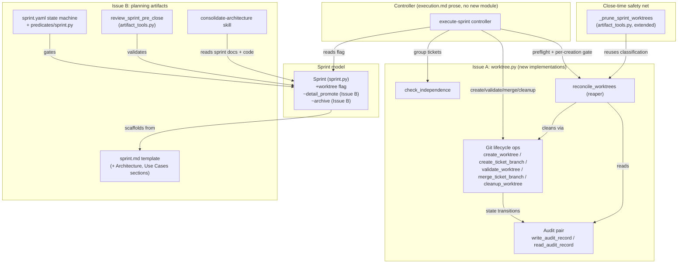
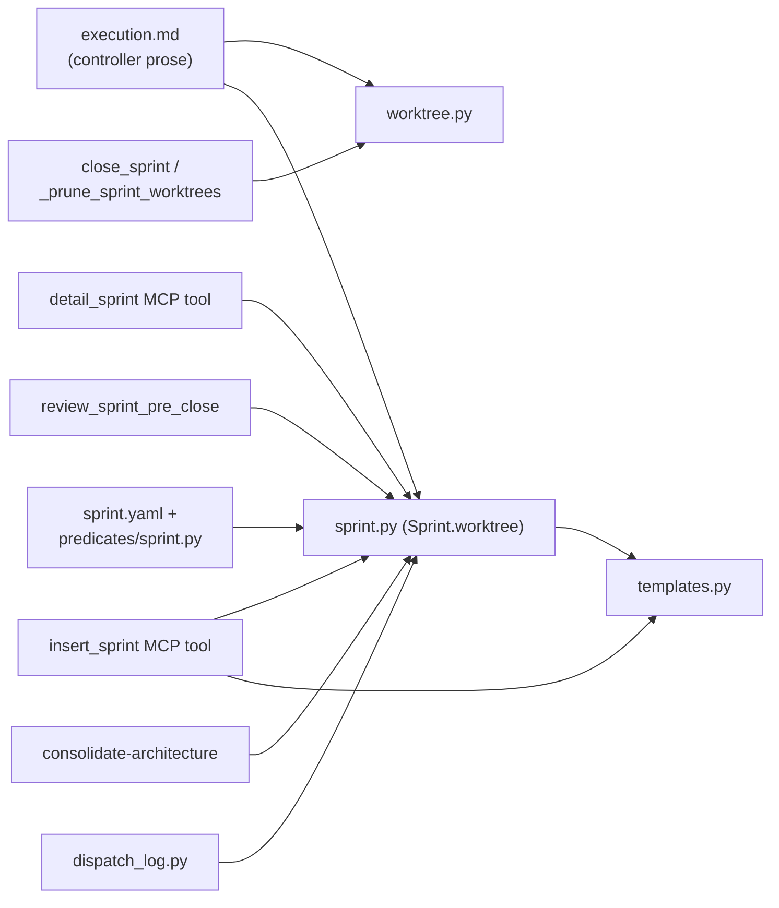

<!-- CLASI: Before changing code or making plans, review the SE process in CLAUDE.md -->

# Architecture Update -- Sprint 018: Worktree parallel execution and right-sized sprint planning

## Responsibilities Introduced or Changed

**Issue A (worktree parallel execution)**:
1. Worktree lifecycle operations (create/branch/validate/merge/cleanup) —
   pure git wrappers, one function per lifecycle step.
2. Ticket independence analysis — static file-set extraction and grouping.
3. Worktree audit persistence — atomic read/write of sprint-local JSON.
4. Worktree reconciliation (the reaper) — composes audit + live git state
   into a classify-and-clean decision, at three trigger points.
5. Sprint-level opt-in signaling — a single boolean flag read by the
   controller.
6. Execution-controller mode selection — parallel-vs-serial branching in
   controller prose (`execution.md`), not a module change.
7. Close-time worktree safety net — extending the existing
   `_prune_sprint_worktrees` reaper-adjacent function.

**Issue B (right-sized planning)**:
8. Sprint document scaffolding — what files `detail_promote`/`insert_sprint`
   write.
9. Sprint document schema — template sections instead of separate files.
10. Sprint lifecycle invariants — which artifacts gate which state
    transitions.
11. Pre-close validation — which planning docs are checked before a sprint
    can close.
12. Architecture consolidation — on-demand read of sprint docs + code,
    write of one coordinated doc; removal of the per-sprint copy step.
13. Planning-agent guidance — how the sprint-planner decides how much to
    write.

Responsibilities 1-5 are independent of each other (each changes for a
different reason: git mechanics vs. static analysis vs. persistence vs.
reconciliation policy vs. a config flag) but are co-located in one module
(`worktree.py`) because the issue's own design groups them as "the
worktree lifecycle API." Responsibility 6-7 are controller/integration
concerns that consume 1-5 but do not live in the same module. Issue B's
8-11 all change for the same reason (one document replaces three) and are
naturally cohesive; 12 is a separate concern (it runs independently, on
demand, not on the sprint lifecycle) and 13 is process guidance, not code.

## Module / Component Diagram

Fan-out check: `execute-sprint controller` has fan-out 4 (Sprint,
reconcile_worktrees, check_independence, git-lifecycle-ops) — within the
4-5 guideline; it is the natural orchestration point and does not itself
hold worktree logic, only sequencing.

## Dependency Graph

No cycles: `worktree.py` has zero dependencies on `sprint.py` or
`artifact_tools.py` (it operates on `repo_root`/`sprint_dir` `Path`
arguments passed in by the caller, matching the existing stub contract).
`sprint.py` depends only on `templates.py` and `artifact.py` (unchanged).
Dependency direction is consistently "controller/tools → domain module,"
never the reverse.

## Shared-File Sequencing (the sequencing constraint)

Two files are edited by both issues. This is not a design smell — it is
two features that happen to touch the same object (`Sprint`) and the same
tool module (`artifact_tools.py`) for unrelated reasons — but it requires
an explicit edit order so neither issue's ticket clobbers the other's
diff.

### `src/clasi/sprint.py`

| Issue | Function(s) | Nature of change |
|---|---|---|
| A | `Sprint.worktree` (new property, after `.status`) | Additive — new read-only property |
| B | `Sprint.detail_promote()` | Rewrite — stops writing `usecases.md`/`architecture-update.md`, scaffolds only `tickets/`+`tickets/done/` |
| B | `Sprint.archive()` | Rewrite — drops the `docs/architecture/` copy step |
| B | `Sprint.to_dict()` | Rewrite — drops `usecases.md`/`architecture-update.md` from `files` |
| B | `Sprint.usecases` / `Sprint.architecture` / `usecases_md` / `architecture_update_md` | Kept as-is (read-only accessors for historical sprints) |

**Order**: Issue A's `Sprint.worktree` property lands first (it is
additive and touches no function Issue B rewrites), then Issue B's
`detail_promote`/`archive`/`to_dict` rewrite lands as a single ticket.
This order is chosen (not the reverse) because the additive property is
zero-conflict-risk and unblocks Issue A's Chunk 2 dependents (execution.md
mode selection) earliest, while Issue B's rewrite is best done as one
atomic ticket touching three methods together rather than interleaved.

### `src/clasi/tools/artifact_tools.py`

| Issue | Function(s) | Nature of change |
|---|---|---|
| B | `insert_sprint` | Rewrite — stops writing `usecases.md`/`architecture-update.md` |
| B | `_renumber_sprint_dir` | Rewrite — drops the two filenames from the reference-rewrite loop (keeps `architecture.md` entry untouched — that's the future consolidated-doc filename convention, unrelated) |
| B | `review_sprint_pre_close` | Rewrite — `planning_docs_pre_close` list drops the two entries |
| A | `_prune_sprint_worktrees` | Extend — also matches `refs/heads/ticket/<sprint-id>-*`, or delegates to `reconcile_worktrees` |

**Order**: Issue B's three rewrites land first as one ticket (they are
one cohesive "stop writing/checking the two files" change), then Issue
A's `_prune_sprint_worktrees` extension lands as a separate ticket that
diffs cleanly against the post-Issue-B version of the file. This order is
chosen because Issue A's extension is purely additive to a function
Issue B does not touch, so landing it second avoids any rebase of Issue
A's diff against Issue B's larger rewrite; landing it first would instead
risk Issue B's ticket needing to re-apply around Issue A's diff inside a
much bigger file-level change.

Both tickets touching each file declare explicit `depends-on` edges (see
Ticket Sequencing below) so the programmer for the second ticket starts
from a tree that already contains the first ticket's diff — no merge
conflicts, no silent overwrites.

## Complete the Document

### What Changed

**Issue A**: `src/clasi/worktree.py` gains real implementations for all 8
stub functions plus a new `reconcile_worktrees` function. Behavioral tests
replace the `NotImplementedError` smoke tests in
`tests/clasi/test_worktree_stubs.py` (deleted, replaced by
`tests/clasi/test_worktree.py`). `Sprint` gains a `worktree` boolean
property. `templates/sprint.md` gains `worktree: false` in frontmatter.
`execution.md` is rewritten from strictly-serial to mode-selecting
(parallel when `worktree: true` and preconditions hold, else the existing
serial path verbatim). `_prune_sprint_worktrees` is extended to catch
orphaned `ticket/<sprint>-*` worktrees at sprint close, conservative on
branches (`failed`/`conflict` retained), aggressive on directories (always
removed). An optional new MCP tool wraps `reconcile_worktrees` for
on-demand invocation.

**Issue B**: `templates/sprint.md` gains `## Architecture` and
`## Use Cases` sections; `SPRINT_USECASES_TEMPLATE`,
`SPRINT_ARCHITECTURE_UPDATE_TEMPLATE`, and `SPRINT_ARCHITECTURE_TEMPLATE`
(and their backing `.md` files) are deleted from `templates.py`.
`Sprint.detail_promote()` scaffolds only `tickets/`+`tickets/done/`.
`Sprint.archive()` no longer copies to `docs/architecture/`.
`Sprint.to_dict()` drops the two files from its `files` dict. The
`is_architecture_present`/`is_usecases_present` state-machine invariants
and their backing predicates in `predicates/sprint.py` are deleted; the
`planned`, `pre-flight`, and `ticketed` states in `sprint.yaml` keep only
`is_sprint_doc_present`. `schema.yaml`'s `planning-docs` and
`architecture-review` artifacts point their `generates:` at `sprint.md`.
`review_sprint_pre_close`'s `planning_docs_pre_close` list drops the two
entries, checking only `sprint.md`. `insert_sprint` and
`_renumber_sprint_dir` in `artifact_tools.py` drop the two files.
`dispatch_log.py::_auto_context_documents` drops the two files from
subagent context. `consolidate-architecture` is repointed to read sprint
docs (new sections + legacy files, `clasi/sprints/**` incl. `done/`) plus
current code, writing one `docs/design/architecture.md` on demand.
`ARTIFACT_PATH_DEFAULTS` in `project.py` drops the `architecture` key;
`hook_handlers.py`'s role-guard allow-prefixes drop `architecture_dir`
(superseded by `design_dir`, which already covers `docs/design/`).
`docs/architecture/` (17 files) is deleted from this repo. Sprint-planner
agent/skill docs (`agent.md`, `plan-sprint.md`, `dispatch-template.md.j2`,
`contract.yaml`, `architecture-authoring`, `architecture-review`,
`create-tickets` SKILL.md files, plus cross-referencing docs) are updated
to describe the one-document model and right-sizing guidance.

### Why

**Issue A**: Sprint execution today is strictly serial even when tickets
are provably independent, wasting wall-clock time on large sprints. The
capability was built once and dropped for a specific, well-understood
failure mode (worktree-directory accumulation), and the stakeholder wants
it back with that failure mode structurally prevented rather than merely
documented against.

**Issue B**: The current three-document-per-sprint model imposes a fixed
planning cost regardless of change size, producing bloated near-duplicate
architecture documents for trivial changes and never producing a single
coordinated architecture view for the accumulated history of sprint-level
changes. Sizing planning effort to the change, and generating the
coordinated view on demand instead of accumulating it automatically, both
directly address findings in `clasi/issues/e2e-001-review.md`.

### Impact on Existing Components

- **execute-sprint / execution.md**: gains a mode-selection branch; the
  existing serial section is preserved verbatim as the fallback path, so
  no regression for sprints that don't opt in.
- **close_sprint / `_prune_sprint_worktrees`**: behavior is a superset of
  today's — today it only matches the sprint branch's own worktree; after
  this sprint it also matches ticket worktrees. Existing mocked test
  sequences in `tests/system/test_artifact_tools.py` need one more
  `git worktree list --porcelain` entry to cover the new match case.
- **Sprint (sprint.py)**: three methods change behavior
  (`detail_promote`, `archive`, `to_dict`); one property is added
  (`worktree`). Any code that relied on `to_dict()["files"]` containing
  `usecases.md`/`architecture-update.md` keys must be checked (repo-wide
  grep is part of the corresponding ticket's testing plan).
  `Sprint.usecases`/`Sprint.architecture` accessors and
  `usecases_md`/`architecture_update_md` path properties are **not**
  removed — they remain so historical sprints (001-017) still render.
- **State machine (sprint.yaml + predicates)**: the `planned`,
  `pre-flight`, and `ticketed` states lose two invariants each. This is a
  strict relaxation (fewer required conditions), so no previously-valid
  transition becomes invalid; some previously-invalid transitions (sprint
  advancing without a separate usecases/architecture file) become valid,
  which is the intended effect.
- **Pre-close validation**: `review_sprint_pre_close` becomes less strict
  (drops two required-file checks). Existing closed sprints are
  unaffected (validation only runs before close, not retroactively).
- **Role-guard hook**: removing `architecture_dir` from the allow-prefix
  list is safe because `design_dir` (`docs/design/`) already covers the
  new consolidated-architecture output location; nothing currently writes
  to `docs/architecture/` except the deleted `Sprint.archive()` copy step
  and the deleted `consolidate-architecture` old behavior.
- **Dispatch logging**: subagent context documents shrink from 3 files to
  1 (`sprint.md`) plus the ticket — programmer/sprint-planner dispatches
  get a smaller, single-source-of-truth context bundle.

### Migration Concerns

- **Backward compatibility (Issue B)**: closed sprints 001-017 keep their
  existing `usecases.md`/`architecture-update.md` files untouched — no
  migration script rewrites history. Because the state-machine invariants
  are *removed* (not changed to check something new), old sprints
  continue to satisfy every remaining invariant automatically. The
  read-only `Sprint.usecases`/`Sprint.architecture` accessors ensure
  `get_status`/`list_sprints`/any status-rendering code keeps working
  against those old sprints unchanged.
- **`docs/architecture/` deletion**: this is a one-time, explicit deletion
  of 17 files as a ticket deliverable, not an automated migration.
  Nothing reads `docs/architecture/architecture-update-*.md` after this
  sprint except (implicitly) `consolidate-architecture` if invoked before
  the deletion ticket lands within the sprint — the ticket sequencing
  places the repoint-and-generate-first, delete-second (see Ticket
  Sequencing) so no window exists where consolidate-architecture is
  pointed at a directory that no longer exists without having already
  been repointed.
- **In-flight sprints at the time this sprint lands**: any sprint
  currently in `planning-docs` phase with a partially-written
  `usecases.md`/`architecture-update.md` (created under the old
  `detail_promote()`) is unaffected structurally — those files simply
  become inert (no longer read by validation), and the sprint can
  continue to close normally since `review_sprint_pre_close` no longer
  requires them. No ticket in this sprint needs to touch other sprints'
  directories.
- **Worktree audit files (Issue A)**: `.worktree-audit.json` is
  sprint-local and net-new; no migration needed. It archives with the
  sprint directory the same way other sprint-local files do.
- **Deployment sequencing**: Issue A's chunks must land in the order
  Chunk 1 → Chunk 3 (atomic) → Chunk 4 → Chunk 5, with Chunks 2, 6, 7
  parallelizable against that spine (per the issue). Issue B's parts must
  land Part 1 (templates/scaffolding) → Part 2 (state machine/gates) →
  Part 3 (planning agents/skills) → Part 4 (consolidation/deletion),
  Part 5 (config/role-guard) parallelizable with Part 3/4, Part 6
  (backward-compat verification) last. See Ticket Sequencing for the
  merged, file-safe ordering of both issues together.

## Design Rationale

### Decision: Opt-in via per-sprint frontmatter flag, not a repo-wide sentinel file

- **Context**: The original spec (`docs/design/worktree-process.md` §1)
  specifies a repo-wide sentinel file
  (`docs/clasi/.parallel-exec-enabled`) as the opt-in gate.
- **Alternatives considered**: (a) the spec's sentinel file; (b) an
  environment variable; (c) a per-sprint frontmatter flag.
- **Why this choice**: A repo-wide sentinel makes parallel execution an
  all-or-nothing property of the whole project, but risk tolerance is
  naturally per-sprint (a sprint with many small independent doc tickets
  is a safe candidate; a sprint with few, large, interdependent tickets
  gains nothing and adds risk). A per-sprint flag is visible in the one
  artifact (`sprint.md`) the planner already authors and the controller
  already reads via `get_sprint_status`, requiring no new file convention
  and no new MCP setter tool.
- **Consequences**: `execution.md` must read the flag from sprint
  frontmatter instead of checking file existence; the flag is explicitly
  **not** added to the state machine (it is an execution-strategy toggle,
  not a lifecycle gate), so no invariant or predicate changes are needed
  for it.

### Decision: File-set source is the ticket plan file's `## Files to create or modify` heading, not new frontmatter keys

- **Context**: The original spec (§3) sources file sets from
  `files_to_create`/`files_to_modify` frontmatter keys or `### Files to
  create`/`### Files to modify` body subsections — neither of which
  exists in current ticket templates.
- **Alternatives considered**: (a) add new frontmatter keys to the ticket
  template; (b) parse an existing heading convention; (c) require a
  separate plan file with a new heading.
- **Why this choice**: This sprint's tickets are required (by the
  sprint-planner agent contract and the stakeholder's explicit
  instruction) to contain a `## Files to create or modify` heading in the
  ticket body already, for the "worktree independence algorithm" to
  parse. Reusing this heading (accepting `##`/`###` and the "Files to
  create"/"Files to modify" spelling variants) means zero new ticket
  schema, and it is authored by the sprint-planner regardless of whether
  worktrees are ever enabled for a given sprint.
- **Consequences**: `check_independence` must be a heading-text parser,
  not a frontmatter reader, for the common case; frontmatter keys remain
  a supported override for callers that provide them (e.g. tests), per
  the issue's stated priority order.

### Decision: Reaper (`reconcile_worktrees`) is pure classification, escalation is the controller's job

- **Context**: The core failure mode being fixed is worktree
  accumulation. The reaper must decide what is safe to delete
  automatically vs. what needs a human.
- **Alternatives considered**: (a) reaper auto-resolves everything
  (delete anything not explicitly merged); (b) reaper never deletes,
  always reports; (c) reaper auto-cleans two safe classes and escalates
  the rest, described in the issue's Cleanup Discipline table.
- **Why this choice**: (a) risks silent data loss on uncommitted work —
  unacceptable. (b) fails to prevent accumulation — the exact problem
  being solved. (c) is the confirmed stakeholder decision: aggressive on
  dead directories, conservative on undecided work.
- **Consequences**: `reconcile_worktrees` must never delete a worktree
  directory whose classification is `ambiguous`, even though this means
  some directories persist until a human/controller resolves them — this
  is intentional, not a residual bug. The function is pure (no prompting,
  no side effects beyond the two safe-class cleanups) so it is safe to
  call repeatedly and safe to expose as a read-mostly MCP tool.

### Decision: Architecture-review gate stays as a gate mechanism; only the *content bar* changes, not the state machine

- **Context**: Issue B could either remove the architecture-review gate
  for small sprints or keep the mechanism and change what counts as
  satisfying it.
- **Alternatives considered**: (a) remove the gate/state entirely for
  small sprints (conditional state machine); (b) keep the `planned` state
  and its `architecture-review` transition, but let a `skipped`/`n-a`
  gate record satisfy `is_architecture_review_recorded`.
- **Why this choice**: (a) requires a conditional state machine (a sprint
  takes a different path through states depending on its size), which is
  a much larger structural change with its own risk; (b) requires no
  state-machine change at all — `is_architecture_review_recorded` already
  just checks "does a gate record exist", so a `skipped` record satisfies
  it exactly as a `passed` record would. This matches the issue's
  explicit statement: "No structural state-machine change needed — a
  skipped record satisfies the gate."
- **Consequences**: The sprint-planner agent (not the state machine) is
  responsible for the size judgment call; `record_gate_result` needs no
  new `result` enum value beyond what it already accepts as a free-form
  string (confirm in the corresponding ticket whether `"skipped"` needs
  to be added to any validated enum — see Open Questions).

### Decision: Consolidated architecture lives at `docs/design/architecture.md`, singular, not a versioned series

- **Context**: The old model produced `docs/architecture/architecture-
  NNN.md` snapshots plus per-sprint `architecture-update-MMM.md` deltas.
- **Alternatives considered**: (a) keep versioned snapshots under a new
  path; (b) one single file, overwritten on each on-demand run.
- **Why this choice**: The issue's confirmed decision is a single
  coordinated doc, produced on demand, not an accumulating pile — the
  entire point of Issue B is to stop accumulating architecture documents.
  Git history already provides versioning for a single file.
- **Consequences**: `consolidate-architecture`'s SKILL.md "Archive" step
  (moving old files to `docs/architecture/done/`) is removed entirely,
  since there is no "old consolidated doc" concept anymore — each run
  overwrites `docs/design/architecture.md` in place.

## Open Questions

1. ~~Does `record_gate_result`'s `result` parameter need `"skipped"`
   added to a validated enum?~~ **Resolved during planning**:
   `state_db_class.py` defines `VALID_GATE_RESULTS = {"passed", "failed"}`
   (line 27) — a closed set. `record_gate` (line 272) raises `ValueError`
   if `result not in VALID_GATE_RESULTS` (line 291). This means recording
   `architecture_review` as `"skipped"` **fails today**. The Issue B gate
   ticket must add `"skipped"` to `VALID_GATE_RESULTS` (and confirm
   `is_pre_flight_satisfied`/`is_review_satisfied`-style predicates and
   any status-rendering code that branches on gate `result` treat
   `"skipped"` as satisfying, not as a failure state — `is_architecture_
   review_recorded` only checks record *presence*, so a `skipped`-valued
   record already satisfies it once the enum accepts the value).
2. Should the optional MCP tool for `reconcile_worktrees` (Issue A Chunk
   6) be named `reconcile_worktrees(sprint_id)` exactly, or namespaced
   differently to avoid confusion with the module-level function of the
   same name? Deferred to the implementing ticket's judgment; not a
   blocking design question.
3. `_renumber_sprint_dir`'s reference-rewrite loop currently iterates
   `("usecases.md", "architecture-update.md", "architecture.md")` — the
   third entry, `architecture.md`, does not correspond to any file
   `Sprint` currently writes (it appears to be a stale/future-proofing
   entry, possibly anticipating a per-sprint consolidated doc that was
   never built). This sprint removes the first two from the tuple but
   leaves `architecture.md` alone, since Issue B's consolidated doc lives
   at the project level (`docs/design/architecture.md`), not per-sprint —
   confirmed not a collision, but noted here since it's easy to miss.
4. Whether to also delete the now-unreferenced
   `docs/clasi/.parallel-exec-enabled` sentinel concept from
   `worktree-process.md`'s prose, or leave the spec document as historical
   record with a note that the implementation deviated (per-sprint flag
   instead of sentinel). Recommendation: leave the spec as-is (it is
   explicitly marked as a point-in-time design document) and let the
   implementing ticket add a short "Implementation Note" pointing at the
   deviation, rather than editing the historical record in place.

## Sprint Changes

Changes planned (see tickets below for the sequenced breakdown). Both
issues are covered in full; ticket sequencing enforces the shared-file
edit order documented above under "Shared-File Sequencing."

### Changed Components

See "What Changed" above for the full component-level breakdown, and the
Ticket Sequencing section (in `sprint.md`'s `## Tickets` table) for the
ticket-to-component mapping.

### Migration Concerns

See "Migration Concerns" above.
