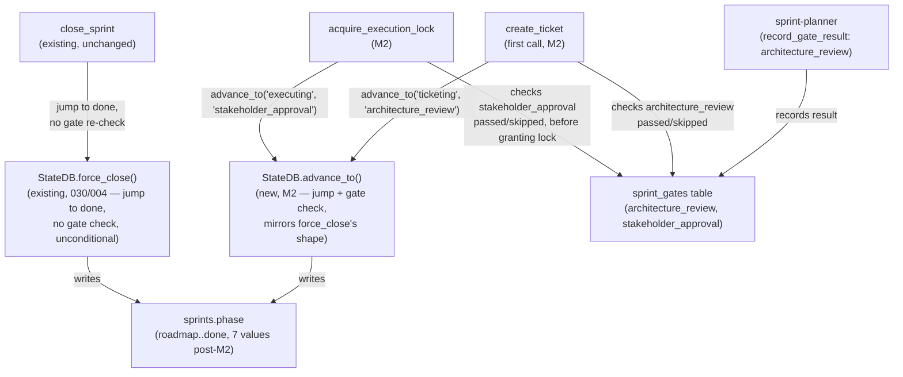
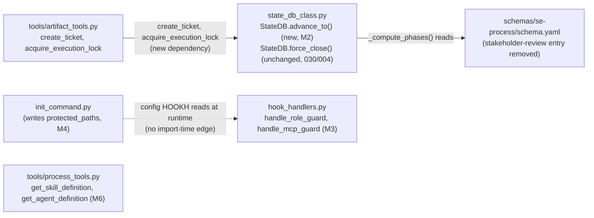

<!-- CLASI: Before changing code or making plans, review the SE process in CLAUDE.md -->

# Sprint 031: Honest process and leaner flow

## Goals

Make the docs, the gates, and the enforcement describe the *same* process.
Cut a small sprint's ceremony from 6 subagent dispatches / 35-40 MCP calls /
3 full-suite runs down to about 4 dispatches / 15 MCP calls / 1 full-suite
run — while keeping the two safety properties intact: the stakeholder
approves the plan, and tests gate the close. This is Phase 3 ("Honest
process, leaner flow") of the reliability campaign in
`docs/reviews/2026-08-reliability/00-review.md`, following Phases 0-2
(sprints 028-030: instrumentation, fail-closed guards and root resolution,
one-truth state and unwedgeable close — all closed).

## Problem

The phase machine requires stakeholder approval **before** tickets exist,
while every agent definition and skill says tickets come first — so
sprint-planner is hard-blocked mid-dispatch every sprint, forcing a third
planner dispatch that exists purely to work around the contradiction
(`docs/reviews/2026-08-reliability/06-process-flow.md`, doc/code
contradictions row 1; issue
`sprint-phase-gate-order-contradicts-plan-sprint-skill-docs.md`).

Process text for a single topic lives in up to four diverging copies
(skill, schema instruction, agent-local copy, `software-engineering.md` —
whose largest section describes a retired seven-agent process), and tool
signatures in the docs don't match the code (issue
`one-canonical-text-per-process-topic.md`).

Guard friction adds cost without adding safety: 68% of hard blocks arrive
in retry bursts. The tier-0 relaxation for `create_sprint`/`insert_sprint`
was already decided on 2026-08-19 but never shipped, so team-lead still
eats a forced planner dispatch for one tool call; separately, role-guard
blocks the plan-mode plans directory outright, and sprint-planner's
tier-1 status has never been observed live, so the write-policy the docs
describe may be fiction (issues
`report-guard-friction-slowness-relax-tier-0-restrictions.md`,
`role-guard-blocks-plan-mode-plans-dir.md`,
`sprint-planner-tier-1-may-never-be-set-verify-clasi-agent-tier-wiring.md`).

The sprint runs three full test-suite runs where the docs themselves claim
two is the total, and agents are taught to route around blocks (park the
ticket table, retry, fall back to a workaround) instead of reporting them
— which hides friction instead of fixing it (issues
`one-full-suite-run-per-sprint.md`,
`agents-must-report-blocks-not-route-around-them.md`).

Even a *correctly* closed sprint cannot report its own success:
`close_sprint` deletes the sprint branch, but `is_branch_merged` checks
`git branch --merged` — so a closed sprint's state is unsatisfiable by
construction, the third and last reason that predicate could never hold
(issue `closed-state-still-unsatisfiable-after-branch-deletion.md`).

Fresh evidence from the final E2E validation run on 2026-08-20 makes these
live rather than theoretical:

- The gate-order contradiction cost a real failed call: a subject agent
  following the shipped docs called `create_ticket` before the
  `stakeholder_approval` gate and was rejected — the single failure out of
  40 calls in that run's `mcp-calls.jsonl`.
- A correctly closed sprint reported `state: pre-flight` instead of
  `closed`, confirming the branch-deletion / `is_branch_merged` conflict
  above is not hypothetical.
- The campaign's own operator worked around the triple full-suite run by
  passing a fake `test_command="true"` at close — exactly the quiet
  gate-weakening the issue predicts, demonstrated by the people building
  the fix.

## Solution

High-level shape of the fix, per Part 5 Phase 3 of the review:

- **Gate-order fix**: `stakeholder_approval` gates the execution lock, not
  ticket creation; delete the `stakeholder-review` phase; phases become
  event-derived so agents never call `advance_sprint_phase`.
- **Ship the decided tier-0 relaxation**: team-lead may call `create_sprint`
  and write sprint files directly; `create_ticket` stays planner-owned;
  verify the planner's tier wiring end-to-end with a real-dispatch test.
- **One canonical text per topic**: exclude `agents/old/` from definition
  lookup; fix or retire the `dispatch-subagent` skill's dead-tool STOP
  wording and `source-code.md`'s execute-ticket pointer; rewrite
  `software-engineering.md` to the 3-agent reality; sync the installed
  team-lead agent definition into the plugin source.
- **One full-suite run, owned by close**: delete the pre-close and
  sprint-review re-runs; `sprint-review` interprets
  `review_sprint_pre_close` instead of re-running the suite; document the
  close-recovery contract (`recovery_state`, `clear_sprint_recovery`, the
  role-guard bypass during recovery) that today exists only in code.
- **Agents report blocks, not route around them**: replace
  workaround-and-continue patterns (parking a ticket table, silently
  retrying, faking a test command) with a documented report-and-stop
  contract.
- **Fix the unsatisfiable closed-state check**: correct
  `is_branch_merged`/the closed-state predicate so a correctly closed
  sprint can actually report `closed`.

## Success Criteria

A full E2E run under the new flow shows the dispatch/call/suite-run counts
hit the leaner-flow targets (about 4 dispatches, about 15 MCP calls, 1
full-suite run, 1-2 human stops, 0 agent-driven phase/gate calls) with
zero blocked-call retry bursts, and a correctly closed sprint reports
`state: closed`.

## Scope

### In Scope

The 8 issues claimed by this sprint:

- `sprint-phase-gate-order-contradicts-plan-sprint-skill-docs.md`
- `report-guard-friction-slowness-relax-tier-0-restrictions.md`
- `role-guard-blocks-plan-mode-plans-dir.md`
- `sprint-planner-tier-1-may-never-be-set-verify-clasi-agent-tier-wiring.md`
- `one-canonical-text-per-process-topic.md`
- `one-full-suite-run-per-sprint.md`
- `agents-must-report-blocks-not-route-around-them.md`
- `closed-state-still-unsatisfiable-after-branch-deletion.md`

### Out of Scope

Phase 4 (delete and decompose — about 1,700 lines of dead worktree/
versioning machinery, the installer merge-not-overwrite fixes, the
`artifact_tools.py` split) and Phase 5 (fast/slow test-suite split) are
later phases of the same campaign, planned as separate sprints per Part 5
of `docs/reviews/2026-08-reliability/00-review.md`. This sprint touches
only the process/enforcement layer (schema, gates, phase derivation, tier
wiring, canonical docs) — not code deletion or decomposition.

### Sequencing Risk

This sprint changes the enforcement it runs under, the same
self-referential risk sprint 029 carried when it rewrote sprint-state
machinery from inside the sprint-state machinery. Two of this sprint's own
changes are load-bearing for how the *rest of this sprint* gets executed:
the gate-order fix changes when `create_ticket` is legal, and the tier-0
relaxation changes what team-lead may call directly without a forced
planner dispatch. Detail planning must sequence tickets so that early
tickets aren't blocked by the pre-fix enforcement and later tickets aren't
validated against enforcement that has already changed underneath them —
e.g., land and verify the gate-order fix (with its own E2E check) before
relying on the new ticket-creation order for this sprint's later tickets,
and don't assume the tier-0 relaxation is live for this sprint's own
`create_sprint`/`insert_sprint` calls until its ticket has landed and been
verified.

## Test Strategy

Unit tests per module (gate/phase transitions in `state_db_class.py`,
role-guard/mcp-guard allow/deny payloads, the closed-state predicate,
the agents/old/ exclusion, tool-signature introspection). One
end-to-end regression per issue's own verification criteria: a real
dispatched sprint-planner reaching ticket creation with zero rejected
MCP calls (002), a real dispatched sprint-planner writing
`clasi/sprints/**` and resolving `tier-1` with no OOP flag (005), a
sprint driven through close reporting `state: closed` (001). The three
`TestGitSpawnCollapseInRealRepo` tests
(`tests/unit/test_status/test_hook_injection.py`) must stay green
throughout — no ticket in this sprint may reintroduce a git subprocess
spawn on the status-inject hot path. No new full-suite run is added by
this sprint's own process (see M8): its own close uses the single gate
this sprint's M8 ticket defines.

## Architecture

**Substantial** — nine tickets across seven subsystems
(`state_db_class.py`; `schemas/se-process/schema.yaml` and
`schemas/state-machines/sprint.yaml`; `tools/artifact_tools.py`;
`hook_handlers.py`; `status/reader.py` +
`state_machine/predicates/sprint.py`; `tools/process_tools.py`;
`platforms/_rules.py` plus `plugin/skills/`, `plugin/instructions/`,
`plugin/agents/`; `init_command.py`), a genuine phase-machine
behavior-contract change (phase transitions become event-derived
instead of agent-called), and a new cross-module dependency
(`acquire_execution_lock` and `create_ticket` come to depend on a new
`StateDB.advance_to()` primitive) — module count and the
behavior-contract change each independently clear the substantial-tier
bar. No data-model change: no ticket below adds a SQLite column or a
frontmatter key; every fix changes *which* value gets written, *when*
an existing write happens, or *which check* a tool performs before
acting — the same shape sprint 030 used to justify skipping an
entity-relationship diagram, and for the same reason here.

### 1. Understand the Problem

See Problem above, plus the review's own quantified cost trace
(`docs/reviews/2026-08-reliability/06-process-flow.md`, "Sprint cost
trace"): a 3-ticket sprint today costs 6 subagent dispatches (one of
which — sprint-planner's "ticket materialization" dispatch — exists
*only* because the phase machine and the docs disagree about when
tickets may exist), about 35-40 MCP calls, 3 full-suite runs against
the docs' own stated total of 2, and 6-7 agent-driven phase/gate calls
that are pure bookkeeping. The eight linked issues are not eight
unrelated bugs — they are eight concrete instances of the same
finding: **the enforced process and the documented process are
different processes**, and every fix below makes one pair of them
agree.

This planning pass verified two of the team-lead's stated premises
against the current code and this repo's own live state before
designing against them, per the dispatch's explicit ask:

- **`close_sprint`'s self-repair already advances phases as a side
  effect of a tool call, not through a chain of agent-driven
  `advance_sprint_phase` calls.** `StateDB.force_close()`
  (`state_db_class.py:519`) jumps a sprint's phase directly from
  *whatever it currently is* to `"done"` in one transaction, with no
  per-phase gate walk and no call to `advance_phase()` at all — it is
  structurally the same shape this sprint's M2 (ticket 002) generalizes
  to the `ticketing` and `executing` transitions via a new, shared
  `StateDB.advance_to()` primitive. The review's claim is correct, and
  M2 is that promotion, not a new pattern invented from scratch.
- **No sprint in this repo's live `.clasi.db` currently sits at the
  phase being deleted.** Verified by direct query during this planning
  pass: `SELECT id, phase FROM sprints` shows every non-`done` sprint
  at `roadmap`, `planning-docs`, or `ticketing` (012 is the pre-existing
  archived-but-`ticketing` drift sprint 030 already scoped
  `any_sprint_in_phase` around — unaffected by this sprint); zero rows
  at `stakeholder-review`. Every recorded `stakeholder_approval` gate
  (29 of them, one per closed sprint) reads `passed`. No execution lock
  is currently held. This sprint's own gate-order fix (M2) is therefore
  safe to land against this repo's live data with no manual repair step
  — see Migration Concerns for the general (not just this-repo) safety
  argument, since a downstream CLASI-installed project could have a
  sprint parked there at upgrade time even though this one doesn't.

### 2. Identify Responsibilities

Nine responsibilities, each changing for an independent reason (mapped
1:1 to this sprint's nine tickets and the eight linked issues — one
issue, `report-guard-friction-slowness-relax-tier-0-restrictions.md`,
splits across two tickets because it bundles a policy-relaxation change
or agents; issue
`one-canonical-text-per-process-topic.md` similarly splits across two
tickets because it bundles a code-level lookup fix with a much larger
prose-consolidation effort):

1. **Make the sprint-machine's `closed` state reachable** — changes
   because `is_branch_merged` references something `close_sprint`
   itself destroys, not because the merge/archive logic is wrong.
2. **Fix the phase-machine gate order and make the ticketing/executing
   transitions event-derived** — changes because `stakeholder_approval`
   gates ticket creation today while every doc says the reverse, and
   because two of the seven remaining agent-driven phase calls are
   pure ceremony a tool call can perform as a side effect instead.
3. **Ship the decided tier-0/tier-1 write-policy relaxation** — changes
   because the enforced policy is stricter than the stakeholder's
   2026-08-19 decision, not because the enforcement mechanism itself is
   broken.
4. **Make `clasi init` write `protected_paths` and make write scope
   discoverable without being blocked first** — changes because no
   writer for `protected_paths` exists today and an agent currently
   learns its write scope only by hitting a block.
5. **Prove the tier-resolution plumbing and the outside-root allow path
   with real-dispatch/real-payload tests** — changes because two
   issues' own text is an *investigation*, not a code defect, and this
   planning pass found live evidence (below) that both describe
   already-fixed or already-working behavior that has never been
   pinned by a test.
6. **Stop two lookup paths from resolving into retired machinery** —
   changes because `get_skill_definition`'s `rglob` fallback and
   `source-code.md`'s pointer both currently dead-end an agent that
   follows them literally, not because the lookup mechanism's *normal*
   path is wrong.
7. **Consolidate process prose to the process that actually runs** —
   changes because up to four diverging copies exist per topic and the
   largest instruction file describes a retired seven-agent roster.
8. **Make `close_sprint`'s internal run the sprint's one full-suite
   gate** — changes because three call sites each independently decided
   to run the suite, not because any one of the three runs is itself
   wrong.
9. **State the report-a-block norm in one place** — changes because the
   norm has never been written down anywhere, not because an existing
   statement of it is wrong.

None of the nine needs to relocate to a different subsystem to be
fixed — every fix is correctness or consolidation within the
responsibility's existing home, plus one new shared primitive
(`StateDB.advance_to()`, responsibility 2) that generalizes a pattern
(`force_close`) that already exists.

### 3. Define Subsystems and Modules

**M1 — Closed sprint-machine state is reachable** (ticket 001;
`schemas/state-machines/sprint.yaml`, `state_machine/predicates/sprint.py`)
- **Purpose**: Make the sprint machine's `closed` state satisfiable by
  what `close_sprint` actually leaves behind.
- **Boundary**: Inside — dropping `is_branch_merged` from `closed`'s
  invariant list (the issue's own recommended Option 1: `close_sprint`
  performs merge, archive, and branch deletion atomically, so
  `is_sprint_archived` alone is the honest, git-free signal); deleting
  `is_branch_merged`'s predicate registration and its `branch_merged()`
  reader method once no invariant list references it; a new integration
  test driving a sprint through the real `close_sprint` path and
  asserting `clasi status` reports `state: closed` afterward (the
  regression the issue names: `test_sprint_lifecycle_integration.py`,
  added by 030-006, asserts DB/frontmatter agreement through close but
  not the *computed machine state* afterward — the exact gap that let
  this through). Outside — `is_sprint_archived` and the
  cheap-first-predicate short-circuit ordering 030-002 established
  (unchanged; this ticket makes the second invariant unnecessary
  rather than reordering around it).
- **Use cases served**: SUC-001.
- **Verified before design, not assumed**: the three
  `TestGitSpawnCollapseInRealRepo` tests
  (`tests/unit/test_status/test_hook_injection.py:457`) already pass
  against a fixture with 6 archived sprints — `branch_merged()` is
  never actually reached on that hot path today because status-inject
  only evaluates state for the *active* sprint, not archived ones (an
  archived sprint's state is never queried by the per-prompt status
  block). Dropping `is_branch_merged` therefore removes a predicate the
  hot-path tests already don't exercise; it cannot regress them, and it
  closes the theoretical gap (a future direct `evaluate_state` call
  against an archived sprint id) rather than leaving it open.

**M2 — Gate-order fix and event-derived phase transitions** (ticket
002; `schemas/se-process/schema.yaml`, `state_db_class.py`,
`tools/artifact_tools.py`)
- **Purpose**: Make ticket creation depend on the architecture-review
  gate alone and make the execution lock depend on stakeholder
  approval, with both the `ticketing` and `executing` phase values
  arriving as a side effect of the tool call that earns them rather
  than a separate agent-driven `advance_sprint_phase` call.
- **Boundary**: Inside —
  - `schema.yaml`: delete the `stakeholder-review` artifact entry;
    `ticketing`'s `requires:` becomes `[architecture-review]` (was
    `[stakeholder-review]`). `_compute_phases()` derives the new
    7-value phase list (`roadmap`, `planning-docs`,
    `architecture-review`, `ticketing`, `executing`, `closing`, `done`)
    with no other code change, since `advance_phase()`'s existing
    single-hop walk already reads the list positionally.
  - `state_db_class.py`: delete `"stakeholder-review":
    "stakeholder_approval"` from `_GATE_REQUIREMENTS` (the phase it
    keyed no longer exists); new `StateDB.advance_to(sprint_id,
    target_phase, required_gate=None)` — idempotent (no-op if already
    at or past `target_phase`), checks `required_gate`'s recorded
    result is `passed`/`skipped` when given, jumps the phase directly
    from wherever it is to `target_phase` in one transaction (mirrors
    `force_close`'s existing shape deliberately — see Design
    Rationale), records one `phase_transitions` row, raises a named,
    actionable error (not a raw `ValueError` from `list.index()`) if
    the sprint's *current* phase is not present in the computed phases
    list at all (the stranded-legacy-value case — see Migration
    Concerns).
  - `tools/artifact_tools.py`: `create_ticket`'s
    `_check_sprint_phase_for_ticketing` is replaced by a direct
    gate-result check ("has this sprint's `architecture_review` gate
    recorded `passed` or `skipped`?", not a phase-index comparison) on
    a ticket's *first* call, followed by `advance_to(sprint_id,
    "ticketing", "architecture_review")`; `acquire_execution_lock`
    gains a `stakeholder_approval` gate check (reject, no lock granted,
    if not `passed`/`skipped`) *before* calling `db.acquire_lock()`,
    then calls `advance_to(sprint_id, "executing",
    "stakeholder_approval")` after the lock is granted.
    **Failure-mode contract, stated explicitly rather than left
    implicit**: the gate check and the lock acquisition are the
    safety-critical steps (no lock without a recorded approval); the
    phase-advance that follows is a status-display convenience, not a
    second safety gate. If `advance_to` itself fails after
    `db.acquire_lock()` has already succeeded, the lock is *not* rolled
    back — the lock, not the phase string, is what every other
    consumer (the tier-2 ticket-state gate, `close_sprint`'s
    precondition check) actually treats as authoritative. The failure
    is surfaced to the caller (never swallowed), and a retried
    `acquire_execution_lock` call is safe: `db.acquire_lock()`'s
    existing re-entrant path returns success immediately for a lock
    this sprint already holds, and `advance_to` is independently
    idempotent, so the retry's only real work is completing the
    phase-advance that failed the first time. This mirrors,
    deliberately, the same "the lock is the authoritative fact, the
    mirrored phase/status value catches up idempotently" shape sprint
    030 established for `force_close`/`Sprint.set_sprint_stage()` — not
    a new failure-handling philosophy invented here.
  Outside — `record_gate_result` itself (unchanged: still callable at
  any phase, exactly as today — verified during planning, see Step 1);
  the `closing`→`done` hop (`force_close`, unchanged, M2 does not touch
  it); `advance_sprint_phase` the MCP tool (kept, unchanged in
  behavior, demoted from "part of the documented flow" to "manual
  recovery primitive" — see Design Rationale).
- **Use cases served**: SUC-002.

**M3 — Tier-0/tier-1 role-guard and mcp-guard write-policy relaxation**
(ticket 003; `hook_handlers.py`, `.claude/settings.json` +
`plugin/hooks/hooks.json`)
- **Purpose**: Implement the stakeholder's already-decided policy —
  block protected source paths and `create_ticket`; allow everything
  else — for tier 0 and tier 1.
- **Boundary**: Inside — deleting the tier-0 `blk-sprint` block
  (`hook_handlers.py`, the `for blk in _block_prefixes` loop scoped to
  `agent_tier in ("", "0")`); extending the existing tier-1
  `sprints_dir` allow (`agent_tier == "1"`) to also match `agent_tier in
  ("", "0")`; updating the docstring allow/block matrix to state
  `.clasi/sprints/**` as `ALLOW` for tier 0; shrinking the
  `mcp__clasi__create_ticket|mcp__clasi__create_sprint` hook matcher (in
  both `.claude/settings.json`, this repo's own installed copy, and
  `plugin/hooks/hooks.json`, the source of truth new installs copy
  from) to `mcp__clasi__create_ticket` alone. Outside — the
  `insert_sprint` inconsistency the issue names as a symptom of the
  same porous matcher resolves itself once `create_sprint` is off the
  matcher entirely (both tools become equally tier-0-legal; no separate
  fix needed); the protected-source-path block itself (unchanged —
  still BLOCK for tier 0/1, per the decided policy's first clause); the
  tier-2 ticket-state gate (unchanged, out of this issue's scope). Item
  6 of the issue's proposed fix ("name the actual registered role in
  the block message") is **already shipped** — verified during
  planning: `hook_handlers.py`'s block-message code already resolves
  the agent name from the same DB record the tier came from when
  `_tier_source_db` is true (landed as part of ticket 026-001, per its
  own docstring citation) — no further change needed; ticket 003 notes
  this as verified-closed rather than silently re-doing it.
- **Use cases served**: SUC-003.

**M4 — `clasi init` writes `protected_paths`; write scope is
discoverable** (ticket 004; `init_command.py`, `hook_handlers.py`'s
`handle_subagent_start`/status-block building)
- **Purpose**: Make a fresh `clasi init` configure the safer
  allow-by-default mode instead of leaving every project in
  block-by-default, and let an agent learn its write scope without
  being blocked first.
- **Boundary**: Inside — `init_command.py` detecting (or prompting for)
  the project's source/test directories and writing `protected_paths:`
  to `config.yaml` on a fresh init, with the pre-existing
  block-by-default fallback kept unchanged for a project that declines
  or that upgrades without re-running init; a 3-4 line write-scope
  summary (allowed prefixes, blocked prefixes, the OOP recovery route)
  injected at `handle_subagent_start` for tier 1/2 and folded into the
  existing tier-0 status block. Outside — the role-guard/mcp-guard
  decision logic itself (M3, unchanged) — this ticket only makes the
  *existing* policy visible and correctly configured on fresh installs,
  it does not change what the policy allows.
- **Use cases served**: SUC-004.
- **Sequencing**: depends on M3 landing first — the write-scope summary
  this ticket injects describes M3's *post*-relaxation policy; writing
  it against the pre-relaxation policy would need a second edit the
  moment M3 lands.

**M5 — Tier wiring and role-guard regression coverage** (ticket 005;
tests only — `tests/`)
- **Purpose**: Pin, with real-dispatch and real-payload tests, two
  behaviors this planning pass found already correct in production but
  never asserted by an automated test.
- **Boundary**: Inside — a test that dispatches a real sprint-planner
  and asserts it writes `clasi/sprints/**` with no OOP flag, resolving
  reason `tier-1` (the issue's own literal verification criterion);
  parametrized tests asserting a tier-0 write to
  `~/.claude/plans/<name>.md` and to an arbitrary outside-root path
  both exit 0 (`outside-root`/`claude-plans-dir`), pinning the current,
  already-shipped behavior. Outside — any production code change (see
  Step 1's verification and Design Rationale for why none is needed
  here).
- **Use cases served**: SUC-005.
- **Live evidence gathered during this planning pass** (not asserted
  from memory — pulled from this repo's own `hooks.log` and
  `active_agents` table while planning this sprint, itself run as a
  dispatched sprint-planner): `tier=1(db)` appears 79 times in the
  current `hooks.log`, including twice *today* for the sprint-planner
  dispatches that created sprints 031 and 032 themselves, each
  successfully writing under `clasi/sprints/031.../sprint.md` and
  `clasi/sprints/032.../sprint.md` with reason `tier-1`; this planning
  pass's own `active_agents` row (`agent_type=sprint-planner, tier=1`)
  is present and was not purged by `clear_stale_agents`'s sweep, which
  runs *before* registration each dispatch — confirmed by reading
  `handle_subagent_start`'s call order, resolving the issue's own
  investigation step 3 without needing a fault-injection test to prove
  ordering. The DB-backed `get_active_tier` fallback is load-bearing
  and correct; the gap is purely the missing regression test the
  issue's own acceptance criteria already names.

**M6 — Stop two lookups from resolving into retired machinery** (ticket
006; `tools/process_tools.py`, `platforms/_rules.py`,
`plugin/skills/dispatch-subagent/SKILL.md`)
- **Purpose**: Make a lookup for a nonexistent skill or agent fail
  loudly instead of silently resolving into `agents/old/`, and stop one
  shipped skill from mandating a tool that does not exist.
- **Boundary**: Inside — `_get_definition`'s `rglob` fallback
  (`process_tools.py`, the one lookup path that does **not** already
  exclude `"old"` from its search — `_list_agents_recursive` and
  `_find_agent_dir` already skip it; only the `_get_definition`
  fallback at the bottom of the file does not) gains the same `"old" in
  path.parts` exclusion, with a test asserting a lookup for a
  nonexistent skill/agent raises a clear, named error rather than
  silently returning `agents/old/sprint-executor/execute-ticket.md`;
  `platforms/_rules.py` (the canonical source `.claude/rules/
  source-code.md` is generated from) repoints "follow the execute-ticket
  skill" at the programmer agent definition instead of a skill that
  does not exist; `dispatch-subagent/SKILL.md`'s "you MUST call
  `log_subagent_dispatch`... STOP if unavailable" is rewritten to match
  reality (no such tool exists anywhere in `src/clasi` — confirmed by
  grep during planning) — either dropping the logging-mandate language
  entirely or pointing at whatever dispatch-logging mechanism, if any,
  this sprint's M7 ticket ends up describing as canonical (sequencing
  note: land M6 first since it is the narrower, code-adjacent fix;
  M7 can then reference M6's corrected skill text rather than the two
  tickets drifting independently). Outside — `_list_agents_recursive`/
  `_find_agent_dir` (already correct, unchanged).
- **Use cases served**: SUC-006.

**M7 — Consolidate process docs to the process that actually runs**
(ticket 007; `plugin/instructions/software-engineering.md`,
`.claude/agents/team-lead/agent.md` + `plugin/agents/team-lead/agent.md`,
`schemas/se-process/instructions/sprint-plan.md` / the `plan-sprint`
skill)
- **Purpose**: Make one canonical text exist per process topic,
  describing the process this sprint's M2/M3 tickets actually enforce.
- **Boundary**: Inside — rewriting `software-engineering.md` (636
  lines today) to the real 3-agent process (team-lead, sprint-planner,
  programmer) or reducing it to a pointer page, dropping the retired
  seven-agent roster and per-ticket code-reviewer sections; reconciling
  the installed `.claude/agents/team-lead/agent.md` (333 lines) against
  the plugin source (312 lines) — confirmed to differ during planning —
  per the issue's own stated rule (whichever is newer wins,
  deliberately, and the two are made to agree going forward);
  `sprint-plan.md`/the `plan-sprint` skill updated to describe the
  post-M2 gate order (tickets created once the architecture-review gate
  passes, not after a separate stakeholder-review phase) and the
  post-M3 tier-0 policy (team-lead may call `create_sprint` and write
  sprint files directly); a test that introspects the live MCP tool
  signatures (`move_ticket_to_done`, `reconcile_worktrees`, and others
  named in the review's contradiction table) and asserts the
  documented signature in each rewritten doc matches, rather than
  trusting a human proofread. Outside — `create-tickets`/`tdd-cycle`/
  `systematic-debugging`'s agent-local-copy drift (named in the issue's
  description as part of the broader duplication problem, but not
  named in its acceptance criteria — flagged as a follow-up in Open
  Questions rather than pulled into this already-large ticket without a
  criterion driving it).
- **Use cases served**: SUC-007.
- **Sequencing**: depends on M2 and M3 — this ticket's whole point is
  to describe the *post-fix* process; writing it before M2/M3 land
  would mean rewriting it twice.

**M8 — One full-suite run, owned by close** (ticket 008;
`schemas/se-process/instructions/execution.md`, the `sprint-review`
skill/instructions)
- **Purpose**: Make `close_sprint`'s internal test run the sprint's
  single full-suite gate.
- **Boundary**: Inside — deleting `execution.md` §5.2's separate
  pre-close full-suite-run instruction; rewriting `sprint-review` to
  call `review_sprint_pre_close` and interpret its output instead of
  re-running the suite itself; wiring or explicitly retiring the
  orphaned `review_sprint_post_close` tool (today referenced by no
  skill or agent doc — confirmed by grep during planning); a "tests
  already passed for HEAD `<sha>`" marker (the issue's own proposed
  mechanism) that lets a deliberate close re-run skip redundant work
  without the operator reaching for `test_command="SKIP"` (030's
  sentinel, kept as the explicit escape hatch it already is — this
  ticket makes it unnecessary in the *normal* flow, not removes it).
  Outside — `close_sprint`'s own test-execution step in `close.py`
  (unchanged — this ticket makes it the *only* run, not a different
  run).
- **Use cases served**: SUC-008.
- **Sequencing**: ordered after M7 for merge cleanliness (both touch
  `execution.md`-adjacent instruction files) — not a hard dependency.

**M9 — Agents report blocks, not route around them** (ticket 009;
`plugin/agents/programmer/agent.md`, `plugin/agents/sprint-planner/agent.md`
or the corresponding `.claude/agents/` copies, one canonical
`.claude/rules/` statement)
- **Purpose**: State, once, that a blocked agent stops and reports
  rather than finding an alternate write path.
- **Boundary**: Inside — the stop/report/wait rule (see Problem above)
  stated once, in whichever of `.claude/rules/` or the agent
  definitions is the more natural canonical home given M7's
  consolidation, with the programmer and sprint-planner agent
  definitions referencing it rather than restating it; the specific
  forbidden bypasses named explicitly (Bash heredoc, `sed -i`,
  redirection, `git apply`, or any tool that dodges the role-guard
  matcher); dispatch prompts/templates stating that reporting a block
  is a successful dispatch outcome, not a failure. Outside — the
  role-guard/mcp-guard matcher's own coverage gaps (a Bash heredoc
  bypassing `Edit|Write|MultiEdit` is real and cited by this issue as
  motivation, but closing that gap is a guard-code change no linked
  issue's acceptance criteria asks for here — this ticket's job is the
  norm, not the matcher).
- **Use cases served**: SUC-009.
- **Sequencing**: ordered after M7 for the same shared-file reason as
  M8; no hard dependency.

### 4. Diagrams

**Component diagram — the phase/gate machine, before and after M2.**
Included: this is the sprint's highest-risk change and the clearest way
to show the new `advance_to()` primitive's relationship to the
already-shipped `force_close` pattern it generalizes.

`advance_sprint_phase` (the pre-existing MCP tool / `sprint.advance_phase()`
single-hop method) is not drawn as a participant in the standard flow —
it remains callable for manual recovery but no ticket in this sprint
routes the standard create-ticket/acquire-lock/close path through it
anymore.

**Dependency graph — the new `advance_to()` fan-in.** Included: two
existing tools-layer functions gain a new dependency on a single shared
primitive, the class of change the substantial-tier trigger names
explicitly.

No entity-relationship diagram: confirmed against every touched module
during planning — no SQLite table gains a column, no frontmatter
document gains a key.

### 5. What Changed / Why / Impact on Existing Components / Migration Concerns

**What Changed** — one line per module, detail in Step 3:

- M1: `is_branch_merged` dropped from `closed`'s invariants; its
  predicate and `branch_merged()` reader method deleted; a new
  close-then-assert-`state:closed` integration test.
- M2: `stakeholder-review` phase deleted from schema.yaml; new
  `StateDB.advance_to()`; `create_ticket`/`acquire_execution_lock`
  gate-check and auto-advance via it.
- M3: tier-0 `blk-sprint` block deleted; tier-0/1 `sprints_dir` allow
  unified; mcp-guard matcher shrunk to `create_ticket` alone (both
  copies).
- M4: `clasi init` writes `protected_paths` on fresh init; a write-scope
  summary injected at dispatch and in the tier-0 status block.
- M5: new real-dispatch tier-1 test; new real-payload outside-root/
  plans-dir tests. No production code change.
- M6: `_get_definition`'s `rglob` fallback excludes `agents/old/`;
  `_rules.py`'s execute-ticket pointer fixed; `dispatch-subagent/
  SKILL.md` rewritten to match reality.
- M7: `software-engineering.md` rewritten/reduced; installed vs plugin
  `team-lead/agent.md` reconciled; `sprint-plan.md`/`plan-sprint`
  updated for the post-M2/M3 process; a tool-signature introspection
  test.
- M8: `execution.md` §5.2 deleted; `sprint-review` interprets
  `review_sprint_pre_close`; a HEAD-sha test-pass marker.
- M9: the report-a-block norm stated once, referenced from programmer
  and sprint-planner agent definitions.

**Why**: Problem and Step 1 state the diagnosis. The shared thread
across all nine: the documented process and the enforced process must
describe the same thing, and where they already silently agree (M1's
`is_sprint_archived`, M2's `force_close` pattern, M5's tier-1
resolution), that agreement should be pinned by a test rather than left
to be rediscovered by the next person who reads the diverging doc.

**Impact on Existing Components**

- **Every downstream CLASI-installed project**: once M2 ships, a
  sprint-planner dispatch that creates tickets right after recording
  the `architecture_review` gate — the order every current doc already
  describes — stops being rejected. A sprint whose plan a stakeholder
  has *not* yet approved can no longer reach `executing` (M2 relocates,
  not removes, the `stakeholder_approval` check). Once M3 ships, a
  team-lead session may write anywhere under `clasi/sprints/` and call
  `create_sprint` directly without a forced sprint-planner dispatch for
  that one tool call; `create_ticket` remains tier-1-only, unchanged.
- **`state_db_class.py`**: gains one new public method
  (`advance_to()`); `_GATE_REQUIREMENTS` shrinks by one entry;
  `force_close()` itself is untouched (M2 generalizes its *shape*, not
  its code).
- **`hook_handlers.py`**: shrinks by one block (`blk-sprint`); the
  allow/block docstring matrix updated to match; no change to the
  protected-source-path block, the tier-2 ticket-state gate, or any
  OOP/recovery/staleness gate.
- **Status consumers**: `clasi status`/`get_status` output shape is
  unaffected; a correctly closed sprint now reports `state: closed`
  instead of falling back to `pre-flight` (M1) — the one behavior
  change any status-block consumer would observe, and it is the fix
  the issue exists to deliver.
- **Instruction/skill consumers**: `software-engineering.md`,
  `sprint-plan.md`, `dispatch-subagent`, `source-code.md`'s canonical
  source, and both copies of `team-lead/agent.md` change prose content;
  no MCP tool signature named in any of them changes as a result of the
  doc fixes themselves (M2/M3's tool-level changes are additive checks,
  not signature changes).

**Migration Concerns**

- **No DB schema migration**: no table gains a column; `advance_to()`
  and the M1 predicate removal reuse the existing `sprints.phase`,
  `sprint_gates`, and `phase_transitions` tables exactly as they are.
- **No frontmatter schema migration**: no artifact type gains a new
  key.
- **The `stakeholder-review` phase-string removal is safe against this
  repo's live data, verified not assumed** (Step 1): zero current rows
  reference it. **For general (not just this-repo) safety**, `advance_to()`
  and `advance_phase()`'s phase-list lookup raise a named, actionable
  error rather than a raw `ValueError` from `list.index()` if a
  sprint's *current* phase value is ever absent from the computed
  phases list — the stranded-legacy-value case a downstream
  CLASI-installed project could hit even though this repo does not.
  Historical `phase_transitions` rows already recording
  `"stakeholder-review"` for sprints closed before this fix are inert
  historical data — nothing re-validates them against the current
  phase list, so no historical rewrite is needed (same policy sprint
  030 already established for legacy `status:` strings).
- **Self-referential sequencing — this sprint's own execution under its
  own gate-order fix (constraint 1, addressed in full in this ticket's
  own report):** sprint 031's execution lock is acquired once, at the
  start of this sprint's own execution, under the *pre*-M2 code; M2's
  changes to `acquire_execution_lock` are therefore never re-exercised
  against sprint 031's own lock (re-entrant lock acquisition already
  skips every check, unchanged by M2). Every one of this sprint's own
  nine tickets is created during *this* planning pass, before any
  ticket executes — so M2's changes to `create_ticket` are also never
  re-exercised for sprint 031's own tickets. The self-referential risk
  is real for *future* sprints (032 is already in Roadmap Mode and will
  be detail-planned under whichever code is live when it happens), not
  for this sprint's own remaining execution — see the architecture
  self-review and this ticket's own report for the full argument.

### 6. Design Rationale

**Decision: `StateDB.advance_to(sprint_id, target_phase,
required_gate=None)` is a new, general primitive shared by M2's two
call sites, not two bespoke jump methods.**
- **Context**: both `create_ticket`'s ticketing auto-advance and
  `acquire_execution_lock`'s executing auto-advance need the identical
  shape — jump from wherever the phase currently is to a target,
  checking one named gate's result first, idempotent if already there.
- **Alternatives considered**: (a) two separate methods
  (`advance_to_ticketing`, `advance_to_executing`) — rejected, it
  duplicates the exact logic `force_close` already proved out generally
  (jump + own precondition + transactional), for no benefit; (b) fold
  the new behavior directly into `advance_phase()` — rejected,
  `advance_phase()`'s contract is "exactly one hop, gate keyed off the
  *current* phase via `_GATE_REQUIREMENTS`," which is a different,
  narrower contract than "jump to an arbitrary later phase, checking an
  explicitly named gate" — conflating them would make `advance_phase()`
  harder to reason about for its existing manual-recovery callers; (c)
  one shared, explicitly-parameterized primitive — adopted.
- **Why this choice**: (c) is the direct generalization of a pattern
  (`force_close`) this codebase already ships and trusts, satisfying
  constraint 2 by promoting the de facto design to a named, reusable
  contract instead of writing two more one-off variants of it.
- **Consequences**: `force_close` itself is deliberately **not**
  refactored to call `advance_to()` — `force_close`'s contract
  (unconditional jump to the terminal state, no gate check at all,
  because tickets/tests already gate close elsewhere) is meaningfully
  different from `advance_to()`'s (gate-checked jump to a
  non-terminal phase), and conflating "close bypasses everything" with
  "structural auto-advance checks its gate" would blur a distinction
  worth keeping explicit.

**Decision: keep `record_gate_result(stakeholder_approval, ...)` as an
explicit, agent-driven call; do not fold it into
`acquire_execution_lock` as an implicit default.**
- **Context**: the review's Part 5 text describes "1 human approval —
  plan + tickets; approval = gate" and "0 agent-driven phase/gate
  calls" as the leaner-flow target. Read literally, that could suggest
  folding the stakeholder-approval gate recording into
  `acquire_execution_lock` itself.
- **Alternatives considered**: (a) `acquire_execution_lock` accepts an
  `approved: bool` parameter and records the gate itself in the same
  call — rejected: a boolean parameter defaulting to (or trivially
  settable to) `True` is indistinguishable from "no real approval
  happened," and the team-lead's own dispatch names "the stakeholder
  approves the plan" as one of exactly two safety properties that must
  survive this sprint untouched; collapsing the recording step into the
  same call that *consumes* it removes the one place a human's actual
  "yes" gets written down as a fact independent of whoever is about to
  act on it. (b) keep `record_gate_result(stakeholder_approval, ...)`
  as its own explicit call, made by team-lead only after receiving
  genuine stakeholder approval, checked (not re-recorded) by
  `acquire_execution_lock` — adopted.
- **Why this choice**: (b) is the only option that keeps the gate
  recording and the gate's consumption as two independently-verifiable
  facts, which is what makes "the stakeholder approved" a real
  assertion rather than a tautology.
- **Consequences**: this sprint's ceremony-count target is "1
  agent-driven gate call" (stakeholder_approval), not the review's
  literal "0" — a deliberate, reasoned deviation in service of the
  safety property the dispatch itself names as non-negotiable, not an
  oversight. `advance_sprint_phase` and `record_gate_result(
  architecture_review)` are the calls actually eliminated from the
  standard flow by this sprint (the latter via M2's ticketing
  auto-advance no longer requiring a *phase* check at all — see next
  decision).

**Decision: do not implement "server records `architecture_review`
from the planner's sizing payload" (the review's own phrase) in this
sprint.**
- **Context**: the review's Part 5 leaner-flow text names this as part
  of the target design. No "sizing payload" parameter exists anywhere
  in the current tool surface, and none of this sprint's eight linked
  issues names a concrete mechanism for it in their acceptance
  criteria.
- **Alternatives considered**: (a) infer the gate result by parsing the
  sizing sentence sprint-planner already writes into the Architecture
  section's prose ("Trivial —", "Compact —", "Substantial —") —
  rejected: parsing prose to drive a gate recording is exactly the
  fragile-inference class this campaign's RC-2/RC-6 findings exist to
  eliminate, not add; (b) add a new explicit parameter to an existing
  tool (e.g., `create_ticket(..., architecture_review_result=...)` on a
  sprint's first call) that the planner passes deliberately — a real,
  buildable design, but a new tool-signature decision no linked issue's
  acceptance criteria asks for; (c) keep `record_gate_result(
  architecture_review, ...)` as sprint-planner's own explicit call,
  unchanged — adopted for this sprint.
- **Why this choice**: (c) is the only option this sprint's actual
  acceptance criteria require; (b) is a legitimate follow-up, not
  invented scope creep, if the stakeholder wants the residual ceremony
  gone — flagged in Open Questions rather than built without a
  criterion driving it.
- **Consequences**: `record_gate_result(architecture_review, ...)`
  remains a second explicit agent-driven call in the standard flow,
  alongside `stakeholder_approval`'s (see previous decision) — this
  sprint's realistic ceremony-count target is "2 agent-driven gate
  calls, 0 agent-driven phase calls" rather than the review's literal
  "0/0."

**Decision: `is_branch_merged` is deleted outright (M1), not made
git-free via a special case.**
- **Context**: the issue itself offers three options; option 1
  (recommended by the issue) drops the predicate; option 2 special-cases
  "branch absent + sprint archived" as merged; option 3 looks for merge
  evidence instead of the branch (rejected by the issue's own text for
  spawning git on the hot path).
- **Alternatives considered**: (a) option 2 — rejected, the issue's own
  framing is correct that this is option 1 wearing a disguise: a
  special case that only ever evaluates to "merged" when the sprint is
  archived is not adding information `is_sprint_archived` doesn't
  already carry; (b) option 1, delete outright — adopted.
- **Why this choice**: (b) is simpler, strictly more honest (one
  invariant instead of one invariant plus a permanently-vacuous second
  one), and was already verified (Step 1, M1's boundary note) not to
  regress the git-spawn-collapse hot-path tests, since `branch_merged()`
  is not reached by them today either way.
- **Consequences**: `ClasiStateReader.branch_merged()` and its
  `is_branch_merged` predicate registration have no remaining caller
  after M1 and are deleted, not merely unregistered — dead code left in
  place is exactly the RC-5 pattern this campaign exists to stop
  creating.

**Decision: split `report-guard-friction-slowness-relax-tier-0-restrictions.md`
across two tickets (003, 004) instead of one.**
- **Context**: the issue's own proposed fix bundles six items:
  role-guard/mcp-guard policy relaxation (items 1-2, 6), `clasi init`
  writing `protected_paths` (item 3), write-scope discoverability (item
  4), and doc alignment (item 5, folded into M7 instead — see that
  module's boundary).
- **Alternatives considered**: (a) one ticket covering items 1-4 —
  rejected, items 1-2 (and the already-verified item 6) are a narrow,
  low-risk policy change confined to `hook_handlers.py` and two config
  files, while items 3-4 are new feature surface (`init_command.py`
  detection logic, a new status-block section) with materially
  different risk and a materially different "done" test; bundling them
  makes the ticket harder to review as one unit and harder to land
  independently if one half needs more iteration than the other; (b)
  two tickets, 003 (policy) then 004 (init + discoverability, depending
  on 003 for the policy text it describes) — adopted.
- **Why this choice**: (b) matches "each ticket completable in one
  focused session" more honestly than a six-item single ticket would.
- **Consequences**: both tickets carry the same issue back-reference
  (`report-guard-friction-slowness-relax-tier-0-restrictions.md`); its
  acceptance criteria are split across the two tickets' own checklists,
  each ticket only claiming the subset it actually implements.

**Decision: split `one-canonical-text-per-process-topic.md` across two
tickets (006, 007) instead of one.**
- **Context**: the issue's seven acceptance-criteria checkboxes span a
  narrow code-lookup fix (the `agents/old/` exclusion,
  `_get_definition`'s fallback) and a much larger prose-consolidation
  effort (`software-engineering.md`'s rewrite, the installed-vs-plugin
  `team-lead/agent.md` reconciliation, `sprint-plan.md`'s update for the
  post-M2/M3 process).
- **Alternatives considered**: (a) one ticket — rejected for the same
  reason as the 003/004 split: different risk profile (M6 is a
  contained code fix with a clean test; M7 is a large, sequencing-
  dependent doc rewrite that cannot even start correctly until M2/M3
  land) and different "done" criteria; (b) two tickets, 006 (the traps,
  independent) then 007 (consolidation, depends on M2/M3) — adopted.
- **Why this choice**: (b) lets 006 land early and safely (no
  dependency on anything else in this sprint) while 007 is correctly
  sequenced after the enforcement changes it must describe accurately.
- **Consequences**: both tickets carry the same issue back-reference;
  `dispatch-subagent`'s rewrite is placed in M6 (it is code-adjacent —
  a skill mandating a nonexistent tool) rather than M7 (prose
  consolidation), a placement call this ticket table makes explicit
  rather than leaving ambiguous between the two.

### 7. Open Questions

1. **Whether `advance_sprint_phase` (the MCP tool) should be
   deprecated, renamed, or left exactly as-is** once no standard-flow
   doc instructs any agent to call it. This sprint keeps it unchanged
   and available for manual recovery (Step 3, M2) — a naming or
   deprecation-notice decision is cosmetic and not blocking, left for
   whoever next touches `artifact_tools.py`'s tool docstrings.
2. **`create-tickets`/`tdd-cycle`/`systematic-debugging`'s agent-local
   copies**, named in `one-canonical-text-per-process-topic.md`'s
   description as part of the broader duplication problem but not in
   its acceptance criteria — not pulled into M7's already-large scope
   without a criterion driving it. Recommended as a small follow-up
   issue, not a silent scope expansion here.
3. **A concrete mechanism for eliminating
   `record_gate_result(architecture_review, ...)`** as a residual
   agent-driven call (see Design Rationale) — a legitimate follow-up if
   the stakeholder wants the ceremony count to reach the review's
   literal "0," requiring a new tool-parameter design this sprint's
   linked issues do not currently ask for.
4. **The `closing` phase remains in the schema's phase list but is
   never the target of an explicit `advance_sprint_phase` call in the
   leaner flow** (`force_close` already jumps past it, unchanged by
   M2) — not addressed here since no linked issue names it; flagged so
   a future cleanup pass doesn't need to rediscover that it is already
   effectively vestigial.
5. **The role-guard/mcp-guard matcher gap that lets a Bash heredoc
   bypass `Edit|Write|MultiEdit` entirely** — cited as motivation by
   `agents-must-report-blocks-not-route-around-them.md` but explicitly
   out of that issue's own scope (a norm, not a guard-code fix). Left
   as a known, documented gap; a future issue could close it if the
   stakeholder judges the norm insufficient on its own.

## Use Cases

### SUC-001: A correctly closed sprint reports `state: closed`
Parent: UC — Reliability / Process State

- **Actor**: `clasi status` / `get_status`, and any agent or stakeholder
  reading it after a sprint closes
- **Preconditions**: A sprint has been merged, archived, and had its
  execution lock released by a normal `close_sprint` call
- **Main Flow**:
  1. `evaluate_state` checks the sprint machine's `closed` state
     invariants
  2. `is_sprint_archived` (directory-location-based, git-free) is the
     sole invariant
  3. It evaluates `True` for the archived sprint
- **Postconditions**: `clasi status` reports `state: closed`, not a
  fallback to an earlier state; the status-inject hot path still spawns
  zero git subprocesses
- **Acceptance Criteria**:
  - [ ] `is_branch_merged` is removed from `closed`'s invariant list
  - [ ] A sprint driven through a real `close_sprint` call reports
        `state: closed` from `clasi status` afterward
  - [ ] The three `TestGitSpawnCollapseInRealRepo` tests remain green
  - [ ] `ClasiStateReader.branch_merged()` and its predicate
        registration are deleted, not left as dead code

### SUC-002: A sprint-planner creates tickets right after the architecture-review gate, with no rejected calls
Parent: UC — Reliability / Sprint Planning

- **Actor**: sprint-planner, during a single detail-planning dispatch
- **Preconditions**: A sprint is in `planning-docs` or
  `architecture-review` phase; the `architecture_review` gate has just
  been recorded as `passed` or `skipped`
- **Main Flow**:
  1. sprint-planner calls `create_ticket` for the sprint's first ticket
  2. The call checks the recorded `architecture_review` gate result
     directly (not the sprint's phase value)
  3. On success, the sprint's phase auto-advances to `ticketing` via
     `StateDB.advance_to()`
  4. Later, once a human approves the plan and team-lead calls
     `acquire_execution_lock`, the call checks the recorded
     `stakeholder_approval` gate result before granting the lock, then
     auto-advances the phase to `executing`
- **Postconditions**: A single sprint-planner dispatch following the
  documented flow reaches ticket creation with zero rejected MCP calls;
  no sprint can reach `executing` without a recorded, passing
  `stakeholder_approval` gate
- **Acceptance Criteria**:
  - [ ] `stakeholder-review` is removed from the schema-derived phases
        list
  - [ ] `create_ticket`'s ticketing check reads the `architecture_review`
        gate result directly, not a phase index
  - [ ] `acquire_execution_lock` rejects (grants no lock) when
        `stakeholder_approval` has not been recorded as `passed`/
        `skipped`
  - [ ] A sprint's phase advances to `ticketing` on its first
        `create_ticket` call and to `executing` on a successful
        `acquire_execution_lock` call, with no separate
        `advance_sprint_phase` call by the agent
  - [ ] A phase value absent from the computed phases list (the
        stranded-legacy-value case) raises a named, actionable error,
        not a raw `ValueError`
  - [ ] A real dispatched sprint-planner reaches ticket creation in one
        dispatch, verified against this repo or an E2E fixture
  - [ ] A simulated `advance_to` failure inside `acquire_execution_lock`
        (after `db.acquire_lock()` has already succeeded) leaves the
        lock held, surfaces the failure to the caller, and a retried
        `acquire_execution_lock` call completes the phase-advance
        without re-checking the gate or re-acquiring the lock

### SUC-003: Team-lead writes sprint files and calls create_sprint directly, without a forced planner dispatch
Parent: UC — Reliability / Guard Policy

- **Actor**: team-lead (tier 0)
- **Preconditions**: None — applies to every session
- **Main Flow**:
  1. team-lead calls `create_sprint` or writes directly under
     `clasi/sprints/`
  2. role-guard/mcp-guard allow the call (tier 0 is no longer blocked
     from `sprints_dir` or `create_sprint`)
  3. `create_ticket` remains blocked for tier 0 (ticket creation stays
     planner-owned)
- **Postconditions**: Tier 0 may write all sprint files and call
  `create_sprint`/`insert_sprint` directly; protected source paths and
  `create_ticket` remain the only tier-0 blocks
- **Acceptance Criteria**:
  - [ ] A tier-0 write under `clasi/sprints/**` exits 0
  - [ ] A tier-0 `create_sprint` call exits 0 (mcp-guard matcher no
        longer includes it)
  - [ ] A tier-0 `create_ticket` call still exits 2
  - [ ] A tier-0 write to a protected source path still exits 2
  - [ ] The role-guard docstring allow/block matrix matches the
        implementation exactly

### SUC-004: A fresh project is configured for allow-by-default guard behavior, and write scope is visible before a block
Parent: UC — Reliability / Onboarding

- **Actor**: A new CLASI user running `clasi init`; any dispatched
  subagent
- **Preconditions**: A fresh project with no existing
  `protected_paths:` configuration
- **Main Flow**:
  1. `clasi init` detects (or is told) the project's source/test
     directories and writes `protected_paths:` to `config.yaml`
  2. A dispatched subagent's `SubagentStart` event includes a 3-4 line
     write-scope summary (allowed prefixes, blocked prefixes, the OOP
     recovery route)
- **Postconditions**: A fresh install runs in allow-by-default mode
  instead of block-by-default; an agent can learn its write scope
  without triggering a block first
- **Acceptance Criteria**:
  - [ ] `clasi init` on a fresh fixture project writes `protected_paths`
  - [ ] A project that declines or doesn't re-run init keeps today's
        block-by-default fallback, unchanged
  - [ ] A dispatched tier-1/tier-2 subagent's status output includes
        the write-scope summary

### SUC-005: Tier resolution and the outside-root allow path are proven by real-dispatch and real-payload tests
Parent: UC — Reliability / Regression Coverage

- **Actor**: The default test suite
- **Preconditions**: None
- **Main Flow**:
  1. A test dispatches a real sprint-planner (not a fixture insert, not
     a hand-set env var) and asserts it writes `clasi/sprints/**` with
     no OOP flag, resolving reason `tier-1`
  2. Parametrized tests assert a tier-0 write to
     `~/.claude/plans/<name>.md` and to an arbitrary outside-root path
     both exit 0
- **Postconditions**: Both previously-unverified behaviors are pinned;
  a future regression in either is caught by a failing test instead of
  rediscovered by an agent hitting a live block
- **Acceptance Criteria**:
  - [ ] A real-dispatch test asserts a sprint-planner resolves
        `tier-1` and writes `clasi/sprints/**` successfully
  - [ ] A real-dispatch test asserts a programmer still resolves
        `tier-2` (regression guard — must not break)
  - [ ] A real-dispatch test asserts team-lead is still blocked from
        `clasi/sprints/**` and source paths (the unresolved case must
        stay non-permissive)
  - [ ] Real-payload tests cover the plans-dir and arbitrary
        outside-root allow cases

### SUC-006: A lookup for a nonexistent skill or agent fails loudly instead of resolving into retired machinery
Parent: UC — Reliability / Process Docs

- **Actor**: `get_skill_definition`/`get_agent_definition`, and any
  agent following `.claude/rules/source-code.md` or
  `dispatch-subagent`
- **Preconditions**: A requested skill or agent name does not exist
  under the live `skills/`/`agents/` trees
- **Main Flow**:
  1. `_get_definition`'s `rglob` fallback excludes any match under
     `agents/old/`
  2. The lookup raises a clear "not found" error instead of silently
     returning retired content
  3. `source-code.md`'s canonical source points at the programmer agent
     definition instead of a nonexistent execute-ticket skill
  4. `dispatch-subagent/SKILL.md` no longer mandates a tool that does
     not exist
- **Postconditions**: An agent following either document literally can
  no longer dead-end or silently receive retired process text
- **Acceptance Criteria**:
  - [ ] `_get_definition`'s fallback excludes `agents/old/`
  - [ ] A test asserts a nonexistent-skill lookup raises loudly rather
        than resolving into `old/`
  - [ ] `platforms/_rules.py` (and the generated
        `.claude/rules/source-code.md`) points at the programmer agent
  - [ ] `dispatch-subagent/SKILL.md` contains no reference to
        `log_subagent_dispatch` or any other nonexistent tool

### SUC-007: One canonical text exists per process topic, describing the process that actually runs
Parent: UC — Reliability / Process Docs

- **Actor**: Any agent reading `software-engineering.md`,
  `team-lead/agent.md`, or `sprint-plan.md`
- **Preconditions**: M2 and M3 have landed
- **Main Flow**:
  1. `software-engineering.md` describes the real 3-agent process (or
     is reduced to a pointer page)
  2. The installed and plugin-source copies of `team-lead/agent.md`
     agree
  3. `sprint-plan.md`/`plan-sprint` describes the post-M2 gate order and
     post-M3 tier-0 policy
  4. A test introspects live MCP tool signatures and asserts every
     rewritten doc's stated signature matches
- **Postconditions**: No shipped instruction describes a retired
  seven-agent roster, a tool signature that doesn't match the code, or
  a gate order M2 has already changed
- **Acceptance Criteria**:
  - [ ] `software-engineering.md` reflects the 3-agent process
  - [ ] `.claude/agents/team-lead/agent.md` and
        `plugin/agents/team-lead/agent.md` agree
  - [ ] `sprint-plan.md`/`plan-sprint` describes tickets created after
        the architecture-review gate, and team-lead calling
        `create_sprint` directly
  - [ ] A signature-introspection test passes for every tool named in
        a rewritten doc

### SUC-008: A sprint runs the full test suite exactly once
Parent: UC — Reliability / Sprint Ceremony

- **Actor**: team-lead, and `close_sprint` itself
- **Preconditions**: A sprint has reached the point where
  `execution.md` previously instructed a pre-close full-suite run
- **Main Flow**:
  1. team-lead does not run a separate pre-close full-suite pass
     (`execution.md` §5.2 deleted)
  2. `sprint-review` calls `review_sprint_pre_close` and interprets its
     output rather than re-running the suite
  3. `close_sprint` runs the suite once, internally, as its own test
     gate
- **Postconditions**: A sprint's wall-clock no longer includes two
  redundant full-suite runs against an unchanged tree; a deliberate
  close re-run can skip redundant work via the HEAD-sha marker instead
  of a fake `test_command`
- **Acceptance Criteria**:
  - [ ] `execution.md` no longer instructs a separate pre-close
        full-suite run
  - [ ] `sprint-review` calls `review_sprint_pre_close` instead of
        re-running the suite
  - [ ] `review_sprint_post_close` is either wired to a caller or
        explicitly retired
  - [ ] A "tests already passed for HEAD `<sha>`" marker lets a
        deliberate re-run skip redundant work

### SUC-009: An agent that hits a block stops and reports it, and that is a successful outcome
Parent: UC — Reliability / Process Norms

- **Actor**: Any dispatched programmer or sprint-planner
- **Preconditions**: A CLASI guard blocks a write the agent attempted
- **Main Flow**:
  1. The agent does not retry via an alternate write path (Bash
     heredoc, `sed -i`, redirection, `git apply`, or any tool dodging
     the role-guard matcher)
  2. The agent reports the block to its dispatcher: what was attempted,
     the exact violation text, and its own belief about the correct
     resolution
  3. The agent waits for the dispatcher to resolve it
- **Postconditions**: A reported block is treated by the dispatcher as
  a successful dispatch outcome, not a failed one; the one legitimate
  exception (a deliberately invoked, reported `clasi oop on --reason
  '...'`) remains available
- **Acceptance Criteria**:
  - [ ] The stop/report/wait rule is stated once, referenced (not
        restated) from the programmer and sprint-planner agent
        definitions
  - [ ] The specific forbidden bypasses are named explicitly
  - [ ] Dispatch prompts/templates state that reporting a block is a
        successful outcome

## GitHub Issues

(GitHub issues linked to this sprint's tickets. Format: `owner/repo#N`.)

## Definition of Ready

Before tickets can be created, all of the following must be true:

- [ ] Sprint planning document is complete (sprint.md, including its
      Architecture and Use Cases sections)
- [ ] Architecture review passed (or skipped, for changes with no
      architectural impact)
- [ ] Stakeholder has approved the sprint plan

## Tickets

| # | Title | Depends On | Issue |
|---|-------|------------|-------|
| 001 | Closed sprint-machine state is reachable | — | `closed-state-still-unsatisfiable-after-branch-deletion.md` |
| 002 | Gate-order fix and event-derived phase transitions | — | `sprint-phase-gate-order-contradicts-plan-sprint-skill-docs.md` |
| 003 | Tier-0/tier-1 role-guard and mcp-guard write-policy relaxation | — | `report-guard-friction-slowness-relax-tier-0-restrictions.md` |
| 004 | clasi init writes protected_paths; write-scope discoverability | 003 (soft) | `report-guard-friction-slowness-relax-tier-0-restrictions.md` |
| 005 | Tier wiring and role-guard regression coverage | 003, 004 (hard) | `sprint-planner-tier-1-may-never-be-set-verify-clasi-agent-tier-wiring.md`, `role-guard-blocks-plan-mode-plans-dir.md` |
| 006 | Fix the two live traps and add a tool-signature introspection test | — | `one-canonical-text-per-process-topic.md` |
| 007 | Consolidate process docs to the post-fix 3-agent reality | 002, 003, 006 (hard) | `one-canonical-text-per-process-topic.md` |
| 008 | One full-suite run, owned by close | 007 (soft) | `one-full-suite-run-per-sprint.md` |
| 009 | Agents report blocks, not route around them | 007 (soft) | `agents-must-report-blocks-not-route-around-them.md` |

Tickets execute serially in the order listed. "Soft" dependencies are
merge/file-overlap ordering, not functional blocks — see each such
ticket's own body for the specific reason. 001, 002, 003, and 006 have
no dependency on anything else in this sprint and could in principle run
in any relative order among themselves; they are ordered 001-003-then-006
here for narrative grouping (state-machine fix, then the highest-risk
gate-order change, then the write-policy cluster, then the doc-trap
cluster), not because the machine requires it.
