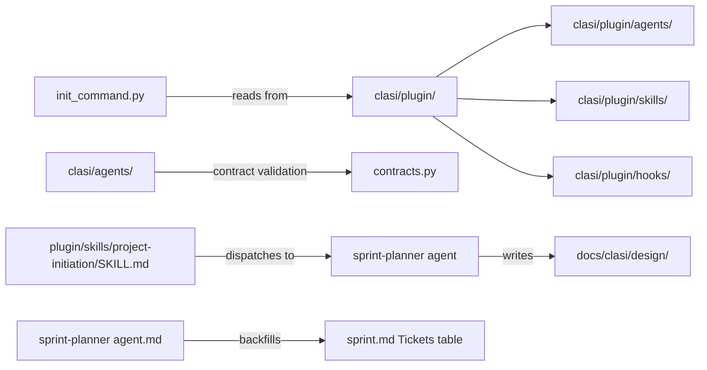

<!-- CLASI: Before changing code or making plans, review the SE process in CLAUDE.md -->

# Architecture Update -- Sprint 003: SE Process Tooling Improvements

## What Changed

### 1. Plugin Content Relocated into Python Package (`clasi/plugin/`)

The `plugin/` directory at the repo root is moved into the `clasi` Python package as
`clasi/plugin/`. This makes it proper package data rather than a repo-root convention.

- **Before**: `plugin/agents/`, `plugin/skills/`, `plugin/hooks/` at repo root.
  `_PLUGIN_DIR` in `init_command.py` resolves via `Path(__file__).parent.parent / "plugin"`.
- **After**: `clasi/plugin/agents/`, `clasi/plugin/skills/`, `clasi/plugin/hooks/`.
  `_PLUGIN_DIR` resolves via `Path(__file__).parent / "plugin"` (package-internal).

`pyproject.toml` `[tool.setuptools.package-data]` is updated to include `plugin/**/*`
under the `clasi` package. The old `plugin/**` glob at the repo root is removed.

The `clasi/agents/` directory is **not** merged into `clasi/plugin/agents/`. These
serve different purposes:
- `clasi/plugin/agents/` — installable Claude Code agents (3 agents for end users)
- `clasi/agents/` — contract validation hierarchy (13 agents with `contract.yaml` files)

`contracts.py` searches `clasi/agents/` for `contract.yaml` files. It does not use
`plugin/` content. The two trees remain separate with distinct responsibilities.

Process descriptions that appeared in both `plugin/agents/sprint-planner/agent.md`
and `clasi/agents/domain-controllers/sprint-planner/plan-sprint.md` are reconciled:
`plugin/agents/sprint-planner/agent.md` is the canonical installable definition;
`clasi/agents/` descriptions are for contract context only.

### 2. Project Initiation Skill Dispatches to Subagent

`plugin/skills/project-initiation/SKILL.md` is updated so that the team-lead
dispatches to the sprint-planner agent (via the Agent tool) to produce the three
design documents, rather than writing them directly.

- **Before**: Skill instructed the invoking agent to write documents itself.
- **After**: Skill instructs team-lead to dispatch to sprint-planner (or a dedicated
  initiation subagent), passing the specification. The subagent writes `overview.md`,
  `specification.md`, and `usecases.md` and calls `create_overview`.

Output directory is explicitly set to `docs/clasi/design/` in both the skill
description and the subagent instructions. This resolves inconsistency where overview
was sometimes created at the wrong path.

### 3. Sprint Template and Sprint-Planner Agent Updated for Ticket Table

`clasi/templates/sprint.md` `## Tickets` section is updated from a prose placeholder
to an empty table with the required columns.

`plugin/agents/sprint-planner/agent.md` gains a new step after ticket creation (step
14b in the workflow): read back created tickets, compute topological groups, and update
the `## Tickets` table in `sprint.md`.

`clasi/agents/domain-controllers/sprint-planner/plan-sprint.md` gains step 12b with
the same backfill instruction.

## Why

- **Plugin relocation** (SUC-001, TODO: `consolidate-agent-definitions-and-skills.md`):
  `plugin/` at the repo root is not proper Python package structure. It cannot be
  reliably bundled as package data using standard `setuptools` without fragile
  relative-path hacks. Moving it inside the package makes installation reliable and
  removes the dual-path `_PLUGIN_DIR` fallback.

- **Project initiation subagent dispatch** (SUC-002, SUC-003,
  TODOs: `project-initiation-dispatch-to-subagent.md`, `project-init-docs-in-design-dir.md`):
  The team-lead's core rule is "never write content directly." The existing
  `project-initiation` skill violated this by instructing the team-lead to write
  documents itself. Dispatching to a subagent restores consistency. Fixing the output
  directory to `docs/clasi/design/` eliminates a recurring confusion.

- **Ticket table backfill** (SUC-004,
  TODO: `sprint-planner-backfill-tickets-in-sprint-md.md`):
  After sprint planning, `sprint.md` is the canonical sprint summary, but it lacks
  a ticket index. Stakeholders and team-leads must open individual ticket files to
  understand what was planned. The table makes `sprint.md` self-contained.

## Impact on Existing Components

| Component | Change |
|---|---|
| `clasi/init_command.py` | `_PLUGIN_DIR` path updated; dev-layout fallback removed |
| `pyproject.toml` | `package-data` updated: `plugin/**/*` added under `clasi` |
| `plugin/` (repo root) | Removed after content moved to `clasi/plugin/` |
| `plugin/skills/project-initiation/SKILL.md` | Now at `clasi/plugin/skills/...`; updated to dispatch to subagent |
| `plugin/agents/sprint-planner/agent.md` | Now at `clasi/plugin/agents/...`; new ticket-table backfill step |
| `clasi/templates/sprint.md` | `## Tickets` section now has empty summary table |
| `clasi/agents/domain-controllers/sprint-planner/plan-sprint.md` | New step 12b for ticket table backfill |
| `clasi/agents/` (13 agents, contracts) | Unchanged — separate responsibility from plugin content |

## Migration Concerns

- **`clasi init` users**: The command output is identical. The source path changes
  internally; the destination `.claude/` layout is unchanged.
- **Installed projects**: Already-initialized projects are unaffected. Running
  `clasi init` again on an existing project will re-copy from the new location.
- **`plugin/` at repo root**: Any direct references (CI scripts, documentation) to
  `plugin/` must be updated to `clasi/plugin/`. A grep of the repo should be done
  before deletion.
- **`pyproject.toml`**: The `package-data` stanza must be updated before `plugin/` is
  deleted; otherwise an installed package would lose the content.
- **No data migration required**: This sprint modifies only source files and agent
  instruction text. No database schemas, MCP state, or user data are affected.
