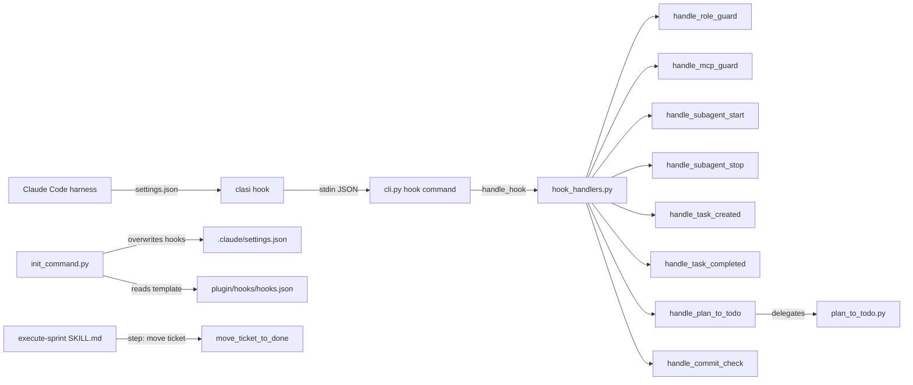

<!-- CLASI: Before changing code or making plans, review the SE process in CLAUDE.md -->

# Architecture Update -- Sprint 004: Hook System Refactor and Process Guards

## What Changed

### 1. `handle_hook()` Dispatcher Added to `hook_handlers.py`

A new top-level function `handle_hook(event: str) -> None` is added to
`clasi/hook_handlers.py`. It reads the JSON payload from stdin via
`read_payload()` and routes to the correct handler based on the event name.

Routing table:

| Event name       | Handler                  |
|------------------|--------------------------|
| `role-guard`     | `handle_role_guard`      |
| `subagent-start` | `handle_subagent_start`  |
| `subagent-stop`  | `handle_subagent_stop`   |
| `task-created`   | `handle_task_created`    |
| `task-completed` | `handle_task_completed`  |
| `mcp-guard`      | `handle_mcp_guard`       |
| `plan-to-todo`   | `handle_plan_to_todo`    |
| `commit-check`   | `handle_commit_check`    |

`handle_plan_to_todo` delegates to `clasi.plan_to_todo.plan_to_todo()`.
`handle_commit_check` replaces the inline bash PostToolUse hook that detected
commits on master and printed a reminder.

### 2. Missing Event Names Added to `clasi hook` CLI (`cli.py`)

The `click.Choice` list in `cli.py`'s `hook` command is extended with:
`mcp-guard`, `plan-to-todo`, `commit-check`.

The existing `from clasi.hook_handlers import handle_hook` import is already
present; no structural change to `cli.py` beyond the extended choice list.

### 3. Hook Configuration Template Updated (`clasi/plugin/hooks/hooks.json`)

All hook commands are updated from `python3 .claude/hooks/foo.py` to
`clasi hook <event-name>`. The PostToolUse Bash hook (inline bash) is replaced
with `clasi hook commit-check`. The PostToolUse ExitPlanMode entry is added
(it was missing from `hooks.json`) as `clasi hook plan-to-todo`.

The `plan_to_todo.py` script is not in `hooks.json` (only in the live project
`.claude/`) — this discrepancy is resolved by adding the ExitPlanMode entry
to the template.

Python hook scripts (`*.py`) are removed from `clasi/plugin/hooks/`. The
directory contains only `hooks.json` after this sprint.

### 4. `clasi init` Hook Installation Rewrites Unconditionally

`_install_plugin_content` in `init_command.py` currently merges hooks with
`setdefault` and skips entries already present. This is replaced with an
overwrite: the entire `hooks` key in `settings.json` is replaced with the
content of `hooks.json` on every `clasi init` run. Idempotency is preserved
(re-running with the same template produces "Unchanged").

The hook script copy loop (which copies `*.py` from `plugin/hooks/` to
`.claude/hooks/`) is removed, since there are no longer any `.py` files to
copy.

### 5. Live Hook Configuration Updated and Python Scripts Deleted

`.claude/settings.json` in the CLASI project itself is updated:
- All `python3 .claude/hooks/foo.py` commands become `clasi hook <event>`
- The inline bash commit-check is replaced with `clasi hook commit-check`
- The ExitPlanMode entry changes from `python3 .claude/hooks/plan_to_todo.py`
  to `clasi hook plan-to-todo`

All `.py` files in `.claude/hooks/` are deleted.

### 6. Role Guard Tightened for Tier-0 Source Writes

The `handle_role_guard()` function in `hook_handlers.py` is updated to be
more explicit about what tier-0 is allowed to write. Investigation of the
current code shows that tier-0 is allowed `.claude/` broadly (line 144).
This is correct — team-lead needs to write to `.claude/settings.json` and
`.claude/rules/`. However, the existing logic has no explicit list of blocked
extensions or a tighter path allowlist.

The fix adds a check: if the file path matches `.claude/` but is a source
code file extension (`.py`, `.ts`, `.js`, `.sh`, `.toml`, `.yaml`, `.json`
outside of `.claude/`), that write is blocked. The general approach is to
validate that `.claude/` writes are to expected subdirectories (settings,
rules, agents, skills, hooks) and not to arbitrary source files.

The actual guard logic after the fix reads:
1. Tier-2: allow (programmer's job)
2. OOP bypass: allow
3. Recovery state bypass: allow
4. Safe top-level files: `CLAUDE.md`, `AGENTS.md` — allow
5. `.claude/` prefix: allow (team-lead configures the harness)
6. `docs/clasi/` prefix (excluding `sprints/`): allow
7. Everything else: block with ROLE VIOLATION

The key insight from reading the current code: source code files (`.py` in
`clasi/`, etc.) do not match any of these conditions and are already blocked.
The actual bug reported in the reflection is likely tier detection failure
(the env var `CLASI_AGENT_TIER` was not set in the team-lead session, and the
DB fallback returned an unexpected value). The fix confirms and tests this path.

### 7. Execute-Sprint Skill Updated with Ticket Move Step

`clasi/plugin/skills/execute-sprint/SKILL.md` already contains a strong note:
"Ticket completion is mandatory... `move_ticket_to_done` called." The skill
is updated to make this a numbered step in the Monitor Progress section:

> After each programmer Task completes:
> 1. Verify `status: done` in ticket frontmatter
> 2. Call `move_ticket_to_done(ticket_path)` for that ticket
> 3. Continue monitoring remaining tasks

This makes the move explicit and ordered relative to the completion check.

## Why

- **SUC-001 (Hook dispatching via CLI)**: Using `python3 .claude/hooks/foo.py`
  is fragile because it relies on ambient `python3` having access to the
  `clasi` package. CLASI is installed via pipx, which uses an isolated
  environment. The `clasi` executable on PATH is the correct entry point.

- **SUC-002 (clasi init overwrites hooks)**: The merge-then-skip strategy
  means users who ran `clasi init` before this sprint never receive updated
  hook commands. Overwriting ensures all projects converge on the current
  configuration.

- **SUC-003 (Role guard tightening)**: The team-lead writing source code
  directly violates the CLASI process model. Structural enforcement is
  necessary because relying on agent discipline has demonstrably failed
  (per reflection 2026-04-03).

- **SUC-004 (Ticket move after completion)**: The ticket file moving to
  `tickets/done/` is required for `close_sprint` validation to pass. The
  programmer is responsible for setting `status: done` in frontmatter; the
  team-lead or hook is responsible for the file move. Making this explicit
  in the skill eliminates the gap.

## Impact on Existing Components

| Component | Change |
|---|---|
| `clasi/hook_handlers.py` | Add `handle_hook()` dispatcher; add `handle_plan_to_todo()`, `handle_commit_check()`; tighten `handle_role_guard()` |
| `clasi/cli.py` | Extend `click.Choice` with `mcp-guard`, `plan-to-todo`, `commit-check` |
| `clasi/init_command.py` | Switch hooks install from merge-skip to overwrite; remove `.py` copy loop |
| `clasi/plugin/hooks/hooks.json` | All commands use `clasi hook <event>`; add ExitPlanMode entry |
| `clasi/plugin/hooks/*.py` | All Python scripts deleted |
| `.claude/settings.json` | All hook commands updated to `clasi hook <event>` |
| `.claude/hooks/*.py` | All Python scripts deleted |
| `clasi/plugin/skills/execute-sprint/SKILL.md` | Add numbered `move_ticket_to_done` step |

## Migration Concerns

- **Existing projects**: Any project that ran `clasi init` before this sprint
  has `python3 .claude/hooks/foo.py` commands in `settings.json`. These will
  continue to fail if `python3` lacks the `clasi` package. Running
  `clasi init` after this sprint upgrades them. No automated migration is
  provided; users must re-run `clasi init`.

- **Live CLASI project** (this repo): `.claude/settings.json` and
  `.claude/hooks/*.py` are modified as part of ticket 002. The Python scripts
  are deleted. A brief window exists where the script files are gone but
  `settings.json` still references them; the ticket ensures both changes happen
  atomically (same commit).

- **No data migration required**: No database schemas, MCP state, or log
  files are affected.

## Design Rationale

### Decision: `handle_hook()` as the single dispatcher vs. routing in `cli.py`

**Context**: `cli.py` already has `if event == "role-guard": handle_role_guard()`
style code. We could extend that pattern or introduce a dispatcher function.

**Alternatives considered**:
1. Extend the `if/elif` chain directly in `cli.py`.
2. Add a `handle_hook()` dispatcher in `hook_handlers.py` that `cli.py` calls.

**Why this choice**: Option 2 keeps `cli.py` as a thin wiring layer. The
routing logic (which event maps to which handler) belongs in `hook_handlers.py`
alongside the handlers themselves. This makes it straightforward to test the
dispatcher in isolation without invoking Click.

**Consequences**: `cli.py` becomes a one-liner (`handle_hook(event)`). The
dispatcher is testable. Adding a new event requires only a change to
`hook_handlers.py`.

### Decision: Overwrite hooks on `clasi init` vs. prompt user

**Context**: Overwriting could clobber user customizations to the hooks section.

**Why this choice**: The hooks section is entirely managed by CLASI. It is not
a place for user customizations — those belong in `.claude/settings.local.json`
or custom rule files. Overwriting ensures correctness without requiring a
migration script.

**Consequences**: Any manual edits to the hooks section in `settings.json` will
be lost on `clasi init`. This is acceptable and documented.

## Open Questions

None — all design decisions are resolvable from the existing codebase.
