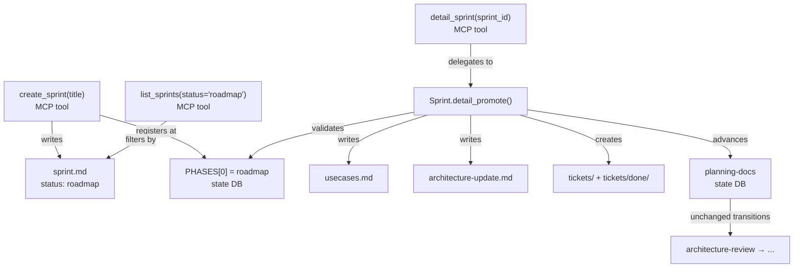

# Architecture Update — Sprint 017: Two-phase sprint planning: roadmap then detail

## What Changed

### 1. `PHASES` constant — `roadmap` prepended as first phase

`clasi/state_db_class.py` line 17 defines the `PHASES` list. The constant
currently starts at `planning-docs`. After this sprint it begins with
`roadmap`:

```
roadmap → planning-docs → architecture-review → stakeholder-review
        → ticketing → executing → closing → done
```

The database schema default for new sprints changes from `planning-docs` to
`roadmap`. All existing sprints in `done/` are unaffected (their phase records
are already `done`). In-flight sprint 016 keeps its current phase; no
migration is needed.

The `StateDB.advance_phase()` method uses sequential index arithmetic on
`PHASES`. Prepending `roadmap` automatically makes `advance_phase()` from
`roadmap` advance to `planning-docs`, and all downstream transitions remain
unchanged.

**Use cases**: SUC-004.

---

### 2. `create_sprint` — writes only `sprint.md` with `status: roadmap`

`clasi/project.py` `Project.create_sprint()` currently writes three files
(`sprint.md`, `usecases.md`, `architecture-update.md`) and creates
`tickets/` and `tickets/done/`. After this sprint it writes only `sprint.md`.

The sprint.md template (`clasi/templates/sprint.md`) must produce
`status: roadmap` in frontmatter. The usecases and architecture templates
remain but are no longer invoked from `create_sprint`; they move to
`Sprint.detail_promote()`.

The `create_sprint` MCP tool (in `artifact_tools.py`) registers the sprint in
the state DB at phase `roadmap` rather than `planning-docs`. This is the only
change to the MCP tool's external contract: callers receive a sprint in
`roadmap` phase.

**Use cases**: SUC-001, SUC-004.

---

### 3. `Sprint.detail_promote()` — new method on the Sprint class

`clasi/sprint.py` gains a new method `detail_promote()`. Its responsibilities:

1. Validate the sprint is in `roadmap` phase; raise `ValueError` if not.
2. Validate no `usecases.md` already exists (idempotency guard).
3. Write `usecases.md` from `SPRINT_USECASES_TEMPLATE`.
4. Write `architecture-update.md` from `SPRINT_ARCHITECTURE_UPDATE_TEMPLATE`.
5. Create `tickets/` and `tickets/done/` directories.
6. Call `self.advance_phase()` to move the state DB from `roadmap` to
   `planning-docs`.
7. Return a dict with the paths written and the new phase.

This method is the single source of truth for promotion. The MCP tool
`detail_sprint` delegates entirely to it.

**Use cases**: SUC-002, SUC-004.

---

### 4. `detail_sprint(sprint_id)` — new MCP tool in `artifact_tools.py`

A new `@server.tool()` function named `detail_sprint` is added to
`clasi/tools/artifact_tools.py`. Interface:

```
detail_sprint(sprint_id: str) -> str  (JSON)
```

Behaviour:
- Resolves the sprint by ID using `get_project().get_sprint(sprint_id)`.
- Delegates to `sprint.detail_promote()`.
- Returns JSON: `{sprint_id, phase, files_written}`.
- On error (sprint not in roadmap, artifacts already present), returns a
  JSON error message with a clear explanation.

No new module is created. The tool lives alongside `create_sprint`,
`advance_sprint_phase`, and other artifact tools in the existing file.

**Use cases**: SUC-002.

---

### 5. `list_sprints` status filter — verify and document

`clasi/project.py` `Project.list_sprints(status=None)` already supports
status filtering by reading `sprint.md` frontmatter (line 91–111). After
`create_sprint` sets `status: roadmap`, passing `status="roadmap"` will
naturally return roadmap sprints.

The MCP tool `list_sprints` in `artifact_tools.py` must pass the `status`
argument through to `project.list_sprints()`. Verify this wiring is complete;
add it if missing.

**Use cases**: SUC-003.

---

### 6. Template split — `sprint.md` template sets `status: roadmap`

`clasi/templates/sprint.md` currently does not set `status` in frontmatter
(or sets `status: planning`). It must be updated to set `status: roadmap`.

The usecases and architecture-update templates remain in
`clasi/templates/` and are unchanged in content. They are simply no longer
called from `create_sprint`. They are called from `Sprint.detail_promote()`.

No new template files are created. No template is deleted.

**Use cases**: SUC-001.

---

### 7. Skill and agent prose updates

Four text files are updated to reflect the actual tool-level two-phase flow:

**`clasi/plugin/skills/sprint-roadmap/SKILL.md`**
Remove the workaround steps (delete extra artifacts, overwrite sprint.md).
The skill now simply calls `create_sprint` and writes content into the
returned lightweight `sprint.md`.

**`clasi/plugin/skills/plan-sprint/SKILL.md`**
Phase 1 (Roadmap) section: state that `create_sprint` produces only `sprint.md`
with `status: roadmap`. No manual deletion step.
Phase 2 (Detail) section: state that `detail_sprint(sprint_id)` is called
first to scaffold missing artifacts before the agent begins writing content.

**`clasi/plugin/agents/sprint-planner/agent.md`**
Roadmap Mode: call `create_sprint`, receive roadmap sprint, write content.
Detail Mode: call `detail_sprint(sprint_id)` first; it advances phase to
`planning-docs` and scaffolds artifacts; then write content into those files.

**`clasi/plugin/agents/team-lead/agent.md`**
Sprint queue survey: distinguish roadmap sprints (phase = `roadmap`, not yet
ready for execution dispatch) from detail-planned sprints (phase =
`planning-docs` or later, eligible for `detail_sprint` or execution).

**Use cases**: SUC-005.

---

### 8. Tests

New and updated tests:

**`tests/unit/test_project.py`**
- `test_create_sprint_writes_only_sprint_md`: assert `usecases.md`,
  `architecture-update.md`, and `tickets/` do not exist after `create_sprint`.
- `test_create_sprint_status_roadmap`: assert sprint.md frontmatter has
  `status: roadmap`.

**`tests/unit/test_sprint.py`**
- `test_detail_promote_scaffolds_artifacts`: call `detail_promote()` on a
  roadmap sprint, assert all artifacts exist and phase is `planning-docs`.
- `test_detail_promote_rejects_non_roadmap`: call `detail_promote()` on a
  sprint already in `planning-docs`, assert `ValueError`.
- `test_detail_promote_idempotent_guard`: create `usecases.md` manually,
  call `detail_promote()`, assert error.

**`tests/unit/test_state_db_class.py`**
- `test_roadmap_is_first_phase`: assert `PHASES[0] == "roadmap"`.
- `test_advance_from_roadmap`: assert advancing from `roadmap` yields
  `planning-docs`.

**`tests/system/test_artifact_tools.py`**
- `test_detail_sprint_tool_roundtrip`: `create_sprint` → assert phase is
  `roadmap` → `detail_sprint` → assert phase is `planning-docs` → assert
  all artifacts present.
- `test_list_sprints_status_roadmap`: create two sprints, advance one
  to `planning-docs`, assert `list_sprints(status="roadmap")` returns only
  the roadmap one.

**Use cases**: SUC-006.

---

## Why

| Change | Rationale |
|--------|-----------|
| `PHASES` gains `roadmap` first | The two-phase model is documented but unenforceable without a machine-level gate. Prepending `roadmap` closes that gap with zero disruption to existing transitions. |
| `create_sprint` writes only `sprint.md` | Roadmap planning sessions require creating many sprints quickly. Scaffolding full artifacts bloats the repository and forces workarounds (manual deletion). The lightweight default fixes this. |
| `Sprint.detail_promote()` | Centralizes promotion logic in the domain class, following the existing pattern of `Sprint.archive()`. The MCP tool is a thin wrapper. |
| `detail_sprint` MCP tool | Makes promotion a first-class, gated operation. Agents and humans call one tool; the tool validates preconditions and advances the state machine. |
| Skill/agent prose updates | Four files currently describe a model that is impossible to execute with the tools. Updating them eliminates contradictions and removes workaround instructions. |
| Tests | The lifecycle is safety-critical: a missing `detail_sprint` call could leave a sprint stuck at `roadmap` with no tooling path forward. Tests catch this regression. |

---

## Component Diagram



---

## Entity-relationship diagram (state machine)

```mermaid
stateDiagram-v2
    [*] --> roadmap : create_sprint
    roadmap --> planning-docs : detail_sprint
    planning-docs --> architecture-review : advance_sprint_phase
    architecture-review --> stakeholder-review : advance_sprint_phase
    stakeholder-review --> ticketing : advance_sprint_phase
    ticketing --> executing : acquire_execution_lock
    executing --> closing : advance_sprint_phase
    closing --> done : close_sprint
```

---

## Impact on Existing Components

| Component | Impact |
|-----------|--------|
| `StateDB.advance_phase()` | No code change; adding `roadmap` to `PHASES` automatically extends the sequence. |
| `Project.list_sprints()` | No code change; status filter already reads frontmatter. Verify MCP tool passes `status` arg. |
| `Sprint.archive()` | No change; archives still copy `architecture-update.md` when it exists. The `exists()` check already handles missing files gracefully. |
| `create_sprint` callers (existing sprints) | Sprints in `done/` are unaffected. In-flight sprint 016 is unaffected (its state DB record pre-dates the schema default change). |
| `advance_sprint_phase` MCP tool | No change to the tool itself. Its behavior on `roadmap` sprints is now: rejects if the sprint is at `roadmap` (it is not a valid `advance_sprint_phase` target — use `detail_sprint` instead). Gate validation must confirm this. |

---

## Migration Concerns

- **No data migration required.** Existing sprints in `done/` have phase `done`
  in the state DB; `roadmap` prepended to `PHASES` does not affect them.
- **In-flight sprint 016** is in `executing`/`closing` phase and will not be
  touched by this change.
- **Sprints 018–022** are currently in `planning-docs` state (they were
  created with the old one-shot `create_sprint` and had their extra artifacts
  deleted manually). After this sprint lands, those sprints are already past
  `roadmap` and can proceed normally through `detail_sprint`-mediated planning
  or direct detail work.

---

## Design Rationale

### Decision: `detail_sprint` as a separate MCP tool, not a flag on `create_sprint`

**Context**: Two options exist — add `roadmap_only: bool = True` to
`create_sprint`, or introduce `detail_sprint` as an explicit promotion tool.

**Alternatives considered**:
1. `create_sprint(roadmap_only=True)` — one tool, opt-in detail scaffolding.
2. `detail_sprint(sprint_id)` — separate tool, explicit promotion.

**Why separate tool**: The two operations have different preconditions,
different outputs, and different phase transitions. Combining them into one
tool with a flag violates single-responsibility and hides the state transition
behind an optional argument. A separate tool is explicit, discoverable, and
lets the state machine enforce ordering.

**Consequences**: Callers must call two tools in sequence for detail planning.
This is a deliberate friction point that matches the two-phase model.

---

### Decision: `Sprint.detail_promote()` rather than `Project.detail_sprint()`

**Context**: Promotion logic could live in `Project` (alongside `create_sprint`)
or in `Sprint` (alongside `archive`).

**Why `Sprint`**: The operation acts on a single sprint's artifacts and phase.
`Sprint.archive()` sets the pattern — it modifies the sprint's state and moves
files. `detail_promote()` follows the same pattern. `Project.create_sprint()`
is the factory; post-creation operations belong on the domain object.

---

## Open Questions

None. All decisions were locked in by the stakeholder before sprint planning
(see TODO file).
