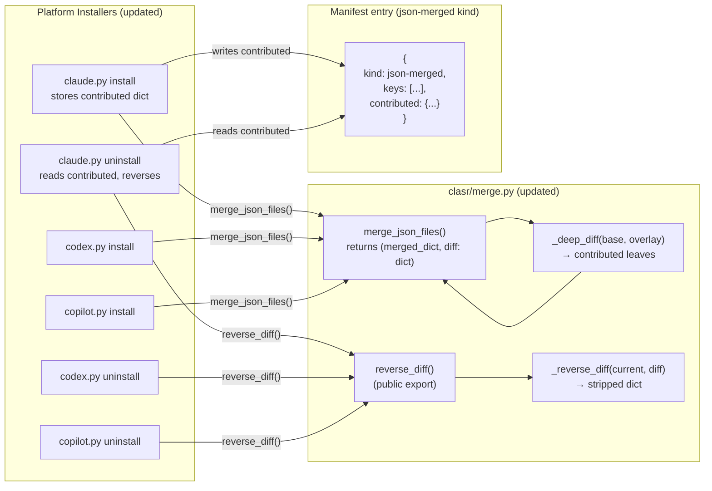
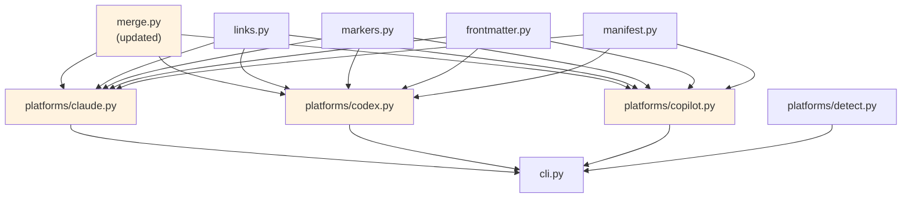

# Architecture Update — Sprint 019: clasr settings.json multi-provider uninstall fix

## What Changed

### 1. `clasr/merge.py` — deep-diff recording replaces top-level key list

The public API of `merge_json_files` changes its second return value.

**Before (sprint 014)**:
```python
merge_json_files(existing, incoming, provider, other_provider) -> tuple[dict, list[str]]
# Second element: list of top-level keys from incoming, e.g. ["model", "permissions"]
```

**After (sprint 019)**:
```python
merge_json_files(existing, incoming, provider, other_provider) -> tuple[dict, dict]
# Second element: deep-diff snapshot — the exact nested paths and leaf values
#                 that incoming contributes beyond the pre-merge state
```

The deep-diff is computed by a new private helper `_deep_diff(base, overlay) -> dict`
that walks `overlay` recursively and records only the paths and leaf values present in
`overlay` that either do not exist in `base` or differ from `base`. The result is a
nested dict mirroring the shape of the contribution — not a flat path list. This
structure:

- Is unambiguous for nested objects: `{"permissions": {"allow": ["Bash(git status)"]}}` vs.
  `["permissions"]`.
- Can be reversed by a matching `_reverse_diff(current, diff) -> dict` helper that
  strips the contributed leaves from `current`.
- Degenerates naturally to a top-level key list for non-overlapping keys (each contributed
  key maps to its full value).

The conflict warning behavior (one WARNING per conflicting top-level key, naming both
providers) is unchanged.

**New private helpers added to `clasr/merge.py`**:

```
_deep_diff(base: dict, overlay: dict) -> dict
    Returns the sub-tree of overlay that contributes new or changed leaf values
    relative to base. For dict-vs-dict, recurses. For all other types, returns
    the overlay value if it differs from base, else omits it.

_reverse_diff(current: dict, diff: dict) -> dict
    Returns a copy of current with the leaves recorded in diff removed.
    For dict-vs-dict, recurses. For scalar/list leaves, removes the key from
    current (does not attempt value-level list diffing).
    Leaves that no longer exist in current are silently skipped.
```

The `is_json_passthrough` function is unchanged.

**Boundary**: JSON parsing + dict merging + diff computation + stderr warnings. No file
writes. No `clasr` or `clasi` imports. Leaf node.

**Use cases**: SUC-001, SUC-002, SUC-004.

---

### 2. `clasr/manifest.py` — manifest schema version 2 for `json-merged` entries

The `"json-merged"` entry kind gains a new field `"contributed"` to hold the deep-diff
snapshot. The `"keys"` field is retained for backward compatibility but is no longer
authoritative for sprint-019 installs.

**New schema for `json-merged` entries**:
```json
{
  "path": ".claude/settings.json",
  "kind": "json-merged",
  "keys": ["model", "permissions"],
  "contributed": {
    "model": "claude-3-opus",
    "permissions": {
      "allow": ["Bash(pytest:*)"]
    }
  }
}
```

- `"keys"` is now a derived convenience field (top-level keys of `"contributed"`),
  included for tooling that only needs a summary.
- `"contributed"` is the authoritative deep-diff snapshot used by uninstall.
- Manifests without `"contributed"` are in the old (v1) format; uninstall falls back
  to top-level key removal and emits a deprecation warning (SUC-005).

No schema version bump to the manifest `"version"` field is introduced — the change is
additive and backward-compatible. The `"contributed"` field's presence signals new
format; its absence signals old format.

**`manifest.py` itself has no code changes** — it is a thin JSON I/O layer. Schema
interpretation lives in the platform installers and in `merge.py`.

**Boundary**: JSON I/O only. Schema documentation updated. No logic changes.

**Use cases**: SUC-001, SUC-002, SUC-005.

---

### 3. Platform installers (`clasr/platforms/claude.py`, `codex.py`, `copilot.py`) — store deep-diff in manifest

At install time, when `merge.is_json_passthrough(src_file)` and the destination already
exists, the platform installer calls `merge.merge_json_files` and receives
`(merged_dict, diff)` where `diff` is now a `dict` (deep-diff snapshot) instead of
`list[str]`.

The manifest entry is updated to include both `"keys"` (derived from `diff`) and
`"contributed"` (the full diff):

```python
entries.append({
    "path": rel_str,
    "kind": "json-merged",
    "keys": list(diff.keys()),        # top-level summary for compat
    "contributed": diff,              # authoritative deep-diff
})
```

At uninstall time, when a `"json-merged"` entry is encountered, the platform installer:

1. Checks for the `"contributed"` field in the entry.
2. If present, calls `merge.reverse_diff(current_data, contributed)` to strip only the
   contributed leaves.
3. If absent (old format), falls back to removing top-level keys from `entry["keys"]`
   and emits a WARNING to stderr.

This makes uninstall reversal precise: only the exact nested values this provider
contributed are removed.

**Changes confined to**: the `json-merged` install branch (writing `"contributed"` into
the entry dict) and the `json-merged` uninstall branch (reading `"contributed"` and
calling `reverse_diff`). All other entry kinds (`copy`, `symlink`, `rendered`,
`marker-block`) are unchanged.

**All three platform modules** (`claude.py`, `codex.py`, `copilot.py`) receive the same
symmetric change, since all three share the same `json-merged` install/uninstall pattern.

**Boundary**: Each platform module's boundary is unchanged — it writes only to its own
platform directory. The new logic is a local change to the JSON-merge install/uninstall
branches inside each module.

**Use cases**: SUC-001, SUC-002, SUC-003, SUC-004, SUC-005.

---

### 4. `tests/clasr/test_merge.py` — new deep-diff tests

New test cases covering:
- `_deep_diff` with non-overlapping keys: returns full overlay.
- `_deep_diff` with overlapping nested dict: returns only changed/added leaves.
- `_deep_diff` with scalar conflict: returns overlay scalar.
- `_reverse_diff` removes contributed leaves from a merged result.
- `_reverse_diff` with missing keys in current dict: silently skips.
- `merge_json_files` second return value is now a `dict`, not a `list`.
- `merge_json_files` round-trip: merge then reverse produces the original base.

Existing tests updated: `test_merge_json_files_returns_contributed_keys` and
`test_merge_json_files_basic` assert against a `dict` return type rather than `list[str]`.

---

### 5. `tests/clasr/test_multi_tenant.py` — overlapping-key scenarios

New test class `TestJsonMergeUninstallOverlapping` (Section C2) covering:

- **C2-1**: Both providers contribute `model`; uninstalling provider2 leaves provider1's
  `model` intact (old top-level-key removal would delete `model` entirely).
- **C2-2**: Both providers contribute to `permissions.allow`; uninstalling provider2
  removes only provider2's list entries, leaves provider1's entries.
- **C2-3**: After uninstalling provider2, uninstalling provider1 deletes `settings.json`
  (no orphan data).
- **C2-4**: Old-format manifest (no `"contributed"` field) triggers fallback + WARNING.

Existing Section C tests (`test_c1_uninstall_b_leaves_a_key`,
`test_c2_file_deleted_when_both_uninstalled`) remain and pass (non-overlapping keys are
the degenerate case where deep-diff and top-level-key removal produce the same result).

---

### 6. `tests/asr/provider2/claude/settings.json` — updated to overlap with provider1

Currently provider2's `settings.json` only has `mcpServers`, which does not overlap with
provider1's `model` and `permissions`. To exercise the bug scenario from the TODO and
make the `just demo` meaningful, provider2's settings are updated to also include `model`
(different value) and an additional entry in `permissions.allow`.

This makes the `just demo` output demonstrate the real-world problem and its fix.

---

## Why

The sprint-014 design recorded `"keys": ["model", "permissions"]` for JSON-merged entries.
On uninstall, the platform module pops those entire top-level keys, removing both
providers' contributions to `model` and `permissions`. The bug is that `pop("model")`
removes provider1's model setting along with provider2's.

The deep-diff approach records exactly what provider2 added: `{"model": "claude-3-opus",
"permissions": {"allow": ["Bash(pytest:*)"]}}`. Reversal removes only those leaves.
Provider1's `{"model": "sonnet", "permissions": {"allow": ["Read", "Bash(git status)"]}}` 
remains untouched.

This is option 2 from the source TODO, selected because it is the only approach that
composes correctly for arbitrary numbers of providers contributing to the same nested key
paths, without requiring a snapshot of the full file state.

---

## Impact on Existing Components

| Component | Change |
|-----------|--------|
| `clasr/merge.py` | `merge_json_files` second return type changes from `list[str]` to `dict`; new private helpers `_deep_diff`, `_reverse_diff` added; `reverse_diff` exported |
| `clasr/platforms/claude.py` | `json-merged` install branch stores `"contributed"` dict; uninstall branch reads `"contributed"` with fallback |
| `clasr/platforms/codex.py` | Same symmetric change as `claude.py` |
| `clasr/platforms/copilot.py` | Same symmetric change as `claude.py` |
| `clasr/manifest.py` | No code changes; schema doc updated |
| `tests/clasr/test_merge.py` | Existing assertions updated; new deep-diff tests added |
| `tests/clasr/test_multi_tenant.py` | New `TestJsonMergeUninstallOverlapping` class; existing tests pass |
| `tests/asr/provider2/claude/settings.json` | Updated to include overlapping `model` key |
| All other modules | Unchanged |

---

## Migration Concerns

Existing installed manifests on disk use the old format (`"keys"` without `"contributed"`).
The fallback path in the uninstall handler (SUC-005) ensures these are handled gracefully:
old-format uninstall continues to work as before (top-level key removal), with a deprecation
warning emitted. Operators who reinstall their providers after upgrading clasr will get
new-format manifests automatically.

No database migration, no file-format migration, no operator action required.

---

## Component Diagram



---

## Dependency Graph

No new dependencies are introduced. The dependency direction from sprint 014 is
unchanged:



No cycles. `merge.py` remains a leaf node (no `clasr` or `clasi` imports). Fan-out from
each platform module is still 5.

---

## Design Rationale

### Decision: Deep-diff stored as nested dict, not flat dot-notation path list

**Context**: Option 1 in the source TODO proposed recording path strings like
`["permissions.allow[2]", "permissions.allow[3]", "model"]`. Option 2 (selected here)
stores the contributed sub-tree as a nested dict.

**Why nested dict**: Array-index paths (`permissions.allow[2]`) are fragile — if other
providers or operators append to the array after this provider installed, the index-based
path no longer refers to the correct element. A nested dict makes no assumptions about
positional indices; it stores the value contributed, not where it ended up. The reversal
logic removes by value (for lists) or by key (for dicts), which is order-independent.

**Consequences**: For list values inside the contributed diff, `_reverse_diff` removes
the key entirely rather than attempting element-level list diffing (e.g. removing specific
`allow` entries). This is a deliberate simplification: list-level diffing is complex,
fragile, and rarely needed. If two providers both contribute to an array (e.g.
`permissions.allow`), the second provider's manifest records the entire `allow` array it
contributed. On uninstall, the `allow` key is removed from the current dict, not
element-by-element subtracted. Provider1's `allow` entries remain because they are
tracked in provider1's own contributed dict, not in provider2's.

This simplification is correct for all cases where providers contribute to the same
top-level object key but different nested structures. It breaks only if a provider
literally appends to an array that another provider also owns — a case that does not arise
in the realistic `settings.json` scenario (each provider owns its own `allow` list under
`permissions`).

**Alternatives**: Full list-diff (element tracking) was considered and rejected as
over-engineering given the actual use cases.

---

### Decision: Backward-compatible manifest — `"contributed"` field is optional

**Context**: Existing installs have manifests without `"contributed"`. A migration
strategy is needed.

**Why optional field with fallback**: Requiring a manifest version bump would break
existing uninstalls. Making `"contributed"` optional, with a fallback to `"keys"`-based
removal, keeps the upgrade seamless. Operators see a WARNING that informs them to
reinstall, but uninstall still completes. This follows the principle that tool upgrades
should not require operator intervention for existing installs.

**Consequences**: Two code paths in the uninstall handler (one for new format, one for
old). The old path is simple (already existed) and can be removed in a future sprint once
old manifests are no longer in the wild.

---

## Open Questions

None. The stakeholder pre-approved this sprint. The deep-diff approach and
backward-compatibility fallback are both locked in per the sprint.md decision.
