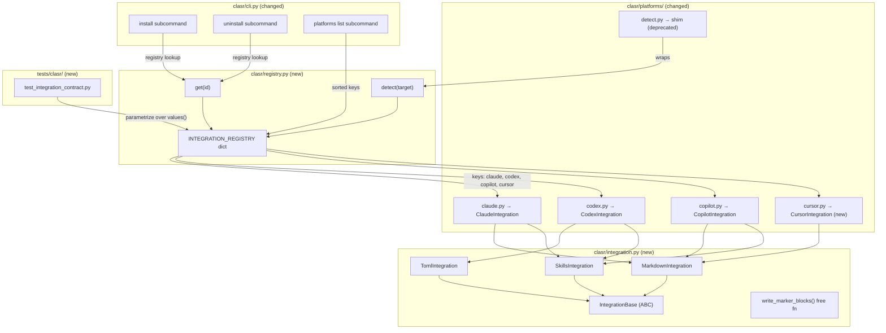
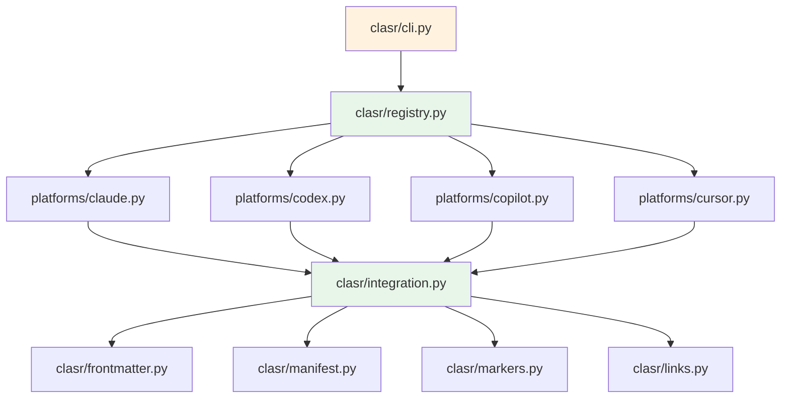

# Architecture Update — Sprint 021: Integration registry: base class and registry for clasr platforms

## What Changed

### New: `clasr/integration.py` — IntegrationBase ABC + three intermediate classes

A new module defines the contract every clasr platform must satisfy.

**`IntegrationBase`** (ABC, `@abstractmethod` on all behaviour):

Class-level fields (declared as class variables, not `__init__` parameters — each subclass declares them as class attributes):

```
id: str                                          # "claude", "codex", "cursor"
display_name: str                                # "Claude Code", "Cursor"
detect_files: list[str]                          # relative paths whose presence implies the platform
target_root: Path                                # ".claude", ".codex", ".github", ".cursor"
command_dir: Path | None                         # ".claude/commands", ".cursor/rules", None
skill_dir: Path | None                           # ".claude/skills", None
agent_dir: Path | None                           # ".claude/agents", None
rule_dir: Path | None                            # ".claude/rules", None
settings_file: Path | None                       # ".claude/settings.json", None
command_format: Literal["md", "toml", "yaml"]    # file format for command files
frontmatter_dialect: Literal["yaml", "toml", "none"]
invoke_separator: str                            # "/" for Claude slash cmds, ":" for others
companion_files: list[str]                       # ["AGENTS.md", "CLAUDE.md"]
```

Abstract methods (each subclass must implement):

```
render_agent(self, source: Path, target_dir: Path, provider: str) -> list[ManifestEntry]
render_skill(self, source: Path, target_dir: Path, provider: str, copy: bool) -> list[ManifestEntry]
render_rule(self, source: Path, target_dir: Path, provider: str) -> list[ManifestEntry]
install(self, source: Path, target: Path, provider: str, copy: bool = False) -> None
uninstall(self, target: Path, provider: str) -> None
```

`write_marker_blocks` is a **free function** in `integration.py` (not an abstract method), because marker-block logic is platform-agnostic — only the destination file(s) differ, and those are declared in `companion_files`. This resolves the open question from the TODO.

**`MarkdownIntegration(IntegrationBase)`** — platforms whose command files are `.md` with YAML frontmatter (Claude, Cursor, Continue, Aider). Provides a shared `render_agent` implementation that calls `frontmatter.render_file(source, self.id)` and writes to `self.agent_dir`. Subclasses override only where their output naming differs.

**`TomlIntegration(IntegrationBase)`** — platforms whose command files are `.toml` fragments (Codex). Provides a shared `render_agent` implementation using the `"codex"` frontmatter projection. Rule handling (scoped vs unscoped) lives here because it is common to all TOML-format platforms.

**`SkillsIntegration(IntegrationBase)`** — platforms with a `SKILL.md` convention (Claude Code skills, `.agents/skills/`). Provides a shared `render_skill` implementation (symlink-or-copy into `self.skill_dir`). Claude inherits from both `MarkdownIntegration` and `SkillsIntegration` via Python multiple inheritance; Codex inherits from `TomlIntegration` and `SkillsIntegration`.

Boundary: `integration.py` imports `clasr.frontmatter`, `clasr.manifest`, `clasr.markers`, `clasr.links`. It does not import any platform subclass — dependency is one-way.

---

### New: `clasr/registry.py` — INTEGRATION_REGISTRY, get(), detect()

```python
INTEGRATION_REGISTRY: dict[str, type[IntegrationBase]] = {
    "claude":   ClaudeIntegration,
    "codex":    CodexIntegration,
    "copilot":  CopilotIntegration,
}

def get(id: str) -> IntegrationBase:
    """Return a fresh instance of the integration with the given id.
    Raises KeyError for unknown ids."""

def detect(target: Path) -> list[IntegrationBase]:
    """Return instances of all integrations whose detect_files are present in target."""
```

`detect()` replaces `clasr/platforms/detect.py`. The old `detect.py` returned `dict[str, list[str]]` (platform → providers). The new `registry.detect()` returns `list[IntegrationBase]` instances (the platforms present), leaving provider discovery to the manifest layer. Callers that need provider lists continue to use `manifest.read_manifest()` directly.

Boundary: `registry.py` imports all three platform subclass modules (triggering their definitions) and `IntegrationBase`. No circular dependency: `registry.py` → platform modules → `integration.py` → shared utilities.

---

### Changed: `clasr/platforms/claude.py` — ClaudeIntegration subclass

The module-level `install()` and `uninstall()` free functions are replaced by `ClaudeIntegration`, which subclasses `MarkdownIntegration` and `SkillsIntegration`.

Class-level fields:
```
id = "claude"
display_name = "Claude Code"
detect_files = [".claude/.clasr-manifest"]
target_root = Path(".claude")
command_dir = None          # Claude uses agents/ not a commands/ dir for sprint 021
skill_dir = Path(".claude/skills")
agent_dir = Path(".claude/agents")
rule_dir = Path(".claude/rules")
settings_file = Path(".claude/settings.json")
command_format = "md"
frontmatter_dialect = "yaml"
invoke_separator = "/"
companion_files = ["AGENTS.md", "CLAUDE.md"]
```

The `_discover_other_provider` and `_cleanup_empty_dirs` helpers remain as private module functions called by the class methods.

The module retains a module-level backward-compatible shim:
```python
def install(source, target, provider, copy=False):
    ClaudeIntegration().install(source, target, provider, copy)

def uninstall(target, provider):
    ClaudeIntegration().uninstall(target, provider)
```
This shim allows existing call sites in tests to continue working unchanged during the conversion. Shims are removed once `cli.py` is updated to use the registry.

---

### Changed: `clasr/platforms/codex.py` — CodexIntegration subclass

Same pattern as Claude. `CodexIntegration` subclasses `TomlIntegration` and `SkillsIntegration`.

Class-level fields:
```
id = "codex"
display_name = "Codex"
detect_files = [".codex/.clasr-manifest"]
target_root = Path(".codex")
command_dir = None
skill_dir = Path(".agents/skills")
agent_dir = Path(".codex/agents")
rule_dir = None              # Codex rules go to nested AGENTS.md, not a rule_dir
settings_file = None
command_format = "toml"
frontmatter_dialect = "toml"
invoke_separator = ":"
companion_files = ["AGENTS.md"]
```

Module-level shims provided for backward compatibility.

---

### Changed: `clasr/platforms/copilot.py` — CopilotIntegration subclass

`CopilotIntegration` subclasses `MarkdownIntegration` (agents/rules as `.md`) and `SkillsIntegration` (skills handling).

Class-level fields:
```
id = "copilot"
display_name = "GitHub Copilot"
detect_files = [".github/.clasr-manifest"]
target_root = Path(".github")
command_dir = None
skill_dir = Path(".agents/skills")
agent_dir = Path(".github/agents")
rule_dir = Path(".github/instructions")
settings_file = None
command_format = "md"
frontmatter_dialect = "yaml"
invoke_separator = "/"
companion_files = [".github/copilot-instructions.md"]
```

Copilot overrides `render_agent` to append `.agent.md` suffix and `render_rule` to append `.instructions.md` suffix — divergences from the `MarkdownIntegration` defaults.

Module-level shims provided.

---

### New: `clasr/platforms/cursor.py` — CursorIntegration smoke-test subclass

```
id = "cursor"
display_name = "Cursor"
detect_files = [".cursor/"]
target_root = Path(".cursor")
command_dir = Path(".cursor/rules")
skill_dir = None
agent_dir = None
rule_dir = Path(".cursor/rules")
settings_file = None
command_format = "md"
frontmatter_dialect = "yaml"
invoke_separator = "/"
companion_files = []
```

`CursorIntegration` subclasses `MarkdownIntegration` only (no skills). Rules go to `.cursor/rules/*.mdc`. The `.mdc` extension is Cursor's convention; `render_rule` is overridden to emit `.mdc` output files. Cursor is added to `INTEGRATION_REGISTRY` as `"cursor": CursorIntegration`.

---

### Changed: `clasr/platforms/detect.py` — deprecated, replaced by registry.detect()

`clasr/platforms/detect.py` is retained but reduced to a thin wrapper that calls `registry.detect()` and converts the output back to the old `dict[str, list[str]]` format for any remaining callers. It is marked deprecated in its docstring.

---

### Changed: `clasr/cli.py` — registry dispatch + `platforms list` subcommand

`_cmd_install` and `_cmd_uninstall` are updated:

```python
# Before (sprint 020 state):
from clasr.platforms import claude, codex, copilot
if args.claude:
    claude.install(...)

# After (sprint 021):
from clasr.registry import INTEGRATION_REGISTRY
for name in selected_names:          # ["claude"], ["codex", "copilot"], etc.
    INTEGRATION_REGISTRY[name]().install(source, target, provider, copy=args.copy)
```

`--claude/--codex/--copilot` flags continue to exist but are now resolved to registry keys, not hardcoded module imports.

New `platforms` subcommand group with `list` subcommand:

```
clasr platforms list
```

Iterates `sorted(INTEGRATION_REGISTRY.keys())` and prints one ID per line. Exit 0.

---

### New: `tests/clasr/test_integration_contract.py` — parametrised contract test

```python
import pytest
from clasr.registry import INTEGRATION_REGISTRY

@pytest.mark.parametrize("integration_cls", list(INTEGRATION_REGISTRY.values()))
def test_contract_install_uninstall(integration_cls, tmp_path):
    source = _build_minimal_source(tmp_path)
    target = tmp_path / "target"
    target.mkdir()
    integration = integration_cls()
    integration.install(source, target, provider="test-provider")
    # assert: manifest file exists in expected location
    # assert: at least one installed file present
    integration.uninstall(target, provider="test-provider")
    # assert: manifest file gone
    # assert: installed files removed
```

The test fixture builds a minimal source directory (one SKILL.md, one agent .md, one rule .md, one AGENTS.md) valid for all platform types. Platform-specific behavior (e.g., Cursor emitting `.mdc`) is verified by asserting on the presence of at least one output file in `target_root`, not on exact file names.

---

## Why

The three platform modules share no enforced contract. Parity gaps (Codex vs Claude features) are invisible until someone reads code. Adding a fourth platform requires writing a new module from scratch and editing every call site. A typed `IntegrationBase` hierarchy with a registry turns addition from "fork and edit everything" into "subclass and register."

The Cursor smoke test is the key validation step: if `CursorIntegration` can be added without modifying the contract, the registry helpers, or the contract test, the abstraction is real. If it cannot, the sprint surfaces the mismatch before it becomes technical debt.

---

## Impact on Existing Components

| Component | Change |
|-----------|--------|
| `clasr/integration.py` | New: `IntegrationBase` ABC, `MarkdownIntegration`, `TomlIntegration`, `SkillsIntegration`, `write_marker_blocks` free function |
| `clasr/registry.py` | New: `INTEGRATION_REGISTRY`, `get()`, `detect()` |
| `clasr/platforms/claude.py` | Refactored: `ClaudeIntegration` class; module-level shims retained |
| `clasr/platforms/codex.py` | Refactored: `CodexIntegration` class; module-level shims retained |
| `clasr/platforms/copilot.py` | Refactored: `CopilotIntegration` class; module-level shims retained |
| `clasr/platforms/cursor.py` | New: `CursorIntegration` smoke-test subclass |
| `clasr/platforms/detect.py` | Deprecated: thin wrapper around `registry.detect()` |
| `clasr/cli.py` | Updated: registry dispatch in install/uninstall; new `platforms list` subcommand |
| `tests/clasr/test_integration_contract.py` | New: parametrized contract test |
| `tests/clasr/test_platform_claude.py` | Unchanged (shims preserve API) |
| `tests/clasr/test_platform_codex.py` | Unchanged |
| `tests/clasr/test_platform_copilot.py` | Unchanged |
| `tests/clasr/test_platform_detect.py` | Minor update to match new return type from `registry.detect()` |
| All other modules | Unchanged |

---

## Migration Concerns

**Backward compatibility via shims**: Each platform module retains its `install(source, target, provider, copy)` and `uninstall(target, provider)` free functions as thin wrappers around the class method. Any test or external code that imports `from clasr.platforms.claude import install` continues to work unchanged. Shims are removed in a follow-on sprint once the codebase-wide migration is confirmed.

**detect.py return type change**: The old `detect()` returned `dict[str, list[str]]`. The new `registry.detect()` returns `list[IntegrationBase]`. The `detect.py` compatibility wrapper converts back to the old format. The one test (`test_platform_detect.py`) is updated to test the new interface directly; the compatibility path is covered by an integration test.

**Multiple inheritance (Claude, Codex, Copilot)**: Python MRO handles `MarkdownIntegration + SkillsIntegration` without conflict because neither intermediate class defines the same concrete method. The MRO is declared left-to-right: `class ClaudeIntegration(MarkdownIntegration, SkillsIntegration)`. This matches the spec-kit precedent cited in the TODO.

**No database migration**: This sprint touches only `clasr/` library code and its tests. No CLASI state database, schema files, or MCP server changes.

---

## Component Diagram



---

## Dependency Graph



No cycles. `integration.py` has no `clasr` package imports beyond the four shared utilities (frontier leaf). `registry.py` depends on all platform modules and `integration.py` — it is the fan-in point. `cli.py` depends only on `registry.py`, not on individual platform modules directly. Fan-out from `registry.py` is 5 (four platforms + `integration.py`) — justified by its role as the registry; fan-in from CLI is 1.

---

## Design Rationale

### Decision: ABC with @abstractmethod rather than Protocol

**Context**: The TODO raises "Protocol vs ABC" as an open question.

**Why ABC**: `ABC` gives runtime errors at subclass instantiation if a method is not implemented, not just at type-check time. This is the spec-kit pattern and the behavior the TODO recommends. `Protocol` is structurally typed — it would allow non-subclass objects to satisfy the contract, which is not desired here (we want explicit opt-in via subclassing).

**Consequences**: All platforms must explicitly inherit from `IntegrationBase`. No duck-typing. This is the intended constraint.

**Alternative considered**: `typing.Protocol` — rejected because it does not give runtime errors for missing implementations.

---

### Decision: write_marker_blocks as a free function, not an abstract method

**Context**: The TODO asks whether `write_marker_blocks` belongs on `IntegrationBase` or as a free function with per-platform `companion_files` config.

**Why free function**: Marker-block logic (writing/reading CLASI marker delimiters) is identical across all platforms. Only the target file paths differ (`AGENTS.md`, `CLAUDE.md`, `.github/copilot-instructions.md`). Those are declared in `companion_files` on the integration class. A free function that takes `(target: Path, provider: str, content: str, companion_files: list[str])` handles all platforms without duplication.

**Consequences**: `write_marker_blocks` is not in the abstract interface; subclasses call it directly rather than overriding it. If a future platform needs truly custom marker logic, it can override a thin `_write_companion_files()` helper in its class.

---

### Decision: Module-level shims retained until CLI migration is confirmed

**Context**: The existing test suite calls `from clasr.platforms.claude import install`. Removing the free functions immediately would require updating all tests in the same ticket.

**Why shims**: Shims let each conversion ticket (Claude, Codex, Copilot) be independently green. Tests do not need to be updated until the registry-dispatch ticket lands. This reduces per-ticket blast radius and keeps the test suite green throughout.

**Consequences**: Two call paths exist temporarily (class methods + shim wrappers). Shims are removed once `cli.py` uses the registry exclusively.

---

### Decision: detect.py retained as a deprecated wrapper

**Context**: `test_platform_detect.py` and potentially external callers depend on `detect(target) -> dict[str, list[str]]`.

**Why wrapper**: A one-sprint deprecation cycle preserves compatibility without a breaking change. The wrapper is marked with a `DeprecationWarning` in its docstring. External callers have one sprint to migrate to `registry.detect()`.

---

## Open Questions

1. **`command_dir` vs `rule_dir` naming ambiguity**: Claude does not have a `commands/` dir in the current codebase (`command_dir = None`). If a future sprint adds Claude slash-command support, `command_dir` would become `Path(".claude/commands")`. The field is reserved but unused in sprint 021. Programmer should set `None` for sprint 021 and leave a `# TODO: sprint NNN` comment.

2. **Multiple inheritance MRO for platforms with both Markdown and Skills**: `class ClaudeIntegration(MarkdownIntegration, SkillsIntegration)` is straightforward. If a future platform needs both `TomlIntegration` and `MarkdownIntegration` (unlikely but possible), MRO conflicts may arise. Document the constraint: each platform inherits from at most one rendering intermediate class.

3. **CursorIntegration .mdc extension**: Cursor's `.mdc` convention is documented but not formally specified. The smoke test validates that the override works; if Cursor changes its spec, only `cursor.py` needs updating.
