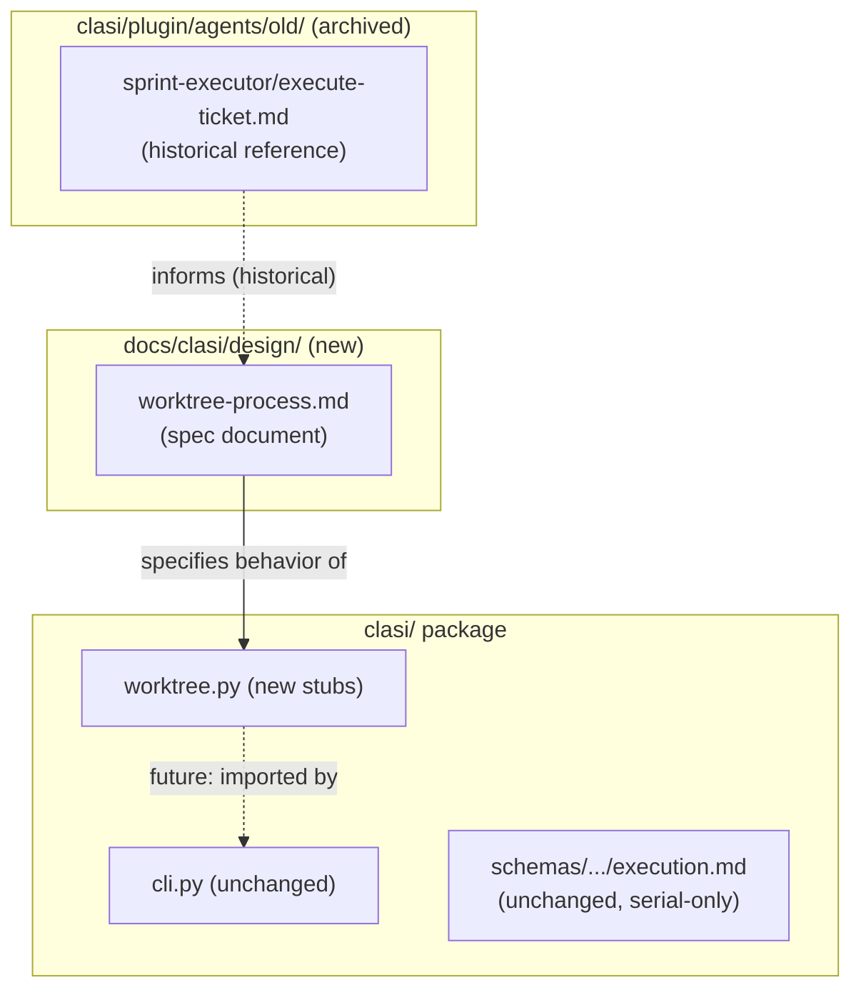
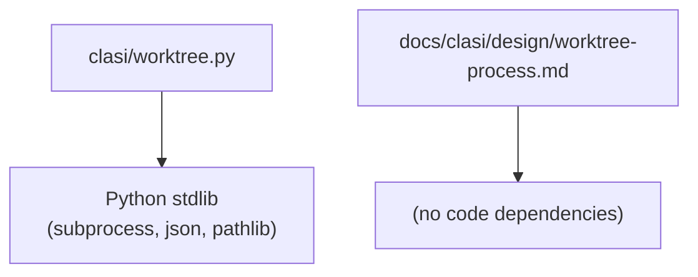

# Architecture Update — Sprint 022: Worktree Process for Parallel Ticket Execution

## What Changed

### Sprint nature: design-only

This sprint introduces **no behavioral changes** to the running system. Parallel
ticket execution remains disabled. The serial-only mandate in
`clasi/schemas/se-process/instructions/execution.md` is not modified.

The two deliverables are:

1. `docs/clasi/design/worktree-process.md` — a new design document that serves
   as the authoritative specification for the worktree lifecycle.
2. `clasi/worktree.py` (optional, see rationale below) — a new module that
   consolidates existing scattered worktree references into one attachment point.

---

### New: `docs/clasi/design/worktree-process.md` — Worktree Process Specification

**Purpose**: Provide one authoritative reference for the full parallel-execution
worktree lifecycle. When the stakeholder re-enables parallelism, this document
is the spec the implementation must satisfy.

**Boundary**: This is a design document, not code. It does not execute. It is
read by human engineers and future sprint planners.

**Contents the document must cover**:

- **Preconditions for parallel execution**: The conditions that must all be true
  before a sprint may use parallel worktrees. Includes: sprint phase (`executing`),
  lock held, no in-progress tickets, opt-in flag present, and the independence
  check passing.

- **Ticket independence determination**: Algorithm for detecting shared-file and
  shared-test hazards. Two tickets are independent if their planned file-touch
  sets (from ticket frontmatter or static analysis of `## Files` sections) have
  no overlap. Tickets that share a test module are considered dependent even if
  their source files differ.

- **Worktree naming convention**: Worktrees live at
  `../worktree-<sprint-id>-<ticket-id>/` relative to the repo root (e.g.,
  `../worktree-022-001/`). This keeps them outside the repo working tree,
  avoiding accidental inclusion in commits.

- **Per-ticket branch naming**: `ticket/<sprint-id>-<ticket-id>-<slug>` (e.g.,
  `ticket/022-001-audit-current-state`). Branch lives in the worktree only; it
  is deleted after successful merge-back.

- **Lifecycle state machine**: States and transitions:
  ```
  [worktree-created] → [branch-created] → [in-progress] →
  [pre-validate] → [merged] → [cleaned-up]
  ```
  Each state transition is logged to the audit record (see below).

- **Ownership**: The controller (team-lead or execute-sprint skill) owns
  worktree creation, branch creation, merge-back, and cleanup. The programmer
  agent inside the worktree owns only the implementation and validation steps.
  The programmer agent does NOT create or destroy its own worktree.

- **Pre-completion validation**: Before merge-back, the controller must verify:
  (a) the ticket branch's test suite passes, (b) the worktree has no untracked
  or staged-but-uncommitted files, (c) the ticket status is `done` in frontmatter.

- **Merge strategy**: Fast-forward if possible; merge commit if the sprint branch
  has advanced since the worktree was created. No rebase (to preserve per-ticket
  branch history for audit). Conflict resolution always escalates to the
  stakeholder — the controller does not auto-resolve.

- **Cleanup rules**: On successful merge, the controller runs
  `git worktree remove --force <path>` and `git branch -d <ticket-branch>`.
  On failure or abandonment, the worktree is removed but the branch is retained
  for manual inspection.

- **Audit / recovery state**: Written to
  `docs/clasi/sprints/<NNN>-slug/.worktree-audit.json`. Schema:
  ```json
  {
    "sprint_id": "022",
    "worktrees": [
      {
        "ticket_id": "001",
        "path": "../worktree-022-001",
        "branch": "ticket/022-001-audit-current-state",
        "state": "merged",
        "created_at": "<iso8601>",
        "merged_at": "<iso8601>"
      }
    ]
  }
  ```
  Written by controller after each state transition. Read by controller on
  recovery. Not read by the programmer agent.

- **Hooks vs. controller**: Git hooks (pre-commit, post-merge) are for logging
  only — they may append to `.worktree-audit.json` but must not block or enforce
  lifecycle gates. All enforcement (preconditions, state transitions, cleanup
  ordering) is the controller's responsibility.

- **Error paths**:
  - Merge conflict: controller escalates to stakeholder; worktree retained.
  - Test failure in worktree: programmer agent retries up to 3 times; on
    exhaustion, controller marks ticket `failed`, retains worktree, escalates.
  - Orphaned worktree (controller crash): detected on next session start by
    reading audit file; controller prompts stakeholder to clean up.
  - Abandoned branch: detected by listing `ticket/<sprint-id>-*` branches on
    next session; controller prompts cleanup.

- **Opt-in gate**: Parallel execution is guarded by a boolean key in
  `docs/clasi/.parallel-exec-enabled` (presence of this file = enabled; absence
  = disabled). The controller checks for this file before creating any worktrees.
  The serial path is unaffected whether or not the file exists.

Uses: SUC-001, SUC-002, SUC-003, SUC-004, SUC-005.

---

### New (optional): `clasi/worktree.py` — Worktree Lifecycle Module

**Purpose**: Consolidate any worktree-related references from scattered sources
into a single Python module. Provides a clear attachment point for future
implementation. In this sprint the module contains documented stubs (functions
that raise `NotImplementedError` or are no-ops) — no behavior change.

**Boundary**: `clasi/worktree.py` imports only from the Python standard library
(`subprocess`, `json`, `pathlib`, `datetime`). It does not import from
`clasi.mcp_server` or any MCP tool. It does not import from `clasi.cli`. No
circular dependencies possible.

**Functions (stubbed)**:
```
create_worktree(repo_root, sprint_id, ticket_id) -> Path
create_ticket_branch(worktree_path, sprint_id, ticket_id, slug) -> str
validate_worktree(worktree_path, ticket_path) -> bool
merge_ticket_branch(repo_root, sprint_branch, ticket_branch) -> None
cleanup_worktree(repo_root, worktree_path, ticket_branch, keep_branch=False) -> None
write_audit_record(sprint_dir, event) -> None
read_audit_record(sprint_dir) -> dict
check_independence(tickets) -> list[list[str]]
```

Each stub has a docstring describing its contract as specified by the design
document, so that a future implementer can read the stub and know exactly what
the function must do.

The existing `clasi/cli.py` contains one reference to worktree in a log event
string (`task-created` parallel lifecycle log, line 291). This reference does
not invoke any worktree logic — it is a log label. No change needed.

The old `clasi/plugin/agents/old/sprint-executor/execute-ticket.md` contains
narrative references to worktrees in a "Parallel Execution Note" section. These
are in the `old/` archived directory and are not installed or active. They serve
as historical record; no change needed.

Uses: SUC-005, SUC-006.

---

## Why

The serial-only mandate was issued because the parallel path had no authoritative
specification. Ambiguities in ownership (who creates the worktree?), naming,
merge strategy, and recovery made the path unreliable. This sprint resolves those
ambiguities at the design level without activating the path.

Writing the spec now, while the serial path is stable and the recent disable
commit is fresh, captures institutional knowledge before it disperses. It also
avoids a future sprint having to reconstruct the intent from git history.

---

## Impact on Existing Components

| Component | Change |
|-----------|--------|
| `docs/clasi/design/worktree-process.md` | New: authoritative design document |
| `clasi/worktree.py` | New: stubbed lifecycle module (optional, no behavior) |
| `clasi/schemas/se-process/instructions/execution.md` | Unchanged (serial mandate stays) |
| `clasi/cli.py` | Unchanged |
| `clasi/plugin/agents/old/sprint-executor/execute-ticket.md` | Unchanged (archived) |
| All other modules | Unchanged |

---

## Migration Concerns

None. This sprint introduces no behavior changes, no database migrations, no
schema changes, and no API changes. The stubbed `clasi/worktree.py` is not
imported by any existing module.

---

## Component Diagram



Dashed edges represent future relationships not yet active in this sprint.

---

## Dependency Graph



No cycles. `clasi/worktree.py` is a leaf module with no CLASI package imports.

---

## Design Rationale

### Decision: Design document over immediate implementation

**Context**: Parallel execution is disabled. Implementing the worktree lifecycle
now would produce dormant code of uncertain quality — it cannot be tested
end-to-end while the serial mandate is in effect.

**Why design-first**: A well-specified design document captures the intent with
near-zero risk. When the mandate is lifted, implementation can proceed against a
clear spec in a single focused sprint. The spec is also independently reviewable
and correctable without a running system.

**Alternatives considered**: Implement full lifecycle now (dormant code, untestable,
risky); defer entirely (loses institutional knowledge). Design-first threads the
needle.

**Consequences**: Future sprint to implement. Design doc becomes a contract.

---

### Decision: Opt-in file flag over config key for parallel execution

**Context**: The design must specify how parallel execution is activated.

**Why file flag**: A sentinel file (`docs/clasi/.parallel-exec-enabled`) is
visible in `git status`, committable, and requires no config-file parsing. It is
harder to accidentally set than a boolean in a JSON config. Removing the file is
a one-liner rollback.

**Alternatives considered**: Config key in `settings.json` (harder to inspect at
a glance); environment variable (not persisted, easy to forget). File sentinel is
the most explicit and auditable choice.

---

### Decision: Worktree paths outside the repo working tree

**Context**: Git worktrees can be placed anywhere. Inside the repo means they
appear in `git status` as untracked directories.

**Why outside**: `../worktree-<sprint>-<ticket>/` keeps the main working tree
clean. Accidental `git add .` in the main tree cannot pick up worktree contents.
The trade-off is that absolute paths must be used when referencing the worktree
from the main repo.

---

## Open Questions

1. **`clasi/worktree.py` necessity**: If the programmer finds no existing
   production code to consolidate (the only worktree references are in archived
   docs and a log label in cli.py), the stub module may be omitted and the ticket
   reduced to updating the design doc and cross-linking references. The programmer
   should make this call and note the decision in the commit message.

2. **Audit file format**: `.worktree-audit.json` is proposed as a sprint-local
   JSON file. An alternative is appending structured log lines to a global
   `.clasi-audit.log`. The design document ticket should weigh both and pick one.

3. **Independence check precision**: Static analysis of `## Files` sections in
   ticket markdown is low-precision (files are listed by human, not computed).
   The design document should note whether this is acceptable initially or whether
   a computed approach (git diff --name-only) is required from day one.
