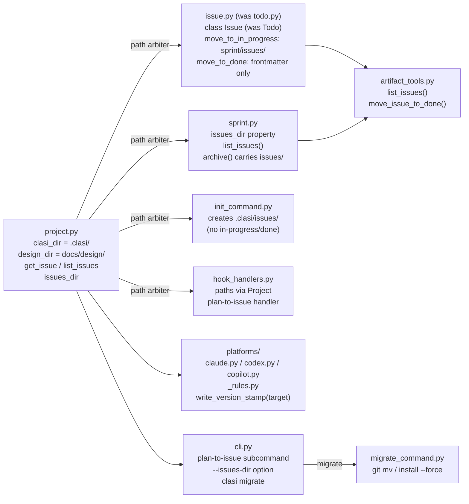
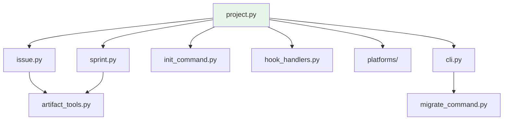

<!-- CLASI: Before changing code or making plans, review the SE process in CLAUDE.md -->

# Architecture Update — Sprint 015: CLASI Artifact Layout Migration to `.clasi/`

## What Changed

### 1. `Project` becomes the single path arbiter for `.clasi/`

`clasi/project.py` — `clasi_dir` property changes from `self._root / "docs" / "clasi"`
to `self._root / ".clasi"`. This is the only line that must change; all derived path
properties (`sprints_dir`, `issues_dir`, `log_dir`, `architecture_dir`, `db`) inherit
the new root automatically through their existing implementations.

`design_dir` is corrected simultaneously: it was `self.clasi_dir / "design"` (pointing
to the nonexistent `docs/clasi/design/`). It becomes `self._root / "docs" / "design"`
(matching the actual source layout).

**Boundary**: `Project` owns all artifact root paths. No other module constructs these
paths directly; all callers go through `Project` properties.

**Use cases**: SUC-001.

---

### 2. `Todo` to `Issue` vocabulary rename

`clasi/todo.py` is renamed `clasi/issue.py`. The class `Todo` is renamed `Issue`. No
behavioral changes to the class at this step — lifecycle methods remain intact; their
semantics change in Change 3 (sprint-scoped lifecycle).

`clasi/plan_to_todo.py` is renamed `clasi/plan_to_issue.py`. Functions `plan_to_todo`
and `plan_to_todo_from_text` are renamed `plan_to_issue` and `plan_to_issue_from_text`.

**Project path properties** updated:
- `Project.todo_dir` becomes `Project.issues_dir` (still returns `self.clasi_dir / "issues"`)
- `Project.get_todo(filename)` becomes `Project.get_issue(filename)`
- `Project.list_todos()` becomes `Project.list_issues()`

**Ticket frontmatter fields** updated:
- `todo:` becomes `issue:` (links a ticket to its source issue file)
- `completes_todo:` becomes `completes_issue:`

**Status enum value** updated:
- `status: todo` becomes `status: open` (tickets that have not started are `open`)
- Full ticket status enum: `open` / `in-progress` / `done`

**Use cases**: SUC-001.

---

### 3. Sprint-scoped issue lifecycle

The issue file lifecycle changes from a global in-progress/done directory model to a
sprint-co-located model.

**Before**:
```
.clasi/issues/<filename>.md         pending
.clasi/issues/in-progress/<file>    claimed by a sprint
.clasi/issues/done/<file>           completed
```

**After**:
```
.clasi/issues/<filename>.md         pending (unclaimed)
.clasi/sprints/<N>/issues/<file>    claimed by sprint N (flat, no in-progress subdir)
.clasi/sprints/done/<N>/issues/     archived with the sprint
```

`Issue.move_to_in_progress(sprint_id, ticket_id)`: destination changes from
`<root>/issues/in-progress/` to `<sprint_dir>/issues/`. The sprint dir is resolved via
`Project.get_sprint(sprint_id).path / "issues"`. The `issues/` directory is created
(`mkdir(parents=True, exist_ok=True)`) on first use.

`Issue.move_to_done`: becomes frontmatter-only. Sets `status: done` in frontmatter;
does NOT move the file. The file stays in `<sprint>/issues/` and archives with the sprint
automatically when the sprint directory moves to `done/`.

`Sprint.issues_dir`: new property returning `self._path / "issues"`.

`Sprint.list_issues()`: new method returning `Issue` objects from `<sprint>/issues/*.md`.

`Sprint.archive()`: no code change needed — the existing directory-level move already
carries `<sprint>/issues/` to `done/` automatically. Verify this in tests.

`init_command.py`: creates only `.clasi/issues/` (the pending pool). No `in-progress/`
or `done/` subdirectory is created at the root level.

`Project.list_issues()`: scans `.clasi/issues/*.md` (pending pool only). Sprint-specific
issues are returned by `Sprint.list_issues()`. The team-lead's "active issues" view is the
union of these two sources.

**Use cases**: SUC-001, SUC-002.

---

### 4. Version marker consolidation

`clasi/platforms/_markers.py` — `write_version_stamp(target, subdir)` is replaced by
`write_version_stamp(target: Path)` that writes a single file at
`<target>/.clasi/clasi-version`. The function creates `.clasi/` if absent.

Each of `claude.py`, `codex.py`, `copilot.py` calls `write_version_stamp(target)` once.
The prior per-platform calls (`write_version_stamp(target, ".claude")`,
`write_version_stamp(target, ".agents")`, etc.) are removed.

Re-stamping on a second platform install is harmless — same content overwrites.

**Boundary**: `write_version_stamp` is the only writer of `.clasi/clasi-version`.
No code reads this file; it is a write-only artifact for human inspection.

**Use cases**: SUC-001.

---

### 5. Platform installers: path reference updates

`clasi/platforms/claude.py`, `codex.py`, `copilot.py`, and `_rules.py` contain hardcoded
references to `docs/clasi/` paths in:
- YAML frontmatter `paths:` globs on rule files.
- AGENTS.md body text that instructs agents on where artifacts live.
- Rule body text (OOP override path, sprint directory path).

All such references update to `.clasi/` equivalents:
- `docs/clasi/**` becomes `.clasi/**`
- `docs/clasi/todo/**` (or `issues/**`) becomes `.clasi/issues/**`
- `docs/clasi/oop` becomes `.clasi/oop`
- `docs/clasi/sprints/` becomes `.clasi/sprints/`

**Use cases**: SUC-001.

---

### 6. CLI, hook handlers, and skill rename

**CLI** (`clasi/cli.py`):
- Subcommand `plan-to-todo` becomes `plan-to-issue`
- Option `--todo-dir` becomes `--issues-dir` (default `".clasi/issues"`)
- Hook registry keys updated accordingly.

**Hook handlers** (`clasi/hook_handlers.py`):
- All `Path("docs/clasi/...")` constructions replaced with `get_project().clasi_dir / ...`
  or equivalent dynamic resolution.
- Handler function names `handle_plan_to_todo` becomes `handle_plan_to_issue`,
  `handle_codex_plan_to_todo` becomes `handle_codex_plan_to_issue`.

**Skill**:
- `clasi/plugin/skills/todo/` becomes `clasi/plugin/skills/issue/`
- SKILL.md updated with "issue" terminology.

**Use cases**: SUC-001.

---

### 7. `clasi migrate` subcommand

New CLI subcommand `clasi migrate` (implemented in `clasi/migrate_command.py` and wired
into `clasi/cli.py`).

Behavior:
1. Verify no execution lock is held for any active sprint.
2. Verify `.clasi/` does not already exist at the target (guard against double-run).
3. `git mv docs/clasi .clasi` (falls back to `shutil.move` for non-git projects).
4. Update `.gitignore`: replace `docs/clasi/log/` with `.clasi/log/`.
5. Re-run `clasi install --force` to refresh rule files / agent prompts with the new globs.
6. Print a one-line note to update any user-customized references in their own docs.

**Boundary**: Write access to the project root only. No external service calls.

**Use cases**: SUC-001.

---

## Why

| Change | Why |
|--------|-----|
| `docs/clasi/` to `.clasi/` | `docs/` should be user documentation. CLASI process artifacts belong in a hidden config dir like `.git/`. |
| `Todo` to `Issue` | Aligns with GitHub Issues vocabulary; eliminates collision with Python `# TODO:` convention; makes the distinction from "ticket" explicit. |
| Status `todo` to `open` | `todo` is ambiguous (can mean the artifact type or the state); `open` is the GitHub/Jira term for "not yet started". |
| Sprint-scoped issues | Issues that are in-progress belong to a sprint. Co-locating them with the sprint's tickets and architecture makes the sprint's history self-contained after archive. |
| Version marker consolidation | 2-3 duplicate `.clasi-version` stamps per install (one per platform dir) is redundant. A single `.clasi/clasi-version` is the canonical install marker. |
| `clasi migrate` | Existing projects cannot manually `git mv` and be sure every path reference is updated. A first-class migration subcommand provides the correct sequence. |

---

## Component Diagram



---

## Entity-Relationship: Issue Lifecycle

```mermaid
erDiagram
    PENDING_ISSUE {
        path ".clasi/issues/filename.md"
        status pending
    }

    IN_PROGRESS_ISSUE {
        path ".clasi/sprints/NNN-slug/issues/filename.md"
        status in-progress
        sprint NNN
        ticket NNN-MMM
    }

    DONE_ISSUE {
        path ".clasi/sprints/done/NNN-slug/issues/filename.md"
        status done
    }

    SPRINT {
        path ".clasi/sprints/NNN-slug"
        issues_dir ".clasi/sprints/NNN-slug/issues"
    }

    PENDING_ISSUE ||--o{ IN_PROGRESS_ISSUE : "move_to_in_progress"
    IN_PROGRESS_ISSUE ||--|| SPRINT : "co-located in sprint/issues/"
    IN_PROGRESS_ISSUE ||--o{ DONE_ISSUE : "sprint.archive() moves sprint dir"
```

---

## Dependency Graph



No cycles. `Project` is the only component all others depend on. `Issue` and `Sprint`
depend on `Project` for path resolution but not on each other. `MCP` (artifact_tools.py)
depends on both `Issue` and `Sprint`. `CLI` depends on `Project` and adds `MigrateCmd`.

---

## Impact on Existing Components

| Component | Change |
|-----------|--------|
| `clasi/project.py` | `clasi_dir` to `.clasi/`; `design_dir` to `docs/design/`; property renames |
| `clasi/todo.py` | Removed; replaced by `clasi/issue.py` |
| `clasi/issue.py` | New (renamed from `todo.py`); lifecycle semantics updated |
| `clasi/plan_to_todo.py` | Removed; replaced by `clasi/plan_to_issue.py` |
| `clasi/plan_to_issue.py` | New (renamed from `plan_to_todo.py`) |
| `clasi/sprint.py` | New properties: `issues_dir`, `list_issues()`; archive verified |
| `clasi/hook_handlers.py` | Path string to dynamic; handler renames |
| `clasi/cli.py` | Subcommand + option renames; `migrate` group added |
| `clasi/migrate_command.py` | New |
| `clasi/platforms/_markers.py` | `write_version_stamp` signature change |
| `clasi/platforms/claude.py` | Path globs; version stamp call |
| `clasi/platforms/codex.py` | Path strings; AGENTS.md body; version stamp |
| `clasi/platforms/copilot.py` | Path globs; version stamp call |
| `clasi/platforms/_rules.py` | Rule body text for OOP path, sprint path |
| `clasi/tools/artifact_tools.py` | `list_todos` to `list_issues`; `move_todo_to_done` to `move_issue_to_done` (last ticket) |
| `clasi/init_command.py` | Creates `.clasi/issues/` (no in-progress/done subdirs) |
| `clasi/plugin/skills/todo/` | Renamed to `clasi/plugin/skills/issue/` |
| `clasi/plugin/agents/**` | Terminology updates |
| `clasi/se-overview-template.md` | Issues vs Tickets section |
| `README.md` | Path refs, Issues vs Tickets section |
| `tests/unit/**` | Fixtures updated for new paths, class names, status values |
| `tests/system/**` | Integration test for issue lifecycle |

---

## Migration Concerns

**Existing target projects** that ran `clasi install` before this sprint will continue
to have `docs/clasi/` layouts until `clasi migrate` is run. This is intentional — no
automatic migration, explicit opt-in via the subcommand.

**This source repo itself** (`docs/clasi/` to `.clasi/`) is migrated in a separate clean
session after the sprint closes, to avoid the code running against old paths during
development. The sprint code changes are tested against a synthetic fixture tree, not
this repo's live `docs/clasi/`.

**No backward-compat shims**: dual-path reads are explicitly out of scope per the
locked-in decision. Hard cut over. If a caller still uses `docs/clasi/` or `list_todos`,
it will break — that is the desired forcing function.

**The StateDB** at `.clasi/.clasi.db` (after path migration) — any open CLASI session
must be restarted after `clasi migrate` runs, since the DB path is resolved at server
start.

---

## Design Rationale

### Decision: Hard rename, no deprecated aliases

**Context**: Renaming MCP tools, CLI subcommands, and Python class names could be done
with deprecated shims that emit warnings for a release cycle before removal.

**Why hard rename**: CLASI is an internal tool; there are no external consumers of its
Python API that could break silently. Shims add maintenance overhead and testing surface
for no practical benefit. The MCP tools are the only external-ish interface, and the MCP
server restarts at sprint close — so old callers (running agent sessions) are disrupted
at a known point regardless.

**Consequences**: Ticket 028 (MCP tool rename) must be the last ticket because the
running MCP server still exposes old names during sprint execution. When the sprint
closes, the server restarts with the new names.

---

### Decision: Sprint-scoped issues (flat, no in-progress subdir)

**Context**: Two options for in-progress issues: (A) global `in-progress/` dir, or
(B) flat in `<sprint>/issues/`.

**Why B**: The sprint is the natural unit of work; issues belong to the sprint that
claimed them. Co-location means the sprint's done directory is self-contained — tickets,
architecture, and issues in one place. The `in-progress/done/` split inside the sprint
is unnecessary because the sprint's scope is already narrow enough that frontmatter
`status:` is sufficient.

**Consequences**: `Project.list_issues()` no longer scans a single directory for all
active issues. The team-lead must union pending + sprint-specific to see the full active
set. This is a small cost for a significant gain in sprint cohesion.

---

### Decision: `move_to_done` becomes frontmatter-only

**Context**: Currently `move_to_done` physically moves the file to `<root>/issues/done/`.
After this sprint, it sets `status: done` in frontmatter and leaves the file in
`<sprint>/issues/`.

**Why**: The sprint archive (`Sprint.archive()`) already moves the entire sprint directory
to `done/` at sprint close. Adding a pre-archive file move would create a two-step
process with potential for inconsistency (issue moves to "done" before the sprint is
actually closed). A frontmatter-only update is atomic and consistent.

**Consequences**: A "done" issue file stays at `<sprint>/issues/` until `close_sprint`
runs. Callers that previously checked the filesystem location to determine issue status
must now check the `status:` frontmatter field.

---

### Decision: `clasi migrate` vs. documentation-only

**Context**: Existing projects must somehow move from `docs/clasi/` to `.clasi/`.
Could be documented-manual-steps or an automated subcommand.

**Why automated**: The migration touches code (`git mv`), `.gitignore`, and requires
a `clasi install --force` re-render. Documenting these steps invites errors. A
subcommand encodes the correct sequence once and can be tested against a fixture tree.

**Consequences**: New module `clasi/migrate_command.py`. Must be tested against both
git and non-git scenarios.

---

## Architecture Self-Review

**Consistency**: The Sprint Changes section matches the document body. No conflicts.
Design rationale is present for all four significant decisions.

**Codebase Alignment**: The existing `Project.clasi_dir` returns `docs/clasi/`; the
sprint changes exactly that. All derived properties inherit automatically — no drift.
The `design_dir` bug fix (`docs/clasi/design/` to `docs/design/`) corrects a latent
inconsistency in the current code.

**Design Quality**:
- `Project` handles one responsibility: path arbitration. Cohesion passes.
- `Issue` handles one responsibility: issue lifecycle. Cohesion passes.
- `Sprint` handles sprint state; the new `issues_dir` and `list_issues()` are in-scope.
- No circular dependencies in the dependency graph.
- Fan-out from `Project` is 6 — at the upper limit but justified: each dependent is a
  distinct subsystem with clear boundaries.
- The MCP tool rename (ticket 028) is the only sequencing constraint imposed by the
  running server; all other tickets are purely internal.

**Anti-Pattern Check**:
- No god component: `Project` is a path arbiter, not a business logic hub.
- No shotgun surgery: the path constant change in `Project.clasi_dir` is the root cause
  for all derived property updates — one change, not many scattered changes.
- No circular dependencies.
- No leaky abstractions: `Issue` does not expose `Sprint` internals; the caller resolves
  the sprint dir and passes it to `move_to_in_progress`.
- No speculative generality: `clasi migrate` is a concrete requirement, not a
  future-proofing abstraction.

**Risks**:
- The StateDB path moves. Any in-flight session (holding an open DB connection) after
  `clasi migrate` runs will fail to find its DB. Mitigation: `migrate_command.py` prints
  a prominent "restart any open CLASI sessions" notice.
- Ticket 028 (MCP tool rename) could break agent sessions mid-sprint if run early.
  Mitigation: it is explicitly the last ticket and carries a `depends-on: 019, 027`
  guard.

**Verdict: APPROVE** — no structural issues, no cycles, no god components, clean
dependency direction. Proceed to ticketing.
