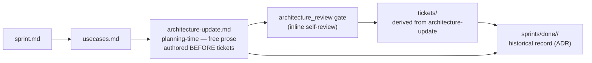

<!-- CLASI: Before changing code or making plans, review the SE process in CLAUDE.md -->

# Architecture Update — Sprint 016: Architecture-update positioning — prose planning artifact, documented

## What Changed

### 1. `architecture-authoring` skill: Mode 2 framing corrected to forward-looking

The Mode 2 description in `architecture-authoring/SKILL.md` currently opens
with: "Write a focused architecture diff describing what changed in this
sprint." The phrase "what changed" positions the artifact as a retrospective
record of changes already decided. This contradicts the intended role: a
forward-looking structural plan that precedes ticket decomposition.

The change is a targeted prose edit to the Mode 2 opening. The revised framing:
- States that the artifact is authored before tickets exist.
- Sets the guiding question as: "Is this description clear enough that tickets
  can be derived from it without ambiguity?"
- Removes any framing that implies the artifact records what has already
  been implemented.

No new mode is added. No format constraints change. The 7-step methodology,
quality checks, and section structure are unchanged.

**Use cases**: SUC-001.

---

### 2. Documentation: per-sprint architecture-update model described correctly

Three documentation files contain language about `architecture-update.md`
that either implies a retrospective role or omits its planning-time position:

**`software-engineering.md`** — The Architecture artifact section (§2)
describes "versioned architecture documents" in `.clasi/architecture/` and
says "each version represents the target state after a sprint completes."
This describes the *consolidated* architecture model (the product of
`consolidate-architecture`), but it sits adjacent to the sprint directory
layout that includes `architecture-update.md`, creating an implication that
the update is merged or snapshotted at sprint close. A clarification is added:
per-sprint `architecture-update.md` files are planning-time artifacts that
accumulate as historical record. The versioned consolidated architecture is a
separate, optional artifact produced by the `consolidate-architecture` skill.

**`se-overview-template.md`** — Sprint Detail Planning mentions
"usecases, architecture, tickets" in a flat list. A sentence is added noting
that the architecture-update is authored before tickets and accumulates as
historical record.

**`README.md`** — Sprint Planning section says each sprint gets "an
Architecture document." Minor addition: one phrase clarifying that it is
authored before tickets and archived as historical record at close.

**Use cases**: SUC-002.

---

## Why

| Change | Why |
|--------|-----|
| `architecture-authoring` Mode 2 framing | The phrase "what changed" reads retrospectively. Agents following this skill may write the document after deciding on implementation. The fix closes the ambiguity. |
| `software-engineering.md` clarification | The Architecture §2 language implies a consolidated-docs model that involves merge steps. The per-sprint accumulation model needs explicit description. |
| `se-overview-template.md`, `README.md` additions | These are the first docs a new developer or agent reads. Omitting the ordering and accumulation model means agents learn the wrong mental model by omission. |

---

## Component Diagram

---

## Impact on Existing Components

| Component | Change |
|-----------|--------|
| `clasi/plugin/skills/architecture-authoring/SKILL.md` | Mode 2 opening reframed: forward-looking plan before tickets, not retrospective diff |
| `clasi/plugin/instructions/software-engineering.md` | Architecture §2 clarified: per-sprint files accumulate as ADRs; consolidated docs are a separate optional artifact |
| `clasi/se-overview-template.md` | Add sentence: architecture-update authored before tickets, accumulates as historical record |
| `README.md` | Minor addition to Sprint Planning section |
| `clasi/state_db_class.py` | No change — phase machine already correct |
| Sprint-planner agent prompt | No change — already does architecture before tickets with inline review |
| `clasi/plugin/skills/architecture-review/SKILL.md` | No change — already clean: prose review, no parser |
| `clasi/templates/architecture-update.md` | No change |
| `Sprint.archive()` / `sprint.py` | No change — architecture-update already travels to done/ via directory move |

---

## Migration Concerns

**No code changes.** No database migrations, no API changes, no test updates.
All changes are documentation prose edits.

**Existing sprints**: Unaffected. Done sprints with `architecture-update.md`
are untouched.

**No artifact rename.** The artifact remains `architecture-update.md`.

---

## Design Rationale

### Decision: Scope narrowed from phase-machine changes to documentation-only

**Context**: The original Sprint 016 plan included reordering the phase machine
and adding a stakeholder gate before tickets. Verification reads of
`state_db_class.py` and the sprint-planner agent showed that the phase machine
already has the correct order and the agent already places architecture before
tickets.

**Why narrowed**: Changing code that is already correct introduces risk with no
benefit. The genuine complaint behind the TODO was about documentation framing —
the artifact was *described* as retrospective even when the code was right. The
fix is a documentation fix, not a code fix.

**Consequences**: Sprint 016 is two tickets (002 and 004 from the original
numbering, kept to avoid renumbering confusion). No code changes. No test
updates needed.

---

### Decision: Ticket 001 (phase-machine reorder) deleted; ticket 003 (architecture-review skill) deleted

**Context**: Ticket 001 called for modifying `state_db_class.py` and the
sprint-planner agent. Both are already correct.
Ticket 003 called for removing parser-first steps from `architecture-review/SKILL.md`.
Reading the file confirms no such steps exist.

**Why deleted**: Tickets that verify existing correctness and then produce no
changes are execution overhead with no output. The verification finding is
recorded here, in planning artifacts — that is sufficient.

**Consequences**: Ticket count drops from 4 to 2.

---

## Architecture Self-Review

**Consistency**: Two changes described in "What Changed" are reflected
consistently throughout the document. No parser, validator, or delta-format
references appear.

**Codebase Alignment**: Verified via direct file reads. Phase machine is
correct. Sprint-planner is correct. architecture-review skill is clean.
Changes target only the documented drift.

**Design Quality**: No new modules. All changes are prose documentation.
No cohesion or coupling concerns.

**Anti-Pattern Check**: None applicable — no code changes.

**Risks**: Documentation-only changes. Minimal risk. Sole concern: the
prose edit to `architecture-authoring/SKILL.md` must be precise enough that
agents understand both "before tickets" and "forward-looking" — not just
a word swap.

**Open Questions**: None. All verification questions from the prior
architecture-update are now resolved by direct reads.

**Verdict: APPROVE** — Minimal, targeted, documentation-only sprint. Changes
address documented drift between intended model and written description. No
structural concerns.
