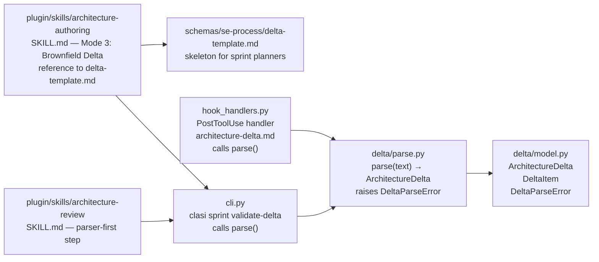
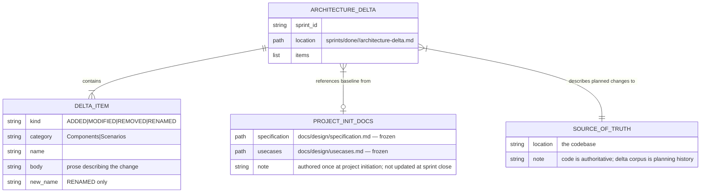
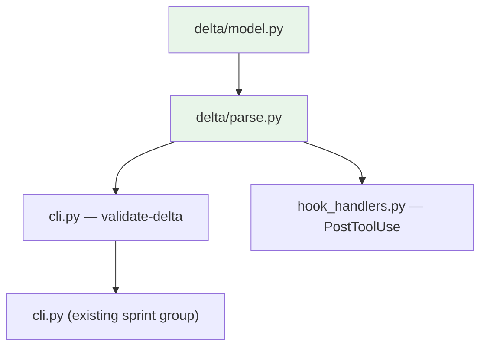

<!-- CLASI: Before changing code or making plans, review the SE process in CLAUDE.md -->

# Architecture Update — Sprint 016: Architecture as forcing-function delta spec at sprint planning

## What Changed

### 1. New package: `clasi/delta/` (parser + model only)

A new pure Python package with two modules: `model.py` and `parse.py`.
Both are IO-free — they operate on strings and in-memory objects. IO happens
at call sites. There is no `merge.py` — delta files are historical records,
not merge inputs.

**`clasi/delta/model.py`** — Pydantic types for the delta format:
- `DeltaItem(name: str, kind: Literal["ADDED","MODIFIED","REMOVED","RENAMED"],
  category: Literal["Components","Scenarios"], body: str, new_name: str | None)`
- `ArchitectureDelta(items: list[DeltaItem])` — root model produced by the parser.
- `DeltaParseError(Exception)` with fields `line: int`, `message: str`, `rule: str`.

No `DeltaMergeError` — there is no merger.

**`clasi/delta/parse.py`** — Parser and validator. Entry point:
`parse(text: str) -> ArchitectureDelta`. Raises `DeltaParseError` (with
line number and rule text) on any format violation.

Hard parse rules:
- Section heading must be exactly `### <KIND> <Category>` where KIND is one
  of `ADDED`, `MODIFIED`, `REMOVED`, `RENAMED` and Category is `Components`
  or `Scenarios`. Any other combination is a parse error.
- Item heading must be exactly `#### Component:` or `#### Scenario:` followed
  by a name (or `OldName → NewName` for RENAMED).
- Every item heading must appear inside a valid `### <KIND> <Category>` section.
- MODIFIED items must have non-empty body content. The body is prose describing
  the change — what changed and why. No round-trippability requirement; no
  "full updated content" rule.
- REMOVED items: name required, body optional.
- RENAMED items: `→` required in the name field.
- Duplicate item identity (same kind+category+name) within one delta is a
  parse error.

`DeltaParseError` carries: `line: int`, `message: str`, `rule: str`.

**Boundary**: `clasi/delta/` has no IO, no MCP, no state. Depends only on
Pydantic (already a project dependency). Leaf node.

**Use cases**: SUC-001, SUC-002, SUC-003, SUC-004.

---

### 2. Delta template: `clasi/schemas/se-process/delta-template.md`

A skeleton `architecture-delta.md` that sprint planners fill in. Contains
all valid section headings as comments; shows one example item per section.
Replaces `architecture-update.md` as the template the sprint-planner agent
starts from.

The template makes the format self-documenting — the planner sees the exact
structure required without consulting the format spec separately. The template's
inline comments for MODIFIED entries say "describe the change in prose" — no
requirement for full replacement content.

**Boundary**: Static data file. No code changes required.

**Use cases**: SUC-001.

---

### 3. CLI subcommand: `clasi sprint validate-delta`

New subcommand added to `clasi/cli.py` under the existing `sprint` group.

`clasi sprint validate-delta <sprint-id>`

Behavior:
1. Resolves the sprint directory via `Project.get_sprint(sprint_id)`.
2. Checks that `architecture-delta.md` exists in the sprint directory.
3. Reads the file and calls `clasi.delta.parse.parse(text)`.
4. On success: exit 0, stdout reports item counts per KIND per Category.
5. On `DeltaParseError`: exit 1, stderr reports line, rule, and message.
6. On missing file: exit 1, stderr explains the file is missing and notes
   the delta format only applies to new-format sprints.

**Boundary**: Read-only. No writes. Adds one subcommand to the existing
`sprint` CLI group.

**Use cases**: SUC-003.

---

### 4. PostToolUse hook: validate-on-write for `architecture-delta.md`

A PostToolUse hook in `clasi/hook_handlers.py` that fires when the Write
or Edit tool produces a file matching `**/architecture-delta.md`.

Behavior:
- Calls `clasi.delta.parse.parse(file_content)`.
- On success: prints "architecture-delta.md validation: OK — N items parsed."
- On `DeltaParseError`: prints "architecture-delta.md validation: ERROR —
  Line N: <message>."
- Does NOT block the write in either case (report-only).

The hook is registered in `clasi/platforms/claude.py` (and equivalents) as a
PostToolUse hook scoped to `**/architecture-delta.md` file paths.

**Boundary**: Calls `parse.py` only (pure, no IO beyond reading the file).
No state changes.

**Use cases**: SUC-004.

---

### 5. `architecture-authoring` skill: brownfield delta mode

The `architecture-authoring` SKILL.md gains a Mode 3: **Brownfield Delta**.

When producing a sprint architecture update for an existing project (vs.
greenfield specification authoring), the skill:
1. Instructs the agent to output `architecture-delta.md` (not
   `architecture-update.md`).
2. Specifies the exact section heading format (ADDED / MODIFIED / REMOVED /
   RENAMED) and the item heading format (`#### Component:` / `#### Scenario:`).
3. Explicitly forbids free prose outside delta sections for this mode.
4. References `clasi/schemas/se-process/delta-template.md` as the starting
   skeleton.
5. Specifies that MODIFIED entries describe the change in prose — what changed
   and why — with no requirement for full replacement content.
6. States that `clasi sprint validate-delta` must return exit 0 before the
   sprint advances to architecture-review.

**Boundary**: SKILL.md text change only. No Python code change.

**Use cases**: SUC-001.

---

### 6. `architecture-review` skill: parser-first step

The `architecture-review` SKILL.md process section gains a new Step 0:

> Before any semantic review: run `clasi sprint validate-delta <id>`.
> If exit code is non-zero, return REVISE with the parser error verbatim.
> Do not perform semantic review until the delta parses cleanly.

This ensures format conformance is enforced at the gate, not left to the
reviewer's interpretation of prose.

**Boundary**: SKILL.md text change only. No Python code change.

**Use cases**: SUC-002.

---

### 7. Phase-machine: architecture-delta authored before tickets

The sprint-planner agent prompt and plan-sprint skill are updated to place
architecture-delta authoring between use-cases and ticketing — not after.

New sprint planning order:
1. Sprint overview (`sprint.md`) — why and scope
2. Use cases (`usecases.md`) — behavior, user-visible operations
3. Architecture delta (`architecture-delta.md`) — structural contract
4. Tickets — work units derived from the delta

The PHASES list in `clasi/state_db_class.py` is not changed — the phase
machine already has `planning-docs` → `architecture-review` → `ticketing`
which maps correctly to the new order. What changes is agent prompts:
the sprint-planner agent's step 3 becomes "write architecture-delta.md"
and the advance to `architecture-review` phase happens before tickets exist.

**Boundary**: Agent prompt and SKILL.md text changes only. No Python code
change to the phase machine.

**Use cases**: SUC-001.

---

### 8. Deprecation and documentation: delta-as-historical-record model

`architecture-update.md` is deprecated as a sprint artifact:
- The sprint-planner agent prompt removes all references to
  `architecture-update.md` as valid output; replaces with
  `architecture-delta.md`.
- The `plan-sprint` SKILL.md process section is updated accordingly.
- `create_sprint` MCP tool creates `architecture-delta.md` from the template;
  `architecture-update.md` is not created for new sprints.
- Existing done/ sprints with `architecture-update.md` are untouched.

Documentation updates establish the historical-record model explicitly:
- Canonical design docs (`docs/design/specification.md`,
  `docs/design/usecases.md`) are project-init artifacts — authored once,
  frozen thereafter. Sprint close does NOT update them.
- "What is the current architecture?" is answered by reading the code —
  not a snapshot doc.
- Per-sprint `architecture-delta.md` files accumulate as the chronological
  record of structural intent. Close-sprint archives them as-is under
  `done/<id>/`. No merge step.

**Boundary**: Sprint-planner agent prompt and SKILL.md text changes.
`create_sprint` MCP tool behavior change (creates `architecture-delta.md`
instead of `architecture-update.md`). README and se-overview-template.md
updated.

**Use cases**: SUC-001, SUC-005.

---

## Why

| Change | Why |
|--------|-----|
| `clasi/delta/` package (model + parser only) | Free prose architecture updates cannot be machine-validated. A structured format makes every structural claim checkable. No merger needed — the code is the source of truth. |
| Delta at planning time | Architecture written after tickets exist is a record, not a contract. Writing it first forces structural thinking before work decomposition. |
| `validate-delta` CLI | Agents and humans need immediate format feedback. A CLI subcommand is the natural integration point for hooks and CI. |
| PostToolUse hook | Sprint authors should not discover format errors at review time. Immediate feedback on save closes the loop faster. |
| Parser-first review | A reviewer reading malformed prose wastes time. The parser catches format violations automatically; the reviewer focuses on semantics. |
| MODIFIED = prose, not round-trippable | Requiring full replacement content for MODIFIED entries was over-engineering. The reviewer reads prose; no automated merger consumes the body. |
| Deltas as historical record, code as truth | Maintaining a snapshot doc in sync with code and accumulated deltas is redundant effort with failure modes. The code is always authoritative; deltas are planning-time commitments, not sync targets. |
| Phase-machine reorder (prompts only) | Ensures agents don't write tickets before the structural plan exists. The phase machine already enforces the correct sequence; agent prompts must reflect it. |
| Deprecate `architecture-update.md` | Two artifact names for the same concept creates ambiguity. Hard cut eliminates the confusion for new sprints. |

---

## Component Diagram

---

## Entity-Relationship: Delta as Historical Record

---

## Dependency Graph

No cycles. `delta/model.py` is a leaf. `delta/parse.py` depends only on
`model.py`. Call sites (`cli.py`, `hook_handlers.py`) depend on the delta
package but the delta package has no dependency on them.
Dependency direction: call sites → delta library.

No merger, no archive modification, no source-of-truth write path.

---

## Impact on Existing Components

| Component | Change |
|-----------|--------|
| `clasi/delta/` | New package — model.py, parse.py only. No merge.py. |
| `clasi/schemas/se-process/delta-template.md` | New static file |
| `clasi/cli.py` | Add `sprint validate-delta` subcommand |
| `clasi/hook_handlers.py` | Add PostToolUse handler for `architecture-delta.md` |
| `clasi/sprint.py` | No new merge logic. archive() unchanged beyond verifying delta is preserved in done/. |
| `clasi/plugin/skills/architecture-authoring/SKILL.md` | Add Mode 3: Brownfield Delta |
| `clasi/plugin/skills/architecture-review/SKILL.md` | Add parser-first step 0 |
| `clasi/plugin/skills/plan-sprint/SKILL.md` | Update to reference `architecture-delta.md` |
| Agent prompts (sprint-planner) | Update to produce `architecture-delta.md` |
| `clasi/state_db_class.py` | No change — phase machine unchanged |
| `clasi/platforms/claude.py` | Register PostToolUse hook for `architecture-delta.md` |
| `tests/unit/delta/` | New — test_model.py, test_parse.py, test_invalid_deltas.py |
| `tests/integration/test_delta_pipeline.py` | New — validate + hook integration test |
| Existing tests | No change — delta package is additive |
| `clasi/delta/merge.py` | NOT created — no merger in this sprint |

---

## Migration Concerns

**Existing sprints with `architecture-update.md`**: Unaffected. No merge
step exists; `Sprint.archive()` is not changed beyond preserving the delta.

**`create_sprint` MCP tool output**: After this sprint, `create_sprint` will
produce `architecture-delta.md` from the delta template instead of
`architecture-update.md`. Agents expecting `architecture-update.md` in a new
sprint directory will find it absent — intentionally. The sprint-planner
prompt is updated in this sprint to reference `architecture-delta.md`.

**Source-of-truth docs remain frozen**: `docs/design/specification.md` and
`docs/design/usecases.md` are not touched at sprint close. Existing projects
keep their project-init versions as frozen historical records. The delta
corpus alongside the code is the current architecture.

---

## Design Rationale

### Decision: No merger — code is the source of truth

**Context**: The original plan included `clasi/delta/merge.py` and a
close-sprint step that would merge delta content back into
`docs/design/specification.md` and `docs/design/usecases.md`.

**Why dropped**: The fundamental premise — that a snapshot doc can be kept in
sync with both the code and the accumulated deltas — has a worse failure mode
than the drift it was trying to solve. When the snapshot doc drifts from code,
you have two conflicting sources of truth. The code is always authoritative.
Maintaining a snapshot doc in parallel creates redundant work and eventual
contradiction. The delta corpus answers "what was the structural intent at
each sprint?" The code answers "what is the structure now?" No snapshot needed.

**Consequences**: No `merge.py`, no `DeltaMergeError`, no feature flag, no
close-sprint modification. The archive step is unchanged. MODIFIED entries
describe the change in prose (not full replacement content) because there is
no automated consumer of that body. The reviewer reads it; humans are the
consumer.

---

### Decision: MODIFIED entries describe the change in prose, not full replacement content

**Context**: The original plan required MODIFIED entries to include "full
updated content" so the merger could do verbatim replacement. With no merger,
this requirement has no justification.

**Why prose**: The reviewer of the architecture delta is a human (or an agent
acting in a human-review capacity). What the reviewer needs is "what changed
and why" — prose that conveys intent. Full replacement content would be
redundant with the actual code changes that implement the modification.

**Consequences**: The MODIFIED body validation rule changes from "non-empty,
full replacement content" to "non-empty prose." The parser still rejects
empty bodies (the author must say something about what changed). The template
guidance changes from "include full updated content" to "describe the change."

---

### Decision: Parser and validator are IO-free (pure functions)

**Context**: The delta package could own file reading/writing directly, or it
could accept and return strings.

**Why pure**: IO-free means the parser is fully testable with in-memory
strings — no fixture files, no temp directories, no subprocess calls. Call
sites own the IO; the library owns the logic. This is the same pattern as
`clasi/frontmatter.py`.

**Consequences**: `clasi sprint validate-delta` reads the file, passes the
text to `parse()`. The hook reads the file content from the event, passes
to `parse()`. Each call site controls error handling and file lifecycle.

---

### Decision: `## Specification` section deferred to v2

**Context**: The source TODO describes three top-level sections in the delta
format: `## Architecture`, `## Use cases`, `## Specification`.

**Why defer**: Specification deltas are the most likely to expose edge cases.
Proving the format and parser on Architecture + Use cases first reduces risk.

**Consequences**: The parser silently ignores a `## Specification` section
(logs a warning) rather than raising a parse error — this makes v2 migration
easier.

---

## Architecture Self-Review

**Consistency**: Sprint Changes section matches the document body. All eight
changes described in "What Changed" are reflected consistently. Merger
references have been fully removed. Design rationale covers all four
significant decisions, including the dropped merger.

**Codebase Alignment**: `Sprint.archive()` is not modified (no new merge
logic). The `clasi/delta/` package is entirely new. No existing code needs
modification beyond additive call-site additions in `cli.py` and
`hook_handlers.py`.

**Design Quality**:
- `delta/model.py`: one responsibility — type definitions. Cohesion passes.
- `delta/parse.py`: one responsibility — parse text into model. Cohesion passes.
- No circular dependencies. `cli.py` and `hook_handlers.py` depend on
  `delta/`; `delta/` depends on nothing in the project.
- Fan-out from each call site is minimal (one parse() call each).

**Anti-Pattern Check**:
- No god component: each delta module is a focused primitive.
- No shotgun surgery: validate-delta CLI and hook are two separate integration
  points, each touching one file.
- No circular dependencies.
- No leaky abstractions: `DeltaParseError` carries structured fields.
- No speculative generality: merger explicitly excluded; `## Specification`
  section explicitly deferred.

**Risks**:
- The PostToolUse hook fires on every Write/Edit to `architecture-delta.md`.
  If the parser has a bug, hook output could be noisy or misleading.
  Mitigation: the hook does not block writes; worst case is unhelpful output.

**Open Questions**:
- Should the `## Specification` section be silently ignored or logged as a
  warning? Recommend: log to stderr as a warning (makes v2 upgrade easier).

**Verdict: APPROVE WITH CHANGES** — The architecture is internally consistent,
no cycles, no god components, clean dependency direction. The dropped merger
simplifies the design substantially. The one open question (Specification
section handling) is low-stakes and resolvable during implementation.
Proceed to ticketing.
