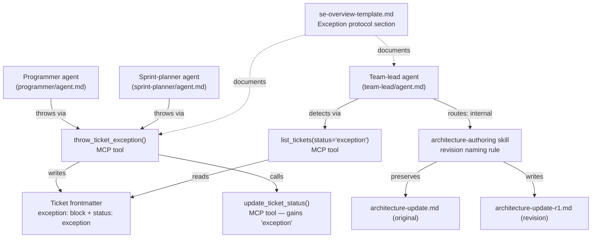

# Architecture Update — Sprint 018: Lower-agent exception protocol

## What Changed

### 1. `exception` added to ticket status enum

`clasi/tools/artifact_tools.py` — `update_ticket_status()` currently validates
against `{"open", "in-progress", "done"}`. After this sprint the valid set is:

```
{"open", "in-progress", "done", "exception"}
```

`clasi/sprint.py` — `ticket_counts()` currently tallies `open`, `in_progress`,
`done`. A fourth bucket `exception` is added:

```python
counts: dict[str, int] = {"open": 0, "in_progress": 0, "done": 0, "exception": 0}
```

No database schema change is needed: status is read from ticket frontmatter,
not stored in the state DB.

The `list_tickets` MCP tool and its `status` filter already pass through the
string verbatim; no change needed there. The `review_sprint_pre_close` and
`review_sprint_post_close` checks must treat a ticket with status `exception`
as a blocker (equivalent to `open`) — existing logic already raises an error
for any non-`done` ticket, so this requires no code change provided the
exception ticket was either resolved or re-opened before close.

**Use cases**: SUC-001, SUC-002, SUC-007.

---

### 2. Ticket frontmatter `exception:` block schema

Tickets that carry an exception payload will include a top-level `exception:`
mapping in their YAML frontmatter. The schema:

```yaml
exception:
  thrown_by: "programmer"          # "programmer" | "sprint-planner"
  thrown_at: "2026-05-07T14:23:00Z"  # ISO-8601 UTC timestamp
  attempted: |                     # One-paragraph description of what was tried
    Attempted to implement the widget cache using a module-level singleton
    to satisfy SUC-003, but the existing architecture assigns singleton
    lifecycle ownership to the orchestrator layer.
  conflict: "architecture-update.md §3 — Orchestrator owns singleton lifecycle"
            # Free-text reference to the upstream decision being blocked by
  surface: "internal"              # "user-visible" | "internal"
```

Fields:
- `thrown_by`: which agent role threw the exception.
- `thrown_at`: when the exception was written (agent fills this).
- `attempted`: what work was tried before hitting the wall.
- `conflict`: the specific upstream decision that cannot be overridden without
  escalation. Should reference the architecture module, use-case ID, or
  decision section causing the conflict.
- `surface`: pre-classification by the throwing agent. The team-lead may
  override this during routing (SUC-004), but the throwing agent provides
  a first-pass classification to aid routing.

The schema is enforced by convention and by the `throw_ticket_exception` MCP
tool (§3 below). No JSON Schema validator is added in this sprint.

**Use cases**: SUC-001, SUC-002, SUC-004, SUC-007.

---

### 3. `throw_ticket_exception` — new MCP tool in `artifact_tools.py`

A new `@server.tool()` function `throw_ticket_exception` is added to
`clasi/tools/artifact_tools.py`. Interface:

```
throw_ticket_exception(
    path: str,
    thrown_by: str,
    attempted: str,
    conflict: str,
    surface: str,
) -> str  (JSON)
```

Behaviour:
- Resolves the ticket path via `resolve_artifact_path(path)`.
- Validates `thrown_by` in `{"programmer", "sprint-planner"}`.
- Validates `surface` in `{"user-visible", "internal"}`.
- Writes the `exception:` YAML block to the ticket's frontmatter using
  `Artifact.update_frontmatter()`.
- Sets `thrown_at` to `datetime.now(timezone.utc).isoformat()`.
- Sets ticket `status` to `exception`.
- Returns JSON: `{path, old_status, new_status: "exception", thrown_at}`.
- On error (ticket not found, invalid args): returns JSON error.

This tool is the single atomic operation for throwing. Agents call it once;
they do not separately call `update_ticket_status`.

**Use cases**: SUC-007.

---

### 4. Programmer agent prompt — exception throw guidance

`clasi/plugin/agents/programmer/agent.md` gains a new top-level section:

**"Exception Protocol"**

Content:
- **Threshold**: Throw when you cannot proceed without overriding an upstream
  architecture or use-case decision. Hard work is not a threshold. The wall
  must be structural.
- **How to throw**: Call `throw_ticket_exception(path, thrown_by="programmer",
  attempted=..., conflict=..., surface=...)`.
- **Surface classification**: Classify `surface` as `"user-visible"` if the
  conflict touches a behavior described in `usecases.md`; otherwise
  `"internal"`.
- **Exit cleanly**: After throwing, stop. Do not partially complete the ticket.
  Do not write partial code. The thrown exception is the deliverable.
- **No out-of-band signaling**: The ticket is the carrier. Do not return
  exception text in your final message as a substitute for writing it to the
  ticket.

**Use cases**: SUC-001.

---

### 5. Sprint-planner agent prompt — exception throw guidance

`clasi/plugin/agents/sprint-planner/agent.md` gains the same "Exception
Protocol" section as the programmer agent (§4), with one adaptation:

- `thrown_by` is `"sprint-planner"` rather than `"programmer"`.
- The section notes that during planning phases (before tickets exist), the
  sprint-planner surfaces the exception in its return text to the team-lead
  rather than writing to a ticket frontmatter — because no ticket may yet
  exist. In that case the payload fields are included in the return text in
  the same schema format, for team-lead routing.

**Use cases**: SUC-002.

---

### 6. Team-lead agent prompt — exception routing rules

`clasi/plugin/agents/team-lead/agent.md` gains a new section:

**"Exception routing"**

Content:
- **Detection**: After a programmer or sprint-planner agent returns, check
  for tickets with status `exception` using `list_tickets(status="exception")`.
- **Read the payload**: Read the ticket's `exception:` frontmatter block.
- **Routing decision** (SUC-003, SUC-004):
  - Consult `usecases.md`. If the `conflict` or `surface` maps to user-visible
    behavior, escalate to the stakeholder. Describe the conflict plainly and
    ask what decision should be made.
  - If the conflict is purely internal, dispatch the sprint-planner to revise
    the architecture. Pass the exception payload so the planner has full context.
- **After resolution**: Re-open the ticket (`reopen_ticket`) or create a
  replacement ticket. Do not leave tickets in `exception` status after routing.
- **No silent abandonment**: Every `exception` ticket must result in either
  escalation or an architecture revision cycle.

**Use cases**: SUC-003, SUC-004.

---

### 7. Architecture-authoring skill — preserve original on revision

`clasi/plugin/skills/architecture-authoring/SKILL.md` gains a new rule in
the Mode 2 section:

**"Revision naming and preservation"**

When a revision is needed (triggered by an exception loop, a failed
architecture-review gate, or a stakeholder change request):

1. Do NOT overwrite `architecture-update.md`.
2. Write the revision as `architecture-update-r1.md` in the same sprint
   directory. Subsequent revisions: `architecture-update-r2.md`, etc.
3. The latest `architecture-update-rN.md` is the active planning artifact.
4. The original and all intermediate revisions remain as historical record
   (calibration signal per SUC-005, SUC-006).

The sprint-planner agent prompt is updated to reference this naming convention.

**Use cases**: SUC-005, SUC-006.

---

### 8. Tests

**`tests/unit/test_artifact_tools.py`**
- `test_update_ticket_status_accepts_exception`: call `update_ticket_status`
  with `status="exception"`, assert success.
- `test_update_ticket_status_rejects_unknown`: confirm unknown statuses still
  raise `ValueError`.
- `test_throw_ticket_exception_writes_frontmatter`: call
  `throw_ticket_exception`, assert ticket frontmatter contains `exception:`
  block with all fields, and status is `exception`.
- `test_throw_ticket_exception_invalid_thrown_by`: assert `ValueError` on
  invalid `thrown_by`.
- `test_throw_ticket_exception_invalid_surface`: assert `ValueError` on
  invalid `surface`.

**`tests/unit/test_sprint.py`**
- `test_ticket_counts_includes_exception_bucket`: create a ticket with
  `status: exception`, assert `ticket_counts()["exception"] == 1`.

**`tests/system/test_exception_flow.py`** (new file)
- `test_throw_and_list`: create a sprint + ticket, call
  `throw_ticket_exception`, assert `list_tickets(status="exception")` returns
  the ticket.
- `test_exception_ticket_blocks_pre_close`: assert `review_sprint_pre_close`
  fails when an `exception` ticket exists (i.e., it is treated as incomplete).

**`tests/docs/test_se_overview.py`** (new file or existing expanded)
- `test_exception_protocol_section_exists`: assert the SE overview template
  contains an "Exception protocol" section.

**Use cases**: SUC-001, SUC-002, SUC-003, SUC-007.

---

### 9. SE overview documentation — "Exception protocol" section

`clasi/se-overview-template.md` gains a new section:

**"Exception protocol"**

A brief description of:
- When to throw (structural wall threshold).
- The exception payload schema (same fields as §2).
- The ticket as carrier (no out-of-band signaling).
- Team-lead routing logic (user-visible → stakeholder; internal → architecture
  revision loop).
- Calibration signal: revision artifact naming convention and what high counts
  mean.

This section is the canonical human-readable reference; agent prompts reference
it for the full rationale.

**Use cases**: SUC-001, SUC-002, SUC-003, SUC-004, SUC-005, SUC-006.

---

## Why

| Change | Rationale |
|--------|-----------|
| `exception` status added | Without a machine-readable status, exception tickets are indistinguishable from open tickets. The status makes them filterable and blocks sprint close until resolved. |
| `exception:` frontmatter schema | Free-text exception messages in agent output are invisible to the team-lead unless the team-lead was watching at the exact moment. Writing to the ticket makes the exception durable and inspectable. |
| `throw_ticket_exception` tool | Gives agents a single atomic operation. Without it, agents must make two calls (`update_frontmatter`, `update_ticket_status`) and risk partial writes if interrupted. |
| Programmer and sprint-planner prompt updates | Without explicit threshold guidance, agents either over-throw (any difficulty) or under-throw (paper over walls with workarounds). The threshold rule — "structural, not merely hard" — calibrates the signal. |
| Team-lead routing rules | Without routing rules, exceptions arrive and the team-lead has no defined procedure. The rules make the path deterministic: read payload, consult use cases, branch on `surface`. |
| Revision artifact preservation | Overwriting `architecture-update.md` destroys the calibration signal. The `-rN.md` naming preserves the full revision history without requiring a version-control diff to reconstruct it. |
| SE overview section | The protocol spans five files. A canonical description in the overview prevents drift between the individual file updates. |

---

## Component Diagram



---

## Entity-relationship diagram — ticket status machine

```mermaid
stateDiagram-v2
    [*] --> open : create_ticket
    open --> in-progress : update_ticket_status / acquire_execution_lock
    in-progress --> done : move_ticket_to_done
    in-progress --> exception : throw_ticket_exception
    exception --> open : reopen_ticket (after routing)
    done --> open : reopen_ticket
```

---

## Impact on Existing Components

| Component | Impact |
|-----------|--------|
| `artifact_tools.py` — `update_ticket_status` | Add `"exception"` to `valid_statuses` set. One-line change. |
| `artifact_tools.py` — `throw_ticket_exception` | New tool. No changes to existing tools. |
| `sprint.py` — `ticket_counts()` | Add `"exception": 0` to counts dict. Handle `s == "exception"` bucket. |
| `review_sprint_pre_close` / `review_sprint_post_close` | No code change needed: existing logic treats any non-`done` ticket as a blocker. |
| `list_tickets` MCP tool | No change: already passes status filter through verbatim. |
| `programmer/agent.md` | New "Exception Protocol" section appended. No existing content changed. |
| `sprint-planner/agent.md` | New "Exception Protocol" section appended. No existing content changed. |
| `team-lead/agent.md` | New "Exception routing" section appended. No existing content changed. |
| `architecture-authoring/SKILL.md` | New "Revision naming and preservation" rule in Mode 2. No existing rules changed. |
| `se-overview-template.md` | New "Exception protocol" section added. No existing sections changed. |

---

## Migration Concerns

- No database migration required. `exception` status lives in ticket
  frontmatter, not the state DB.
- Existing tickets with `open`, `in-progress`, or `done` status are unaffected.
- The `ticket_counts()` change adds a new key; callers that destructure the
  dict by exact key list will need updating. No known callers do this — they
  access keys individually.
- In-flight sprint 016 is closed; sprint 017 is in-flight but does not involve
  `ticket_counts()`. No sequencing concern.

---

## Design Rationale

### Decision: `exception` as a ticket status rather than a separate artifact

**Context**: Two options — add a ticket status `exception`, or create a
separate `exceptions/` directory with standalone exception files.

**Alternatives considered**:
1. Separate `exceptions/<ticket-id>-exception.md` file alongside ticket.
2. New `exception` status value on the ticket itself.
3. Out-of-band: agent returns exception text in final message only.

**Why ticket status**: The ticket is already the unit of work. Adding a status
keeps exception information co-located with the work it describes. Separate
files split the narrative across two artifacts. Out-of-band text is invisible
after the conversation ends.

**Consequences**: The ticket file carries dual information (work description +
exception payload). This is acceptable because the exception state is
terminal — a ticket in `exception` is not being worked. The payload explains
why, without needing a separate carrier.

---

### Decision: `surface` field classified by throwing agent, not inferred by team-lead

**Context**: The team-lead routes based on user-visible vs. internal. Who
classifies?

**Why throwing agent**: The throwing agent has the fullest context at throw
time — it knows exactly what it was trying to do and where the conflict is.
Requiring the team-lead to re-read the entire ticket and architecture to
re-derive the classification is redundant work. The throwing agent provides a
first-pass classification; the team-lead retains override authority per
SUC-004.

**Consequences**: Incorrect classifications by throwing agents are possible.
The team-lead's use-case cross-reference (SUC-004) is the correction mechanism.

---

### Decision: No formal `throw_ticket_exception` validation against use-case IDs

**Context**: The `conflict` field is free text. Should it require a structured
reference (e.g., a use-case ID that is validated to exist)?

**Why free text**: Sprint 018 establishes the protocol. Structured validation
of conflict references would require a use-case registry not yet implemented.
Free text is sufficient for team-lead routing; precise references are a
quality-of-life improvement that can be added in a later sprint.

**Consequences**: Throwing agents may write vague `conflict` descriptions. The
threshold guidance in agent prompts mitigates this: agents are instructed to
cite the specific architecture section or use-case causing the conflict.

---

## Architecture Self-Review

**Consistency**: All nine "What Changed" sections are reflected in the component
diagram, ER diagram, impact table, and rationale. The `exception` status is
consistently described across §1 (enum), §2 (schema), §3 (tool), §4–6 (agent
prompts), and §8 (tests). No section references a different set of fields.

**Codebase Alignment**: The existing `update_ticket_status` valid_statuses set
is confirmed at line 601 of `artifact_tools.py`. The `ticket_counts()` method
in `sprint.py` is confirmed at lines 406–416. The `Ticket.status` property
reads from frontmatter at line 36–38 of `ticket.py`. All proposed changes are
additions to verified existing patterns; no assumed infrastructure is missing.
The `Artifact.update_frontmatter()` method is already used throughout — the
new tool uses the same pattern.

**Design Quality**:
- Cohesion: `throw_ticket_exception` has one purpose — atomically write the
  exception payload and transition status. No "and" needed.
- Coupling: the new tool depends on `Artifact` (already a dependency of all
  ticket tools) and `resolve_artifact_path` (shared utility). No new
  dependencies introduced.
- Boundaries: agent prompts are updated via prose only; no cross-agent
  coupling is introduced. The team-lead learns about exceptions through the
  MCP tool (`list_tickets`), not by calling agent internals.
- Dependency direction: tool layer → domain objects (Ticket, Artifact) →
  filesystem. Unchanged from current architecture.

**Anti-Pattern Check**:
- No god component: `throw_ticket_exception` is narrow. Agent prompt updates
  are in separate files.
- No shotgun surgery: the `exception` status addition touches two files
  (`artifact_tools.py` line 601, `sprint.py` line 411). Prompt updates are
  additive to three separate agent files.
- No circular dependencies: new tool follows existing fanout pattern.
- No shared mutable state: exception payload lives in the ticket file; no
  in-memory state shared between agents.

**Risks**:
- The `ticket_counts()` dict change adds a key; any caller that does `counts
  == {"open": N, "in_progress": N, "done": N}` exact-dict comparison will
  break. Grep shows no such callers; risk is low.
- Agent prompts are updated additively — existing guidance is preserved.
  Risk of confusion from duplicate or contradictory guidance is low because
  the new sections are clearly delimited.
- The revision naming convention (`-rN.md`) is a prose convention, not
  enforced by tooling. Agents could deviate. Mitigated by explicit guidance
  in both the skill and the sprint-planner prompt.

**Open Questions**: None. All decisions are locked in by the source TODO and
the sprint.md solution outline.

**Verdict: APPROVE** — Changes are additive, grounded in verified existing
patterns, and address the documented gap with minimal scope. No circular
dependencies, no god components, no migration risk beyond the `ticket_counts()`
dict key addition (low risk, confirmed no breaking callers).
