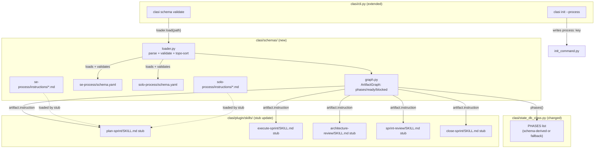
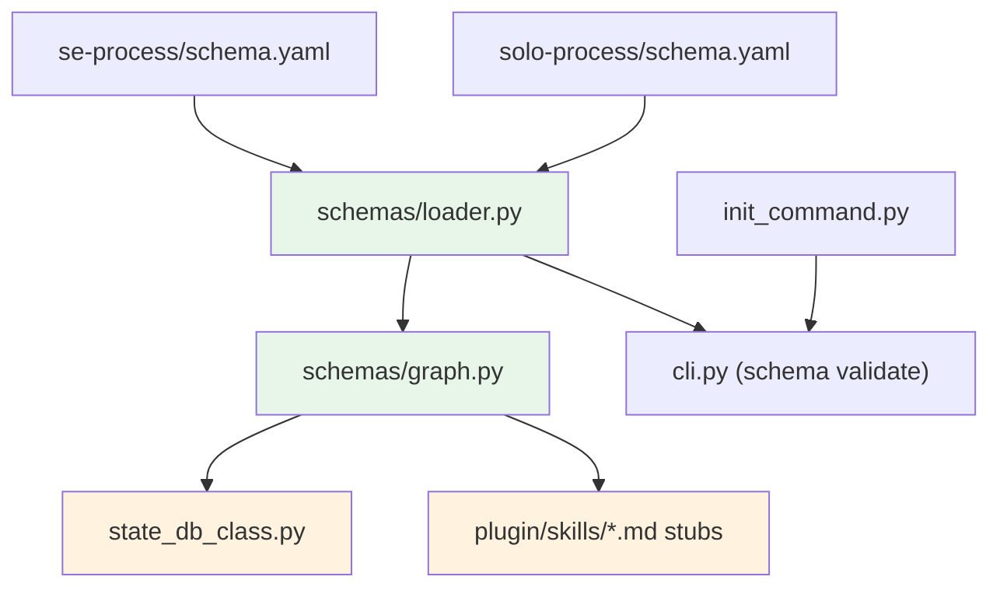

# Architecture Update — Sprint 020: Schema-driven workflow: YAML DAG of artifacts

## What Changed

### New: `clasi/schemas/` package

A new top-level package holding workflow definitions, the schema loader, and
the artifact graph. Three modules and two process directories:

```
clasi/
  schemas/
    __init__.py          ← exports SchemaError, load_schema, ArtifactGraph
    loader.py            ← parse YAML, Pydantic validation, topo-sort,
                           cycle detection, gate-kind registry
    graph.py             ← ArtifactGraph: ready/blocked/done queries
    se-process/
      schema.yaml        ← full SE workflow DAG
      instructions/
        overview.md
        specification.md
        usecases.md
        sprint-plan.md
        architecture-update.md
        tickets.md
        execution.md
        close.md
    solo-process/
      schema.yaml        ← leaner solo workflow DAG
      instructions/
        overview.md
        sprint-plan.md
        tickets.md
        execution.md
        close.md
```

**Pydantic models** (defined in `loader.py`):

- `GateSpec`: `kind: str`, `record: str`. `kind` must be in the gate-kind
  registry (`stakeholder-review`, `review`, `per-ticket`). `record` is the
  gate name passed to `record_gate_result`.
- `ArtifactSpec`: `id: str`, `generates: str`, `instruction: str | None`,
  `requires: list[str]`, `gate: GateSpec | None`, `lock: str | None`.
- `WorkflowSchema`: `version: int`, `name: str`, `description: str`,
  `artifacts: list[ArtifactSpec]`.

**Loader behavior** (`loader.load(path) -> WorkflowSchema`):

1. Parse YAML. Pydantic validates field types and required fields.
2. Check for duplicate `id` values — raise `SchemaError`.
3. Resolve all `requires` references — raise `SchemaError` for unknown IDs.
4. Topological sort (Kahn's algorithm) — raise `SchemaError` on cycle.
5. Validate each `gate.kind` against the registry — raise `SchemaError` for
   unknown kinds.
6. Return the validated, sorted `WorkflowSchema`.

**`ArtifactGraph`** (`graph.py`):

Wraps a loaded `WorkflowSchema`. Provides:
- `phases() -> list[str]` — artifact IDs in topological order (what
  `state_db_class.py` will read instead of `PHASES`).
- `artifact(id) -> ArtifactSpec` — lookup by ID.
- `requires(id) -> list[str]` — direct dependencies.
- `gate_for(id) -> GateSpec | None` — gate declaration for an artifact.

Boundary: read-only queries on the in-memory graph. No file I/O, no SQLite.

---

### Changed: `clasi/state_db_class.py` — PHASES derived from schema

The module-level `PHASES` constant becomes derived from the active schema at
module import. A feature flag `CLASI_SCHEMA_PHASES` controls the behavior for
one release:

- **Flag absent or `"0"`**: Use the hardcoded fallback `_PHASES_FALLBACK`
  constant (current behavior, unchanged).
- **Flag `"1"`**: Call `ArtifactGraph(load_schema(active_schema_path)).phases()`
  at import time. Assign the result to `PHASES`.

After the migration release, the flag and fallback are removed and the
schema-derived path becomes unconditional.

The `_GATE_REQUIREMENTS` dict remains in `state_db_class.py` for now. In a
future sprint (gate metadata migration), it will be derived from `gate.record`
fields in the schema. That change is out of scope for sprint 020.

**Boundary**: `state_db_class.py` gains a single call-site dependency on
`clasi.schemas`. All other logic (SQLite, gate validation, lock management)
is unchanged.

---

### Changed: Skill stubs for `plan-sprint`, `execute-sprint`, `architecture-review`, `sprint-review`, `close-sprint`

Each of the five affected skills currently embeds instructional prose inline in
`SKILL.md`. After this sprint:

1. The prose is extracted to the corresponding `instructions/*.md` file in
   `se-process/instructions/`.
2. The `SKILL.md` stub is reduced to: frontmatter, a one-sentence description,
   and a load directive pointing to the instruction file.
3. The skill loader (existing machinery in `clasi/plugin/`) reads the
   instruction file at skill invocation time and presents it as the skill body.

The external behavior of each skill is unchanged. The skill names, MCP tool
signatures, and agent behaviors are identical. Only the source of the prose
changes.

---

### New: `se-process/schema.yaml`

Declares the full SE workflow as a YAML DAG. The artifact IDs match the current
`PHASES` list exactly, with `roadmap` declared as the first phase (per sprint
017). Gate kinds map to the existing `_GATE_REQUIREMENTS` entries:

```yaml
version: 1
name: se-process
description: Full software-engineering process — team mode

artifacts:
  - id: roadmap
    generates: docs/clasi/sprints/<id>/sprint.md
    instruction: schemas/se-process/instructions/sprint-plan.md
    requires: []

  - id: planning-docs
    generates: docs/clasi/sprints/<id>/sprint.md
    instruction: schemas/se-process/instructions/sprint-plan.md
    requires: [roadmap]

  - id: architecture-review
    generates: docs/clasi/sprints/<id>/architecture-update.md
    instruction: schemas/se-process/instructions/architecture-update.md
    requires: [planning-docs]
    gate:
      kind: review
      record: architecture_review

  - id: stakeholder-review
    generates: docs/clasi/sprints/<id>/tickets/
    instruction: schemas/se-process/instructions/tickets.md
    requires: [architecture-review]
    gate:
      kind: stakeholder-review
      record: stakeholder_approval

  - id: ticketing
    generates: docs/clasi/sprints/<id>/tickets/
    instruction: schemas/se-process/instructions/tickets.md
    requires: [stakeholder-review]

  - id: executing
    generates: <code + test changes>
    instruction: schemas/se-process/instructions/execution.md
    requires: [ticketing]
    lock: execution
    gate:
      kind: per-ticket
      record: ticket-complete

  - id: closing
    generates: docs/clasi/sprints/done/<id>/
    instruction: schemas/se-process/instructions/close.md
    requires: [executing]

  - id: done
    generates: <archived sprint>
    requires: [closing]
```

The topological sort of this DAG produces `["roadmap", "planning-docs",
"architecture-review", "stakeholder-review", "ticketing", "executing",
"closing", "done"]` — identical to the current hardcoded `PHASES` list.

---

### New: `solo-process/schema.yaml`

A leaner DAG for solo developers. No `architecture-review` phase, no
`stakeholder-review` gate:

```yaml
version: 1
name: solo-process
description: Lean solo-developer process — no team gates

artifacts:
  - id: roadmap
    generates: docs/clasi/sprints/<id>/sprint.md
    instruction: schemas/solo-process/instructions/sprint-plan.md
    requires: []

  - id: planning-docs
    generates: docs/clasi/sprints/<id>/sprint.md
    instruction: schemas/solo-process/instructions/sprint-plan.md
    requires: [roadmap]

  - id: ticketing
    generates: docs/clasi/sprints/<id>/tickets/
    instruction: schemas/solo-process/instructions/tickets.md
    requires: [planning-docs]

  - id: executing
    generates: <code + test changes>
    instruction: schemas/solo-process/instructions/execution.md
    requires: [ticketing]
    lock: execution
    gate:
      kind: per-ticket
      record: ticket-complete

  - id: closing
    generates: docs/clasi/sprints/done/<id>/
    instruction: schemas/solo-process/instructions/close.md
    requires: [executing]

  - id: done
    generates: <archived sprint>
    requires: [closing]
```

---

### New: `clasi init --process` flag

`cli.py` gains a `--process` option on the `init` command (`se` | `solo`,
default `se`). `init_command.py` writes the choice to `.clasi/config.yaml`
under a `process:` key. Server startup reads this key to select the schema
path.

---

### New: `clasi schema validate` CLI subcommand

`cli.py` gains a `schema` group with a `validate` subcommand:

```
clasi schema validate <path>
```

Calls `loader.load(path)`. Prints "Schema valid." on success (exit 0). Prints
the `SchemaError` message to stderr on failure (exit non-zero).

---

## Why

The three-location desyncs (state DB, skill prose, dispatch logic) are the
root cause of the recurring "skill says X but state enforces Y" class of bugs
and of the need for the OOP escape hatch during phase transitions. Promoting
the workflow definition to a YAML DAG with a validated loader makes the schema
the single source of truth. Each derived layer (phase machine, skill prose,
dispatch routing) reads from it instead of maintaining its own copy.

The solo-process schema validates that the abstraction is real, not
theoretical: if a second process can be declared and executed without code
changes, the schema layer is doing genuine work.

---

## Impact on Existing Components

| Component | Change |
|-----------|--------|
| `clasi/schemas/` | New package: `__init__.py`, `loader.py`, `graph.py` |
| `clasi/schemas/se-process/schema.yaml` | New file — full SE workflow DAG |
| `clasi/schemas/se-process/instructions/*.md` | New files — extracted skill prose (8 files) |
| `clasi/schemas/solo-process/schema.yaml` | New file — solo workflow DAG |
| `clasi/schemas/solo-process/instructions/*.md` | New files — solo instruction prose (5 files) |
| `clasi/state_db_class.py` | `PHASES` optionally derived from schema; feature flag added |
| `clasi/plugin/skills/plan-sprint/SKILL.md` | Reduced to stub; prose moved to instruction file |
| `clasi/plugin/skills/execute-sprint/SKILL.md` | Reduced to stub |
| `clasi/plugin/skills/architecture-review/SKILL.md` | Reduced to stub |
| `clasi/plugin/skills/sprint-review/SKILL.md` | Reduced to stub |
| `clasi/plugin/skills/close-sprint/SKILL.md` | Reduced to stub |
| `clasi/cli.py` | `init` gains `--process` option; new `schema validate` subcommand |
| `clasi/init_command.py` | Writes `process:` key to `.clasi/config.yaml` |
| All other modules | Unchanged |

---

## Migration Concerns

**Phase machine backward compatibility**: The `CLASI_SCHEMA_PHASES` feature
flag ensures one release of backward compatibility. Projects without the flag
set continue to use the hardcoded `PHASES` list. The flag is enabled
explicitly to opt into the schema-derived path. After one release confirms
correctness, the flag and fallback are removed.

**Existing installs**: No database migration required. The schema changes only
affect which Python list `PHASES` is populated from — the SQLite schema and
all stored phase names are unchanged.

**Skill prose migration**: Skill stubs still present identical instructional
text to the agent; only the delivery mechanism changes (file load vs. inline).
No behavioral change for running agents.

**Solo-process projects**: A project initialized with `--process solo` cannot
be switched to `--process se` mid-flight without a state-DB migration (out of
scope for v1; documented as a limitation).

**Schema versioning**: The `version: 1` field is reserved for future
migration tooling (`clasi schema migrate`, deferred). For v1, schema changes
are manual YAML edits; no migration tooling exists.

---

## Component Diagram



---

## Dependency Graph



No cycles. `loader.py` is a leaf with no `clasi` imports (only stdlib + Pydantic +
PyYAML). `graph.py` depends only on `loader.py` types. `state_db_class.py`
gains one dependency on `clasi.schemas`. Fan-out from `graph.py` to callers
is 2 (state DB + skill stubs) — well within the 4-5 guideline.

---

## Design Rationale

### Decision: Feature flag for PHASES migration rather than hard cut

**Context**: The current `PHASES` list is correct. The risk is a regression
where the schema-derived list differs (e.g., wrong topo-sort order, extra
phase). A hard cut with no fallback would break all installs if the schema
has a bug.

**Why feature flag**: One release with the flag lets the derived path be
validated in production (or staging) before the fallback is removed. Any
mismatch between derived and hardcoded lists is detectable immediately without
user-visible breakage.

**Consequences**: Two code paths in `state_db_class.py` for one release.
The flag env var is `CLASI_SCHEMA_PHASES`. After the sprint 020 release, a
follow-on commit removes the flag and fallback.

**Alternative considered**: Keep hardcoded list forever and only use the
schema for skill prose and CLI. Rejected: this misses the core goal — the
schema must be the single source of truth for the phase machine too.

---

### Decision: `_GATE_REQUIREMENTS` stays hardcoded in sprint 020

**Context**: The TODO describes moving gate metadata from scattered call sites
into the schema's `gate:` blocks. `_GATE_REQUIREMENTS` is the primary
call site.

**Why defer**: The gate-metadata migration is a meaningful second step that
needs its own attention. Doing it in the same sprint as the schema skeleton and
`PHASES` migration would make the sprint too large and the blast radius too
wide. Sprint 020 establishes the schema layer; a follow-on sprint migrates gate
enforcement to read from `gate.record` in the schema.

**Consequence**: The schema's `gate.record` field exists but is not yet
consumed by `_GATE_REQUIREMENTS` in sprint 020. It is used by the `clasi
schema validate` output and by `ArtifactGraph.gate_for()`, but not for
enforcement. This is noted as an open question below.

---

### Decision: `roadmap` declared as first artifact in se-process schema

**Context**: Sprint 017 added `roadmap` as the first phase. The schema must
declare it first so the derived `PHASES` list matches the current hardcoded
one exactly.

**Why first**: Topological sort of a DAG with `roadmap` having no `requires`
dependencies naturally places it first. This mirrors the existing behavior.

**Consequence**: The `se-process/schema.yaml` includes `roadmap` and
`planning-docs` as separate artifact nodes, even though they both point to
`sprint.md`. The distinction is correct — `roadmap` produces a lightweight
sprint.md; `planning-docs` produces the full sprint.md with use cases and
architecture. The schema's `generates` field documents the output; the loader
does not enforce uniqueness of `generates` paths.

---

### Decision: Instruction files are per-process, not shared

**Context**: Some instruction prose (e.g., overview authoring) might be
identical between `se-process` and `solo-process`.

**Why per-process copies**: Shared instruction files would create a coupling
between two independent schemas. If `se-process` needs to change its overview
instructions, a shared file would silently change `solo-process` behavior.
Per-process copies are verbose but decoupled. If duplication becomes painful,
a `$include:` mechanism can be added later.

---

## Open Questions

1. **Gate enforcement from schema**: `_GATE_REQUIREMENTS` is not yet derived
   from `gate.record` in the schema. A follow-on sprint should migrate this,
   at which point the schema truly owns all enforcement logic. The sprint 020
   architecture leaves a clean extension point: `ArtifactGraph.gate_for(id)`
   returns the `GateSpec`, ready for the enforcement layer to consume.

2. **`per-ticket` gate modeling**: The `executing` artifact's
   `gate.kind: per-ticket` is special — it does not fit a single
   `record_gate_result` call. For v1, the enforcement code treats it as a
   special case (same as today). A future sprint could model tickets as
   first-class artifact nodes, one per ticket, generated at ticket-creation
   time. This is the "more honest" approach from the TODO but is deferred.

3. **Skill discovery after stubbing**: Once skill bodies are stubs, the
   distinction between a skill file and a schema instruction file blurs. A
   future sprint could collapse per-artifact skill files into one `se` skill
   that accepts an artifact ID argument. Deferred pending user feedback.
