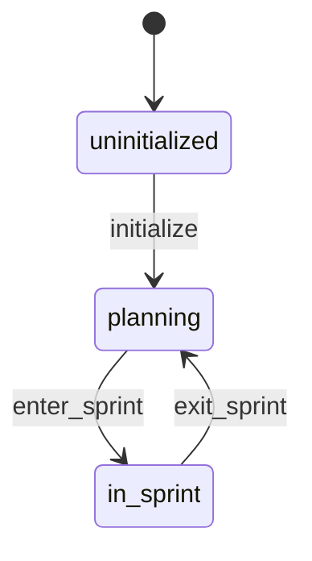
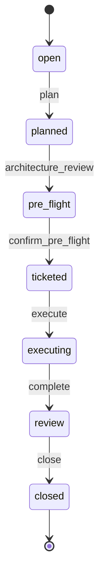
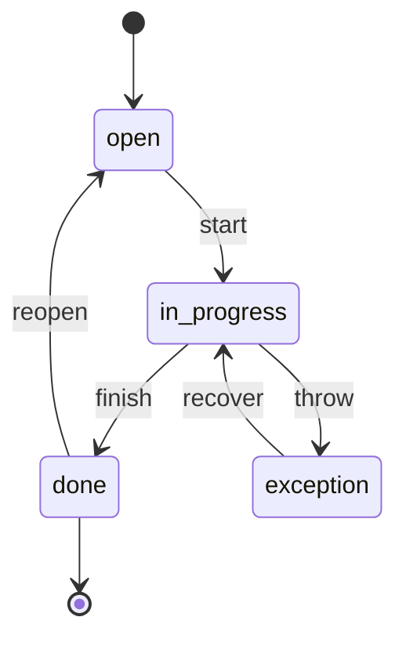

# CLASI State Machines

## Introduction

CLASI's process artifacts (project, sprint, ticket) each have a lifecycle, but
today those lifecycles are implicit — scattered across
[clasi/schemas/se-process/schema.yaml](../../clasi/schemas/se-process/schema.yaml),
[clasi/state_db_class.py](../../clasi/state_db_class.py),
[clasi/ticket.py](../../clasi/ticket.py), and the markdown templates under
[clasi/templates/](../../clasi/templates/). To know "what state are we in?" a
human or agent has to inspect frontmatter, file locations, branch name, and the
state DB, then reason about the combination.

This document is the authoritative target model. It defines three state
machines: **Project**, **Sprint**, and **Ticket**.

### Anatomy of a state machine

A machine has a name, a context type, an initial state, and a map of
states. Each **state** is a structured object with:

- `description` — what this state means.
- `invariants` — a list of `is_*` predicates that must hold *while* the
  machine is in this state, **independent of how you got here**. A state
  invariant is a property of *being in the state*, not of *arriving in
  the state*.
- `transitions` — outbound transitions from this state, keyed by
  transition name. The `from` field is unnecessary (it is always the
  enclosing state), so a transition carries only:
  - `to` — destination state.
  - `conditions` — `is_*` predicates that must hold to fire the
    transition.
  - `action` — the named function that performs the transition.

Predicates and actions are defined once at the machine level in their
own registries, so they can be reused across states and transitions.

### Invariants vs. transition conditions

The two are different things:

- A **transition condition** is checked once, *just before* the
  transition fires. It is about *moving*.
- An **invariant** is checked continuously, by anyone who wants to
  verify the machine is in a self-consistent state. It is about
  *being*.

**Rule:** to fire a transition `X → Y`, the runtime must verify
**both** the transition's conditions **and** the invariants of the
destination state `Y`. Conditions describe the trigger; invariants
describe the destination contract. This means invariants of `Y` need
not be repeated in the conditions of every transition that targets `Y`
— the engine adds them automatically.

### Predicates and actions

A transition has three moving parts:

1. **Conditions** — boolean predicates that gate the transition. Every
   predicate is a named Python function whose name starts with `is_`,
   e.g. `is_overview_present`. Predicates are pure / read-only.
2. **Destination invariants** — the invariant list on the `to:` state,
   automatically required by the engine in addition to the listed
   conditions.
3. **Action** — a single Python function that performs the work of
   moving from source to destination (writes files, records gates,
   moves tickets). Named with a verb, e.g. `write_planning_docs`.
   Actions should be idempotent where practical.

Both predicates and actions take a **context** object: `ProjectContext`,
`SprintContext`, or `TicketContext`. Each context exposes references to
its parent contexts so a predicate or action can look up cross-machine
information when needed.

### Goals of this model

- The vocabulary of `is_*` predicates and named actions should be rich
  enough that **re-arranging the process is a YAML edit, not a code
  change.** New transitions are composed from existing primitives.
- Predicate behavior must be self-contained and side-effect-free.
- Action behavior must be idempotent where practical, so retrying a
  failed transition does not corrupt state.

The final section maps this target model onto the 8-phase model that is
actually implemented in `schema.yaml` today, and lists the known
divergences to be reconciled in a future sprint.

---

## 1. Project state machine



```yaml
machine: project
context: ProjectContext
initial: uninitialized

states:

  uninitialized:
    description: The project has not yet been bootstrapped — no overview exists.
    invariants:
      - is_overview_absent
    transitions:
      initialize:
        to: planning
        conditions: []          # only the destination invariants need hold
        action: write_overview

  planning:
    description: |
      The project has been bootstrapped and is currently between sprints.
      HEAD is on the default branch; no sprint is executing.
    invariants:
      - is_overview_present
      - is_on_default_branch
      - is_execution_lock_released
    transitions:
      enter-sprint:
        to: in-sprint
        conditions:
          - is_any_sprint_ticketed
        action: enter_sprint_branch

  in-sprint:
    description: |
      Exactly one sprint is currently executing. HEAD is on that sprint's
      branch and the execution lock is held.
    invariants:
      - is_on_sprint_branch
      - is_execution_lock_held
      - is_any_sprint_executing
    transitions:
      exit-sprint:
        to: planning
        conditions: []          # the act of closing a sprint releases the lock
        action: return_to_default_branch

predicates:
  is_overview_absent:
    description: Returns True iff docs/clasi/overview.md does not exist.
  is_overview_present:
    description: Returns True iff docs/clasi/overview.md exists.
  is_on_default_branch:
    description: Returns True iff git HEAD is on the project's default branch (master/main).
  is_on_sprint_branch:
    description: Returns True iff git HEAD matches `sprint/<id>-<slug>`.
  is_execution_lock_held:
    description: Returns True iff the state DB has an active execution lock.
  is_execution_lock_released:
    description: Returns True iff no execution lock is currently held.
  is_any_sprint_ticketed:
    description: Returns True iff at least one sprint is in the `ticketed` state, ready to execute.
  is_any_sprint_executing:
    description: Returns True iff some sprint is in the `executing` state.

actions:
  write_overview:
    description: Generates docs/clasi/overview.md from stakeholder input. Idempotent.
  enter_sprint_branch:
    description: Checks out the sprint branch and records the project's in-sprint marker.
  return_to_default_branch:
    description: Checks out the default branch and clears the project's in-sprint marker.
```

### Notes

- `uninitialized` and `planning` are distinguished entirely by
  `is_overview_present`. The `initialize` transition has no extra
  conditions because writing the overview is exactly what makes the
  destination invariant `is_overview_present` true.
- `enter-sprint`'s only listed condition is
  `is_any_sprint_ticketed` — the rest (on sprint branch, lock held,
  some sprint executing) are invariants of the `in-sprint` state and
  are checked automatically by the engine.

---

## 2. Sprint state machine

The sprint machine has seven states. Two of them are **pause states**:

- **`pre-flight`** — between `planned` and `ticketed`. The stakeholder
  may pause here for review, or set a flag to bump through.
- **`review`** — between `executing` and `closed`. Same pattern.

Both pause states are visited by every sprint; the difference between
"pause" and "bump" is whether the corresponding gate fires
automatically or waits for human input. See the **pause-or-bump
pattern** below.



```yaml
machine: sprint
context: SprintContext
initial: open

states:

  open:
    description: |
      The sprint directory and sprint.md exist. No planning artifacts
      yet.
    invariants:
      - is_sprint_doc_present
    transitions:
      plan:
        to: planned
        conditions: []          # planning is a creative activity, not a gate
        action: write_planning_docs

  planned:
    description: |
      Planning artifacts (architecture-update.md, use-cases) are
      present. Architecture review has not yet been recorded.
    invariants:
      - is_sprint_doc_present
      - is_architecture_present
      - is_usecases_present
    transitions:
      architecture-review:
        to: pre-flight
        conditions: []
        action: record_architecture_review

  pre-flight:
    description: |
      Architecture review has been recorded. Sprint pauses here for
      stakeholder pre-flight review, OR auto-bumps if the
      `pre_flight_review` flag is set to `skip`.
    invariants:
      - is_sprint_doc_present
      - is_architecture_present
      - is_usecases_present
      - is_architecture_review_recorded
    transitions:
      confirm-pre-flight:
        to: ticketed
        conditions: []          # is_pre_flight_satisfied is an invariant of `ticketed`
        action: write_tickets

  ticketed:
    description: |
      Tickets have been written. Sprint is ready to execute but no
      execution lock has been acquired yet.
    invariants:
      - is_sprint_doc_present
      - is_architecture_present
      - is_usecases_present
      - is_architecture_review_recorded
      - is_pre_flight_satisfied
      - is_at_least_one_ticket
    transitions:
      execute:
        to: executing
        conditions:
          - is_no_other_sprint_executing
        action: acquire_execution_lock

  executing:
    description: |
      Sprint owns the execution lock. HEAD is on its branch. Tickets
      may be in any state in the ticket machine.
    invariants:
      - is_on_sprint_branch
      - is_execution_lock_held_by_this_sprint
      - is_at_least_one_ticket
    transitions:
      complete:
        to: review
        conditions: []          # is_all_tickets_done is an invariant of `review`
        action: enter_review

  review:
    description: |
      All tickets are done. Sprint pauses here for post-execution
      review, OR auto-bumps if the `post_review` flag is set to `skip`.
    invariants:
      - is_on_sprint_branch
      - is_execution_lock_held_by_this_sprint
      - is_all_tickets_done
    transitions:
      close:
        to: closed
        conditions: []          # is_review_satisfied, is_close_report_present are invariants of `closed`
        action: close_sprint

  closed:
    description: |
      Sprint has been merged into the default branch and archived.
      Execution lock has been released.
    invariants:
      - is_close_report_present
      - is_branch_merged
      - is_review_satisfied
    transitions: {}

predicates:
  is_sprint_doc_present:
    description: Returns True iff docs/clasi/sprints/<id>/sprint.md exists with id and title set.
  is_architecture_present:
    description: Returns True iff docs/clasi/sprints/<id>/architecture-update.md exists.
  is_usecases_present:
    description: Returns True iff the sprint's use-cases artifact exists.
  is_architecture_review_recorded:
    description: Returns True iff the state DB has an `architecture_review` gate record for this sprint.
  is_pre_flight_satisfied:
    description: |
      Returns True iff EITHER the state DB has a `stakeholder_approval`
      gate record for this sprint, OR the sprint's `pre_flight_review`
      flag is set to `skip`. Encodes the pause-or-bump semantics.
  is_at_least_one_ticket:
    description: Returns True iff docs/clasi/sprints/<id>/tickets/ contains at least one ticket file.
  is_no_other_sprint_executing:
    description: Returns True iff no other sprint holds the execution lock.
  is_on_sprint_branch:
    description: Returns True iff git HEAD is this sprint's branch.
  is_execution_lock_held_by_this_sprint:
    description: Returns True iff the execution lock in the state DB is held by this sprint.
  is_all_tickets_done:
    description: Returns True iff every ticket in this sprint is in the ticket-machine `done` state.
  is_review_satisfied:
    description: |
      Returns True iff EITHER the state DB has a `sprint_review` gate
      record marked passed, OR the sprint's `post_review` flag is set
      to `skip`.
  is_close_report_present:
    description: Returns True iff docs/clasi/sprints/<id>/close-report.md exists.
  is_branch_merged:
    description: Returns True iff the sprint branch has been merged into the default branch.

actions:
  write_planning_docs:
    description: Writes the sprint's planning artifacts (architecture-update.md, use-cases) from the sprint.md outline.
  record_architecture_review:
    description: Records the `architecture_review` gate result in the state DB.
  write_tickets:
    description: Generates ticket files in docs/clasi/sprints/<id>/tickets/ from the architecture and use cases.
  acquire_execution_lock:
    description: |
      Acquires the project-wide execution lock and binds it to this
      sprint. Triggers the project machine's `enter-sprint` transition.
  enter_review:
    description: |
      Generates an initial close-report.md draft. If the sprint's
      `post_review` flag is set to `skip`, also records a passing
      `sprint_review` gate so `is_review_satisfied` is immediately true.
  close_sprint:
    description: |
      Merges the sprint branch into default, archives the sprint
      directory, releases the execution lock, and triggers the
      project machine's `exit-sprint` transition.
```

### The pause-or-bump pattern

`pre-flight` and `review` are explicit pause states. Two flags on the
sprint control whether each one pauses or bumps through:

- `pre_flight_review: pause | skip`
- `post_review: pause | skip`

The `is_pre_flight_satisfied` and `is_review_satisfied` predicates
encode "satisfied by recorded gate OR satisfied by waiver." The
corresponding actions (`record_architecture_review` and `enter_review`)
fire the auto-waiver when the flag is `skip`, so the predicate becomes
true immediately and the next transition fires without human input.
When the flag is `pause`, the sprint sits in the pause state until the
stakeholder records the gate result explicitly via
`record_gate_result`.

This pattern keeps the **state machine structurally identical** whether
or not the stakeholder chooses to review — only the dwell time in the
pause state changes. Re-arranging the process is a flag flip, not a
machine rewrite.

---

## 3. Ticket state machine



`exception` is an off-axis state: reached only from `in-progress`, and
returns only to `in-progress`. Not on the normal `open → done` path.

```yaml
machine: ticket
context: TicketContext
initial: open

states:

  open:
    description: |
      Ticket file exists in docs/clasi/sprints/<id>/tickets/. No
      programmer has been dispatched.
    invariants:
      - is_ticket_file_present
      - is_ticket_not_in_done_dir
      - is_no_exception_block
    transitions:
      start:
        to: in-progress
        conditions:
          - is_dependencies_done    # is_sprint_executing is an invariant of `in-progress`
        action: dispatch_programmer

  in-progress:
    description: |
      A programmer subagent has been dispatched and is working on the
      ticket.
    invariants:
      - is_ticket_file_present
      - is_ticket_not_in_done_dir
      - is_programmer_dispatched
      - is_sprint_executing
    transitions:
      finish:
        to: done
        conditions:
          - is_acceptance_criteria_met
          - is_tests_passing
        action: move_ticket_to_done
      throw:
        to: exception
        conditions:
          - is_blocker_identified
        action: write_exception_block

  exception:
    description: |
      The programmer agent declared it cannot proceed. An exception
      block is recorded in the ticket frontmatter.
    invariants:
      - is_ticket_file_present
      - is_ticket_not_in_done_dir
      - is_exception_block_present
    transitions:
      recover:
        to: in-progress
        conditions:
          - is_blocker_resolved
        action: clear_exception_block

  done:
    description: |
      Ticket has been moved to tickets/done/. Acceptance criteria met
      and tests passed at finish time.
    invariants:
      - is_ticket_file_present
      - is_ticket_in_done_dir
      - is_no_exception_block
    transitions:
      reopen:
        to: open
        conditions:
          - is_reopen_requested
        action: move_ticket_out_of_done

predicates:
  is_ticket_file_present:
    description: Returns True iff the ticket file exists somewhere under the sprint's tickets/ tree.
  is_ticket_in_done_dir:
    description: Returns True iff the ticket file lives under tickets/done/.
  is_ticket_not_in_done_dir:
    description: Returns True iff the ticket file does NOT live under tickets/done/.
  is_no_exception_block:
    description: Returns True iff the ticket frontmatter has no `exception:` block.
  is_exception_block_present:
    description: Returns True iff the ticket frontmatter has an `exception:` block with the documented fields.
  is_programmer_dispatched:
    description: Returns True iff a programmer subagent dispatch is recorded for this ticket in the state DB.
  is_sprint_executing:
    description: Returns True iff the parent sprint is in the `executing` state.
  is_dependencies_done:
    description: Returns True iff every ticket listed in this ticket's `depends-on` frontmatter is in the `done` state.
  is_acceptance_criteria_met:
    description: Returns True iff every acceptance-criteria checkbox in the ticket body is checked.
  is_tests_passing:
    description: Returns True iff the project's test suite passes on the current branch.
  is_blocker_identified:
    description: |
      Returns True iff the dispatched programmer agent has declared
      it cannot proceed and a structured blocker description is
      available for `write_exception_block` to record.
  is_blocker_resolved:
    description: |
      Returns True iff the blocker recorded in the ticket's exception
      block has been addressed (architecture updated, dependency
      ticket completed, stakeholder clarification received, etc.).
  is_reopen_requested:
    description: Returns True iff a `reopen_ticket` MCP call has been made for this ticket.

actions:
  dispatch_programmer:
    description: Dispatches a programmer subagent and records the dispatch in the state DB.
  move_ticket_to_done:
    description: Moves the ticket file into tickets/done/ and sets frontmatter status=done.
  write_exception_block:
    description: Writes the `exception:` block into the ticket frontmatter (thrown_by, thrown_at, attempted, conflict, surface).
  clear_exception_block:
    description: Removes the `exception:` block from frontmatter so the programmer can resume work.
  move_ticket_out_of_done:
    description: Moves the ticket file back out of tickets/done/ and clears frontmatter status to `open`.
```

### Notes

- The location of the ticket file (in `tickets/` vs. `tickets/done/`) is
  itself a state invariant, captured by `is_ticket_in_done_dir` and
  `is_ticket_not_in_done_dir`. The physical move is the action that
  makes the destination invariant of `done` true.
- The `exception` state's invariant `is_exception_block_present`
  duplicates information already in the `throw` transition's action,
  but it is the right thing to assert: "while in `exception`, the
  ticket frontmatter MUST have the exception block." The invariant
  protects against external edits.

---

## 4. Cross-machine invariants

These rules connect the machines and must hold globally:

1. **Project is `in-sprint` iff some sprint is `executing`** *and* HEAD
   is on that sprint's branch *and* the execution lock is held.
   (Encoded as invariants on the project `in-sprint` state.)
2. **At most one sprint may be `executing` at a time.** Enforced by
   `is_no_other_sprint_executing` on the sprint machine's `execute`
   transition, plus the execution lock.
3. **A sprint cannot reach `review` while any of its tickets are not
   `done`.** Enforced by `is_all_tickets_done` on `complete` and as an
   invariant of `review`.
4. **A ticket cannot leave `open` while its parent sprint is not
   `executing`.** Enforced by `is_sprint_executing` on `start` and as
   an invariant of `in-progress`.
5. **Project `enter-sprint` and sprint `execute` are paired.** The
   sprint machine's `acquire_execution_lock` action is what causes the
   project machine to take its `enter-sprint` transition; the inverse
   pair is `close_sprint` / `exit-sprint`.
6. **Pause states do not weaken invariants.** `pre-flight` and
   `review` are real visited states with their own invariants.
   Bumping through them is achieved by an auto-waiver action, not by
   skipping a state.

---

## 5. Mapping to the current implementation

The model above is the **target**. The implementation in
[clasi/schemas/se-process/schema.yaml](../../clasi/schemas/se-process/schema.yaml)
today uses an 8-phase model with phase names that are finer-grained and
artifact-oriented rather than state-oriented.

| Target sprint state | Current phase(s) in `schema.yaml`                                            |
|---------------------|-------------------------------------------------------------------------------|
| `open`              | `roadmap` (sprint registered, only title/id known)                            |
| `planned`           | `planning-docs` + `architecture-review` (collapsed)                           |
| `pre-flight`        | `stakeholder-review`                                                          |
| `ticketed`          | `ticketing`                                                                   |
| `executing`         | `executing`                                                                   |
| `review`            | *(no explicit phase — implicit between last ticket done and `closing`)*       |
| `closed`            | `closing` → `done`                                                            |

### Known divergences

- **Initial sprint status string differs.** The target model says a
  newly created sprint is `open`; the current
  [sprint.md template](../../clasi/templates/sprint.md) sets
  `status: roadmap`.
- **Planning is collapsed in the target model.** The current schema
  has two distinct phases (`planning-docs`, `architecture-review`)
  that the target collapses into `planned`, with architecture-review
  modeled as the *transition* that exits `planned` rather than a state
  of its own.
- **Pre-flight is renamed and made pause-or-bump.** The current
  `stakeholder-review` phase becomes the target's `pre-flight` state,
  with the bump-through semantics added.
- **`review` is missing from the current schema.** Today the
  transition from "last ticket done" to "closing" is implicit. The
  target makes `review` a first-class state with pause-or-bump.
- **No state invariants.** The current schema describes phases by what
  they `generate`, not by what must be true to be in them. The target
  separates state invariants (what must hold while in the state) from
  transition conditions (what must hold to enter it).
- **No first-class transition activities.** The current schema mixes
  state-like and activity-like concepts in its `artifacts` list. The
  target separates state (label + invariants + outbound transitions)
  from activity (named action function).
- **No predicate / action function registry.** Today the gating logic
  lives partly in `_GATE_REQUIREMENTS` and partly in ad-hoc code in
  `state_db_class.py` and the MCP tool handlers. The target requires
  named `is_*` predicate and action registries, both callable by name
  from YAML.
- **Project-level machine does not exist in code.** The current
  implementation has no concept of "project is in `planning` vs.
  `in-sprint`." It is derivable, but not modeled.
- **Ticket states match.** Target states (`open`, `in-progress`,
  `done`, `exception`) match the values used today by
  [clasi/ticket.py](../../clasi/ticket.py) and the
  [ticket template](../../clasi/templates/ticket.md).

### Open question: out-of-process

The current `.clasi/oop` mechanism *bypasses* the process gates
entirely. With the pause-or-bump pattern above, OOP mode is naturally
expressible as "every pause flag set to `skip`, every action accepting
minimal input." That keeps OOP work inside the state machine instead
of around it. Detailed design is out of scope here.

Reconciliation of the divergences above is out of scope here — it
needs its own sprint, which will update `schema.yaml`,
`state_db_class.py`, the templates, the MCP tools, and add the
predicate / action registries to match this target.
